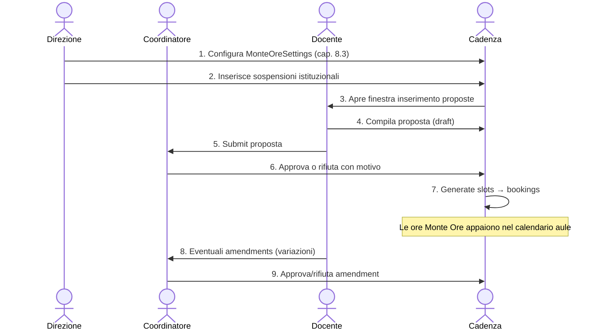

<!--
  Layout A4 — questo MD porta in sé:
    1) Frontmatter YAML compatibile con pandoc/MultiMarkdown (papersize, geometry,
       fontsize, header/footer via fancyhdr) → genera PDF A4 con
         pandoc docs/MANUALE_ADMIN.md -o docs/MANUALE_ADMIN.pdf --pdf-engine=xelatex
    2) Tag <style> con regole @page A4 + page-break sui capitoli (h2):
       quando il file viene renderizzato in HTML e stampato dal browser
       (Cmd+P → Salva come PDF) il layout A4 è già configurato.
    3) Niente "page-break div" hardcoded fra i capitoli — il break è governato
       da CSS sui selettori h2, così il MD resta leggibile come testo.

  Per l'output A4 ad alta qualità senza pandoc:
    npm run manual:html --prefix backend
    open docs/MANUALE_ADMIN.html   # Cmd+P → Salva come PDF
-->

<style>
@page {
  size: A4;
  margin: 22mm 18mm 22mm 18mm;
}
@media print {
  body { font-family: 'Helvetica Neue', Arial, sans-serif; font-size: 10pt; line-height: 1.45; color: #1c1f26; }
  h1 { font-size: 22pt; border-bottom: 1.5pt solid #2a2f3a; padding-bottom: 4pt; }
  h2 { font-size: 16pt; page-break-before: always; break-before: page; border-bottom: 1pt solid #d8dbe2; padding-bottom: 3pt; }
  h3 { font-size: 12.5pt; color: #8b6f3f; page-break-after: avoid; }
  h4 { font-size: 11pt; page-break-after: avoid; }
  table { width: 100%; border-collapse: collapse; font-size: 9pt; page-break-inside: auto; }
  thead { display: table-header-group; }
  tr { page-break-inside: avoid; break-inside: avoid; }
  th, td { border: 0.4pt solid #d8dbe2; padding: 4pt 6pt; text-align: left; vertical-align: top; }
  th { background: #f1eee5; }
  tbody tr:nth-child(even) { background: #fafaf7; }
  pre, blockquote { page-break-inside: avoid; break-inside: avoid; }
  pre { background: #f4f5f8; border: 0.5pt solid #d8dbe2; border-radius: 3pt; padding: 8pt 10pt; font-size: 8.4pt; line-height: 1.4; white-space: pre-wrap; }
  code { background: #f4f5f8; padding: 1pt 3pt; border-radius: 2pt; font-size: 8.8pt; }
  blockquote { border-left: 2pt solid #b9985a; background: #faf7f1; padding: 6pt 10pt; }
  img { max-width: 100%; height: auto; page-break-inside: avoid; }
  a { color: #2c5d8a; text-decoration: none; }
}
</style>

# Cadenza · Manuale Amministratore

> **Versione**: 1.2 · **Data**: 1 maggio 2026 · **Lingua**: italiano · **Formato stampa**: A4
> **Destinatari**: Direttori, DSGA, responsabili IT e coordinatori didattici dei Conservatori
> **Prerequisiti**: account con ruolo `admin` su una installazione Cadenza già provisionata

---

## Cosa c'è di nuovo in v1.2 (1 maggio 2026)

> Aggiornamento incrementale che documenta le funzioni introdotte fra v2.2 e v2.3.1 di Cadenza (audit hardening backend, parity con EasyAcademy/EasyRoom, hardening import Isidata).

| Tema                                           | Novità                                                                                               | Riferimento manuale |
| ---------------------------------------------- | ---------------------------------------------------------------------------------------------------- | ------------------- |
| **Anti mass-assignment + anti-lockout**        | Whitelist su `PUT /users/:id` + protezione "ultimo admin attivo"                                     | §3.6                |
| **Password policy AGID 2024**                  | `POST /register` ora richiede min 10 char + maiuscola + numero                                       | §3.7                |
| **Rate limit dedicati**                        | `/recurring` 5/h/utente, `/2fa/setup` 5/15min/utente                                                 | §3.7                |
| **Cooldown tra prenotazioni**                  | Nuovo campo `minIntervalBetweenBookingsMinutes` per ruolo (anti-bypass cap quotidiano)               | §6.1, §6.0          |
| **Conflitto logico cross-aula**                | `USER_LOGICAL_CONFLICT` blocca lo stesso utente in due aule contemporaneamente                       | §6.0, §6.7          |
| **Sovrapposizioni storiche al setup chiusure** | Preview + batch-cancel per `BookingRuleException` di tipo `block`, con sync `MonteOreSlot`           | §6.3                |
| **Swap atomico prenotazioni admin**            | `POST /api/bookings/swap` per scambiare aula/orario tra 2 prenotazioni future                        | §7.5                |
| **Sidebar restructure**                        | Nuova voce "Registro attività" (gestione bulk-cancel + swap), tab Settings rinominato "Registro Log" | §2, §7.5            |
| **/rooms grouped by building**                 | Sezioni espandibili per edificio (vista pubblica)                                                    | §5.4                |
| **Audit log forensic export firmato**          | Pre-prune HMAC SHA-256 + sidecar metadata                                                            | §12.5               |
| **Pagination uniforme list-routes**            | Header `X-Total-Count`, max 500 record/pagina                                                        | §15.2               |
| **Import Isidata hardening**                   | Cap DoS XLSX-bomb, anti TOCTOU (hash file), `mappingOverrides` whitelist                             | §3.3                |

---

## Indice

1. [Introduzione e ruoli](#1-introduzione-e-ruoli)
2. [Accesso all'area Amministrazione](#2-accesso-allarea-amministrazione)
3. [Utenti](#3-utenti)
4. [Corsi e Livelli](#4-corsi-e-livelli)
5. [Struttura: Istituti, Edifici, Aule, Dotazioni](#5-struttura-istituti-edifici-aule-dotazioni)
6. [⭐ Regole prenotazione (approfondito)](#6--regole-prenotazione-approfondito)
7. [Approvazioni e Registro attività](#7-approvazioni)
8. [⭐ Gestione Monte Ore (approfondito)](#8--gestione-monte-ore-approfondito) — incl. **§8.10 Deroga contratti orari** (nuova v1.1)
9. [Inventario strumenti](#9-inventario-strumenti)
10. [Statistiche / Analytics](#10-statistiche--analytics)
11. [Annunci](#11-annunci)
12. [Impostazioni Server (tab interne)](#12-impostazioni-server-tab-interne)
13. [Operazioni periodiche e best practice](#13-operazioni-periodiche-e-best-practice)
14. [Troubleshooting](#14-troubleshooting)
15. [Sicurezza e hardening (note tecniche v2.2/v2.3)](#15-sicurezza-e-hardening-note-tecniche-v22v23)

---

## 1. Introduzione e ruoli

Cadenza adotta tre ruoli:

| Ruolo      | Permessi principali                                                                                  |
| ---------- | ---------------------------------------------------------------------------------------------------- |
| `studente` | Prenota aule a sé, consulta calendario pubblico, riceve avvisi, richiede prestiti strumenti          |
| `docente`  | Tutto di studente + propone Monte Ore annuale, approva richieste classe (se coordinatore di sezione) |
| `admin`    | Tutto + gestione anagrafica, regole, monte ore, approvazioni, analytics, configurazione server       |

Un utente può avere **un solo ruolo** alla volta. Il cambio di ruolo (es. promozione studente → docente o docente → admin) si fa dalla pagina **Utenti** ed è tracciato nell'**Audit Log**.

> **⚠ Sicurezza**: Cadenza richiede 2FA email obbligatoria sugli account `admin` (provvedimento Garante 06/2021). Al primo login viene chiesto di accettare le policy GDPR (informativa privacy + termini di servizio); il consenso è memorizzato append-only e non revocabile retroattivamente.

---

## 2. Accesso all'area Amministrazione

1. Vai a `https://<dominio-conservatorio>/login`.
2. Click su **"Accedi con email"** → inserisci email + password.
3. Inserisci il codice 2FA ricevuto via mail (validità 10 min).
4. Una volta loggato come admin la sidebar mostra in basso la sezione **"AMMINISTRAZIONE"** con queste voci:

```
AMMINISTRAZIONE
├─ Utenti
├─ Corsi
├─ Gestione Monte Ore       ← cap. 8
├─ Regole prenotazioni      ← cap. 6
├─ Approvazioni             [badge se ci sono pending]
├─ Registro attività        ← cap. 7.5  (NUOVO v2.3)
├─ Struttura
├─ Inventario strumenti
├─ Statistiche
├─ Annunci
└─ Impostazioni Server
```

Le voci **Monte Ore** e **Inventario strumenti** sono nascondibili dall'admin via _Impostazioni Server → Moduli_ se il Conservatorio non li usa (vedi §12.7). Le rotte e i dati restano comunque sempre attivi.

> **Novità v2.3** — la voce **"Registro attività"** è la pagina dedicata a _gestione massiva delle prenotazioni_ (filtri avanzati, bulk-cancel con motivo broadcast, **swap atomico**, vista per ruolo/range/aula). Era una sotto-tab nascosta dentro `/admin/audit-log`; ora è una pagina autonoma per separare nettamente "operazioni sui dati" (Registro attività) da "log immutabile delle azioni" (Registro Log dentro _Impostazioni Server_ → Audit Log). Vedi §7.5 e §12.5.

---

## 3. Utenti

URL: `/admin/users`

### 3.1 Cosa puoi fare

- Creare un nuovo utente manualmente (form con email, nome, cognome, ruolo, corso, matricola)
- Importare anagrafica massiva da CSV (template scaricabile)
- Esportare l'anagrafica completa in CSV (per backup o report)
- Modificare ruolo, status (`approved` / `pending` / `rejected`), corso, matricola
- Disattivare un account (`isActive=false`) senza cancellarlo (preserva storico prenotazioni)
- Cancellare definitivamente con soft-delete (`deletedAt` impostato; recuperabile per 30 giorni)
- Reset password: forza il cambio al prossimo login dell'utente
- Bumpa `tokenVersion`: invalida tutti i JWT precedenti (logout effettivo da tutti i dispositivi)

### 3.2 Filtri rapidi

In alto a destra: ricerca per **nome / email / matricola / corso**, filtro per **ruolo** e **stato approvazione**.

### 3.3 Integrazione Isidata (CSV / XLSX)

In coda alla pagina, riquadro **"Import da Isidata"**: carica il file `.csv` o `.xlsx` esportato da Isidata, Cadenza calcola la **diff** (utenti nuovi / aggiornati / da disattivare) e l'admin la conferma.

#### Flusso a 2 step (preview → apply, anti-errore umano)

1. **Preview** (`POST /api/admin/integrations/isidata-csv/preview`)
   - Carica il file. Cadenza ne fa parsing, applica il mapping (auto-rilevato dagli header — cfr. `INTEGRATIONS-ISIDATA.md`), confronta col DB e restituisce: lista utenti **da creare**, **da aggiornare** (con campi che cambierebbero), **da disattivare** (orphan = già linkati Isidata ma assenti nel nuovo export).
   - **Nessun side-effect sul DB**. Il file resta in `/tmp` per max 10 minuti, leggibile solo dall'admin che l'ha caricato (prefisso del filename = suo `userId`).
   - La risposta include `token` + `hash` SHA-256 del file.
2. **Apply** (`POST /api/admin/integrations/isidata-csv/apply`)
   - Invia indietro `token` + `hash`. Cadenza riapre il file, ricalcola SHA-256, **rifiuta** con `HASH_MISMATCH` se il file è stato sostituito tra preview e apply (anti-TOCTOU).
   - Esegue create/update/orphan in transazione **SERIALIZABLE** su Postgres. I nuovi utenti nascono in stato `pending` (vanno approvati esplicitamente da `/admin/approvals`) e mai con permessi superiori a `studente`/`docente` derivati dal file.
   - **Mai un orfano viene cancellato fisicamente**: solo `isActive=false` + `externalStatusNote = "Non più presente nell'export Isidata del YYYY-MM-DD"`. Riapparire in un export futuro lo riattiva.

#### Mapping personalizzato per istituto

Se il vostro export Isidata ha header diversi da quelli auto-riconosciuti (matricola, cognome, nome, email, ruolo, ecc. con accenti/spazi/case variabile), invia un `mappingOverrides` JSON nel body con i target da mappare. Esempio:

```json
{
  "externalId": "Numero Matricola",
  "email": "Email Istituzionale",
  "courseCode": "Codice Indirizzo"
}
```

I target consentiti sono: `externalId`, `email`, `firstName`, `lastName`, `role`, `matricola`, `courseCode`, `courseName`, `status`, `birthDate`. Altri target vengono droppati silenziosamente. Valori non-stringa o oltre 100 char idem.

#### Limiti e protezioni (v2.3.1 hardening)

| Limite                  | Valore                | Motivo                                                                                                                                               |
| ----------------------- | --------------------- | ---------------------------------------------------------------------------------------------------------------------------------------------------- |
| File size massimo       | **10 MB**             | Cap multer + check buffer. File più grandi → `FILE_TOO_LARGE`                                                                                        |
| Record processati       | **5.000** dopo header | Le righe in eccesso vengono ignorate con warning. Se hai 8.000 utenti, splitta l'import in 2 file                                                    |
| Righe iterate (XLSX)    | **20.000** raw        | Difesa anti **XLSX-bomb**: il file ZIP da 10MB compressi può contenere milioni di righe vuote → cap hard sull'iterazione (era illimitato pre-v2.3.1) |
| Colonne max (XLSX)      | **1.024**             | Difesa contro `columnCount` patologico nel file                                                                                                      |
| Header riservati        | scartati con warning  | `__proto__`, `prototype`, `constructor` non finiscono nei record (defense-in-depth contro prototype pollution)                                       |
| `mappingOverrides` JSON | **4 KB** max          | Anti CPU-spike su parse di JSON patologici                                                                                                           |
| Token TTL               | **10 minuti**         | Dopo, il file viene cancellato e l'apply richiede di ricaricare → `TOKEN_EXPIRED` (410)                                                              |
| Compare hash            | **timing-safe**       | `crypto.timingSafeEqual` invece di `===` — defense-in-depth                                                                                          |

#### Codici errore (per debug)

| Codice              | Quando                                                         | Cosa fare                                |
| ------------------- | -------------------------------------------------------------- | ---------------------------------------- |
| `FILE_REQUIRED`     | `multipart/form-data` senza campo `file`                       | Verifica il form                         |
| `FILE_TOO_LARGE`    | File > 10 MB                                                   | Splitta o rimuovi colonne inutili        |
| `PARSE_FAILED`      | XLSX corrotto o CSV malformato                                 | Riapri in Excel, salva come .xlsx pulito |
| `VALIDATION_FAILED` | `mappingOverrides` non oggetto, troppo grande, o JSON invalido | Riguarda il body                         |
| `TOKEN_INVALID`     | Token non rispetta il formato `\d+-\d+-[a-f0-9]{16}.ext`       | Ricarica la preview                      |
| `TOKEN_FOREIGN`     | L'admin che fa apply ≠ quello che ha caricato                  | Solo l'uploader può applicare            |
| `TOKEN_EXPIRED`     | TTL 10min superato o file rimosso                              | Ricarica la preview                      |
| `HASH_MISMATCH`     | File modificato tra preview e apply                            | Ricarica la preview                      |

#### Audit trail per ogni run

Ogni preview+apply genera un record `IntegrationSyncRun` con: `actorId` (admin), `provider='isidata'`, `triggeredBy='manual'`, `status` (`success`/`partial`/`failed`), conteggi (`created`/`updated`/`orphaned`/`errors`), e `diffSnapshot` (lista dei target toccati per audit). Visibile in `GET /api/admin/integrations/runs?provider=isidata`.

> Per il setup avanzato del mapping per istituto e per il workflow legacy, vedi `INTEGRATIONS-ISIDATA.md`.

### 3.4 OAuth Google / Microsoft

Riquadro **"Provider OAuth"**: incolla `client_id` e `client_secret` di Google Workspace o Microsoft Entra. Una volta configurato, gli utenti vedono i bottoni "Accedi con Google" / "Microsoft" sul login. Le credenziali sono cifrate AES-256-GCM in DB.

### 3.5 ⭐ Deroga Monte Ore per docenti a contratto orario

> Disponibile solo nel form di modifica utente quando **`role = docente`**. Per studenti/admin la sezione resta nascosta.

In coda al form _Modifica utente_ compare il blocco **Monte Ore — Tipo contratto** che permette di personalizzare la soglia annua del singolo docente, indispensabile per i contratti orari (precari, supplenti, part-time) che hanno un monte concordato individualmente diverso dalle 324h CCNL del titolare di ruolo.


#### Campi disponibili

| Campo                                                                                         | Quando usarlo                                                                                |
| --------------------------------------------------------------------------------------------- | -------------------------------------------------------------------------------------------- |
| **Tipo contratto** (select: titolare · contratto orario · supplente · altro)                  | Etichetta informativa, non vincolante; serve a Filtri e Audit Log                            |
| **Soglia ore personalizzata** (toggle + numero, range 0-1500h)                                | Sostituisce le 324h istituzionali per quel singolo docente. Tipici valori: 30, 60, 120, 180h |
| **Esente dal vincolo 2-4 giorni/settimana** (toggle)                                          | Per contratti brevi che possono concentrare le lezioni in 1 solo giorno                      |
| **Motivazione** (textarea, max 500 caratteri, **obbligatoria** se almeno una deroga è attiva) | Es: "Contratto orario 60h - prot. 2026/123 del 15/09/2026". Tracciata nell'audit log         |

#### Comportamento del validator submit

Quando il docente con deroga invia la proposta Monte Ore (`POST /api/monte-ore/me/submit`):

1. La soglia viene **risolta in cascata**: `user.monteOreAnnualHoursOverride → MonteOreSettings.minRequiredHours → fallback 324h`.
2. Se `monteOreBypassDayConstraint = true`, il vincolo "2-4 giorni a settimana" viene saltato (un docente con 30h può fare tutto in un solo giorno).
3. Lo `minRequiredHoursSnapshot` della proposta viene fissato al valore **risolto** (non al globale): se domani l'admin rimuove l'override, le proposte già inviate restano valide con la soglia originale.

#### Esempi di configurazione

| Caso                              | Tipo contratto     | Soglia ore     | Bypass | Motivazione tipica                               |
| --------------------------------- | ------------------ | -------------- | ------ | ------------------------------------------------ |
| Coadiutore al pianoforte          | contratto_orario   | 60             | ✅     | "Co.Co.Co 60h - decreto 2026/45"                 |
| Supplente part-time 50%           | supplente          | 162            | ❌     | "Supplenza annuale 50% titolare"                 |
| Docente di laboratorio            | altro              | 120            | ❌     | "Lab. di musica d'insieme - reg. didattico §12"  |
| Titolare ridotto 270h (legge 104) | titolare           | 270            | ❌     | "Riduzione orario L.104/92 - DSGA prot. 2026/89" |
| Titolare standard                 | titolare (o vuoto) | — (toggle off) | ❌     | n/a                                              |

> **Visibilità lato docente**: nella pagina `/monte-ore` del docente con deroga compare un banner azzurro "Soglia Monte Ore personalizzata: N ore/anno" con tipo contratto e stato del vincolo giorni. Non è esposta la motivazione (riservata all'amministrazione).

#### Audit log

Ogni `PUT /api/users/:id/monte-ore-override` viene tracciato dal middleware audit globale (pattern `/api/users/:id`) con:

- `actorId` (admin che ha eseguito l'azione)
- `targetType=user`, `targetId` del docente
- `payload` (compresa motivazione, esclusa qualunque PII estranea)

Filtra in `Impostazioni Server → Audit Log` per `targetType=user` per vedere la storia delle deroghe.

### 3.6 ⭐ Anti mass-assignment + anti-lockout admin (v2.2)

> Hardening introdotto nel re-audit backend del 30 aprile 2026. Riguarda chiunque chiami `PUT /users/:id`, `DELETE /users/:id`, e bulk-delete.

**Mass-assignment** (cosa significa): prima di v2.2 alcuni endpoint amministrativi accettavano qualunque campo del modello User, incluso `passwordHash`, `tokenVersion`, `deletedAt`. Un admin (o una richiesta forgiata con il suo token) avrebbe potuto sovrascrivere `passwordHash` di un altro utente o resuscitare account soft-deleted modificando `deletedAt`. Ora il backend usa `lib/sanitize.js` con **whitelist + coercizione tipi**: solo i campi consentiti per quel ruolo arrivano in Sequelize.

| Endpoint                                                         | Whitelist                                                                                                                                                                                                            | Cosa NON è più modificabile                                                                               |
| ---------------------------------------------------------------- | -------------------------------------------------------------------------------------------------------------------------------------------------------------------------------------------------------------------- | --------------------------------------------------------------------------------------------------------- |
| `PUT /users/:id`                                                 | email, firstName, lastName, role, matricola, courseId, status, isActive, contractType, monteOreAnnualHoursOverride, monteOreBypassDayConstraint, monteOreOverrideMotivation, emailNotifications + 4 toggle granulari | passwordHash, tokenVersion, deletedAt, googleId, microsoftId, icalToken/Hash, oauthTokens, sessionVersion |
| `PUT /structure/buildings/:id` · `/rooms/:id` · `/equipment/:id` | campi anagrafici/configurativi specifici, type/enum coerced                                                                                                                                                          | createdAt, updatedAt, soft-delete fields, ID interni                                                      |

**Anti-lockout** (perché): senza protezioni, un admin distratto può: (a) demote-arsi e perdere accesso amministrativo (`CANNOT_SELF_DEMOTE`), (b) disattivare il proprio account (`CANNOT_SELF_DISABLE`), (c) cancellare l'unico altro admin attivo lasciando il sistema senza nessuno con permessi (`LAST_ADMIN_LOCKOUT`). Il backend ora restituisce **400/409** in tutti questi casi prima di salvare.

| Errore                | HTTP | Trigger                                  |
| --------------------- | ---- | ---------------------------------------- |
| `CANNOT_SELF_DEMOTE`  | 400  | Admin che si abbassa a docente/studente  |
| `CANNOT_SELF_DISABLE` | 400  | Admin che si imposta `isActive=false`    |
| `CANNOT_SELF_DELETE`  | 400  | Admin che cancella sé stesso             |
| `LAST_ADMIN_LOCKOUT`  | 409  | Operazione che lascerebbe 0 admin attivi |

**Workaround legittimo**: per cambiare ruolo o disattivare un altro admin, **un secondo admin** deve esserci ed essere attivo. Per dismettere l'ultimo admin (caso raro: chiusura del Conservatorio) bisogna passare da DBA con accesso DB diretto.

### 3.7 Password policy AGID 2024 + rate limit (v2.2)

#### Nuovi requisiti registrazione/cambio password

Da v2.2 i nuovi account creati via `POST /register` (e i cambi password via `PUT /users/:id/password`) devono soddisfare le linee guida AGID 2024:

- **min 10 caratteri** (era 8)
- **almeno 1 maiuscola**
- **almeno 1 cifra**

Errori: `PASSWORD_TOO_SHORT`, `PASSWORD_NEEDS_UPPERCASE`, `PASSWORD_NEEDS_DIGIT`. Le password storiche sotto soglia continuano a funzionare per il login (no rotazione forzata) — solo le nuove sono validate.

#### Rate limit dedicati per endpoint critici

| Endpoint                                     | Limit | Finestra | Chiave                               | Motivo                            |
| -------------------------------------------- | ----- | -------- | ------------------------------------ | --------------------------------- |
| `POST /login`                                | 5     | 15 min   | IP                                   | brute-force credenziali           |
| `POST /register`                             | 3     | 30 min   | IP                                   | spam account                      |
| `POST /2fa/setup` · `/2fa/resend`            | 5     | 15 min   | userId del pre2faToken (IP fallback) | spam codici via mail              |
| `POST /2fa/verify`                           | 10    | 15 min   | userId del pre2faToken               | brute-force codice 6 cifre        |
| `POST /bookings/recurring`                   | 5     | 1 ora    | userId                               | DoS pool DB (52 booking/chiamata) |
| `POST /gdpr/export-data` · `/delete-request` | 3     | 24 ore   | userId                               | costo I/O elevato                 |
| `GET /ical/:token`                           | 30    | 1 ora    | IP                                   | enumeration token                 |
| `/api/*` (default)                           | 300   | 1 min    | IP                                   | barriera baseline                 |

I rate limit restituiscono **429** con header `Retry-After` + body `{ error, code: 'RATE_LIMITED', retryAfter: <s> }`.

> **Test**: in CI `NODE_ENV=test` i limiter sono disattivati di default per evitare flake (override con `DISABLE_RATE_LIMIT=false` nei test che li verificano espressamente).

---

## 4. Corsi e Livelli

URL: `/admin/courses`

Pagina con due tab macro (stile _Impostazioni Server_):

### 4.1 Tab "Corsi"

Catalogo SAD del Conservatorio (codici AFAM standard tipo `AFAM001 Pianoforte`).

- Crea/modifica corso: codice univoco, nome, livelli supportati, attivo/disattivo
- Esporta/importa CSV
- Cancellazione: soft-delete; al riavvio del backend i corsi AFAM cancellati **non riappaiono** automaticamente (regression test in `coursesSeederIdempotency.test.js`).

### 4.2 Tab "Livelli"

Catalogo livelli di studio: `propedeutico`, `triennio`, `biennio`, `master`, ecc. Aggiungi un livello una sola volta e usalo in tutti i corsi.

---

## 5. Struttura: Istituti, Edifici, Aule, Dotazioni

URL: `/admin/structure`

Due tab:

### 5.1 Tab "Sedi"

Gerarchia: **Istituto → Edifici → Aule → Equipment**.

- **Istituto**: anagrafica completa (denominazione legale, P.IVA, codice fiscale, PEC, contatti, DPO, sub-processor GDPR, foro competente). Tutti i dati che servono alla Privacy Policy e ai Termini.
- **Edificio**: nome, indirizzo, lista piani, configurazione kiosk/display (rotazione concerti, intervallo slide, ecc.).
- **Aula**: nome (es. `A.101`), piano, capienza, tipo (`studio` / `aula` / `concerto` / `ufficio`), prenotabilità, `requireCheckIn` (QR code), `requiresApproval` (workflow approvativo per le sale concerti).
- **Equipment**: dotazione singola dell'aula (es. "Pianoforte a coda Steinway B-211"). Catalogata da template.

### 5.2 Tab "Dotazioni"

Catalogo riusabile delle dotazioni (template). Una volta creato il template "Pianoforte verticale", puoi assegnarlo a tutte le aule che lo possiedono in due click. Cambiare il template aggiorna tutte le aule che lo usano.

### 5.3 Operazioni di massa

- **Import CSV** della struttura completa (template scaricabile).
- **Bulk-delete** aule selezionate.
- **Bulk-toggle** prenotabilità.
- **Riordina** aule via drag-and-drop (rispettato dal calendario settimanale).

### 5.4 Vista pubblica `/rooms` raggruppata per edificio (v2.3)

La pagina `/rooms` (visibile a tutti gli utenti autenticati) ora ha lo **stesso schema visivo di `/admin/structure`**: sezioni espandibili per edificio, ognuna con tile colorato (`buildingColor`), nome, conteggio aule e numero di piani.

Vantaggi rispetto alla lista flat precedente:

- meno scroll su istituti multi-edificio (es. sede centrale + succursale + auditorium fuori-sede)
- riconoscibilità immediata della sede (colore + nome edificio)
- stato `collapsedBuildings` ricordato durante la sessione del browser

I filtri esistenti (testo, edificio, tipo, capienza, dotazioni, finestra di disponibilità) restano invariati e agiscono **dentro** ciascun gruppo.

---

## 6. ⭐ Regole prenotazione (approfondito)

URL: `/admin/rules`

Questa è la sezione che governa **chi può prenotare cosa, quando, per quanto tempo**. Le regole sono uno strato di policy applicato dal validator `bookingValidator.js`. Tutte le regole agiscono in modo **additivo restrittivo**: la prenotazione passa solo se **tutte** le regole applicabili la consentono.


La pagina ha **quattro macro-tab** in alto:

```
Regole prenotazioni
├─ Per ruolo            (limiti base per studenti/docenti/admin)
├─ Quote               (limiti per stanza/edificio/tipo aula)
├─ Quote prestiti       (analogo per inventario strumenti)
└─ Eccezioni            (override per aule/utenti specifici)
```

### 6.0 Come Cadenza valuta una prenotazione (flusso validator)

Quando un utente fa `POST /api/bookings`, il validator esegue queste verifiche **in ordine** e si ferma alla prima che fallisce:

```
┌─ 1. Auth & ruolo attivo ─────────────────────────────────────┐
│   user.isActive = true ?  status = 'approved' ?              │
└──────────────────────────────────────────────────────────────┘
              ↓ ok
┌─ 2. Aula prenotabile ────────────────────────────────────────┐
│   room.isBookable = true ?  room.deletedAt = null ?          │
└──────────────────────────────────────────────────────────────┘
              ↓ ok
┌─ 3. Anti-overlap (DB-level su Postgres) ─────────────────────┐
│   EXCLUDE constraint: nessun'altra Booking confermata        │
│   sovrappone (roomId, [start, end))                          │
└──────────────────────────────────────────────────────────────┘
              ↓ ok
┌─ 3bis. Conflitto logico utente (cap. 6.7) ────── (NUOVO v2.3)┐
│   Stesso userId con altra Booking confermata in ALTRA aula   │
│   nella stessa fascia oraria  →  USER_LOGICAL_CONFLICT       │
│   (un docente non può fisicamente essere in 2 posti)         │
│   Bypass: bypassQuotas=true (Monte Ore generator)            │
└──────────────────────────────────────────────────────────────┘
              ↓ ok
┌─ 4. BookingRule per ruolo (cap. 6.1) ────────────────────────┐
│   maxActive · maxHoursPerWeek · maxHoursPerDay               │
│   maxBookingDuration · minBookingDuration                    │
│   advanceMaxDays · advanceMinMinutes · cancellationCutoff    │
│   openingTime · closingTime · allowSameDay                   │
│   minIntervalBetweenBookingsMinutes  ← NUOVO v2.3 (cooldown) │
└──────────────────────────────────────────────────────────────┘
              ↓ ok
┌─ 5. BookingQuota — per ogni quota matching (cap. 6.2) ───────┐
│   roomType / equipmentType / room / building / global        │
│   maxHoursPerDay/Week/Month · maxBookings · daysOfWeek       │
│   timeFrom / timeTo                                          │
└──────────────────────────────────────────────────────────────┘
              ↓ ok
┌─ 6. BookingRuleException (cap. 6.3) ─────────────────────────┐
│   Eccezioni applicabili: SOSTITUISCONO i limiti precedenti   │
│   (es. "studente X: nessun limite settimanale dal 1/5 al 30/5")│
│   Tipo `block`: anteprima sovrapposizioni storiche (NUOVO v2.3)│
└──────────────────────────────────────────────────────────────┘
              ↓ ok
┌─ 7. requiresApproval ────────────────────────────────────────┐
│   Se room.requiresApproval=true OR rule.requireApproval=true:│
│   booking.status = 'pending_approval' (cap. 7)               │
│   altrimenti booking.status = 'confirmed'                    │
└──────────────────────────────────────────────────────────────┘
```

Tutti gli errori restituiscono **codici machine-readable** (`MAX_HOURS_EXCEEDED`, `QUOTA_EXCEEDED:roomType:concerto`, `OUTSIDE_OPENING_HOURS`, `MIN_INTERVAL_VIOLATED`, `USER_LOGICAL_CONFLICT`, ecc.) — utili per debug e per personalizzare i messaggi i18n nel frontend. Vedi §6.7 per la reference card completa.

### 6.1 Tab "Per ruolo" — `BookingRule`


Tre righe: una per ruolo. Per ciascun ruolo configuri questi parametri:

| Campo                                                                             | Default                     | Significato                                                                                                                                                                                                                                                                                                                                                                                                                                                                                                    |
| --------------------------------------------------------------------------------- | --------------------------- | -------------------------------------------------------------------------------------------------------------------------------------------------------------------------------------------------------------------------------------------------------------------------------------------------------------------------------------------------------------------------------------------------------------------------------------------------------------------------------------------------------------- |
| **Max prenotazioni attive contemporanee**                                         | 5                           | Numero massimo di prenotazioni future contemporanee. Studente=5, docente=10, admin=∞ tipico.                                                                                                                                                                                                                                                                                                                                                                                                                   |
| **Max ore / settimana**                                                           | 10 (studente), 20 (docente) | Tetto orario settimanale (lun–dom).                                                                                                                                                                                                                                                                                                                                                                                                                                                                            |
| **Max ore / giorno**                                                              | 4                           | Tetto giornaliero. Si conta dalle 00:00 alle 23:59.                                                                                                                                                                                                                                                                                                                                                                                                                                                            |
| **Durata massima prenotazione**                                                   | 120 minuti                  | Per slot singolo. Una prenotazione di 3h va spezzata in più slot.                                                                                                                                                                                                                                                                                                                                                                                                                                              |
| **Durata minima prenotazione**                                                    | 30 minuti                   | Slot minimo (allineato al granularità del calendario).                                                                                                                                                                                                                                                                                                                                                                                                                                                         |
| **Anticipo massimo (giorni)**                                                     | 14                          | Quanto in anticipo si può prenotare. Studente=14, docente=30 tipico.                                                                                                                                                                                                                                                                                                                                                                                                                                           |
| **Anticipo minimo (minuti)**                                                      | 0                           | Soglia per evitare prenotazioni "fra 5 minuti" su aule libere. Docente=0, studente=15 tipico.                                                                                                                                                                                                                                                                                                                                                                                                                  |
| **Cancellation cutoff (ore)**                                                     | 2                           | Quante ore prima della prenotazione l'utente può ancora cancellarla senza penalità. Sotto questa soglia conta come no-show.                                                                                                                                                                                                                                                                                                                                                                                    |
| **Richiede approvazione**                                                         | false                       | Se true, **tutte** le prenotazioni di quel ruolo passano per `pending_approval` indipendentemente dall'aula. Usabile per i nuovi studenti durante un periodo di prova.                                                                                                                                                                                                                                                                                                                                         |
| **Allow same-day**                                                                | true                        | Permettere prenotazioni in giornata.                                                                                                                                                                                                                                                                                                                                                                                                                                                                           |
| **Orario apertura / chiusura**                                                    | 08:00 / 22:00               | Fuori da questa finestra le prenotazioni sono rifiutate. Indipendente dall'orario di apertura del Conservatorio (usalo per limitare studio sera).                                                                                                                                                                                                                                                                                                                                                              |
| **Cooldown tra prenotazioni** (`minIntervalBetweenBookingsMinutes`) ⭐ NUOVO v2.3 | 0 (default backward-compat) | **Minuti minimi** che devono intercorrere fra la fine di una prenotazione e l'inizio della successiva dello stesso utente. Chiude il cap-bypass per concatenazione: senza cooldown, uno studente con `maxBookingDuration=120 min` e `maxHoursPerDay=4` può prenotare 14:00–16:00 + 16:00–18:00 e fare di fatto un blocco unico di 4h, vanificando il limite "2h per booking". Calcolo cross-day sui minuti astronomici, simmetrico (vale anche prenotando in ordine inverso). Errore: `MIN_INTERVAL_VIOLATED`. |

#### Strategia consigliata per la prima configurazione

```
ruolo studente:
  max attivi=5, max settimanali=10h, max giornaliere=4h
  durata max=120 min, durata min=30 min
  advance max=14 giorni, advance min=15 min, cancel cutoff=2h
  no approval, no same-day=false, 08:00–22:00

ruolo docente:
  max attivi=20, max settimanali=40h, max giornaliere=8h
  durata max=240 min, durata min=30 min
  advance max=60 giorni, advance min=0, cancel cutoff=2h
  no approval, allow same-day=true, 07:00–23:00

ruolo admin:
  illimitato per max attivi/settimanali/giornaliere (campo "0" o vuoto = nessun limite)
  altro come docente
```

> **Nota**: i campi a `0` significano "nessun limite". Non confonderli con `null` (campo non valorizzato).

### 6.2 Tab "Quote" — `BookingQuota`


Una **quota** è un sotto-limite più stringente per uno specifico target. Il validator applica **prima** la regola per ruolo e **poi** tutte le quote che matchano il target della prenotazione, prendendo il limite più basso.

#### Tipi di scope

| Scope           | Esempio                        | Uso tipico                                                     |
| --------------- | ------------------------------ | -------------------------------------------------------------- |
| `roomType`      | studio · aula · concerto       | "Studenti possono prenotare la sala concerti max 4h/settimana" |
| `equipmentType` | pianoforte_coda · contrabbasso | "Solo pianisti possono prenotare aule con pianoforte a coda"   |
| `room`          | aula 101                       | Limite specifico su una stanza (es. la più richiesta)          |
| `building`      | edificio_centrale              | Limite per edificio (utile se uno è in ristrutturazione)       |
| `global`        | \*                             | Limite globale (oltre quello di ruolo)                         |

#### Campi quota

- **Ruolo**: studente / docente / admin (la quota si applica solo a quel ruolo)
- **Scope** + **Scope value**: vedi sopra
- **Max ore / giorno** | **/ settimana** | **/ mese** | **Max prenotazioni**
- **Giorni della settimana** (JSON array `[1,2,3,4,5,6]`, dove `1=Lun … 7=Dom`): la quota vale solo nei giorni indicati. Vuoto = tutti.
- **Orario start / end**: la quota vale solo entro questa fascia (es. "max 1h di studio individuale dopo le 18:00").
- **Active**: toggle on/off senza dover cancellare la quota.

#### Esempio pratico

Una quota tipica per Conservatorio:

| #   | Ruolo    | Scope    | Scope value                 | Max h/sett | Days    | Orario | Note                                                |
| --- | -------- | -------- | --------------------------- | ---------- | ------- | ------ | --------------------------------------------------- |
| Q1  | studente | roomType | concerto                    | 0          | tutti   | —      | Studenti non possono prenotare sale concerti        |
| Q2  | docente  | roomType | concerto                    | 0          | tutti   | —      | Idem per docenti — solo Direzione                   |
| Q3  | studente | room     | "Aula 12 — Pianoforte coda" | 2          | tutti   | —      | Aula molto richiesta: max 2h/settimana per studente |
| Q4  | studente | global   | \*                          | 6          | sab-dom | —      | Limite weekend: 6h totali sab+dom                   |
| Q5  | studente | building | "Sede succursale"           | 0          | tutti   | —      | Edificio in ristrutturazione                        |

Le quote scattano in ordine: Cadenza somma le ore già prenotate dall'utente che matchano lo scope, e se l'aggiunta supera il limite rifiuta con messaggio specifico (`QUOTA_EXCEEDED:roomType:concerto`).

### 6.3 Tab "Eccezioni" — `BookingRuleException`


Le eccezioni **sospendono o sostituiscono** una regola/quota per:

- una **finestra temporale** specifica (es. "durante la sessione esami sospendi quota weekend")
- uno **specifico utente** (es. "Prof. Rossi: nessun limite settimanale per il mese di maggio per le prove dell'esame finale")
- una **specifica aula** (es. "Aula 5: prenotabile solo da chi ha permesso speciale, dal 1 al 30 giugno")

L'eccezione ha priorità sulla regola/quota originaria. Tracciato in **Audit Log** con motivo testuale obbligatorio.

#### Sovrapposizioni storiche al setup di chiusure (v2.3 — parity EasyRoom)

Quando crei un'eccezione di tipo **`block`** (chiusura aula/edificio per ristrutturazione, sciopero, festa patronale, ecc.) Cadenza ti chiede subito **"ci sono prenotazioni già confermate che cadono in questo blocco?"**. Workflow:

1. Salvi l'eccezione con `kind=block`.
2. Si apre un dialog di follow-up: Cadenza chiama `POST /api/rules/exceptions/preview-overlaps` (dry-run, nessun side-effect) e mostra l'elenco delle prenotazioni in conflitto, con badge **"Monte Ore"** se la prenotazione è collegata a uno slot del piano didattico (`bookingId` su `MonteOreSlot`).
3. Bottone **"Cancella tutte ($N)"** → `POST /api/rules/exceptions/:id/cancel-overlapping` esegue il batch in transazione:
   - prenotazioni passate o `checked_in` vengono **escluse** (non si ri-scrive il passato)
   - le prenotazioni cancellate ricevono `cancelReason` (testo obbligatorio dall'admin) → email automatica all'utente
   - se la prenotazione era da Monte Ore: lo slot collegato viene marcato `isActive=false, isLocked=true, lockReason=<nome eccezione>, bookingId=null`. **Importante**: senza questo lock, la rigenerazione del piano didattico (es. dopo amendment approvato) ricreerebbe la prenotazione cancellata.

Anche se chiudi senza cancellare nulla, l'eccezione `block` resta attiva: blocca le **prenotazioni future** dal momento della creazione in poi (l'anteprima è solo per smaltire lo storico).

> **Nudge UI**: se l'eccezione ha `dateTo < oggi` (eccezione retrodatata che copre solo il passato), un banner azzurro avvisa "Questa eccezione copre solo date passate — verrà ignorata da nuove prenotazioni". Utile per non dimenticare di estendere `dateTo` quando una chiusura si prolunga.

### 6.4 Granularità slot

Il "minimo comune multiplo" temporale del sistema è **30 minuti** (configurabile a livello globale ma sconsigliato cambiarlo dopo il go-live). Tutte le quote/regole agiscono su questa griglia.

### 6.5 Anteprima regole — _Rules Preview_ (roadmap)

Il componente `RulesPreview` (in `frontend/src/components/admin/`) è già implementato ma non ancora esposto nella UI: simulerà una prenotazione (utente, aula, data/ora) e mostrerà quali regole/quote/eccezioni vengono valutate, con esito ✓ / ✗ riga per riga. Endpoint backend già disponibile: `POST /api/rules/preview`. Verrà attivato in una prossima release con un bottone "Anteprima" nell'header della pagina Regole.

In attesa, per debug puoi usare direttamente l'API:

```bash
curl -X POST http://localhost:3000/api/rules/preview \
  -H "Authorization: Bearer <admin-token>" \
  -H "Content-Type: application/json" \
  -d '{"userId":42,"roomId":7,"startTime":"2026-05-20T14:00:00Z","endTime":"2026-05-20T16:00:00Z"}'
```

### 6.6 Errori comuni di configurazione

| Sintomo                                                                                                 | Causa probabile                                                                                                     | Fix                                                                                                      |
| ------------------------------------------------------------------------------------------------------- | ------------------------------------------------------------------------------------------------------------------- | -------------------------------------------------------------------------------------------------------- |
| Studenti non riescono a prenotare aule libere                                                           | Quota globale `0` (= bloccato) anziché vuota                                                                        | Lascia il campo VUOTO per "nessun limite" — `0` significa zero ore consentite                            |
| Errore `OUTSIDE_OPENING_HOURS` per docenti dopo le 22                                                   | `BookingRule.closingTime` troppo restrittivo per il ruolo                                                           | Aumenta closingTime nel tab "Per ruolo" per il ruolo docente                                             |
| Conflict overlap nonostante anti-overlap                                                                | Due booking con stesso roomId ma deletedAt valorizzato (soft-deleted) → la EXCLUDE constraint ignora i soft-deleted | Verifica con `SELECT * FROM bookings WHERE "roomId"=X AND "deletedAt" IS NOT NULL`                       |
| Quota mensile non scatta                                                                                | `maxHoursPerMonth=0` interpretato come "nessun limite"                                                              | Imposta un valore intero positivo                                                                        |
| Eccezione non applicata                                                                                 | `dateFrom > dateTo`, oppure `isActive=false`                                                                        | Controlla nella tab Eccezioni l'icona verde/grigia                                                       |
| `MIN_INTERVAL_VIOLATED` su prenotazioni back-to-back legittime (es. 2 lezioni di seguito di un docente) | Cooldown impostato troppo alto sul ruolo docente                                                                    | Rivedi `minIntervalBetweenBookingsMinutes` in §6.1, valuta se metterlo solo su studente                  |
| `USER_LOGICAL_CONFLICT` durante generazione Monte Ore                                                   | Pattern Monte Ore con slot concentrici legittimi (es. masterclass in 2 aule)                                        | Il generator usa `bypassQuotas=true`; se il blocco persiste, leggi i log per vedere quale slot lo emette |

### 6.7 Reference card — codici errore validator

Tutti gli errori di `POST /api/bookings` (e `/recurring`, `/swap`) restituiscono **400** con body `{ error, code, ... }`. Tabella unica per debug rapido:

| Codice                                                           | Causa                                                       | Cap.           |
| ---------------------------------------------------------------- | ----------------------------------------------------------- | -------------- |
| `BOOKING_CONFLICT`                                               | EXCLUDE constraint Postgres: aula occupata in quella fascia | §6.0 step 3    |
| `USER_LOGICAL_CONFLICT` ⭐ v2.3                                  | Stesso utente già confermato in un'altra aula               | §6.0 step 3bis |
| `MAX_ACTIVE_EXCEEDED`                                            | Troppe prenotazioni attive contemporanee                    | §6.1           |
| `MAX_HOURS_DAY_EXCEEDED` · `..._WEEK_..` · `..._MONTH_..`        | Cap orario di ruolo o quota                                 | §6.1 / §6.2    |
| `MAX_BOOKING_DURATION_EXCEEDED` · `MIN_BOOKING_DURATION_NOT_MET` | Slot fuori dai bound min/max                                | §6.1           |
| `ADVANCE_TOO_FAR` · `ADVANCE_TOO_SOON`                           | Prenotazione troppo in anticipo o troppo a ridosso          | §6.1           |
| `OUTSIDE_OPENING_HOURS`                                          | Fuori `openingTime`/`closingTime`                           | §6.1           |
| `SAME_DAY_NOT_ALLOWED`                                           | `allowSameDay=false` per quel ruolo                         | §6.1           |
| `MIN_INTERVAL_VIOLATED` ⭐ v2.3                                  | Cooldown tra prenotazioni non rispettato                    | §6.1           |
| `QUOTA_EXCEEDED:roomType:concerto` (formato dinamico)            | Quota specifica superata                                    | §6.2           |
| `EXCEPTION_BLOCK`                                                | Eccezione `kind=block` attiva sull'aula/edificio            | §6.3           |
| `ROOM_NOT_BOOKABLE`                                              | `room.isBookable=false` o soft-deleted                      | §6.0 step 2    |
| `USER_INACTIVE` · `USER_NOT_APPROVED`                            | Account utente inattivo/pending                             | §6.0 step 1    |
| `CANCEL_CUTOFF_PASSED`                                           | Tentata cancellazione oltre cutoff                          | §6.1           |

---

## 7. Approvazioni

URL: `/admin/approvals`

Coda delle prenotazioni in stato `pending_approval`. Vengono qui:

- prenotazioni su aule con `requiresApproval=true` (sale concerti, auditorium)
- prenotazioni di utenti con ruolo configurato `requireApproval=true`
- prenotazioni che violano una eccezione "approva-prima" (rara)

Per ogni richiesta vedi: utente, aula, data/ora, durata, motivo, allegati. Bottoni **"Approva"** / **"Rifiuta"** + campo motivazione (obbligatorio per rifiuto). L'utente riceve email automatica.

Il badge rosso sulla sidebar mostra il conteggio dei pending in tempo reale (polling 60s).

### 7.5 ⭐ Registro attività — gestione massiva e swap (NUOVO v2.3)

URL: `/admin/activity-log`

Pagina dedicata alle **operazioni sulle prenotazioni esistenti**. Era una sotto-tab nascosta dentro `/admin/audit-log`; ora è autonoma per non confondere "operazioni sui dati" con "log immutabile delle azioni" (cfr. §12.5).

#### Filtri avanzati

- Range date (default ultimi 30 giorni)
- Aula / Edificio / Tipo aula
- Utente (search-as-you-type)
- Ruolo utente (studente / docente / admin)
- Stato (`confirmed`, `pending_approval`, `cancelled`, `checked_in`)
- Solo prenotazioni Monte Ore (toggle — filtra `bookings.scheduleId IS NOT NULL`)

#### Operazioni disponibili

##### Bulk-cancel con motivo broadcast

1. Seleziona più prenotazioni (checkbox)
2. Bottone **"Cancella selezionate"** → modal con campo _motivo_ obbligatorio (≥ 10 caratteri)
3. Conferma → batch cancel in transazione + email broadcast a tutti gli utenti (motivo incluso, no PII di altri utenti)
4. Le prenotazioni Monte Ore: lo slot collegato torna `isActive=true` (a meno che non sia in un'eccezione `block` attiva — vedi §6.3)

Tipico: aula in ristrutturazione last-minute, sciopero, evento istituzionale.

##### Swap atomico — `POST /api/bookings/swap`

> **Funzione che EasyAcademy/EasyRoom chiamano "scambio"**. Cadenza implementa l'operazione in **una sola** transazione atomica (3 modalità del concorrente collassate in una).

Quando in toolbar selezioni **esattamente 2** prenotazioni future, compare il bottone **"Scambia"**. Lo swap inverte aula+orario tra le due:

| Prima                           | Dopo                            |
| ------------------------------- | ------------------------------- |
| Booking A: Aula 5 · 10:00–12:00 | Booking A: Aula 8 · 14:00–15:00 |
| Booking B: Aula 8 · 14:00–15:00 | Booking B: Aula 5 · 10:00–12:00 |

##### Implementazione (perché è atomica)

L'EXCLUDE constraint Postgres `bookings_no_overlap WHERE status='confirmed'` impedirebbe lo swap "ingenuo" (entrambi i booking confermati, nessun gap intermedio). Cadenza esegue:

1. `SELECT … FOR UPDATE` su entrambi (lock)
2. **Flip A → cancelled** (esce dall'EXCLUDE, libera lo slot)
3. **Update B** con dati di A (ora libero)
4. **Update A** con dati originali di B + status `confirmed`

Tutto in 1 transazione. Se lo step 4 fallisce per overlap laterale (altra prenotazione che si è infilata) → **rollback completo**, nessuna delle due viene modificata.

##### Codici errore swap

| Codice             | HTTP | Causa                                                           |
| ------------------ | ---- | --------------------------------------------------------------- |
| `NOT_FOUND`        | 404  | Una delle due prenotazioni non esiste o è soft-deleted          |
| `INVALID_STATE`    | 400  | Una delle due non è `confirmed` (es. cancellata)                |
| `PAST_BOOKING`     | 400  | Una delle due è già passata (no swap retroattivo)               |
| `CHECKED_IN`       | 400  | Una delle due ha già check-in (utente è in aula)                |
| `BOOKING_CONFLICT` | 409  | Overlap laterale rilevato durante lo step 4 (rollback eseguito) |
| `SAME_BOOKING`     | 400  | `aId === bId`                                                   |

##### Audit log

Ogni swap genera due record in `audit_log`: uno per A (action `swap_in`), uno per B (action `swap_out`), entrambi con riferimento incrociato al booking gemello e all'admin che ha eseguito l'azione. Visibile in §12.5 con filtro `action LIKE 'swap_%'`.

---

## 8. ⭐ Gestione Monte Ore (approfondito)

URL: `/admin/monte-ore`

> **Cos'è**: il "Monte Ore" è il **piano annuale di insegnamento** del docente del Conservatorio italiano. Contrattualmente il docente di ruolo deve garantire **almeno 324 ore annue** di didattica, distribuite in non meno di 2 e non più di 4 giorni a settimana, in una finestra di insegnamento definita (di solito ottobre→giugno). I docenti **a contratto orario** (precari, supplenti, part-time, collaboratori) hanno invece soglie individuali (tipicamente 30-200h) — vedi §8.10. Cadenza è **il primo software italiano** che digitalizza completamente questo workflow contrattuale.


### 8.1 Quattro modelli sottostanti

| Modello                                 | Funzione                                                                                                                                                     |
| --------------------------------------- | ------------------------------------------------------------------------------------------------------------------------------------------------------------ |
| `MonteOreSettings` (singleton istituto) | Definisce le regole annuali: anno accademico, finestra lezioni, finestra inserimento proposte, soglia ore, max giorni/settimana                              |
| `MonteOreProposal`                      | Una **proposta annuale** del docente: aule scelte, schedule (giorni × orari), totale ore stimate. Stato: `draft → submitted → approved/rejected → generated` |
| `MonteOreSchedule`                      | Riga di schedule dentro la proposta: aula + giorno settimana + ora inizio/fine (es. "Lun 14:00–17:00 in Aula 101")                                           |
| `MonteOreSlot`                          | Singola occorrenza concreta generata dallo schedule (es. lunedì 5/10/2026 14:00–17:00). Diventa una `Booking` quando la proposta è approvata e generata      |
| `MonteOreSuspension`                    | Sospensioni didattiche istituzionali (festività, ferie, esami) — escludono date dalla generazione slot                                                       |
| `MonteOreAmendment`                     | Variazione di una proposta già approvata: spostamento di una lezione, cancellazione, recupero. Stato: `pending → approved/rejected`                          |

### 8.2 Workflow completo (anno tipo)



### 8.3 Configurazione settings (admin · una volta all'anno)

URL diretto: `/admin/monte-ore/settings` o tab dedicata.


| Campo                             | Esempio                 | Note                                                                                                                                                 |
| --------------------------------- | ----------------------- | ---------------------------------------------------------------------------------------------------------------------------------------------------- |
| **Anno accademico start / end**   | 2026-09-01 / 2027-08-31 | Periodo di riferimento contrattuale                                                                                                                  |
| **Finestra lezioni start / end**  | 2026-10-01 / 2027-06-30 | I docenti possono pianificare lezioni solo dentro questa finestra                                                                                    |
| **Finestra inserimento proposte** | 2026-09-15 / 2026-10-15 | Periodo in cui i docenti possono compilare/sottomettere proposte                                                                                     |
| **Soglia ore annue**              | 324                     | Default contratto AFAM. Personalizzabile (es. 270h per docenti part-time)                                                                            |
| **Max giorni / settimana**        | 4                       | Vincolo CCNL: i docenti non possono insegnare più di 4 giorni alla settimana                                                                         |
| **Min giorni / settimana**        | 2                       | Vincolo CCNL: minimo 2 giorni                                                                                                                        |
| **Bypass duration limit**         | true                    | Se true, i pattern Monte Ore possono superare la durata max prenotazione del ruolo (es. lezioni 3h consecutive anche se la regola docente è max 2h). |

> **⚠ Importante**: una volta che le proposte sono state approvate e generate, modificare i settings **non rigenera** automaticamente le prenotazioni. Per cambiare la finestra lezioni a metà anno servono amendments per ogni proposta interessata.

### 8.4 Inserire le sospensioni didattiche

URL: tab "Sospensioni" dentro Gestione Monte Ore o `/admin/monte-ore/suspensions`.

Sospensioni tipiche:

- Festività nazionali (1 nov, 8 dic, 25 dic, 1 gen, 6 gen, Pasqua e lunedì dell'angelo, 25 apr, 1 mag, 2 giu, 15 ago)
- Ferie istituzionali (es. 24 dic – 6 gen, 1–7 settembre)
- Sessioni esami (es. 10–25 gen, 10–25 giu)
- Eventi straordinari (es. saggi pubblici dell'istituto)

Per ogni sospensione: **data inizio**, **data fine**, **descrizione**, **propaga alle proposte già approvate** (toggle).

Quando si propaga, Cadenza:

1. Trova tutte le `MonteOreSlot` future che cadono nel range
2. Le marca come "sospese" (non vengono trasformate in Booking)
3. Crea un `MonteOreAmendment` automatico di tipo "sospensione" per ogni proposta toccata, in stato `auto-approved`
4. Notifica i docenti via email

### 8.5 Tab "Proposte" (vista admin)


Lista di tutte le proposte annuali. Filtri per stato:

- `draft`: il docente sta compilando, non ancora visibile all'admin
- `submitted`: in attesa di approvazione coordinatore
- `approved`: approvate, slot generati e materializzati come prenotazioni
- `rejected`: rifiutate con motivo
- `generated`: stato finale post-generation

Per ogni proposta vedi: docente, corso, **soglia ore applicata** (324h CCNL standard, oppure soglia personalizzata se il docente ha una deroga — cap. 8.10), totale ore proposte, schedule (tabella giorno × orari), aule scelte. Bottoni:

- **Approva** → status diventa `approved`; il sistema genera le `MonteOreSlot` → `Booking`
- **Rifiuta** (richiede motivo) → status `rejected`; il docente può rieditare e risottomettere
- **Approva con modifiche** → riassegna l'aula scelta dal docente a un'altra (es. l'Aula 12 era già piena)
- **Visualizza calendario** → preview grafica delle occorrenze annuali

#### Tasso di approvazione consigliato

In media, approva direttamente le proposte dei docenti senior; usa "approva con modifiche" per spostare i nuovi docenti su aule meno richieste. Il rifiuto puro va riservato alle proposte fuori vincolo (≥4 giorni/sett, <324h/anno, fuori finestra).

### 8.6 Tab "Richieste variazioni" (Amendments)


Una volta che la proposta è `approved`, il docente può chiedere di **modificare** singole occorrenze. Esempi:

- "La lezione di lunedì 12 ottobre la sposto a martedì 13"
- "Rimuovo la lezione del 5 dicembre per malattia, recupero il 7"
- "Cambio l'aula da 101 a 102 per i prossimi 3 mesi"

Ogni amendment è in stato `pending` e va approvato/rifiutato dall'admin (coordinatore). Il workflow:

1. Docente compila amendment dalla sua pagina `/monte-ore`
2. Cadenza valida (no overlap, dentro finestra lezioni, nessun vincolo violato)
3. Amendment va in coda admin (badge nella sidebar)
4. Admin approva → la `MonteOreSlot` originale si aggiorna, la nuova `Booking` si materializza
5. Email automatica al docente

#### Auto-approve per casi semplici

Per ridurre il carico amministrativo, attiva **auto-approve amendments** in _Settings → Monte Ore_ per:

- spostamenti di ±7 giorni che non cambiano aula
- cancellazioni con almeno 24h di anticipo

Tutti gli altri restano `pending` e richiedono approvazione manuale.

### 8.7 Generazione slot e materializzazione prenotazioni

Quando approvi una proposta, Cadenza esegue questa procedura atomica (transazione SERIALIZABLE):

1. Calcola tutte le **occorrenze** dello schedule per ogni `MonteOreSchedule` × tutti i giorni della settimana × tutti i giorni della finestra lezioni che non sono in `MonteOreSuspension`.
2. Per ognuna verifica anti-overlap: nessun'altra `Booking` o `MonteOreSlot` collide nell'aula.
3. Se anti-overlap fallisce: la proposta torna a `pending`, l'admin riceve un report per riassegnazione manuale.
4. Crea le `MonteOreSlot` (record interno) **e** le `Booking` corrispondenti (visibili nel calendario aule generale). Le due restano sincronizzate via foreign key e trigger.
5. Aggiorna lo status della proposta a `generated`.

> **Tempistica**: per un docente con 6h × 4 giorni × 36 settimane = ~864 occorrenze, la generazione richiede 1-3 secondi sul DB. La transazione è atomica: o tutto va a buon fine, o nulla viene scritto.

### 8.8 Calendario didattico (vista pubblica)

Nella pagina docente `/monte-ore` c'è un bottone **"Calendario didattico"** che esporta in PDF/iCal:

- per il docente: il proprio piano annuale
- per la Direzione (link admin): vista aggregata di tutto il monte ore del Conservatorio (incrocio aule × docenti)

Utile da inviare al sindacato o alla segreteria per i registri di insegnamento.

### 8.9 Casi limite

| Caso                                         | Comportamento                                                                                                               |
| -------------------------------------------- | --------------------------------------------------------------------------------------------------------------------------- |
| Docente a contratto orario (30-200h)         | Imposta deroga individuale dalla pagina Utenti → vedi §8.10                                                                 |
| Coordinatore di sezione                      | Nella tab Approvazioni può approvare proposte solo del proprio corso/sezione, non di altri                                  |
| Sostituto temporaneo                         | Crea proposta a nome del titolare originale + amendment di "subentro" per il periodo specifico                              |
| Sospensione tardiva (post-approvazione)      | Inserisci la `MonteOreSuspension` con flag "propaga"; Cadenza marca slot come sospesi e notifica docenti                    |
| Errore sistemico (es. festività dimenticata) | Inserisci sospensione retroattiva; le `Booking` già passate restano (storico immutabile), le future vengono marcate sospese |

### 8.10 ⭐ Deroga per docenti a contratto orario

> **Implementata da v1.1 (aprile 2026)**. Risponde alla casistica del 20-40% del corpo docente di un Conservatorio medio: contrattisti, supplenti, collaboratori, accompagnatori al pianoforte, docenti di laboratorio.

#### Perché serve

Il modello standard di Cadenza assume `MonteOreSettings.minRequiredHours = 324` per **tutti** i docenti dell'istituto. Per i docenti a contratto orario questa soglia è errata (hanno spesso 30-200h concordate individualmente) e **bloccherebbe il submit della proposta** rendendo il modulo Monte Ore inutilizzabile per quella categoria.

La deroga sposta la soglia da "globale per istituto" a "**per-utente**": ogni docente a contratto orario ha la sua soglia individuale + l'eventuale esenzione dal vincolo 2-4 giorni/settimana.

#### Come configurare la deroga

1. Vai su `/admin/users` e clicca su **Modifica** del docente target.
2. In coda al form compare la sezione **"Monte Ore — Tipo contratto"** (visibile solo per `role=docente`, vedi §3.5).
3. Compila:
   - **Tipo contratto**: seleziona la categoria (informativa)
   - **Soglia ore personalizzata**: attiva il toggle e inserisci le ore concordate (es. 60)
   - **Esente dal vincolo 2-4 gg/sett**: attiva se il docente concentra tutto in 1-2 giorni
   - **Motivazione**: obbligatoria (es. "Contratto orario 60h - prot. 2026/123 del 15/09/2026")
4. Salva. Da quel momento il submit Monte Ore di quel docente userà la soglia personalizzata.


#### Comportamento del docente

Il docente che ha una deroga vede sulla sua pagina `/monte-ore` un banner azzurro:

```
ⓘ  Soglia Monte Ore personalizzata: 60 ore/anno
   Tipo contratto: contratto orario · Vincolo 2-4 giorni/settimana: NON applicato
   Per modifiche contattare la Direzione.
```


#### Snapshot della soglia (immutabile per proposte già inviate)

Quando il docente fa submit della proposta, Cadenza memorizza in `MonteOreProposal.minRequiredHoursSnapshot` il valore **risolto** (override individuale → settings istituzionali → 324). Questo significa che:

- Se domani l'admin **rimuove** la deroga del docente, la proposta già `submitted/approved/generated` resta valida con la soglia originale.
- Se domani l'admin **abbassa la soglia** (es. da 60 a 30) la proposta esistente resta valida; il nuovo valore si applica solo ai prossimi submit.

Lo snapshot è la "fotografia contrattuale" del momento del submit — non si modifica mai retroattivamente.

#### Esempi di configurazione contrattuale tipica

| Categoria                     | Tipo contratto   | Soglia    | Bypass | Note                                            |
| ----------------------------- | ---------------- | --------- | ------ | ----------------------------------------------- |
| Titolare CCNL                 | titolare         | — (vuoto) | ❌     | Default 324h dal MonteOreSettings istituzionale |
| Titolare ridotto L.104/92     | titolare         | 270       | ❌     | Riduzione per assistenza familiare              |
| Supplente annuale 50%         | supplente        | 162       | ❌     | Mezzo monte ore titolare                        |
| Co.Co.Co. 60h annue           | contratto_orario | 60        | ✅     | Tipico per coadiutori al pianoforte             |
| Lab. di musica d'insieme 120h | altro            | 120       | ❌     | Da regolamento didattico                        |
| Accompagnatore concertistico  | contratto_orario | 30        | ✅     | Concerti pubblici, monoday possibile            |

#### Audit e conformità

Ogni modifica della deroga viene tracciata automaticamente nell'**Audit Log** (`/admin/server-settings → tab Audit Log`) con:

- chi ha autorizzato (admin loggato)
- quando (timestamp UTC)
- valore precedente vs nuovo
- motivazione testuale

La motivazione è considerata "documento contrattuale" ai sensi della L.241/1990 §3 sulla motivazione dell'atto amministrativo. Conserva l'audit log per **almeno 10 anni** dalla cessazione del rapporto di lavoro (art. 2220 c.c.) — Cadenza supporta la export/archive da _Impostazioni Server → Audit Log_ in formato CSV firmato.

#### Endpoint API (per integrazioni)

| Metodo | Endpoint                                     | Auth    | Descrizione                                                                                                                           |
| ------ | -------------------------------------------- | ------- | ------------------------------------------------------------------------------------------------------------------------------------- |
| `PUT`  | `/api/users/:id/monte-ore-override`          | admin   | Imposta/rimuove deroga (body: `contractType`, `monteOreAnnualHoursOverride`, `monteOreBypassDayConstraint`, `monteOreOverrideReason`) |
| `GET`  | `/api/monte-ore/me/threshold?year=YYYY/YYYY` | docente | Risolve la soglia applicabile al docente loggato (`{minHours, bypassDayConstraint, source, contractType, reason}`)                    |

Vedi `docs/MONTE_ORE_DEROGA_CONTRATTO_ORARIO.md` per il dettaglio progettuale completo.

---

## 9. Inventario strumenti

URL: `/admin/instruments`

Cinque tab (stile _Server Settings_): **Inventario**, **Tutti i prestiti**, **Scaduti**, **In scadenza (2gg)**, **Regole prestito**.

### 9.1 Tab "Inventario"

Catalogo strumenti con: nome, codice, famiglia (archi/fiati legni/fiati ottoni/tastiere/percussioni/corde/voce/elettronica/altro), marca, modello, condizione (ottimo/buono/discreto/da_riparare/fuori_uso), prestabilità on/off, posizione (aula/magazzino).

Operazioni: crea, modifica, cancella, import/export CSV, bulk-toggle prestabilità.

### 9.2 Workflow prestito

```
richiesta → (admin approva) → attivo → (utente restituisce) → returned
                                  ↓
                                overdue (auto se > data restituzione)
```

Ogni cambio stato genera una mail automatica.

### 9.3 Tab "Scaduti" e "In scadenza"

Liste filtrate dei prestiti a rischio. Bottone **"Solleva"** → invia mail di reminder all'utente. Tutti i prestiti scaduti generano automaticamente reminder ogni 7 giorni.

### 9.4 Tab "Regole prestito" — `InstrumentLoanRule`, `InstrumentLoanQuota`

Analoghe alle regole prenotazioni:

- Per ruolo: max prestiti contemporanei, durata max prestito, durata min, anticipo max
- Quote: per famiglia (es. studenti max 1 strumento ad arco contemporaneamente), per stato di approvazione

---

## 10. Statistiche / Analytics

URL: `/admin/analytics`

Pagina con range di date selezionabile (default: ultimo mese). Quattro KPI in alto:

- Prenotazioni confermate
- Auto-cancellate (no-show)
- Tasso no-show (%)
- Totale prenotazioni create

Sotto:

- **Heatmap occupazione 7×24**: griglia giorno della settimana × ora del giorno; cella più scura = più prenotata
- **Trend ultime 8 settimane**: linea con ore prenotate per settimana ISO
- **Top 10 aule per ore**: bar chart orizzontale
- **Top 10 utenti per ore** (visibile solo agli admin, non condivisibile esternamente)

Bottoni **Esporta CSV** e **Esporta PDF** in alto a destra. Il PDF è formattato per stampa A4 landscape, una pagina per heatmap + una per top.

> Per la trasparenza GDPR: i dati utente nei top 10 sono anonimizzati nei report esportati, salvo se l'admin spunta "Includi nomi" (con audit log della scelta).

---

## 11. Annunci

URL: `/admin/announcements`

Bacheca multicanale con audience filter. Crea un annuncio con:

- Titolo + body (markdown supportato)
- Priorità: `low` / `normal` / `high` (gli `high` appaiono in alto sul kiosk)
- Audience: `all` / `role:docente` / `course:AFAM001` / `building:edificio_centrale` (combinabili)
- Pubblica su: kiosk pubblico / email opt-in degli interessati / push notification (Sprint A)
- Pin: rimane sempre in cima
- Scadenza: dopo questa data l'annuncio sparisce automaticamente

Gli avvisi `pinned` finiscono anche nella rotazione del display kiosk pubblico nelle aule.

---

## 12. Impostazioni Server (tab interne)

URL: `/admin/server-settings`

Pagina con macro-tab (stesso pattern di Rules):

```
mail · qrcodes · messaging · display · audit-log · backups · moduli
```

### 12.1 Mail (SMTP)

Configura mittente, host SMTP, porta, credenziali, TLS. Bottone "Test SMTP" invia una mail al tuo account per verificare.

### 12.2 QR Codes

Genera/rigenera QR code per ogni aula (utili per check-in). Bottone "Stampa A4" produce un PDF con un QR per pagina, pronto da incollare alla porta dell'aula.

Toggle: **"Restringi check-in a rete d'istituto"**. Se ON, gli utenti possono fare check-in solo se l'IP del telefono ricade nelle CIDR configurate. Bottone "Aggiungi mio IP corrente" se sei in sede.

### 12.3 Messaging

Configurazione adapter Telegram / WhatsApp Cloud / Signal / Email IMAP. Per ognuno: token, webhook URL (firmato HMAC), rate-limit per utente.

### 12.4 Display Kiosk

Configurazione globale del display pubblico: durata slide, rotazione concerti vs prenotazioni vs annunci, modalità fullscreen.

### 12.5 Audit Log (tab "Registro Log")

> **Rinominato in v2.3**: il tab interno qui dentro era chiamato "Registro attività"; ora si chiama **"Registro Log"** per distinguerlo dalla pagina `/admin/activity-log` (cfr. §7.5) che è invece l'**operativo**. Differenza chiave:
>
> - **Registro Log** (qui): log immutabile append-only delle **azioni amministrative**. Read-only.
> - **Registro attività** (§7.5): pagina di **gestione delle prenotazioni** (filtri, bulk-cancel, swap).

Tracciamento append-only di **ogni** azione amministrativa. Filtri per: data, utente, tipo azione, target. Tutti gli ID utente sono anonimizzati con SHA-256 nei filtri ricerca per la conformità GDPR (l'admin vede l'identità in chiaro solo nel record specifico, dietro accettazione di responsabilità).

Esportabile in CSV o JSON.

#### Forensic preservation — export firmato HMAC SHA-256 (v2.2)

Per default i record di audit log oltre i **730 giorni** vengono prunati dal `retentionScheduler` (compliance GDPR retention 24 mesi). Da v2.2 il prune è **preceduto** da un export forensic firmato:

1. `archiveAuditLog(cutoff)` esegue cursor-paged streaming del DB → file `.gz`
2. Sidecar `.hmac` contiene HMAC SHA-256 dell'archive (chiave da `AUDIT_ARCHIVE_HMAC_KEY` env, fallback derivato da `JWT_SECRET`)
3. Salvataggio in `backups/audit/audit-YYYYMMDD.gz` + `audit-YYYYMMDD.hmac`
4. **Solo se l'archive ha successo** il prune procede. Se fallisce → SKIP del prune (preserva i dati per ritentare al prossimo tick)

Verifica integrità di un archive (es. richiesta GDPR ex post o ispezione):

```bash
KEY="$AUDIT_ARCHIVE_HMAC_KEY"
expected=$(openssl dgst -sha256 -hmac "$KEY" backups/audit/audit-20260101.gz | awk '{print $2}')
actual=$(cat backups/audit/audit-20260101.hmac)
[ "$expected" = "$actual" ] && echo OK || echo TAMPERED
```

Il sidecar HMAC blocca tampering: una qualunque modifica all'archive → `actual != expected`. Documentato in `SECURITY.md`.

### 12.6 Backups

- Backup giornaliero automatico schedulato (default: 03:00)
- Backup manuale via bottone "Esegui ora"
- Restore da snapshot: scegli snapshot, conferma, downtime ~30s
- Storage: Hetzner Storage Box configurato in `BACKUP.md`

### 12.7 Moduli (toggle a la carte)

Due switch:

- **Monte Ore docenti**: nasconde le voci `/monte-ore` (utente) e `/admin/monte-ore`
- **Prestito strumenti**: nasconde `/instruments`, `/my-loans`, `/admin/instruments`

> **Importante**: i toggle sono **puramente di presentazione**. Il backend resta sempre attivo:
>
> - I dati esistenti **non vengono cancellati**
> - Le rotte API continuano a funzionare (deep-link, integrazioni esterne, bookmark)
> - Riattivando il modulo i link tornano subito visibili
>
> Usalo per Conservatori che non gestiscono ancora il Monte Ore (UI più pulita) o non hanno inventario strumenti (riduce confusione).

---

## 13. Operazioni periodiche e best practice

### 13.1 All'inizio dell'anno accademico (settembre)

1. Aggiorna `MonteOreSettings`: nuove date anno + finestre
2. Inserisci tutte le sospensioni del calendario didattico nazionale
3. Apri la finestra inserimento proposte (datas in settings)
4. Notifica i docenti via Annuncio o mail diretta
5. Importa anagrafica studenti aggiornata (Isidata o CSV manuale)
6. Verifica che le aule in ristrutturazione siano marcate `isBookable=false`
7. Aggiorna le quote stagionali (es. orario serale 18–22)

### 13.2 Settimanale

- Lunedì mattina: controlla `/admin/approvals` (badge sidebar) → approva/rifiuta in batch
- Mercoledì mattina: controlla amendments Monte Ore → approva/rifiuta
- Venerdì pomeriggio: controlla Statistiche → individua aule sotto-utilizzate o no-show seriali

### 13.3 Mensile

- Esporta backup off-site (oltre allo Storage Box automatico — copia su un disco fisico in cassaforte come ulteriore garanzia)
- Audit log review (filtra azioni "delete" e "role-change" del mese)
- Aggiornamento policy se cambia normativa (Garante / AgID)

### 13.4 Annuale

- Rivedi le quote (le abitudini di prenotazione cambiano)
- Esporta tutti i Monte Ore approvati come PDF per archivio amministrativo
- Verifica `tokenVersion` di tutti gli admin (forza re-login)
- Restore test da backup (esercizio di disaster recovery)

---

## 14. Troubleshooting

### "L'utente dice di non poter prenotare ma la regola sembra OK"

1. Vai su `/admin/rules` → bottone **Anteprima**
2. Inserisci utente + aula + giorno/ora che lui ha provato
3. La preview mostrerà esattamente quale regola/quota/eccezione blocca

### "Le prenotazioni Monte Ore non appaiono nel calendario"

1. Verifica che la proposta sia in stato `generated` (non solo `approved`)
2. Vai sulla proposta → tab "Slot generati" → controlla che siano materializzati
3. Se la proposta è ferma su `approved`, c'è stato un errore di overlap nella generazione: leggi il report nel campo "Note generation"

### "Il backup notturno non parte"

1. `/admin/server-settings → backups` → verifica ultimo run
2. Se errore: leggi log nel pannello (Storage Box raggiungibile? Spazio sufficiente?)
3. Esegui un backup manuale per validare il setup

### "Voglio annullare massivamente le prenotazioni di un'aula in ristrutturazione"

1. Vai su **`/admin/activity-log`** (Registro attività, vedi §7.5) — la nuova posizione in v2.3 (era `/admin/bookings-page`)
2. Filtra per aula + range date
3. Bulk-cancel con motivo broadcast → email automatica a tutti gli utenti coinvolti

> Per chiusure pianificate (ristrutturazione di settimane), valuta invece di creare un'eccezione `block` da §6.3 — Cadenza ti propone direttamente la lista delle prenotazioni da cancellare con badge "Monte Ore" per quelle collegate al piano didattico.

### "Voglio scambiare aula tra 2 prenotazioni" (v2.3)

1. `/admin/activity-log` (Registro attività)
2. Seleziona esattamente 2 prenotazioni future → bottone **"Scambia"**
3. Vedi §7.5 per dettagli sul flusso atomico e sui codici di errore (es. `BOOKING_CONFLICT` se appare un overlap laterale durante lo swap → ritenta)

### "Errore `MIN_INTERVAL_VIOLATED` su prenotazioni back-to-back"

Da v2.3 esiste il **cooldown** `minIntervalBetweenBookingsMinutes` per ruolo (§6.1). Verifica:

```bash
curl -H "Authorization: Bearer <admin-token>" \
     http://localhost:3000/api/rules
# → cerca minIntervalBetweenBookingsMinutes su ciascun ruolo
```

Se è troppo alto per il caso d'uso (es. masterclass docente con lezioni back-to-back), abbassalo o usa un'eccezione `BookingRuleException` mirata (§6.3).

### "Errore `USER_LOGICAL_CONFLICT` per uno studente che però era libero"

Lo studente ha un'altra prenotazione `confirmed` in **un'altra aula** in quella fascia oraria. Da v2.3 Cadenza blocca questo caso (un utente non può fisicamente essere in due posti). Verifica:

```sql
SELECT id, "roomId", "startTime", "endTime", status FROM bookings
WHERE "userId" = <id> AND status = 'confirmed' AND "deletedAt" IS NULL
  AND tstzrange("startTime","endTime","[)") && tstzrange('<start>','<end>','[)');
```

Cancellare la prenotazione "fantasma" sblocca quella nuova.

### "Ho cancellato un corso AFAM per errore — al riavvio del backend non torna"

Comportamento corretto: il seeder rispetta le cancellazioni admin (regression test in `coursesSeederIdempotency.test.js`). Per ricreare il corso:

1. `/admin/courses` → bottone "Nuovo corso"
2. Inserisci codice, nome, livelli
3. Save

### "Un docente a contratto orario non può inviare la sua proposta Monte Ore"

Se vede l'errore `HOURS_BELOW_THRESHOLD` con "324 ore" (o `WORKING_DAYS_OUT_OF_RANGE`), molto probabilmente non hai ancora impostato la **deroga individuale**. Vai su **`/admin/users` → modifica del docente → sezione "Monte Ore — Tipo contratto"** e configura la soglia personalizzata. Vedi §3.5 e §8.10 per i dettagli.

Verifica diretta lato API (utile in debug):

```bash
# Risoluzione soglia per quel docente:
curl -H "Authorization: Bearer <docente-token>" \
     http://localhost:3000/api/monte-ore/me/threshold?year=2026/2027

# Atteso (deroga attiva):
# {"minHours":60,"bypassDayConstraint":true,"source":"user_override","contractType":"contratto_orario",...}

# Atteso (nessuna deroga, settings istituzionali standard):
# {"minHours":324,"bypassDayConstraint":false,"source":"institute_settings",...}
```

### "Un docente reclama che le sue ore Monte Ore sono sotto la soglia"

1. Apri la sua proposta in `/admin/monte-ore`
2. Verifica il totale ore generato (tab "Slot generati")
3. Se sotto soglia, sospende valide possono averlo decurtato: confronta con `MonteOreSuspension` attive
4. Eventualmente concedi una "deroga" inserendo un valore custom in `oreAnnueOverride` sul record proposta

---

## 15. Sicurezza e hardening (note tecniche v2.2/v2.3)

> Sezione di riferimento per Direttore IT / DSGA. Sintetizza in linguaggio admin tutte le difese aggiunte fra v2.2 (audit hardening backend, 30 apr 2026) e v2.3.1 (hardening import Isidata, 1 mag 2026 notte). Per i dettagli implementativi vedi `docs/SECURITY.md` e `docs/AUDIT_QUALITA_PRODUZIONE.md` §4.4-§4.7.

### 15.1 Difese a livello di endpoint admin (v2.2)

| Difesa                                             | Endpoint                                                                              | Cosa impedisce                                                                                                      |
| -------------------------------------------------- | ------------------------------------------------------------------------------------- | ------------------------------------------------------------------------------------------------------------------- |
| Anti mass-assignment whitelist (`lib/sanitize.js`) | `PUT /users/:id`, `PUT /structure/buildings/:id`, `/rooms/:id`, `/equipment/:id` (+2) | Modifica di campi privilegiati (`passwordHash`, `tokenVersion`, `deletedAt`, OAuth IDs) anche con admin compromesso |
| Anti-lockout admin (§3.6)                          | `PUT /users/:id`, `DELETE`, bulk-delete                                               | Auto-demote/disable, cancellazione ultimo admin attivo                                                              |
| Password policy AGID 2024 (§3.7)                   | `POST /register`, `PUT /users/:id/password`                                           | Password deboli (< 10 char, no maiuscola, no cifra) sui nuovi account                                               |
| Rate limit dedicati (§3.7)                         | `/login`, `/register`, `/2fa/*`, `/recurring`, `/gdpr/*`, `/ical`                     | Brute-force credenziali, spam codici 2FA, DoS pool DB su recurring                                                  |

### 15.2 Difese a livello di dati / lista

| Difesa                                    | Endpoint                                                         | Cosa impedisce                                                                                                                                                |
| ----------------------------------------- | ---------------------------------------------------------------- | ------------------------------------------------------------------------------------------------------------------------------------------------------------- |
| Pagination uniforme (`lib/pagination.js`) | `GET /users`, `/bookings`, `/admin/monte-ore`, list-routes admin | Caricamento di 10k+ record in memoria. Default 100/pagina, max 500. Header `X-Total-Count`, `X-Limit`, `X-Offset` esposti via `Access-Control-Expose-Headers` |
| Cache request-scoped validator            | `POST /bookings`, `/recurring`                                   | Full-table-scan su ogni POST. Riduce 10–15 query → 3–5 su batch. 10× speedup su recurring 52 settimane                                                        |
| Single-tx recurring                       | `POST /bookings/recurring`                                       | 52 transazioni SERIALIZABLE in serie su pool DB → starvation. Ora 1 transazione + parallel validate (concorrenza 5)                                           |
| afterCommit hooks waitlist                | `Booking.afterUpdate/afterDestroy`                               | Email "tu sei il prossimo" inviata anche se la transazione poi rollback                                                                                       |
| Atomic `amendmentCount`                   | `MonteOreProposal`                                               | Race condition su 2 amendment concorrenti dello stesso docente                                                                                                |

### 15.3 Difese a livello di file/IO

| Difesa                                | Cosa                                                                                       | Riferimento                                     |
| ------------------------------------- | ------------------------------------------------------------------------------------------ | ----------------------------------------------- |
| Path traversal hardening              | Cleanup tmp Isidata via `path.basename` + `path.relative` cross-platform                   | `routes/integrations.js`                        |
| XLSX-bomb cap (v2.3.1)                | `MAX_RAW_ROWS = 20.000` + `includeEmpty:false` + cap colonne 1024                          | `services/integrations/isidata/csvImporter.js`  |
| Prototype pollution defense (v2.3.1)  | Filtro header `__proto__/prototype/constructor` + `Object.create(null)`                    | `csvImporter.js`                                |
| Anti-TOCTOU import Isidata            | Hash SHA-256 del file emesso in preview, ricontrollato in apply (`crypto.timingSafeEqual`) | `routes/integrations.js`                        |
| Token Isidata IDOR-safe               | Prefisso adminId controllato, regex stretta `\d+-\d+-[a-f0-9]{16}\.<ext>`, TTL 10min       | `routes/integrations.js`                        |
| `mappingOverrides` whitelist (v2.3.1) | Solo target ∈ DEFAULT_ALIASES, valori string ≤100 char, JSON ≤4 KB                         | `services/integrations/isidata/fieldMapping.js` |
| Audit log forensic export             | HMAC SHA-256 + sidecar pre-prune (§12.5)                                                   | `services/retentionScheduler.js`                |
| DB anti-overlap                       | EXCLUDE constraint `bookings_no_overlap WHERE status='confirmed'` su Postgres              | `migrations/*`                                  |

### 15.4 Difese a livello di logica applicativa (v2.3)

| Difesa                            | Quando scatta                                                                                                       | Codice errore                 |
| --------------------------------- | ------------------------------------------------------------------------------------------------------------------- | ----------------------------- |
| Cooldown tra prenotazioni         | Stesso utente con prenotazione precedente che termina < cooldown minuti dall'inizio della nuova                     | `MIN_INTERVAL_VIOLATED`       |
| Conflitto logico cross-aula       | Stesso utente già in altra aula nella stessa fascia oraria                                                          | `USER_LOGICAL_CONFLICT`       |
| Sovrapposizioni storiche su block | Prima di salvare un'eccezione `kind=block`, anteprima delle prenotazioni in conflitto + sync MonteOreSlot al cancel | (no errore — UI workflow)     |
| Swap atomico EXCLUDE-aware        | Flip status temporaneo per aggirare EXCLUDE, rollback su overlap laterale                                           | `BOOKING_CONFLICT` (rollback) |

### 15.5 Comandi di verifica rapida (per Direttore IT)

```bash
# Backend test suite completa
cd backend && npm test
# Atteso: 550 passed (+ 5 skipped), pass rate 99.0%

# Verifica npm audit
cd backend && npm audit --omit=dev
cd ../frontend && npm audit --omit=dev
# Atteso: 0 vulnerabilities

# Test specifici hardening import isidata
cd backend && npx vitest run tests/unit/csvImporter.test.js tests/integration/isidataImport.test.js
# Atteso: 20 passed (14 unit + 6 integration)

# DR drill non-distruttivo
bash backend/scripts/dr-drill.sh
# Atteso: RTO ~1s, 34 FK validati

# Verifica un archive audit-log firmato (v2.2 forensic)
KEY="$AUDIT_ARCHIVE_HMAC_KEY"
openssl dgst -sha256 -hmac "$KEY" backups/audit/audit-YYYYMMDD.gz
diff <(openssl dgst -sha256 -hmac "$KEY" backups/audit/audit-YYYYMMDD.gz | awk '{print $2}') \
     <(cat backups/audit/audit-YYYYMMDD.hmac) && echo OK
```

---

## Documenti correlati

- [`docs/ARCHITECTURE.md`](ARCHITECTURE.md) — architettura tecnica
- [`docs/SECURITY.md`](SECURITY.md) — sicurezza, GDPR, 2FA, audit log
- [`docs/DEPLOY.md`](DEPLOY.md) — deploy su VPS
- [`docs/BACKUP.md`](BACKUP.md) — strategia di backup e restore
- [`docs/SSO.md`](SSO.md) — configurazione SSO Google/Microsoft
- [`docs/BOT-MESSAGING.md`](BOT-MESSAGING.md) — integrazione Telegram/WhatsApp/Signal
- [`docs/INTEGRATIONS-ISIDATA.md`](INTEGRATIONS-ISIDATA.md) — sincronizzazione Isidata
- [`docs/AUDIT_QUALITA_PRODUZIONE.md`](AUDIT_QUALITA_PRODUZIONE.md) — punteggi qualità/sicurezza/stabilità (v2.3.1)
- [`docs/MIGRATIONS.md`](MIGRATIONS.md) — workflow sequelize-cli e migration storiche
- [`docs/DISASTER_RECOVERY.md`](DISASTER_RECOVERY.md) — runbook DR + script `dr-drill.sh`
- [`docs/SENTRY_SETUP.md`](SENTRY_SETUP.md) — runbook Sentry + scrubbing PII

---

_Cadenza · Manuale Amministratore v1.2 · 1 maggio 2026 · Danilo Russo, docente del Conservatorio._
_v1.2: aggiunte §3.3 (Isidata hardening v2.3.1), §3.6 (anti mass-assignment / anti-lockout v2.2), §3.7 (password AGID + rate limit), §5.4 (vista /rooms grouped), §6.0/§6.1 (cooldown + USER_LOGICAL_CONFLICT v2.3), §6.3 (preview-overlaps + cancel-overlapping), §6.7 (reference card codici errore), §7.5 (Registro attività + swap atomico), §12.5 (audit log forensic export firmato), §15 (sicurezza e hardening v2.2/v2.3). Sidebar §2 aggiornata con voce "Registro attività". Troubleshooting esteso con 3 nuovi casi (swap, MIN_INTERVAL, USER_LOGICAL_CONFLICT)._
