<style>
@page {
  size: A4;
  margin: 22mm 18mm 22mm 18mm;
}
@media print {
  body { font-family: 'Helvetica Neue', Arial, sans-serif; font-size: 10pt; line-height: 1.45; color: #1c1f26; }
  h1 { font-size: 22pt; border-bottom: 1.5pt solid #2a2f3a; padding-bottom: 4pt; }
  h2 { font-size: 16pt; page-break-before: always; break-before: page; border-bottom: 1pt solid #d8dbe2; padding-bottom: 3pt; }
  h3 { font-size: 12.5pt; color: #8b6f3f; page-break-after: avoid; }
  h4 { font-size: 11pt; page-break-after: avoid; }
  table { width: 100%; border-collapse: collapse; font-size: 9pt; page-break-inside: auto; }
  thead { display: table-header-group; }
  tr { page-break-inside: avoid; break-inside: avoid; }
  th, td { border: 0.4pt solid #d8dbe2; padding: 4pt 6pt; text-align: left; vertical-align: top; }
  th { background: #f1eee5; }
  tbody tr:nth-child(even) { background: #fafaf7; }
  pre, blockquote { page-break-inside: avoid; break-inside: avoid; }
  pre { background: #f4f5f8; border: 0.5pt solid #d8dbe2; border-radius: 3pt; padding: 8pt 10pt; font-size: 8.4pt; line-height: 1.4; white-space: pre-wrap; }
  code { background: #f4f5f8; padding: 1pt 3pt; border-radius: 2pt; font-size: 8.8pt; }
  blockquote { border-left: 2pt solid #b9985a; background: #faf7f1; padding: 6pt 10pt; }
  img { max-width: 100%; height: auto; page-break-inside: avoid; }
  a { color: #2c5d8a; text-decoration: none; }
}
</style>

# Cadenza · Manuale Amministratore

> **Versione**: 1.5 · **Data**: 9 maggio 2026 · **Lingua**: italiano · **Formato stampa**: A4
> **Destinatari**: Direttori, DSGA e coordinatori didattici dei Conservatori
> **Prerequisiti**: account con ruolo `admin` su una installazione Cadenza già attiva

---

## Cosa c'è di nuovo in v1.5 (9 maggio 2026)

> Questa edizione del manuale è stata **ripulita** dei contenuti puramente tecnici (API, codici di errore, dettagli implementativi) e arricchita di **scenari guidati** ed **esempi reali** sulle aree più complesse (Regole/Quote/Eccezioni e Monte Ore). L'obiettivo è renderla una guida pratica utilizzabile da chi gestisce il Conservatorio quotidianamente, lasciando ai documenti di sviluppo i dettagli per il personale IT.

Modifiche principali rispetto alla v1.4:

- Linguaggio più semplice e diretto, meno gergo informatico.
- Rimossi i riferimenti a chiamate API, codici d'errore, query SQL, comandi `curl`.
- Rimossi i mockup testuali "Riferimento UI" duplicati: ora ci sono **screenshot reali** della UI per tutte le pagine principali.
- Tabelle dei campi form alleggerite: nomi e significati, senza limiti di caratteri o dettagli di validazione.
- Sezione "Sicurezza e hardening" (ex §16) rimossa: i suoi contenuti vivono ora in `docs/SECURITY.md` e `docs/AUDIT_QUALITA_PRODUZIONE.md`, dove sono più pertinenti.
- Aggiornata la nuova feature **Eccezioni con scope per aula** (§6.3) e il **toggle vista calendario 1 / 3 giorni** della dashboard utente (§2).
- **Nuovi screenshot**: dashboard utente (1 e 3 giorni), pagina di prenotazione, le mie prenotazioni, aule raggruppate per edificio, profilo, dialog "Nuova eccezione" con campo Aula.
- **Approfondimento §6 — Regole / Quote / Eccezioni**:
  - §6.1bis con 3 scenari guidati di configurazione "Per ruolo" (Conservatorio piccolo, grande, sessione esami)
  - §6.2 ampliato con la spiegazione "regola vs quota in una frase", la lista dei tetti combinabili e una **sequenza passo-passo** di come Cadenza valuta una prenotazione contro più quote
  - §6.3 ampliato con **6 scenari guidati** completi (Aula in ristrutturazione, sessione esami, sala concerti riservata, aula a numero chiuso, vacanze di Natale, sciopero) ciascuno con i parametri esatti del form
- **Approfondimento §8 — Monte Ore**:
  - §8.2bis nuovo: **flusso completo in 5 fasi** (Settings → Inserimento → Approvazione → Generazione → Variazioni) con tabella stati
  - §8.5bis nuovo: **5 casi guidati** durante la revisione delle proposte (entro soglia, sotto soglia, aula non assegnata, conflitto generazione, fuori vincolo CCNL)
  - §8.6 ampliato: tabella dei **4 tipi di amendment** + spiegazione del tetto annuale di variazioni

Per le note tecniche di rilascio (changelog di versione 2.x della piattaforma) vedi `docs/AUDIT_QUALITA_PRODUZIONE.md`.

---

## Indice

- [§1. Introduzione e ruoli](#1-introduzione-e-ruoli)
- [§2. Accesso all'area Amministrazione](#2-accesso-allarea-amministrazione)
- [§3. Utenti](#3-utenti)
- [§4. Corsi e Livelli](#4-corsi-e-livelli)
- [§5. Struttura: Istituti, Edifici, Aule, Dotazioni](#5-struttura-istituti-edifici-aule-dotazioni)
- [§6. Regole prenotazione](#6-regole-prenotazione)
- [§7. Approvazioni · Registro attività · Bookings](#7-approvazioni--registro-attivit-bookings)
- [§8. Gestione Monte Ore](#8-gestione-monte-ore)
- [§9. Inventario strumenti](#9-inventario-strumenti)
- [§10. Statistiche / Analytics](#10-statistiche--analytics)
- [§11. Annunci](#11-annunci)
- [§12. Impostazioni Server](#12-impostazioni-server)
- [§13. Integrazioni Isidata](#13-integrazioni-isidata)
- [§14. Operazioni periodiche e best practice](#14-operazioni-periodiche-e-best-practice)
- [§15. Troubleshooting](#15-troubleshooting)

---

## 1. Introduzione e ruoli

Cadenza è la piattaforma del Conservatorio per gestire **prenotazioni di aule e sale prove**, l'**inventario strumenti**, il **Monte Ore didattico annuale**, gli **avvisi** e il **display kiosk** che gli studenti vedono nei corridoi.

Esistono tre ruoli:

| Ruolo      | Cosa può fare                                                                                         |
| ---------- | ----------------------------------------------------------------------------------------------------- |
| `studente` | Prenota aule a sé, consulta il calendario pubblico, riceve avvisi, richiede prestiti strumenti        |
| `docente`  | Tutto di studente + propone il proprio Monte Ore annuale, approva richieste di classe se coordinatore |
| `admin`    | Tutto + gestione anagrafica, regole, monte ore, approvazioni, statistiche, configurazione del server  |

Un utente ha sempre **un solo ruolo** alla volta. Il cambio di ruolo (es. promozione studente → docente) si fa dalla pagina **Utenti** ed è registrato nello storico delle attività.

> **Sicurezza di base**: gli account `admin` richiedono il **secondo fattore via email** (codice OTP). Al primo login viene chiesto il consenso GDPR (informativa privacy + termini di servizio); il consenso resta tracciato e non revocabile retroattivamente.

---

## 2. Accesso all'area Amministrazione

### 2.1 Login


1. Vai a `https://<dominio-conservatorio>/login`.
2. Click su **"Accedi con email"** → inserisci email e password.
3. Inserisci il codice di sicurezza ricevuto via mail (validità 10 minuti).


> **Primo accesso?** Dopo aver creato l'account, la pagina ti chiede di completare il profilo (matricola, corso, ecc.) prima di poter usare il sistema.


### 2.2 Sidebar Amministrazione

Una volta loggato come admin, la sidebar a sinistra mostra in basso la sezione **"AMMINISTRAZIONE"** con queste voci:

```
AMMINISTRAZIONE
├─ Utenti                   ← §3
├─ Corsi                    ← §4
├─ Gestione Monte Ore       ← §8
├─ Regole prenotazioni      ← §6
├─ Approvazioni             ← §7.1   (badge se ci sono richieste in sospeso)
├─ Registro attività        ← §7.2   (cancellazioni in blocco + scambio aula)
├─ Struttura                ← §5
├─ Inventario strumenti     ← §9
├─ Statistiche              ← §10
├─ Annunci                  ← §11
└─ Impostazioni Server      ← §12
```

Le voci **Monte Ore** e **Inventario strumenti** sono nascondibili da _Impostazioni Server → Moduli_ se il Conservatorio non li usa (vedi §12.9).

### 2.3 Dashboard utente

La dashboard è la **prima pagina** che vedi dopo il login. Riassume in un colpo d'occhio: prossime prenotazioni, calendario aule, eventuali notifiche.


### 2.4 Vista del calendario in dashboard (1 / 3 giorni)

Sulla dashboard la card del calendario ha un toggle in alto a destra: **`1 giorno · 3 giorni`**. Quando è attiva la modalità "3 giorni" vedi affiancati il giorno corrente e i due successivi. La preferenza viene ricordata sul tuo browser, e le frecce di navigazione avanzano in passi coerenti (1 oppure 3 giorni).


### 2.5 Pagine principali per l'utente

Tutti gli utenti (studente / docente / admin) hanno accesso alle stesse pagine "operative". L'admin in più ha la sezione AMMINISTRAZIONE descritta sopra.

- **Prenota** (`/booking`) — cerchi l'aula, scegli giorno e orario, prenoti.
  
- **Le mie prenotazioni** (`/my-bookings`) — riepilogo con tab future / passate / annullate.
  
- **Aule** (`/rooms`) — directory raggruppata per edificio con foto e dotazioni.
  
- **Profilo** (`/profile`) — anagrafica, password, preferenze notifiche, link iCal personale.
  

> **Differenza tra "Sidebar Operazioni" e "Impostazioni Server"**: le prime 11 voci della sidebar sono per le **attività quotidiane**. _Impostazioni Server_ raggruppa invece la **configurazione del sistema** (mail, QR, display, audit, backup, moduli) ed è la voce che apri raramente.

---

## 3. Utenti

URL: `/admin/users`

### 3.1 Cosa puoi fare in questa pagina

- Vedere e cercare tutti gli utenti del Conservatorio.
- Approvare o rifiutare nuove registrazioni.
- Modificare anagrafica e ruolo di un utente esistente.
- Disattivare o cancellare account.
- Operare in blocco su più utenti contemporaneamente.
- Configurare l'accesso con Google e Microsoft (sotto la tabella).
- Importare le anagrafiche da Isidata (card "Integrazione anagrafiche").

### 3.2 Toolbar e filtri

In testa alla pagina trovi:

- **Ricerca testuale**: cerca su nome, cognome, email, matricola e corso.
- **Filtro Ruolo**: tutti / Admin / Docente / Studente.
- **Filtro Approvazione**: tutti / In attesa / Approvati / Rifiutati.
- **Filtro Stato account**: tutti / Attivi / Disattivati.

I filtri sono immediati: scrivi e la lista si aggiorna senza ricaricare la pagina.

### 3.3 Tabella utenti

Le colonne mostrano: avatar + nome, email, ruolo (badge), matricola, corso, stato di approvazione, account attivo/disattivato, e le azioni (✓ approva, ✗ rifiuta, ✎ modifica, 🗑 elimina). Sulla tua riga personale alcune azioni sono disabilitate per evitare di disattivarti o eliminarti per sbaglio.

### 3.4 Bulk action bar (azioni in blocco)

Selezionando una o più righe (checkbox a sinistra) compare in alto una barra giallo-ambra con i bottoni:

- **Pulisci** — annulla la selezione
- **Approva** / **Rifiuta** — su tutti i selezionati
- **Elimina** — chiede conferma e rimuove anche le prenotazioni associate

Al termine compare un riepilogo: "N approvati, M saltati" o equivalente.

### 3.5 Form Utente

Si apre con **+ Nuovo utente** o cliccando l'icona ✎ su una riga.

Campi essenziali:

| Campo           | Descrizione                                                                       |
| --------------- | --------------------------------------------------------------------------------- |
| Nome / Cognome  | Dati anagrafici di base                                                           |
| Email           | Sarà anche l'username per l'accesso                                               |
| Ruolo           | Admin · Docente · Studente                                                        |
| Matricola       | Numero matricola istituzionale (facoltativo)                                      |
| Corso di studio | Scelta dal catalogo dei corsi (facoltativo per docenti/admin)                     |
| Password        | In creazione è obbligatoria; in modifica lasciala **vuota** se non vuoi cambiarla |
| Account attivo  | Spegnendolo, l'utente non può più fare login senza essere cancellato              |

**Sezione Monte Ore — visibile solo per i docenti** (vedi §3.7 e §8.10):

- **Tipo contratto**: titolare, supplente, contratto orario, ecc.
- **Override Monte Ore individuale** (interruttore) — abilita i campi sottostanti
- **Ore annue**: la soglia personalizzata (es. 60h)
- **Esente vincolo 2-4 giorni/sett.**: per docenti che concentrano la didattica in pochi giorni
- **Motivazione**: testo obbligatorio quando l'override è attivo (es. "Contratto orario 60h, prot. 2026/123 del 15/09/2026")

### Banner sul form utente

- **Email rimbalzata** (giallo): se l'utente ha un indirizzo email che ha rimbalzato definitivamente, compare un alert "Email rimbalzata — notifiche disattivate" + bottone **Riattiva** una volta corretto il problema.
- **Errore di salvataggio** (rosso): mostra il messaggio specifico restituito dal sistema.

### 3.6 Provider OAuth (Google · Microsoft)

In coda alla pagina Utenti due card affiancate permettono di abilitare il **login con Google Workspace** e **Microsoft 365 / Entra ID**.

Per ciascun provider devi inserire i parametri ricevuti dal pannello sviluppatori del provider stesso (Client ID, Client Secret, eventuale Tenant per Microsoft, e il Callback URL). Le credenziali vengono salvate **cifrate**: nessuno, neppure l'admin, le vede in chiaro dopo il primo salvataggio.

> **Importante**: dopo aver attivato un provider, **riavvia il backend** (vedi §12.4) perché il provider sia effettivamente disponibile sul login. Cadenza ti mostra un alert informativo dopo il salvataggio.

Per la procedura passo-passo (creazione applicazione, configurazione redirect URI, ecc.) vedi `docs/SSO.md`.

### 3.7 Deroga Monte Ore per docenti a contratto orario

Il dettaglio della funzione è in §8.10. Qui basti sapere che dal form _Modifica utente_, in coda, c'è la sezione **Monte Ore — Tipo contratto** che permette di personalizzare la soglia annua del singolo docente. È indispensabile per i contratti orari (precari, supplenti, part-time), che hanno spesso un monte ore concordato individualmente diverso dalle 324 ore CCNL del titolare di ruolo.

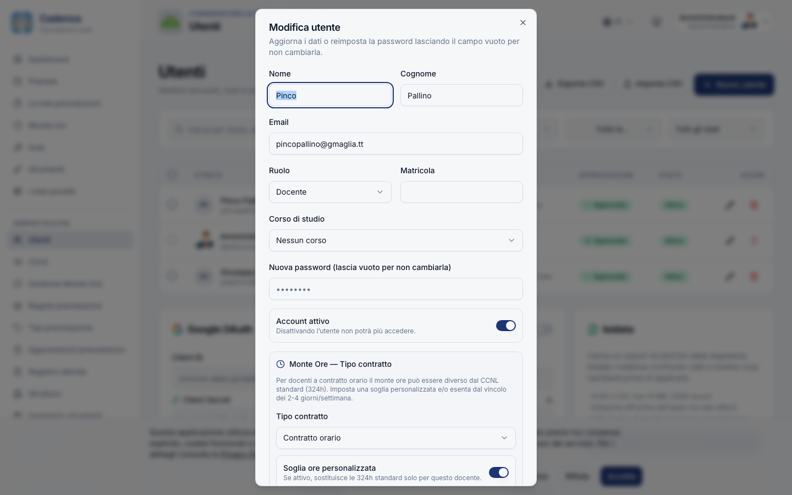

### 3.8 Politiche di password e sicurezza

Cadenza richiede password di **almeno 10 caratteri**, con almeno una **lettera maiuscola** e almeno una **cifra**. È la policy raccomandata dalle linee guida AGID 2024 per la PA italiana. Le password storiche più corte continuano a funzionare per il login, ma alla prossima richiesta di cambio dovranno rispettare le nuove soglie.

I tentativi di login, registrazione, invio del codice di sicurezza e generazione di prenotazioni ricorrenti sono **rate-limited**: dopo un numero di tentativi falliti l'IP riceve un blocco temporaneo, per proteggere il sistema da brute-force e spam. L'utente vede un messaggio chiaro tipo "Troppi tentativi, riprova tra X secondi".

### 3.9 Anti-blocco amministratore

Cadenza non ti permette di fare azioni che lascerebbero il sistema senza nessun amministratore attivo:

- Non puoi auto-degradarti a docente o studente.
- Non puoi disattivarti o eliminarti.
- Non puoi cancellare l'ultimo admin attivo dell'istituto.

Per dismettere un admin servono almeno **due** admin attivi, in modo che ne resti sempre uno. Se hai bisogno di chiudere completamente il Conservatorio (cessazione), serve un intervento del personale tecnico (DBA con accesso al database).

---

## 4. Corsi e Livelli

URL: `/admin/courses` (con scheda `?tab=corsi|livelli`)

### 4.1 Layout

La pagina ha due **macro-tab** in alto:

- **Corsi** (catalogo SAD del Conservatorio)
- **Livelli** (propedeutico, triennio, biennio, master, ecc.)

### 4.2 Tab "Corsi"

La toolbar offre:

- **Esporta CSV** — scarica l'elenco corsi (`corsi-AAAA-MM-GG.csv`)
- **Importa CSV** — carica un CSV per creare/aggiornare in massa
- **+ Nuovo corso** — apre il form di creazione

I filtri permettono di restringere per **codice/nome**, **livelli** o **stato** (attivo/disattivato). Selezionando più righe compare la barra di azione bulk con i bottoni **Deseleziona** e **Elimina selezionati**.

#### Form Corso

| Campo              | Descrizione                                                     |
| ------------------ | --------------------------------------------------------------- |
| Codice             | Codice ufficiale (es. `DCPL34`)                                 |
| Denominazione      | Nome del corso (es. `Pianoforte`)                               |
| Dipartimento       | Es. `Strumenti a tastiera` (facoltativo)                        |
| Livelli supportati | Spunta i livelli applicabili (Propedeutico, Triennio, ecc.)     |
| Descrizione        | Testo libero (facoltativo)                                      |
| Corso attivo       | Disattivando, il corso non è più selezionabile dai nuovi utenti |

Se non hai ancora configurato livelli, compare un avviso "Nessun livello configurato. Aggiungili dalla scheda Livelli".

### 4.3 Tab "Livelli"

Il catalogo dei livelli di studio (es. `propedeutico`, `triennio`, `biennio`, `master`). Una volta creato un livello lo riusi su tutti i corsi che lo supportano. Ogni livello ha codice, etichetta visualizzata, ordine in lista e stato attivo/disattivato.

---

## 5. Struttura: Istituti, Edifici, Aule, Dotazioni

URL: `/admin/structure` (con scheda `?tab=sedi|dotazioni`)

### 5.1 Layout

Macro-tab selector in alto: **Sedi** e **Dotazioni**.

La gerarchia è: **Istituto → Edificio → Aula → Equipment** (dotazione strumentale dell'aula). Ogni livello è una card espandibile/collassabile con anagrafica e i bottoni **+ Crea figlio**, **✎ Modifica**, **🗑 Elimina**.

Le **dotazioni di una stanza** appaiono come "chip" cliccabili sotto la riga dell'aula (per modificare o cancellare al volo) con un bottone tratteggiato **+ Aggiungi**.

### 5.2 Form Istituto

Il form Istituto raccoglie l'anagrafica e i **dati legali** che servono alla pagina Privacy Policy / Termini.

**Anagrafica**: Nome, Codice, Città, Indirizzo, Descrizione, Logo (PNG/JPG/WEBP/SVG).

**Dati legali** (per la sezione "Titolare del trattamento" della privacy):

- Denominazione legale ("Conservatorio di Musica Statale ...")
- P. IVA, Codice fiscale
- Email contatto, PEC
- Nome e email del DPO (Data Protection Officer)
- Foro competente (default: città dell'istituto)
- Sub-processor: lista dei fornitori esterni (es. SMTP provider, hosting), uno per riga, formato `Nome | Finalità | Localizzazione | URL DPA`

### 5.3 Form Edificio

Nome, Codice, Indirizzo, Piani (lista separata da virgole, es. `Piano Terra, 1º, 2º`).

### 5.4 Form Aula

| Campo                  | Descrizione                                                               |
| ---------------------- | ------------------------------------------------------------------------- |
| Nome                   | Es. `Aula 12`                                                             |
| Codice                 | Es. `A.101` (facoltativo)                                                 |
| Piano                  | Da scegliere fra i piani definiti per l'edificio                          |
| Capienza               | Numero di persone                                                         |
| Tipologia              | `studio`, `aula`, `concerto`, `ufficio`                                   |
| Ruoli ammessi          | Quali ruoli possono prenotarla                                            |
| Corsi autorizzati      | Se vuoi limitare l'accesso a specifici corsi (vuoto = tutti)              |
| Foto aula              | Immagine 16:9 (facoltativa)                                               |
| Aula prenotabile       | Disattiva temporaneamente l'aula da tutto il sistema                      |
| Richiedi check-in (QR) | Se attivo, l'utente deve scansionare un QR per "presentarsi" (anti-ghost) |
| Richiede approvazione  | Per le sale concerti / auditorium: ogni prenotazione passa per §7.1       |
| QR check-in (PDF)      | Bottone per scaricare il foglio A4 da affiggere in aula                   |

### 5.5 Form Dotazione (Equipment)

Permette di descrivere lo strumentario di una specifica aula: nome, tipologia, quantità, marca/modello, in funzione (sì/no). Puoi pre-compilare nome e tipo scegliendo dal **catalogo dotazioni** (vedi §5.7).

### 5.6 Bulk action floating bar

Selezionando edifici o aule (checkbox), in basso compare una card fissa con i conteggi degli elementi selezionati e i bottoni **Deseleziona** ed **Elimina**. La cancellazione di un edificio rimuove a cascata anche le sue aule, le dotazioni e le prenotazioni; lo stesso vale per la cancellazione di un'aula. Cadenza ti riporta i conteggi finali nel toast (es. "5 aule eliminate, 12 prenotazioni rimosse").

### 5.7 Tab "Dotazioni"

Il catalogo riusabile delle dotazioni (template). Una volta creato il template "Pianoforte verticale", lo riusi assegnandolo a tutte le aule che lo posseggono in due click. Cambiare il template aggiorna automaticamente tutte le aule che lo usano.

### 5.8 Vista pubblica `/rooms`

La pagina `/rooms` (visibile a tutti gli utenti loggati) mostra le aule **raggruppate per edificio**, con sezioni espandibili e un colore identificativo per ogni edificio. Riduce lo scroll su istituti con più sedi e rende immediato distinguere "Aula 12 — Storico" da "Aula 12 — Succursale". Lo stato espanso/collassato di ogni gruppo viene ricordato durante la sessione.

---

## 6. ⭐ Regole prenotazione

URL: `/admin/rules`

Questa è la sezione che governa **chi può prenotare cosa, quando e per quanto tempo**. Le regole sono lo strato di policy che Cadenza applica a ogni nuova prenotazione: la prenotazione passa solo se **tutte** le regole applicabili la consentono.

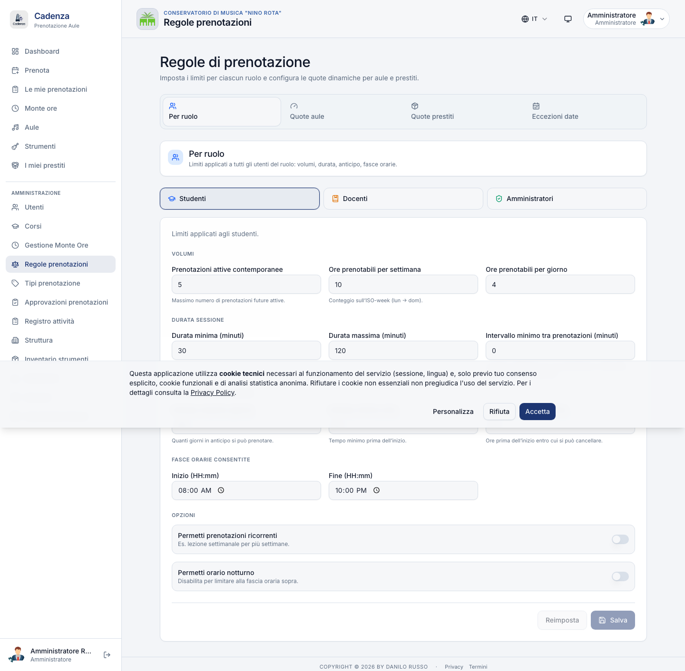

La pagina ha **quattro macro-tab** in alto:

```
Regole prenotazioni
├─ Per ruolo            (limiti base per studenti / docenti / admin)
├─ Quote                (limiti per stanza / edificio / tipo aula)
├─ Quote prestiti       (analogo per inventario strumenti)
└─ Eccezioni            (override temporanei per ruolo, aula e finestra)
```

### 6.0 Come Cadenza valuta una prenotazione (in sintesi)

Quando un utente prova a prenotare, Cadenza verifica in ordine:

1. L'utente è **attivo e approvato**.
2. L'aula è **prenotabile** (non disattivata, non cestinata).
3. Non c'è già **un'altra prenotazione** confermata sull'aula nella stessa fascia oraria.
4. L'utente non ha **un'altra prenotazione confermata in un'altra aula** nella stessa fascia (un docente non può fisicamente essere in due posti).
5. La regola **per ruolo** (max ore/settimana, durata massima, finestra oraria, cooldown, ecc.) è rispettata.
6. Le **quote** specifiche (per tipo aula, stanza, edificio) sono rispettate.
7. Nessuna **eccezione `block`** copre quella fascia oraria/aula/ruolo.
8. Se l'aula richiede approvazione, la prenotazione viene salvata in stato `pending_approval` (vedi §7.1).

Se uno dei controlli fallisce, l'utente vede un messaggio leggibile nella propria interfaccia che spiega esattamente cosa non torna (es. "Hai superato le ore settimanali consentite").

### 6.1 Tab "Per ruolo"

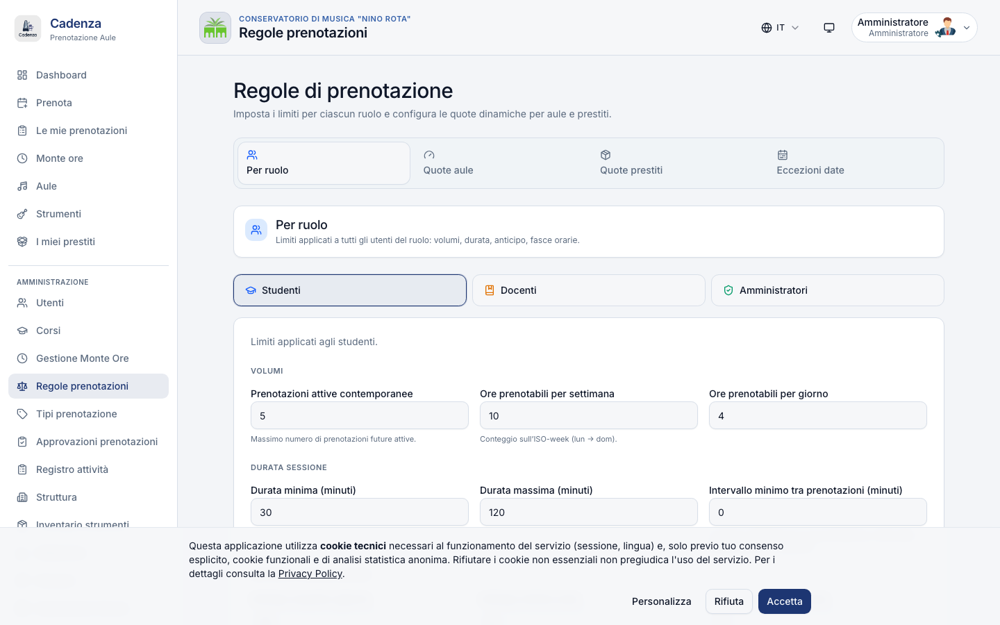

Tre toggle in alto per scegliere il ruolo (Studenti · Docenti · Admin). Sotto, un form con i parametri che valgono per quel ruolo:

| Campo                                     | Default                     | Significato                                                                                                                                                                                   |
| ----------------------------------------- | --------------------------- | --------------------------------------------------------------------------------------------------------------------------------------------------------------------------------------------- |
| **Max prenotazioni attive contemporanee** | 5                           | Numero massimo di prenotazioni future contemporanee.                                                                                                                                          |
| **Max ore / settimana**                   | 10 (studente), 20 (docente) | Tetto orario settimanale (lun–dom).                                                                                                                                                           |
| **Max ore / giorno**                      | 4                           | Tetto giornaliero.                                                                                                                                                                            |
| **Durata massima prenotazione**           | 120 minuti                  | Una prenotazione di 3h va spezzata in più slot.                                                                                                                                               |
| **Durata minima prenotazione**            | 30 minuti                   | Slot minimo (allineato al granularità del calendario).                                                                                                                                        |
| **Anticipo massimo (giorni)**             | 14                          | Quanto in anticipo si può prenotare. Studente=14, docente=30 tipici.                                                                                                                          |
| **Anticipo minimo (minuti)**              | 0                           | Per evitare prenotazioni "fra 5 minuti" su aule libere. Docente=0, studente=15 tipici.                                                                                                        |
| **Cancellation cutoff (ore)**             | 2                           | Sotto questa soglia, cancellare conta come no-show (e va a impattare le statistiche).                                                                                                         |
| **Richiede approvazione**                 | falso                       | Se vero, **tutte** le prenotazioni di quel ruolo passano per la coda di approvazione (utile per il primo periodo dei nuovi studenti).                                                         |
| **Allow same-day**                        | vero                        | Permettere prenotazioni in giornata.                                                                                                                                                          |
| **Orario apertura / chiusura**            | 08:00 / 22:00               | Fuori finestra le prenotazioni vengono rifiutate.                                                                                                                                             |
| **Cooldown tra prenotazioni** (minuti)    | 0                           | Minuti minimi tra la fine di una prenotazione e l'inizio della successiva dello stesso utente. Utile per evitare il "trucco" di concatenare due slot da 2h per fare di fatto un blocco da 4h. |

#### Configurazione consigliata per la prima messa in opera

```
ruolo studente:
  max attivi=5, max settimanali=10h, max giornaliere=4h
  durata max=120 min, durata min=30 min
  anticipo max=14 gg, anticipo min=15 min, cutoff=2h
  no approvazione, no same-day=falso, 08:00–22:00

ruolo docente:
  max attivi=20, max settimanali=40h, max giornaliere=8h
  durata max=240 min, durata min=30 min
  anticipo max=60 gg, anticipo min=0, cutoff=2h
  no approvazione, allow same-day=vero, 07:00–23:00

ruolo admin:
  illimitato (lascia 0 o vuoto per "nessun limite")
  altro come docente
```

> I campi a `0` significano "nessun limite". Non confonderli con "campo non valorizzato".

### 6.1bis Scenari guidati per la configurazione "Per ruolo"

Per aiutarti a partire, ecco tre profili di Conservatorio reali e i parametri consigliati. Adattali poi alla tua realtà locale.

#### Scenario A — Conservatorio piccolo / medio (≤ 200 studenti, 1 sede)

| Parametro                 | Studente | Docente | Razionale                                                           |
| ------------------------- | -------- | ------- | ------------------------------------------------------------------- |
| Max prenotazioni attive   | 5        | 15      | Lo studente non deve "occupare" il calendario settimane in anticipo |
| Max ore / settimana       | 12       | 30      | 2h al giorno × 6 giorni per lo studente è generoso                  |
| Max ore / giorno          | 4        | 8       | Studente non studia per 8h, docente sì                              |
| Durata max prenotazione   | 120      | 240     | Lo studente fa lezione + studio personale                           |
| Anticipo max (gg)         | 14       | 60      | Il docente programma il semestre, lo studente vede 2 settimane      |
| Anticipo min (min)        | 15       | 0       | Lo studente deve "decidersi" 15 min prima                           |
| Cancel cutoff (h)         | 2        | 2       | Sotto le 2h conta come no-show                                      |
| Orario apertura/chiusura  | 08-22    | 07-23   | Il docente inizia presto e chiude più tardi                         |
| Cooldown tra prenotazioni | 30 min   | 0       | Anti-aggiramento del cap giornaliero per gli studenti               |

#### Scenario B — Conservatorio grande (> 400 studenti, 2-3 sedi, sala concerti)

Stessi parametri di A, con queste differenze:

- **Max ore / settimana studente: 8** (più persone in coda → ognuno ne usa di meno)
- **Max ore / giorno studente: 3**
- **Anticipo max studente: 7 gg** (rotazione più rapida)
- Aggiungi una **quota dedicata** sulle aule "premium" (vedi §6.2 esempio Q3)
- Considera il **cooldown 60 min** per gli studenti se vedi che concatenano sistematicamente

#### Scenario C — Sessione esami / saggi (modalità intensiva, 2-3 settimane all'anno)

Non cambiare le regole base. Crea invece **eccezioni temporanee** (vedi §6.3) per:

- Sospendere quota weekend (`time_window` con `daysOfWeek=sab+dom`, `Ore max=999`)
- Aprire l'orario serale fino alle 24 per i docenti (eccezione su ruolo docente)
- Limitare l'aula concerti a "solo prenotazioni dell'esame" (eccezione `block` con scope aula)

Le eccezioni scadono in automatico alla data finale: niente da ricordare di ripristinare a posteriori.

### 6.2 Tab "Quote"

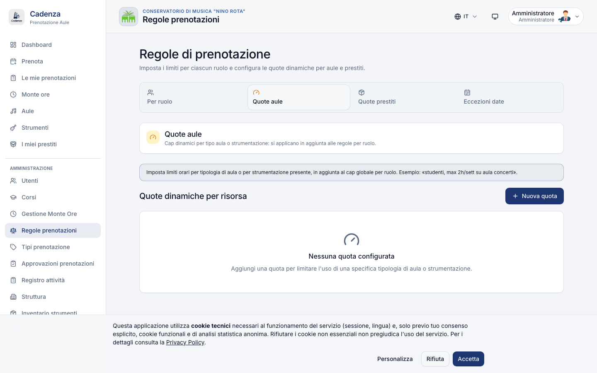

Una **quota** è un sotto-limite più stringente per uno specifico target. Cadenza applica **prima** la regola per ruolo e **poi** tutte le quote che corrispondono al target della prenotazione, prendendo il limite più basso.

> **In una frase**: "_la regola di ruolo dice quanto vale per tutto il sistema; la quota dice quanto vale per una specifica risorsa_". Se per uno studente il ruolo dice 12 h/sett ma esiste una quota "Aula 12: max 2h/sett per studente", quello studente farà al massimo 2h in Aula 12 + altre 10h sparse altrove.

#### Tipi di scope

| Scope           | Esempio                        | Uso tipico                                                     |
| --------------- | ------------------------------ | -------------------------------------------------------------- |
| `roomType`      | studio · aula · concerto       | "Studenti possono prenotare la sala concerti max 4h/settimana" |
| `equipmentType` | pianoforte_coda · contrabbasso | "Solo pianisti possono prenotare aule con pianoforte a coda"   |
| `room`          | aula 101                       | Limite specifico su una stanza (es. la più richiesta)          |
| `building`      | edificio_centrale              | Limite per edificio (utile se uno è in ristrutturazione)       |
| `global`        | \*                             | Limite globale (oltre quello di ruolo)                         |

#### Tetti che puoi mettere su una quota

Ogni quota può combinare uno o più di questi tetti — Cadenza applica il **più stringente** che trova:

| Tetto                  | Significato                                 |
| ---------------------- | ------------------------------------------- |
| Max ore / giorno       | Tetto giornaliero su quel target            |
| Max ore / settimana    | Tetto settimanale (lun–dom)                 |
| Max ore / mese         | Tetto del mese solare                       |
| Max prenotazioni       | Numero massimo di prenotazioni nel periodo  |
| Giorni della settimana | Lista giorni cui si applica (vuoto = tutti) |
| Fascia oraria          | Inizio – Fine entro cui la quota agisce     |

> Almeno **un tetto** > 0 deve essere presente: una quota "0 ore in tutto" significa "blocca completamente quel target per quel ruolo" e ha un nome dedicato (eccezione `block`, vedi §6.3).

#### Esempi pratici di quote

| #   | Ruolo    | Scope           | Scope value                 | Tetto                 | Giorni  | Orario      | Note                                                   |
| --- | -------- | --------------- | --------------------------- | --------------------- | ------- | ----------- | ------------------------------------------------------ |
| Q1  | studente | `roomType`      | concerto                    | 0                     | tutti   | —           | Studenti non possono prenotare sale concerti           |
| Q2  | docente  | `roomType`      | concerto                    | 4 h/mese              | tutti   | —           | Docenti: sala concerti solo per prove serie            |
| Q3  | studente | `room`          | "Aula 12 — Pianoforte coda" | 2 h/sett              | tutti   | —           | Aula contesa: massimo 2h/settimana per studente        |
| Q4  | studente | `global`        | \*                          | 6 h totali            | sab-dom | —           | Limite weekend: 6h totali sab + dom                    |
| Q5  | studente | `building`      | "Sede succursale"           | 0                     | tutti   | —           | Edificio in ristrutturazione                           |
| Q6  | studente | `equipmentType` | pianoforte_coda             | 4 h/sett              | tutti   | —           | Solo se studente di pianoforte può prenotare il "coda" |
| Q7  | docente  | `roomType`      | concerto                    | 8 h/sett              | tutti   | 18:00–22:00 | Concerto disponibile solo la sera per i docenti        |
| Q8  | studente | `room`          | "Sala 3 — Sala prove"       | 3 h/giorno · 9 h/sett | tutti   | 09:00–22:00 | Limite giornaliero + settimanale combinati             |

#### Sequenza di applicazione (cosa succede passo-passo)

Quando uno studente prova a prenotare 2h in Aula 12 (pianoforte coda) il martedì dalle 14 alle 16, Cadenza fa così:

1. Verifica la regola di ruolo (es. studente: max 12 h/sett · max 4 h/giorno) → OK ammesso ne ha già fatte 8 nella settimana e 0 nella giornata.
2. Cerca le quote che riguardano questa prenotazione:
   - Q3 `room` "Aula 12" — max 2 h/sett → contiamo le ore già prenotate in Aula 12 questa settimana
   - Q6 `equipmentType` pianoforte_coda — max 4 h/sett → contiamo le ore in qualunque aula con questa dotazione
3. **Limite più stretto vince**. Se Q3 dice ne ha già 1h e Q6 dice 2h:
   - Q3 ammette ancora 1h
   - Q6 ammette ancora 2h
   - **Cadenza accetta solo 1h** (il minimo dei due) → l'utente vede "Hai raggiunto il limite per Aula 12".
4. Se nulla blocca, la prenotazione viene salvata (oppure va in approvazione se l'aula lo richiede).

> **Quote vs eccezioni**: la quota è **strutturale e permanente** ("Aula 12 vale così tutto l'anno"). L'eccezione è **temporanea** ("dal 1 al 30 giugno cambiamo le regole"). Vedi §6.3 per le eccezioni.

### 6.2bis Tab "Quote prestiti"

Stesso schema delle quote aule, ma applicato all'**inventario strumenti**:

| Campo           | Significato                                             |
| --------------- | ------------------------------------------------------- |
| Ruolo           | Admin · Docente · Studente                              |
| Scope           | `family` (archi, fiati, ecc.) · `instrument` · `global` |
| Max simultanei  | Quanti prestiti aperti contemporaneamente               |
| Max giorni anno | Quanti giorni cumulati in un anno solare                |
| Attivo          | Disabilita la quota senza eliminarla                    |

### 6.3 Tab "Eccezioni"

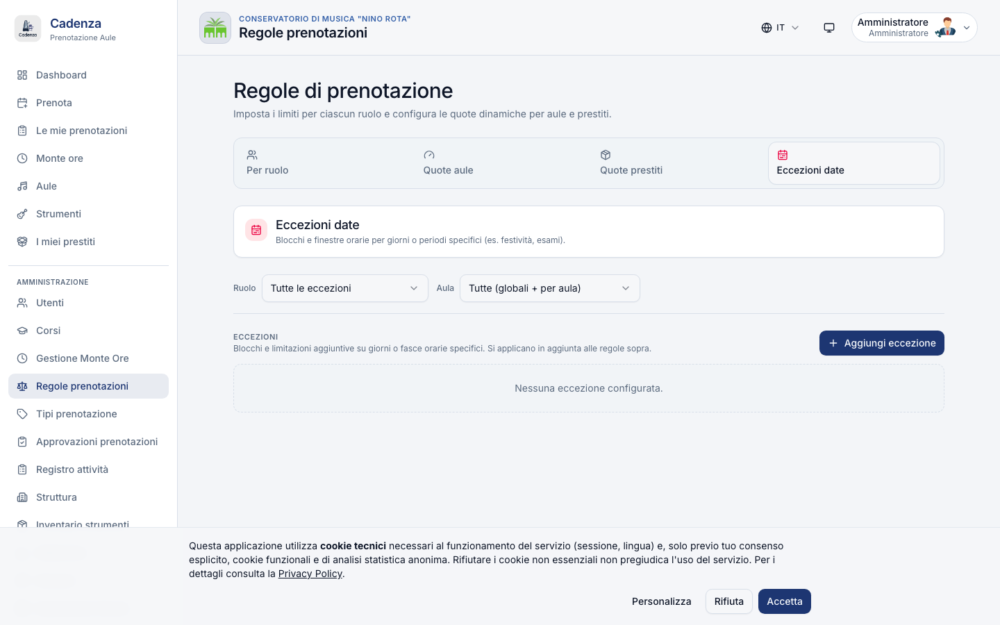

Le eccezioni sono **regole temporanee** che entrano in gioco al posto (o in aggiunta) di quelle normali. La differenza con le quote di §6.2 è la **scadenza**: una quota vale finché non la cancelli; un'eccezione ha una data di inizio e una di fine.

Le eccezioni **sospendono o sostituiscono** una regola/quota per:

- una **finestra temporale** specifica (es. "durante la sessione esami sospendi la quota weekend")
- uno **specifico ruolo** (es. "tutti gli studenti dal 1 al 15 giugno")
- una **specifica aula** ⭐ NUOVO (es. "Aula 5: max 2h/giorno per gli studenti dal 1 al 30 giugno")
- una combinazione delle precedenti (ruolo + aula + finestra)

L'eccezione ha priorità sulla regola/quota originaria. Ogni modifica viene tracciata nel registro attività.

#### Due tipi di eccezione

Cadenza supporta due tipi di eccezione, da scegliere al momento della creazione:

| Tipo          | Cosa fa                                                                                                                                                                                         | Caso d'uso tipico                                                                                                                  |
| ------------- | ----------------------------------------------------------------------------------------------------------------------------------------------------------------------------------------------- | ---------------------------------------------------------------------------------------------------------------------------------- |
| `block`       | **Chiusura totale** del target nella finestra. Nessuna prenotazione passa.                                                                                                                      | Aula in ristrutturazione, sciopero, festa patronale, evento istituzionale che occupa l'intera struttura                            |
| `time_window` | **Cambia il limite di ore** nella finestra. La prenotazione passa solo se sotto il nuovo tetto. Può **rilassare** (più ore del solito) o **stringere** (meno ore) rispetto alla regola normale. | Sessione esami: "lo studente può fare 999h/sett (di fatto illimitato)" oppure "Aula 5 a numero chiuso: max 2h/giorno per studente" |

#### Lista eccezioni — toolbar e filtri

In alto sopra la tabella:

- **Filtro Ruolo**: tutti i ruoli · studenti · docenti · admin.
- **Filtro Aula**: tutte le aule · oppure scegli una specifica aula. Le aule sono ordinate `Sede · Aula` (es. "Conservatorio Storico · Aula 12") per non confondersi quando ci sono numeri ripetuti tra edifici diversi.

> Le aule la cui Sede è stata cestinata da `/admin/structure` non compaiono nei due Select.

Ogni riga della lista mostra: nome dell'eccezione + tipo (`block` viola scuro · `time_window` ambra), il badge ruolo, il badge viola **"Aula X"** se è scoped, la finestra date e l'icona attiva/non attiva.

#### Form Eccezione

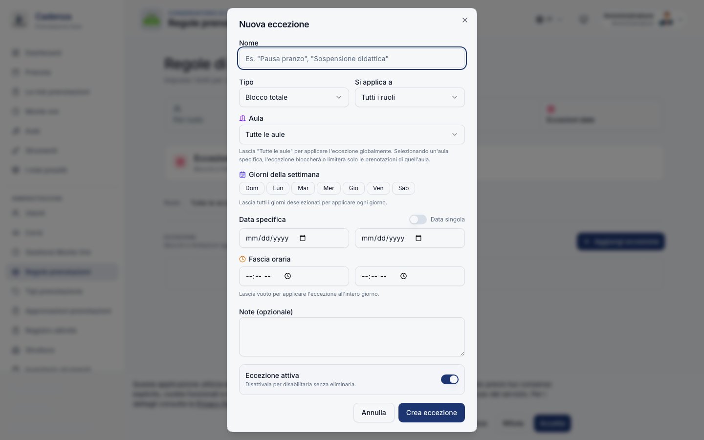

| Campo                  | Descrizione                                                                 |
| ---------------------- | --------------------------------------------------------------------------- |
| Nome                   | Etichetta libera (es. "Saggi sessione estiva")                              |
| Tipo                   | `block` (chiusura totale) oppure `time_window` (limite ore in una finestra) |
| Si applica a           | Tutti · solo studenti · solo docenti · solo admin                           |
| **Aula** ⭐ NUOVO      | Tutte le aule (default) oppure una specifica aula                           |
| Ore max nella finestra | Solo se `time_window` (es. 2 ore)                                           |
| Giorni della settimana | 7 bottoni Lun–Dom; vuoto = ogni giorno                                      |
| Data singola / range   | Toggle: data unica oppure dal–al                                            |
| Fascia oraria          | Inizio – Fine (facoltativa)                                                 |
| Note                   | Testo libero                                                                |
| Attivo                 | Spegni per disabilitarla senza eliminarla                                   |

> **Pre-popolamento aula**: se apri il dialog mentre il filtro lista "Aula" è valorizzato, il Select del form parte già su quella aula.

> **Semantica scope aula**:
>
> - `block` con aula scoped → blocca solo prenotazioni su quell'aula (es. ristrutturazione di una singola aula); le altre aule restano libere.
> - `time_window` con aula scoped → "max X ore **in quell'aula**". Esempio: "Aula 12: max 2h/giorno per studente, dal 1 al 30 giugno" non impedisce di fare altre 2h nell'Aula 5 lo stesso giorno.
> - Aula = "Tutte" → la regola vale **per tutte le aule** (eccezione globale).

> **Nudge visivo**: se la data finale è nel passato, un banner azzurro avvisa che l'eccezione ignorerà comunque le nuove prenotazioni.

#### Scenari guidati per le eccezioni

I 6 casi più frequenti, con i parametri esatti da inserire nel form:

##### Scenario 1 — Aula in ristrutturazione (1 settimana)

> _"L'Aula 7 viene tinteggiata dal 12 al 18 maggio. Nessuno deve prenotarla."_

| Campo        | Valore                          |
| ------------ | ------------------------------- |
| Nome         | "Aula 7 — tinteggiatura"        |
| Tipo         | `block`                         |
| Si applica a | Tutti                           |
| Aula         | "Sede Storica · Aula 7"         |
| Dal · Al     | 2026-05-12 · 2026-05-18         |
| Note         | "Riapertura prevista lunedì 19" |

> Al salvataggio Cadenza ti chiede se ci sono già prenotazioni in quel range. Vedi più sotto **"Sovrapposizioni storiche"**.

##### Scenario 2 — Sessione esami: weekend illimitato per docenti (2 settimane)

> _"Dal 10 al 25 giugno i docenti possono prenotare anche sabato/domenica senza il tetto weekend di 6h."_

| Campo                  | Valore                                  |
| ---------------------- | --------------------------------------- |
| Nome                   | "Esami giugno — weekend libero docenti" |
| Tipo                   | `time_window`                           |
| Si applica a           | Solo docenti                            |
| Aula                   | Tutte le aule                           |
| Ore max nella finestra | 999 (di fatto illimitato)               |
| Giorni                 | sab + dom                               |
| Dal · Al               | 2026-06-10 · 2026-06-25                 |

##### Scenario 3 — Sala concerti riservata per saggio finale (1 giorno)

> _"Il 15 giugno la sala concerti è prenotabile SOLO da chi ha l'esame, dalle 18 alle 23."_

Combo di due eccezioni:

1. `block` su sala concerti per tutti dalle 00 alle 18 + dalle 23 alle 24 → la sala è chiusa fuori orario.
2. Prenoti tu (admin) la sala concerti per il candidato — la prenotazione passa perché un admin può sempre forzare se serve.

In alternativa, più rapida: una singola eccezione `block` su tutte le aule **eccetto** chi ha già la prenotazione manuale fatta dall'admin (Cadenza non blocca le prenotazioni create prima dell'eccezione).

##### Scenario 4 — Aula contesa: numero chiuso temporaneo (1 mese)

> _"L'Aula 12 (con il pianoforte coda) è troppo richiesta a maggio. Limitiamola a max 2h/giorno per studente, dal 1 al 31 maggio."_

| Campo                  | Valore                           |
| ---------------------- | -------------------------------- |
| Nome                   | "Aula 12 — numero chiuso maggio" |
| Tipo                   | `time_window`                    |
| Si applica a           | Solo studenti                    |
| Aula                   | "Sede Storica · Aula 12"         |
| Ore max nella finestra | 2 (= max 2h/giorno)              |
| Giorni                 | tutti                            |
| Dal · Al               | 2026-05-01 · 2026-05-31          |

> Importante: la finestra "ore max" qui è interpretata come **massimo per giorno** (la finestra giornaliera). Per cambiarla in settimanale, usa una quota in §6.2 invece di un'eccezione.

##### Scenario 5 — Vacanze di Natale: chiusura totale (2 settimane)

> _"Dal 24 dicembre al 6 gennaio nessuno deve poter prenotare niente."_

| Campo        | Valore                  |
| ------------ | ----------------------- |
| Nome         | "Chiusura natalizia"    |
| Tipo         | `block`                 |
| Si applica a | Tutti                   |
| Aula         | Tutte le aule           |
| Dal · Al     | 2026-12-24 · 2027-01-06 |

> In alternativa puoi usare il modulo Monte Ore → tab Sospensioni (§8.4): più ricco, perché ti gestisce anche gli slot Monte Ore esistenti.

##### Scenario 6 — Sciopero / festa patronale (1 giorno)

> _"Il 16 ottobre è la festa di Santa Cecilia, patrona dei musicisti. Conservatorio chiuso."_

| Campo        | Valore               |
| ------------ | -------------------- |
| Nome         | "Santa Cecilia 2026" |
| Tipo         | `block`              |
| Si applica a | Tutti                |
| Aula         | Tutte le aule        |
| Dal · Al     | 2026-10-16 (singola) |

#### Combinazione di più eccezioni

Le eccezioni sono **additive**: tutte quelle che corrispondono al target della prenotazione vengono valutate. Se due eccezioni si toccano:

- Due `block` → l'utente vede comunque "aula chiusa".
- Un `block` + un `time_window` → vince il `block` (il blocco totale è più stringente).
- Due `time_window` → vince il limite più basso.

Esempio: hai un'eccezione "Aula 12 max 2h/giorno per maggio" (Scenario 4) e ne crei una seconda "Esami giugno — weekend libero" (Scenario 2). Per uno studente che prova a prenotare l'Aula 12 il sabato 1 giugno, vale solo la prima (la seconda è per docenti).

#### Sovrapposizioni storiche al setup di chiusure

Quando crei un'eccezione di tipo **`block`** (chiusura aula/edificio per ristrutturazione, sciopero, festa patronale), Cadenza ti chiede subito **"ci sono prenotazioni già confermate che cadono in questo blocco?"**:

1. Salvi l'eccezione.
2. Si apre un dialog di follow-up con l'elenco delle prenotazioni in conflitto. Quelle collegate al piano didattico (Monte Ore) hanno il badge **"Monte Ore"**.
3. Bottone **"Cancella tutte ($N)"** → batch cancel in transazione: le prenotazioni cancellate ricevono il motivo (testo obbligatorio) ed email automatica all'utente. Per le prenotazioni Monte Ore, lo slot collegato viene "lockato" così che la rigenerazione non le ricrei.

Anche se chiudi senza cancellare nulla, l'eccezione `block` resta attiva: blocca le **prenotazioni future** dal momento della creazione in poi (l'anteprima serve solo a smaltire lo storico).

### 6.4 Granularità slot

Il "minimo comune multiplo" temporale del sistema è **30 minuti**. Tutte le quote/regole agiscono su questa griglia. È configurabile a livello globale ma sconsigliato cambiarlo dopo il go-live perché potrebbe confondere chi ha già preso l'abitudine.

### 6.5 Errori comuni di configurazione

| Sintomo                                                                   | Causa probabile                                                              | Cosa fare                                                                                                                        |
| ------------------------------------------------------------------------- | ---------------------------------------------------------------------------- | -------------------------------------------------------------------------------------------------------------------------------- |
| Studenti non riescono a prenotare aule libere                             | Quota globale impostata a `0` (= bloccato) anziché vuota                     | Lascia il campo VUOTO per "nessun limite" — `0` significa zero ore                                                               |
| Errore "fuori orario" per docenti dopo le 22                              | Orario chiusura troppo restrittivo per il ruolo                              | Aumenta l'orario di chiusura nel tab "Per ruolo" per quel ruolo                                                                  |
| Quota mensile non scatta                                                  | Ore = 0 interpretato come "nessun limite"                                    | Imposta un valore intero positivo                                                                                                |
| Eccezione non applicata                                                   | Date invertite (`Dal > Al`), oppure interruttore "Attivo" disattivato        | Controlla nella tab Eccezioni l'icona verde/grigia e le date                                                                     |
| Errore "intervallo minimo violato" su prenotazioni back-to-back legittime | Cooldown troppo alto sul ruolo docente                                       | Rivedi il cooldown in §6.1, valuta se metterlo solo su studente                                                                  |
| Errore "conflitto logico utente" durante generazione Monte Ore            | Pattern Monte Ore con slot concentrici legittimi (es. masterclass in 2 aule) | Il generator di Monte Ore lo bypassa correttamente; se il blocco persiste leggi la nota nello "Stato generazione" della proposta |

---

## 7. Approvazioni · Registro attività · Bookings

Tre pagine distinte ma correlate:

- **§7.1 Approvazioni** (`/admin/approvals`) — coda dei nuovi `pending_approval` da approvare/rifiutare.
- **§7.2 Registro attività** (`/admin/activity-log`) — operazioni sulle **prenotazioni confermate future** (filtri, cancellazione in blocco, scambio aula).
- **§7.3 Bookings** (`/admin/bookings`) — alias di `/admin/activity-log`, mantenuto per i bookmark vecchi.

### 7.1 Approvazioni

URL: `/admin/approvals`

Qui finiscono:

- prenotazioni su aule che richiedono approvazione (sale concerti, auditorium)
- prenotazioni di utenti il cui ruolo richiede approvazione (es. studenti in periodo di prova)
- prenotazioni che violano un'eccezione "approva-prima" (rara)

Per ogni richiesta vedi: utente, ruolo, aula, edificio, data/ora, durata, motivo. I bottoni sono **✓ Approva** (la prenotazione diventa confermata e va nel calendario) e **✗ Rifiuta** (apre un dialog con la textarea "Motivo del rifiuto" — il messaggio arriva via email all'utente).

In testa alla pagina compare anche una card-link a **"Variazioni Monte Ore"** con un badge contatore `N in sospeso`: ti porta a `/admin/monte-ore?tab=amendments`. Si aggiorna automaticamente ogni 60 secondi.

### 7.2 Registro attività ⭐

URL: `/admin/activity-log`

> Questa è la pagina che usi quando devi **intervenire su prenotazioni già confermate**: cancellarne molte d'un colpo (chiusura last-minute) o **scambiare** aula/orario fra due prenotazioni.

Mostra solo le prenotazioni **confermate e future**. La barra di ricerca cerca su nome, cognome, email, aula, edificio e motivo.

Le colonne sono: utente, aula, quando (data + orario), tipo. Spuntando una o più righe compare la barra di selezione con il riepilogo "N prenotazioni · M utenti distinti" + i bottoni:

- **⇄ Scambia** — visibile **solo** se hai selezionato esattamente 2 prenotazioni
- **✗ Cancella selezionate** — sempre visibile se la selezione è > 0

#### Cancellazione in blocco con motivo broadcast

1. Seleziona più prenotazioni (checkbox).
2. Click **Cancella selezionate** → dialog con textarea **"Motivo della cancellazione"** (almeno 10 caratteri).
3. Conferma → cancellazione in blocco + email broadcast a tutti gli utenti coinvolti, motivo incluso (senza esporre i nomi degli altri utenti).
4. Per le prenotazioni Monte Ore lo slot collegato viene riportato attivo, salvo che cada in un'eccezione `block` attiva (vedi §6.3).

Casi tipici: aula in ristrutturazione last-minute, sciopero, evento istituzionale.

#### Scambio aula tra due prenotazioni

Selezionando **esattamente 2** prenotazioni future, il bottone **"Scambia"** inverte aula e orario tra le due:

| Prima                           | Dopo                            |
| ------------------------------- | ------------------------------- |
| Booking A: Aula 5 · 10:00–12:00 | Booking A: Aula 8 · 14:00–15:00 |
| Booking B: Aula 8 · 14:00–15:00 | Booking B: Aula 5 · 10:00–12:00 |

Lo scambio avviene in modo **atomico** (o riesce su entrambe o non tocca nulla). Se nel frattempo qualcun altro è "entrato in mezzo" prenotando una delle aule, l'operazione viene annullata e ritenti.

### 7.3 Bookings page

URL: `/admin/bookings` — alias deprecato di `/admin/activity-log`. Mantenuto solo perché qualcuno ha il bookmark; usa la pagina **Registro attività** per i nuovi flussi.

---

## 8. ⭐ Gestione Monte Ore

URL: `/admin/monte-ore`

> **Cos'è**: il "Monte Ore" è il **piano annuale di insegnamento** del docente del Conservatorio italiano. Contrattualmente il docente di ruolo deve garantire **almeno 324 ore annue** di didattica, distribuite in non meno di 2 e non più di 4 giorni a settimana, in una finestra di insegnamento definita (di solito ottobre→giugno). I docenti **a contratto orario** (precari, supplenti, part-time, collaboratori) hanno invece soglie individuali (tipicamente 30-200h) — vedi §8.10. Cadenza è **il primo software italiano** che digitalizza completamente questo flusso contrattuale.

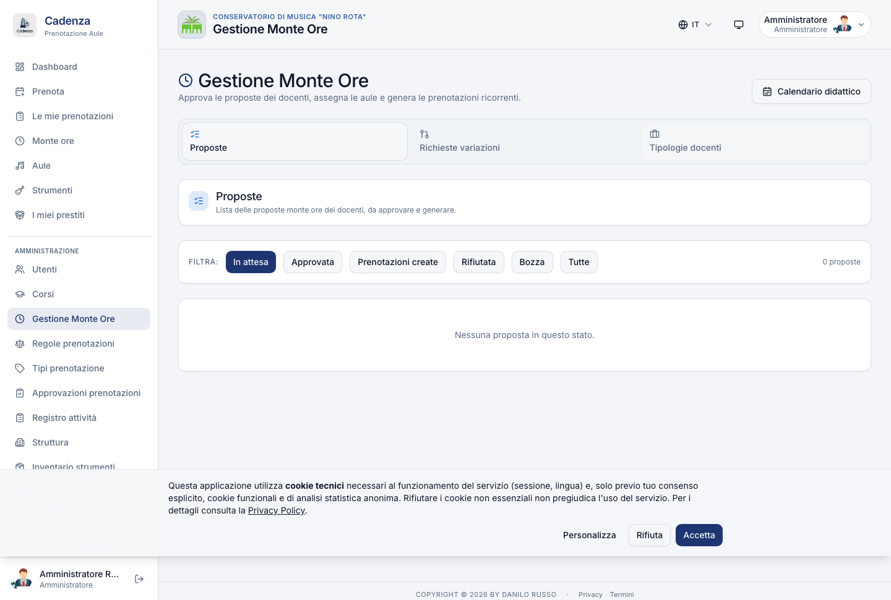

### 8.1 Layout della pagina

Pagina con **3 macro-tab card**:

- **Proposte** — coda proposte da approvare/generare
- **Richieste variazioni** — variazioni post-approvazione, badge contatore in sospeso
- **Tipologie docenti** — gestione tipi contratto e impatto sull'override individuale

In header c'è il pulsante **"Calendario didattico"** che porta alla pagina di configurazione (vedi §8.3).

### 8.2 Cosa contiene il Monte Ore

Per ogni docente Cadenza memorizza:

- **Settings istituzionali**: anno accademico, finestra lezioni (es. 1 ott – 30 giu), finestra inserimento proposte (es. 15 set – 15 ott), soglia ore (default 324), max e min giorni a settimana.
- **Proposta annuale del docente**: aule scelte, schedule (giorni × orari), totale ore stimato. Stati: `bozza → in attesa → approvata/rifiutata → generata`.
- **Schedule**: le righe della proposta (es. "Lun 14:00–17:00 in Aula 101").
- **Slot**: le occorrenze concrete materializzate (es. lunedì 5/10/2026 14:00–17:00). Diventano prenotazioni vere e proprie quando approvi.
- **Sospensioni didattiche**: festività, ferie, esami → escludono date dalla generazione degli slot.
- **Variazioni** (amendments): cambiamenti su una proposta già approvata.

### 8.2bis Il flusso completo del Monte Ore (vista d'insieme)

Il Monte Ore copre un intero anno accademico e attraversa **5 fasi**. Sapere in che fase sei in un dato momento ti dice cosa fare e cosa aspettarti dai docenti.

```
  Fase 1               Fase 2                   Fase 3              Fase 4                    Fase 5
  ──────────           ──────────────           ─────────────       ───────────────────       ──────────────────
  Settings             Inserimento              Approvazione        Generazione                Variazioni
  (admin)              (docente)                (admin)             (admin)                    (docente → admin)
  ──────────           ──────────────           ─────────────       ───────────────────       ──────────────────
  set/ott              metà set – metà ott      ott (rolling)       metà ott                   tutto l'anno
  ↓                    ↓                        ↓                   ↓                          ↓
  • anno accad.        • compila griglia        • esamina lista     • crea le prenotazioni    • il docente chiede
  • finestra           • aule + giorni          • approva o         • slot Monte Ore →          una modifica
    lezioni              + orari                  rifiuta             Booking nel calendario   • admin accetta
  • finestra           • totale h vs soglia     • controlla         • email broadcast            o rifiuta
    inserimento        • submit                   contratto                                    • amendment
  • soglia 324h                                                                                  contatore (tetto
  • sospensioni                                                                                  annuo)
```

**Stati del flusso di una proposta**:

| Stato       | Chi può cambiarlo | Cosa succede                                                                           |
| ----------- | ----------------- | -------------------------------------------------------------------------------------- |
| `bozza`     | Docente           | Sta compilando, può salvare e tornare. Nessuno la vede.                                |
| `in attesa` | Docente → Admin   | Il docente ha cliccato "Invia". Compare nella tab Proposte dell'admin.                 |
| `approvata` | Admin             | Tutto ok dal punto di vista contrattuale. Le aule sono assegnate. Manca solo generare. |
| `rifiutata` | Admin             | Il docente riceve email con motivo. La proposta torna a "bozza" se vuole rilavorarla.  |
| `generata`  | Admin             | Le prenotazioni sono nel calendario aule. Il docente le vede in `/my-bookings`.        |

> **Differenza tra "approvata" e "generata"**: il primo è la **firma contrattuale** ("ok, il piano è valido"), il secondo è la **materializzazione operativa** ("ho creato 800 prenotazioni nel calendario"). Le tieni separate per poter approvare in batch e poi generare quando il calendario è davvero pronto.

### 8.3 Configurazione settings (admin · una volta all'anno)

URL diretto: `/admin/monte-ore/settings`.

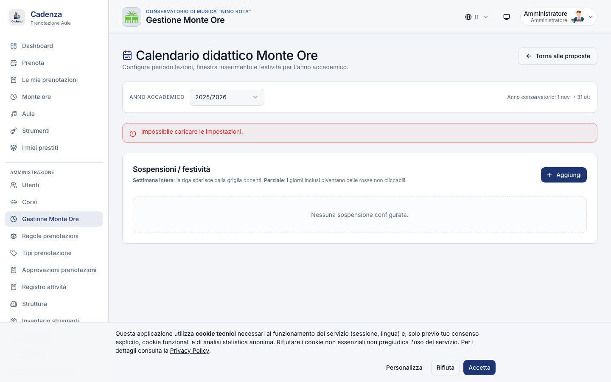

| Campo                         | Esempio                 | Note                                                                                |
| ----------------------------- | ----------------------- | ----------------------------------------------------------------------------------- |
| Anno accademico start / end   | 2026-09-01 / 2027-08-31 | Periodo di riferimento contrattuale                                                 |
| Finestra lezioni start / end  | 2026-10-01 / 2027-06-30 | I docenti possono pianificare lezioni solo dentro questa finestra                   |
| Finestra inserimento proposte | 2026-09-15 / 2026-10-15 | Periodo in cui i docenti possono compilare/sottomettere proposte                    |
| Soglia ore annue              | 324                     | Default contratto AFAM. Personalizzabile (es. 270h per docenti part-time)           |
| Max richieste variazione      | 3                       | Tetto annuale di amendments per proposta                                            |
| Max giorni / settimana        | 4                       | Vincolo CCNL                                                                        |
| Min giorni / settimana        | 2                       | Vincolo CCNL                                                                        |
| Bypass durata massima         | vero                    | Se vero, le lezioni Monte Ore possono superare la durata max della regola del ruolo |

> **Importante**: una volta che le proposte sono state approvate e generate, modificare i settings **non rigenera** automaticamente le prenotazioni. Per cambiare la finestra lezioni a metà anno servono variazioni (amendments) per ogni proposta interessata.

### 8.4 Sospensioni didattiche

In coda alla pagina Settings c'è una tabella con tutte le sospensioni dell'anno accademico:

| Colonna  | Contenuto                            |
| -------- | ------------------------------------ |
| Nome     | Es. "Vacanze di Natale"              |
| Dal · Al | Range date                           |
| Tipo     | "Settimana intera" oppure "Parziale" |
| Azioni   | 🗑 Elimina (con conferma)            |

Form sospensione (inline): nome, data inizio/fine, tipo, e un interruttore **"Applica alle prenotazioni"** che, se attivo, crea automaticamente un'eccezione `block` nella sezione Regole.

Sospensioni tipiche da inserire all'inizio dell'anno:

- Festività nazionali (1 nov, 8 dic, 25 dic, 1 gen, 6 gen, Pasqua e lunedì dell'angelo, 25 apr, 1 mag, 2 giu, 15 ago)
- Ferie istituzionali (es. 24 dic – 6 gen, 1–7 settembre)
- Sessioni esami (es. 10–25 gen, 10–25 giu)
- Eventi straordinari (es. saggi pubblici dell'istituto)

Quando applichi alle prenotazioni esistenti, Cadenza marca gli slot Monte Ore futuri come "sospesi", crea un amendment automatico per ogni proposta toccata e notifica i docenti via email.

### 8.5 Tab "Proposte" (vista admin)

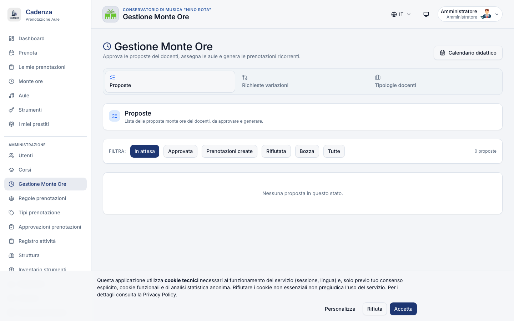

Lista di tutte le proposte annuali. **Filtri per stato** in alto:

`Tutte` · `In attesa` · `Approvata` · `Generata` · `Rifiutata` · `Bozza`

Counter "{N} proposte" a destra. Ogni proposta è una **card cliccabile** che mostra: nome del docente, badge tipologia contratto, AA, numero di fasce, totale ore proposte vs soglia, data invio. Click su `Apri` → dialog con la tabella completa fasce orarie (giorno · orario · aula · tipo · etichetta).

Bottoni nel dialog di dettaglio:

| Stato       | Bottoni                                                                              |
| ----------- | ------------------------------------------------------------------------------------ |
| `In attesa` | **Approva** (verde) · **Rifiuta** (apre textarea motivo)                             |
| `Approvata` | **Crea prenotazioni dal monte ore** (genera gli slot e li trasforma in prenotazioni) |
| `Generata`  | **Annulla generazione** (riapre la proposta — utile se ti accorgi di un errore)      |
| Sempre      | Tabella fasce con ✎ Modifica / 🗑 Elimina · `+ Aggiungi fascia` · `Chiudi`           |

#### Tasso di approvazione consigliato

In media, approva direttamente le proposte dei docenti senior; usa "approva con modifiche" per spostare i nuovi docenti su aule meno richieste. Il rifiuto puro va riservato alle proposte fuori vincolo (≥4 giorni/sett, <324h/anno, fuori finestra).

### 8.5bis Casi guidati durante la revisione delle proposte

Mentre esamini le proposte, ti capiteranno di sicuro questi 5 casi. Ecco cosa fare in ciascuno.

#### Caso A — Docente entro la soglia, aule libere

Il caso ideale. Apri la proposta, vedi il totale ore = 324 (o sopra), nessun warning sulle aule. Click **Approva** → si arricchisce di un timestamp e passa a "Approvata". Quando hai approvato tutti i docenti del corso/sezione, torna in lista e usa **Crea prenotazioni** per generare in batch (vedi §8.7).

#### Caso B — Docente sotto soglia (es. 312 h vs 324)

In dialog vedi una banda gialla "**totale 312 h vs 324 richieste**". Possibili cause:

- Sospensioni dell'anno (Natale, Pasqua) sottratte automaticamente → totale "lordo" 324 ma "netto" 312.
- Il docente ha lasciato fuori una fascia perché in dubbio sull'aula.

Cosa fare:

1. **Chiedi al docente** via mail o di persona: "ti mancano 12 ore — vuoi aggiungere un'altra fascia?"
2. Se sì, **rifiuta** con motivo "Manca un giorno di lezione, riapri la proposta in bozza e aggiungi una fascia di 4h × 3 settimane".
3. Se no (es. lui ha L. 104 al 50%), considera la **deroga individuale** (§8.10): porta la sua soglia a 162 h e riapprova.

#### Caso C — Aula non assegnata su una fascia (warning icon)

Una fascia mostra ⚠ "aula da assegnare". Significa che il docente ha indicato giorno + orario ma non ha potuto scegliere un'aula (era già occupata da altri docenti o non aveva permessi). Cosa fare:

1. Apri la fascia (✎ Modifica) → seleziona un'aula compatibile.
2. Salva. Cadenza ricontrolla la disponibilità. Se OK la fascia diventa verde.
3. Se nessuna aula libera, prova a **spostare la fascia** ad un altro slot orario (es. martedì 14-17 → giovedì 15-18) e riassegnare.

#### Caso D — Conflitto al momento della generazione

Hai cliccato **Crea prenotazioni** ma 3 slot non sono passati per overlap (un'altra prenotazione "manuale" si era infilata in quell'orario). La proposta torna in stato **"Approvata"** con un report che dice quali slot mancano.

Workflow:

1. Apri la proposta → vedi "3 slot non generati" + dettaglio (data + ora + aula).
2. Vai in `/admin/activity-log` → cerca la prenotazione conflittuale → cancella o sposta.
3. Torna sulla proposta → click **Crea prenotazioni** di nuovo. Stavolta passa.

> **Trick**: prima di generare in massa fai un giro dell'/admin/activity-log filtrando per range di date della finestra lezioni. Se vedi prenotazioni "ad hoc" (es. studenti che si sono prenotati la prima settimana di ottobre) cancella o spostale prima.

#### Caso E — Docente fuori vincolo (5 giorni/settimana)

Il vincolo CCNL è 2-4 giorni/sett. Se il docente fa 5 giorni, in dialog vedi un alert rosso. Non puoi approvare. Cosa fare:

1. **Rifiuta** con motivo "vincolo CCNL: max 4 giorni/sett, ridistribuisci le ore in 4 giorni".
2. Se è un docente con **bypass del vincolo** (es. supplente part-time concordato per fare 5 giorni × 1h), imposta la deroga individuale (§8.10) → spunta "Esente dal vincolo 2-4 gg/sett" → approva.

### 8.6 Tab "Richieste variazioni"

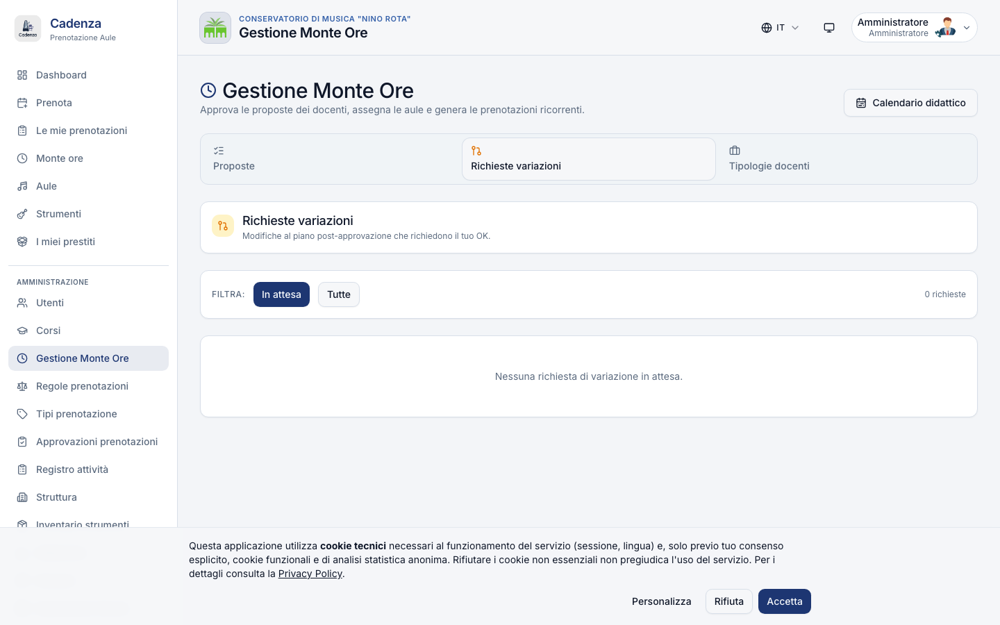

Una volta che la proposta è approvata, il docente può chiedere di **modificare** singole occorrenze:

- "La lezione di lunedì 12 ottobre la sposto a martedì 13"
- "Rimuovo la lezione del 5 dicembre per malattia, recupero il 7"
- "Cambio l'aula da 101 a 102 per i prossimi 3 mesi"

La tabella mostra: docente · AA, tipo (Disattivazione · Riattivazione · Cambio orario · Nuovo giorno), riepilogo dello slot toccato, note del docente, stato (In attesa · Auto-approvata · Approvata · Rifiutata) e i bottoni di azione.

#### I 4 tipi di amendment in dettaglio

| Tipo               | Cosa chiede il docente                                                                  | Effetto sul calendario quando approvi                                                                          |
| ------------------ | --------------------------------------------------------------------------------------- | -------------------------------------------------------------------------------------------------------------- |
| **Disattivazione** | "Cancella la lezione del 12 ottobre"                                                    | Lo slot Monte Ore viene marcato `inattivo`; la prenotazione corrispondente nel calendario aule viene annullata |
| **Riattivazione**  | "La lezione che avevo cancellato del 12 ottobre rimettila"                              | Lo slot torna `attivo` e Cadenza ricrea la prenotazione (se l'aula è ancora libera in quella fascia)           |
| **Cambio orario**  | "Quella del lunedì 14:00 spostala alle 16:00"                                           | Lo slot mantiene la stessa data ma nuovi orari; la prenotazione viene aggiornata                               |
| **Nuovo giorno**   | "Voglio aggiungere una lezione il giovedì 13 ottobre, sono in ritardo con il programma" | Cadenza ti chiede in dialog quale aula assegnare → crea il nuovo slot e la prenotazione                        |

Per ognuno il docente scrive una **nota** che tu vedi in chiaro al momento di approvare. Es. "spostamento per visita medica" o "recupero della classe X".

#### Auto-approve per casi semplici

Per ridurre il carico amministrativo puoi attivare in _Settings → Monte Ore_ l'**auto-approve amendments** per:

- spostamenti di ±7 giorni che non cambiano aula
- cancellazioni con almeno 24h di anticipo

Tutti gli altri restano in stato "In attesa" e richiedono la tua approvazione manuale.

#### Tetto annuale di amendments

Per evitare che la proposta venga riscritta di settimana in settimana, in _Settings → Monte Ore_ puoi impostare un **massimo di amendments per proposta per anno** (default: 3). Quando un docente raggiunge il tetto, vedrà un alert e non potrà più richiedere variazioni. In casi eccezionali tu admin puoi sempre **applicare modifiche manualmente** (modifica diretta della proposta) senza intaccare il contatore.

### 8.7 Generazione slot e materializzazione prenotazioni

Quando approvi una proposta, Cadenza:

1. Calcola tutte le **occorrenze** dello schedule per ogni giorno della settimana × tutti i giorni della finestra lezioni che non sono in sospensione.
2. Verifica che nessun'altra prenotazione collida nell'aula.
3. Se ci sono conflitti, la proposta torna a "In attesa" con un report leggibile per la riassegnazione manuale.
4. Crea gli slot interni e le prenotazioni corrispondenti, visibili nel calendario aule generale.
5. Aggiorna lo status della proposta a `Generata`.

> **Tempistica**: per un docente con 6h × 4 giorni × 36 settimane (~864 occorrenze) la generazione richiede 1–3 secondi. È un'operazione tutto-o-niente: o tutto va a buon fine, o nulla viene scritto.

### 8.8 Calendario didattico (vista pubblica)

Nella pagina docente `/monte-ore` c'è un bottone **"Calendario didattico"** che esporta in PDF/iCal:

- per il docente: il proprio piano annuale
- per la Direzione (link admin): vista aggregata di tutto il monte ore del Conservatorio (incrocio aule × docenti)

Utile da inviare al sindacato o alla segreteria per i registri di insegnamento.

### 8.9 Casi limite

| Caso                                         | Comportamento                                                                                                                 |
| -------------------------------------------- | ----------------------------------------------------------------------------------------------------------------------------- |
| Docente a contratto orario (30-200h)         | Imposta deroga individuale dalla pagina Utenti → vedi §8.10                                                                   |
| Coordinatore di sezione                      | Nella tab Approvazioni può approvare proposte solo del proprio corso/sezione                                                  |
| Sostituto temporaneo                         | Crea una proposta a nome del titolare originale + amendment di "subentro" per il periodo                                      |
| Sospensione tardiva (post-approvazione)      | Inserisci la sospensione con flag "applica"; Cadenza marca gli slot come sospesi e notifica i docenti                         |
| Errore sistemico (es. festività dimenticata) | Inserisci la sospensione retroattiva: le prenotazioni passate restano (storico immutabile), le future vengono marcate sospese |

### 8.10 ⭐ Deroga per docenti a contratto orario

> Implementata da v1.1 (aprile 2026). Risponde alla casistica del 20-40% del corpo docente di un Conservatorio medio: contrattisti, supplenti, collaboratori, accompagnatori al pianoforte, docenti di laboratorio.

#### Perché serve

Il modello standard di Cadenza assume **324h/anno per tutti i docenti** dell'istituto. Per i docenti a contratto orario questa soglia è errata (hanno spesso 30-200h concordate individualmente) e bloccherebbe il submit della proposta. La deroga sposta la soglia da "globale per istituto" a **"per-utente"**: ogni docente ha la sua soglia individuale + l'eventuale esenzione dal vincolo 2-4 giorni/settimana.

#### Come configurare la deroga

1. Vai su `/admin/users` e clicca su **Modifica** del docente target.
2. In coda al form compare la sezione **"Monte Ore — Tipo contratto"** (visibile solo per `role=docente`).
3. Compila:
   - **Tipo contratto**: la categoria informativa
   - **Soglia ore personalizzata**: attiva il toggle e inserisci le ore concordate (es. 60)
   - **Esente dal vincolo 2-4 gg/sett**: attiva se il docente concentra tutto in 1-2 giorni
   - **Motivazione**: obbligatoria, da intendere come riferimento contrattuale (es. "Contratto orario 60h - prot. 2026/123 del 15/09/2026")
4. Salva. Da quel momento il submit Monte Ore di quel docente userà la soglia personalizzata.


#### Come lo vede il docente

Il docente con una deroga vede sulla sua pagina `/monte-ore` un banner azzurro:

```
ⓘ  Soglia Monte Ore personalizzata: 60 ore/anno
   Tipo contratto: contratto orario · Vincolo 2-4 giorni/settimana: NON applicato
   Per modifiche contattare la Direzione.
```


#### Snapshot della soglia (immutabile per proposte già inviate)

Quando il docente fa submit, Cadenza memorizza il valore della soglia **in quel momento** dentro la proposta. Se domani rimuovi o modifichi la deroga, la proposta già inviata/approvata/generata resta valida con la soglia originale. È la "fotografia contrattuale" del momento del submit, e non si modifica retroattivamente.

#### Esempi tipici

| Categoria                     | Tipo contratto   | Soglia    | Bypass | Note                                            |
| ----------------------------- | ---------------- | --------- | ------ | ----------------------------------------------- |
| Titolare CCNL                 | titolare         | — (vuoto) | No     | Default 324h dal MonteOreSettings istituzionale |
| Titolare ridotto L.104/92     | titolare         | 270       | No     | Riduzione per assistenza familiare              |
| Supplente annuale 50%         | supplente        | 162       | No     | Mezzo monte ore titolare                        |
| Co.Co.Co. 60h annue           | contratto_orario | 60        | Sì     | Tipico per coadiutori al pianoforte             |
| Lab. di musica d'insieme 120h | altro            | 120       | No     | Da regolamento didattico                        |
| Accompagnatore concertistico  | contratto_orario | 30        | Sì     | Concerti pubblici, monoday possibile            |

#### Conformità

Ogni modifica della deroga viene tracciata automaticamente nel **registro attività** con: chi l'ha autorizzata, quando, valore precedente vs nuovo, motivazione. La motivazione è considerata "documento contrattuale" ai sensi della L.241/1990 §3 sulla motivazione dell'atto amministrativo. Conserva il registro per **almeno 10 anni** dalla cessazione del rapporto di lavoro (art. 2220 c.c.).

> Per il dettaglio progettuale completo della deroga vedi `docs/MONTE_ORE_DEROGA_CONTRATTO_ORARIO.md`.

---

## 9. Inventario strumenti

URL: `/admin/instruments` (con scheda `?tab=inventory|all_loans|overdue|expiring|rules`)

Pagina con **5 tab**: Inventario · Tutti i prestiti · Scaduti · In scadenza (entro 2 giorni) · Regole prestito.

### 9.1 Tab "Inventario"

In header: **Esporta CSV** · **Importa CSV** · **+ Nuovo strumento**.

I filtri permettono di restringere per **famiglia** (archi, fiati legni/ottoni, tastiere, percussioni, voce, elettronica…), **condizione** (ottimo, buono, discreto, da_riparare, fuori_uso) e **prestabilità** (sì/no).

Le colonne mostrano: foto thumbnail + nome + marca/modello, famiglia, codice, condizione, "Prestabile" sì/no, stato del prestito attuale, e le azioni ✎/🗑.

Selezionando più righe, in basso compare la barra ambra con i bottoni: **Deseleziona**, **Abilita prestito**, **Disabilita prestito**, **Elimina**.

#### Form Strumento

| Campo           | Descrizione                                              |
| --------------- | -------------------------------------------------------- |
| Nome            | Es. `Violino tradizionale`                               |
| Codice          | Codice inventario (es. `INV-0042`)                       |
| Famiglia        | archi · fiati legni · fiati ottoni · ecc.                |
| Condizione      | ottimo · buono · discreto · da_riparare · fuori_uso      |
| Marca / Modello | Stradivari · Yamaha · ecc.                               |
| Numero seriale  | Facoltativo                                              |
| Note            | Testo libero                                             |
| Foto            | Immagine 16:9; default uno strumento generico            |
| Prestabile      | Disattivando, lo strumento sparisce dalla lista prestiti |

### 9.2 Tab "Tutti i prestiti"

Tabella di tutti i prestiti con qualunque stato (`richiesto`, `attivo`, `scaduto`, `restituito`, `rifiutato`).

Colonne: utente, strumento, periodo (dal/al), stato (badge colore), azioni dipendenti dallo stato:

| Stato                | Azioni disponibili                              |
| -------------------- | ----------------------------------------------- |
| `richiesto`          | ✓ Approva (verde) · ✗ Rifiuta (rosso)           |
| `attivo` o `scaduto` | 📄 Stampa consegna (PDF) · ✓ Forza restituzione |
| `restituito`         | 📄 Stampa restituzione (PDF)                    |

### 9.3 Tab "Scaduti" e "In scadenza"

Liste filtrate dei prestiti a rischio. Bottone **"Solleva"** → invia mail di reminder all'utente. Tutti i prestiti scaduti generano automaticamente reminder ogni 7 giorni.

Workflow di un prestito:

```
richiesta → (admin approva) → attivo → (utente restituisce) → restituito
                                  ↓
                                scaduto (auto se oltre la data prevista)
```

Ogni cambio stato genera una mail automatica all'interessato.

### 9.4 Tab "Regole prestito"

Tabella che mappa ogni strumento ai **corsi autorizzati** a richiederlo in prestito. Per ogni riga: foto + nome + codice + famiglia + chip dei corsi (oppure "Tutto permesso").

Click **Modifica** → dialog con: ricerca corsi, bottoni `Seleziona tutto` / `Deseleziona tutto`, griglia checkbox 2 colonne dei corsi attivi.

> Le **quote prestito** numeriche (max prestiti simultanei, max giorni anno) sono separate e si configurano in §6.2bis (Tab "Quote prestiti" delle Regole).

---

## 10. Statistiche / Analytics

URL: `/admin/analytics`

### 10.1 Layout

In alto: bottoni **Export CSV** e **Export PDF** + filtro per data (dal–al). Sotto: 4 KPI tiles, una heatmap occupazione 7×24, una linea trend ultime 8 settimane, e i top 10 aule + top 10 utenti.

### 10.2 Filtri

| Elemento  | Default      |
| --------- | ------------ |
| Date from | Oggi - 30 gg |
| Date to   | Oggi         |
| Apply     | Refresh dati |

### 10.3 KPI grid (4 card)

- **Confermate** — prenotazioni confermate nel periodo
- **Auto-cancellate** — auto-cancellate per no-show o cutoff
- **No-show %** — `auto-cancellate / (confermate + auto-cancellate) × 100`
- **Totale create** — tutte le richieste, indipendentemente dallo stato finale

### 10.4 Visualizzazioni

- **Heatmap 7×24**: griglia giorno × ora, cella più scura = più prenotata (ti dice quando il Conservatorio è davvero pieno).
- **Trend ultime 8 settimane**: ore prenotate per settimana ISO.
- **Top 10 aule per ore**: bar chart orizzontale (le aule più richieste).
- **Top 10 utenti per ore** (visibile solo agli admin, non condivisibile esternamente).

### 10.5 Export

- **Export CSV** — file con i dati grezzi del periodo
- **Export PDF** — formato A4 landscape, pronto da archiviare

> Per la **trasparenza GDPR**: nei report esportati i dati utente nei top 10 sono anonimizzati per default. Spuntando "Includi nomi" la scelta viene tracciata nel registro attività.

---

## 11. Annunci

URL: `/admin/announcements`

In header: bottone **+ Nuovo annuncio**. Sotto, una griglia di card animate. Ogni card mostra:

- Badge contestuali in alto: **Pinnato** · **Audience: tutti/role/corso/edificio** · **Inattivo** o **Scaduto** · **Email inviata**
- Titolo + corpo (max 2 righe troncate)
- Data pubblicazione e scadenza
- Azioni inline: **📤 Rinvia email** · **✎ Modifica** · **🗑 Elimina**

### 11.1 Form Annuncio

| Campo          | Descrizione                                                     |
| -------------- | --------------------------------------------------------------- |
| Titolo         | Massimo 200 caratteri                                           |
| Corpo          | Testo lungo, supporta Markdown semplice                         |
| Pubblicato il  | Default = adesso. Date future = bozze automatiche               |
| Scadenza       | Dopo questa data l'annuncio sparisce dal feed                   |
| Audience kind  | Tutti · Per ruolo · Per corso · Per edificio                    |
| Audience value | Necessario se diverso da "Tutti" (dropdown ruoli/corsi/edifici) |
| Pin            | L'annuncio resta sempre in cima alla lista                      |
| Attivo         | Disattivando lo nascondi senza cancellarlo                      |
| Invia email    | Spunta se vuoi mandare anche un'email broadcast all'audience    |

> **Modifica annuncio**: la modifica **non rimanda** automaticamente l'email. Se vuoi notificare di nuovo, usa l'azione **📤 Rinvia email** sulla card.

### 11.2 Audience targeting

| Tipo     | Esempio               | Visibilità                                                |
| -------- | --------------------- | --------------------------------------------------------- |
| Tutti    | —                     | Tutti gli utenti + display kiosk                          |
| Ruolo    | `docente`             | Solo docenti                                              |
| Corso    | `DCPL34 (Pianoforte)` | Studenti del corso indicato                               |
| Edificio | `Edificio centrale`   | Solo display kiosk dell'edificio (non nel feed personale) |

Gli annunci **pinnati** finiscono anche nella rotazione del display kiosk pubblico nelle aule (vedi §12.7 per la configurazione globale del display).

---

## 12. Impostazioni Server

URL: `/admin/server-settings`

### 12.0 Hub di navigazione macro/sub-tab

La pagina è un **hub** organizzato in macro-tab in alto + sub-tab quando la macro è "Servizi":

```
Impostazioni Server
├─ Servizi   ├─ Mail · Mail Outbox · Messaging · Backups
├─ Aspetto
├─ QR Codes
├─ Display
├─ Audit Log
└─ Moduli
```

| Macro     | Sub-tab                                  | Sezione manuale               |
| --------- | ---------------------------------------- | ----------------------------- |
| Servizi   | Mail · Mail Outbox · Messaging · Backups | §12.1 · §12.2 · §12.3 · §12.4 |
| Aspetto   | (nessuna sub)                            | §12.5                         |
| QR Codes  | (nessuna sub)                            | §12.6                         |
| Display   | (nessuna sub)                            | §12.7                         |
| Audit Log | (nessuna sub)                            | §12.8                         |
| Moduli    | (nessuna sub)                            | §12.9                         |

### 12.1 Servizi → Mail (SMTP)

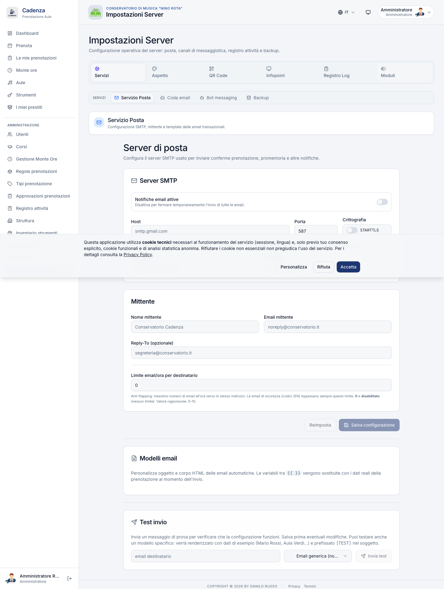

In alto compare il badge di stato della configurazione: **Configurato (DB)** · **Disabilitato** · **Non configurato**. Se sono attive variabili d'ambiente SMTP, un alert blu informa che salvare la form prenderà il loro posto.

#### Card "Server SMTP"

| Campo                           | Descrizione                                                                                                |
| ------------------------------- | ---------------------------------------------------------------------------------------------------------- |
| Abilitato                       | Interruttore per accendere/spegnere l'invio mail                                                           |
| Host                            | Es. `smtp.gmail.com`                                                                                       |
| Porta                           | Tipicamente 465 (TLS) o 587 (STARTTLS)                                                                     |
| Connessione sicura (TLS)        | TLS implicito (porta 465) vs STARTTLS (porta 587)                                                          |
| Username                        | Account autenticato                                                                                        |
| Password                        | Mai pre-compilata (lascia vuoto = nessun cambio). Bottone occhio per mostrare                              |
| From address                    | Es. `noreply@conservatorio.it`                                                                             |
| From name                       | Es. `Conservatorio · Cadenza`                                                                              |
| Reply-to                        | Indirizzo a cui arrivano le risposte                                                                       |
| Throttle per destinatario / ora | 0–1000. `0` = disabilitato. Mette un tetto al numero di mail per ora allo stesso indirizzo (anti-flapping) |

#### Banner di aiuto

- **Mismatch porta/sicura** (ambra): porta 465 senza TLS, oppure 587/25 con TLS
- **Typo nell'host** (ambra): `smpt.` rilevato → suggerisce auto-correct in `smtp.`
- **Password salvata**: badge verde accanto al label password se è già presente nel database

#### Card "Modelli email"

Dropdown per selezionare un template della libreria (badge `OFF` se disabilitato) → apre l'editor con preview e bottone Salva.

#### Card "Test invio"

Compili destinatario e tipo email (Generica · uno specifico template), clicchi **Invia test** e vedi il risultato sotto: ✅ verde se il messaggio è partito, ❌ rosso con dettaglio se ha fallito.

### 12.2 Servizi → Mail Outbox

URL legacy: `/admin/mail-outbox` (ora sub-tab di Server Settings).

#### Banner di salute SMTP

In alto, banner con 4 colori:

- 🟢 **Verde** — SMTP attivo, coda pulita
- 🟡 **Ambra** — SMTP non configurato
- 🔴 **Rossa** — SMTP non raggiungibile + dettaglio errore
- 🔴 **Rossa** — Email fallite oltre il numero massimo di tentativi

Aggiornato ogni 30 secondi automaticamente.

#### Filtri e tabella

- **Pillole stato**: Tutti · In attesa · Inviate · Fallite (dead)
- **Ricerca**: cerca su email destinatario / oggetto
- **Paginazione** prev/next

Le colonne sono: stato, tipo template, destinatario, oggetto, tentativi (`N / max`), quando (data inviata o prossimo tentativo), azioni: 🔄 **Riprova** (solo se "fallite") e 🗑 **Elimina**.

### 12.3 Servizi → Messaging

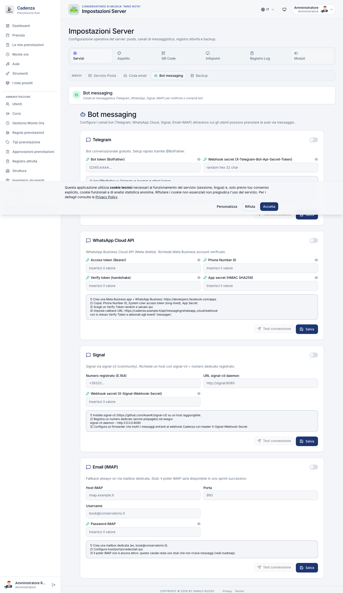

Una card per ogni canale (**Telegram · WhatsApp · Signal · Email/IMAP**). Ognuna ha:

- Toggle abilita/disabilita
- Le impostazioni non-secret (host, ID, ecc.)
- Le credenziali secret (mostrate come `••••••` se già salvate)
- Una guida di setup contestuale (alert info)
- Eventuale risultato dell'ultimo test (alert info/error)
- Bottoni **Test** + **Salva**

I parametri tecnici per ciascun canale (token, secret, webhook URL) sono spiegati passo-passo in `docs/BOT-MESSAGING.md`.

### 12.4 Servizi → Backups

#### Card "Scheduler"

Mostra: stato (Attivo/Disattivato), orario pianificato, prossimo run e — sotto — l'esito dell'**ultimo run** (✅ verde o ❌ rosso con dettaglio).

Configurazione (in modalità modifica):

| Campo                     | Descrizione                         |
| ------------------------- | ----------------------------------- |
| Auto enabled              | Accendi/spegni il backup automatico |
| Ora · Minuto pianificati  | A che ora locale parte              |
| Quanti giornalieri tenere | 1–365                               |
| Quanti settimanali tenere | 1–104                               |
| Quanti mensili tenere     | 1–60                                |
| Auto restart              | Riavvia il backend dopo un restore  |

#### Card "Lista backup"

Tabella con file, data, size, e azioni:

- 📥 **Download** — scarica il `.tar.gz`
- 🔄 **Restore** (con conferma) — ripristina lo stato dell'istante in cui il backup è stato creato. Cadenza salva uno **snapshot pre-restore** prima di sovrascrivere, così puoi tornare indietro se ti accorgi di aver scelto il backup sbagliato. Il bottone "Riavvia backend" appare nella card di successo.
- 🗑 **Delete** (con conferma)

In header: bottoni **+ Backup adesso** e **⤒ Upload** (per caricare un backup esterno).

> Per la procedura completa di backup, restore e off-site upload (S3, Hetzner Storage Box, rclone, GPG) vedi `docs/BACKUP.md`.

### 12.5 Aspetto

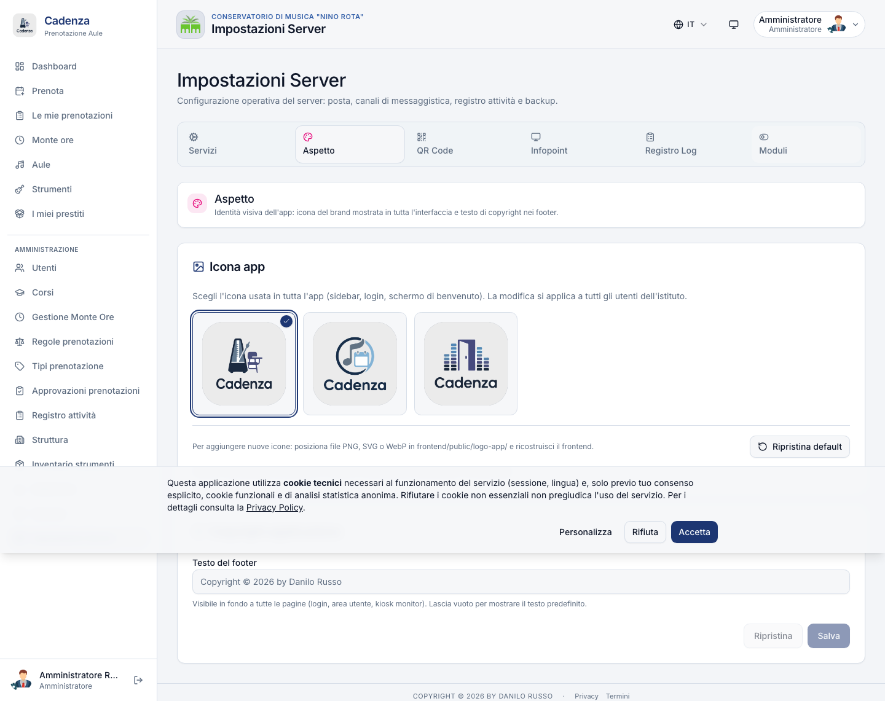

Due card:

- **Icona dell'app** — upload del logo brand (PNG/SVG). Il logo appare nella sidebar, sul login, sul display kiosk.
- **Copyright** — testi che compaiono nel footer di tutte le pagine pubbliche e sul display kiosk.

### 12.6 QR Codes

#### Card "Sicurezza check-in"

Permette di restringere il check-in (la "presentazione" all'aula tramite QR) **solo agli IP della rete interna del Conservatorio**. Configura:

- **Restringi alla rete interna** (interruttore on/off)
- **Lista CIDR**: gli intervalli IP autorizzati (es. `192.168.1.0/24`, `10.0.0.0/8`)
- Bottone **"Aggiungi mio IP corrente"** (utile dal browser per capire quale è il tuo IP pubblico)

Banner di aiuto:

- **Loopback warning**: avvisa se l'IP rilevato è `::1` o `127.x.x.x` (sei in localhost, non in rete vera)
- **Rete vuota + restringi attivo**: configurazione pericolosa, **nessuno** potrebbe fare check-in. Allerta rossa.

#### Card "QR-code per aula"

Lista delle aule con anteprima del QR e i bottoni:

- 📥 **Scarica QR** — il PDF A4 da affiggere in aula
- 🔄 **Rigenera** — genera un nuovo QR (i fogli stampati vecchi diventano inutili)

In header: **Rigenera tutti** — operazione di emergenza (es. dopo un incidente di sicurezza).

### 12.7 Display Kiosk (admin)

Pagina di configurazione globale dello schermo `/display` esposto al pubblico nelle aule.

#### Card "Rotazione prenotazioni"

Master toggle on/off + tabella edifici. Per ogni edificio: dot color + nome, conteggio aule, switch abilita/disabilita, e l'**intervallo di rotazione** (5–600 secondi). Disattivando il master, l'intera tabella diventa opaca.

#### Card "Concerti"

| Campo             | Descrizione             |
| ----------------- | ----------------------- |
| Giorni look-ahead | Da 0 a 365              |
| Numero massimo    | Da 0 a 50 (`0` = tutti) |
| Intervallo (sec)  | Da 5 a 600              |

#### Card "Annunci"

| Campo            | Descrizione                             |
| ---------------- | --------------------------------------- |
| Numero massimo   | Da 0 a 30 (`0` = tutti)                 |
| Intervallo (sec) | Da 5 a 600                              |
| Solo pinnati     | Mostra solo gli annunci con badge "Pin" |

In fondo: bottone **Salva** (disabilitato se non hai modificato nulla).

> **Anteprima**: il pulsante in header apre `/display` in nuova scheda — utile per verificare la rotazione in tempo reale dopo aver salvato.

### 12.8 Audit Log

URL: `/admin/audit-log` (sub-tab di Server Settings; rinominato in "Registro Log" per distinguerlo dal "Registro attività" operativo di §7.2).

#### Filtri

- **Action**: tutti · POST · PUT · PATCH · DELETE
- **Target Type**: tipo oggetto interessato (utente, prenotazione, regola, ecc.)
- **Actor ID**: ID dell'admin
- **Date From / To**: range temporale
- **Path Search**: testo libero sulla path API

Bottoni **Apply** / **Reset** (Reset visibile solo se ci sono filtri attivi).

#### Tabella

50 righe per pagina. Colonne: quando, attore (nome + email), action (badge mono colorato), target, path, status code (verde se OK, rosso se ≥400).

**Click sulla riga** → si espande mostrando il payload, la risposta, l'IP e lo User-Agent.

#### Conservazione e prune

Per conformità GDPR i record dell'audit log oltre i **730 giorni** vengono rimossi automaticamente dal sistema. Prima del prune, Cadenza esegue un **export firmato** in `backups/audit/` (file `.gz` + sidecar `.hmac` con la chiave HMAC), così gli archivi storici restano disponibili per audit forensic. Solo se l'export riesce, il prune procede; in caso contrario i dati vengono preservati per il prossimo tentativo.

### 12.9 Moduli

Card con due interruttori:

| Modulo                 | Effetto                                                               |
| ---------------------- | --------------------------------------------------------------------- |
| **Monte Ore docenti**  | Nasconde le voci `/monte-ore` (utente) e `/admin/monte-ore` (sidebar) |
| **Prestito strumenti** | Nasconde `/instruments`, `/my-loans`, `/admin/instruments`            |

> **Importante**: i toggle sono **puramente di presentazione**. Il backend resta sempre attivo:
>
> - I dati esistenti **non vengono cancellati**
> - Le rotte API continuano a funzionare (deep-link, integrazioni esterne, bookmark)
> - Riattivando il modulo i link tornano subito visibili

---

## 13. Integrazioni Isidata

URL: `/admin/integrations/isidata` — oppure dialog modale dalla pagina Utenti (§3.6).

### 13.1 Layout a 3 step

#### Step 1: Upload

Trascini il file `.xlsx`, `.xls` o `.csv` nella drop area (oppure clicchi per scegliere). Sotto, una textarea collassabile permette di forzare un mapping personalizzato delle colonne quando i nomi nel file sono diversi da quelli standard (vedi §13.3).

#### Step 2: Anteprima (preview)

Cadenza fa il parsing del file e mostra **4 KPI tile** in alto:

- **Da creare** (verde) — nuovi utenti che entreranno in Cadenza
- **Da aggiornare** (blu) — utenti già presenti i cui dati cambieranno
- **Da disattivare** (ambra) — utenti che erano stati linkati a Isidata ma non sono più nel nuovo export
- **Letti totali** — quante righe sono state effettivamente lette dal file

Sotto le KPI, 3 sezioni filtrabili con i dettagli di ogni cambio + eventuali warning. **Nessuna modifica viene scritta** in questa fase.

#### Step 3: Done

Card "Importazione completata" con i numeri finali e il bottone "Importa un altro".

### 13.2 Flusso a 2 step (preview → apply)

L'import è in **due fasi distinte**, per dare a chi lo lancia il tempo di rivedere ciò che cambierà prima di confermare:

1. **Preview**: il file viene caricato e analizzato. Cadenza memorizza temporaneamente il file (per max 10 minuti) e ne calcola un'impronta digitale.
2. **Apply**: confermi l'import. Cadenza riapre il file, ricontrolla l'impronta digitale e — se il file è stato sostituito nel frattempo — rifiuta l'apply per evitare confusione. Esegue create / update / disattivazione in transazione: o tutto va a buon fine, o nulla viene scritto.

I nuovi utenti nascono in stato **`pending`** (vanno approvati esplicitamente dalla pagina Approvazioni). Gli utenti orfani non vengono mai cancellati fisicamente: solo `isActive=false` con nota "Non più presente nell'export Isidata del YYYY-MM-DD". Riapparire in un export futuro li riattiva.

### 13.3 Mapping personalizzato per istituto

Se il vostro export Isidata ha header diversi da quelli auto-riconosciuti, scrivi un piccolo JSON nella textarea "Override colonne" durante l'upload. Esempio:

```json
{
  "externalId": "Numero Matricola",
  "email": "Email Istituzionale",
  "courseCode": "Codice Indirizzo"
}
```

I target consentiti sono: `externalId`, `email`, `firstName`, `lastName`, `role`, `matricola`, `courseCode`, `courseName`, `status`, `birthDate`. Altri target vengono ignorati.

> Per la procedura dettagliata (creazione export Isidata, esempi di mapping per ogni Conservatorio, audit trail) vedi `docs/INTEGRATIONS-ISIDATA.md`.

---

## 14. Operazioni periodiche e best practice

### 14.1 All'inizio dell'anno accademico (settembre)

1. Aggiorna le impostazioni Monte Ore: nuove date anno + finestre.
2. Inserisci tutte le sospensioni del calendario didattico (festività + ferie + sessioni esami).
3. Apri la finestra inserimento proposte.
4. Notifica i docenti via Annuncio o email diretta.
5. Importa anagrafica studenti aggiornata (Isidata o CSV manuale).
6. Verifica che le aule in ristrutturazione siano marcate come non prenotabili.
7. Aggiorna le quote stagionali (es. orario serale 18–22).

### 14.2 Settimanale

- **Lunedì mattina**: controlla _Approvazioni_ (badge sidebar) → approva/rifiuta in batch.
- **Mercoledì mattina**: controlla le _Variazioni Monte Ore_ → approva/rifiuta.
- **Venerdì pomeriggio**: controlla _Statistiche_ → individua aule sotto-utilizzate o utenti con no-show seriali.
- **Giornaliero**: occhio al banner SMTP nella _Mail Outbox_ — se diventa rosso, controlla le mail rimbalzate.

### 14.3 Mensile

- Esporta backup off-site (oltre allo Storage Box automatico — copia su un disco fisico in cassaforte come ulteriore garanzia).
- Audit log review (filtra azioni di delete e cambio ruolo del mese).
- Aggiornamento policy se cambia normativa (Garante / AgID).

### 14.4 Annuale

- Rivedi le quote (le abitudini di prenotazione cambiano).
- Esporta tutti i Monte Ore approvati come PDF per archivio amministrativo.
- Restore test da backup (esercizio di disaster recovery — vedi `docs/DISASTER_RECOVERY.md`).

---

## 15. Troubleshooting

### "L'utente dice di non poter prenotare ma la regola sembra OK"

Il messaggio di errore che riceve l'utente indica esattamente quale regola è stata violata. Chiedi che ti faccia uno screenshot dell'errore o di leggerti il testo. I casi tipici:

- "Hai superato le ore settimanali consentite" → vedi le quote in §6.2 e la regola del ruolo in §6.1
- "Aula non prenotabile in questa fascia oraria" → potrebbe esserci un'eccezione `block` attiva (§6.3)
- "Hai un'altra prenotazione in corso in un'altra aula" → un docente non può essere in due posti, è normale

### "Le prenotazioni Monte Ore non appaiono nel calendario"

1. Verifica che la proposta sia in stato **Generata** (non solo "Approvata").
2. Apri la proposta dal `/admin/monte-ore` → sezione "Slot generati" → controlla che siano materializzati.
3. Se la proposta è ferma su "Approvata", c'è stato un errore di sovrapposizione nella generazione: leggi il report nel campo "Note generation" per capire quale slot ha bloccato il batch.

### "Il backup notturno non parte"

1. `Impostazioni Server → Servizi → Backups` → verifica l'ultimo run.
2. Se errore, leggi il dettaglio (Storage Box raggiungibile? Spazio sufficiente?).
3. Esegui un backup manuale per validare il setup.

### "Voglio annullare massivamente le prenotazioni di un'aula in ristrutturazione"

1. Vai su **`/admin/activity-log`** (Registro attività, vedi §7.2).
2. Cerca per nome aula + filtra per range date.
3. Selezione multipla → **Cancella selezionate** con motivo broadcast → email automatica a tutti gli utenti coinvolti.

> Per chiusure pianificate (ristrutturazione di settimane), valuta invece di creare un'eccezione `block` da §6.3 — Cadenza ti propone direttamente la lista delle prenotazioni da cancellare con badge "Monte Ore" per quelle collegate al piano didattico.

### "Voglio scambiare aula tra 2 prenotazioni"

1. `/admin/activity-log` (Registro attività).
2. Seleziona **esattamente 2** prenotazioni future → bottone **"Scambia"**.
3. Lo scambio è atomico (vedi §7.2): se nel frattempo è entrata un'altra prenotazione in mezzo, l'operazione si annulla e ritenti.

### "Errore 'intervallo minimo violato' su prenotazioni back-to-back"

C'è un cooldown configurato sul ruolo dell'utente (§6.1). Se è troppo alto per il caso d'uso (es. masterclass docente con lezioni back-to-back), abbassalo o crea un'eccezione mirata in §6.3.

### "Errore 'conflitto logico utente' per uno studente che però era libero"

Lo studente ha un'altra prenotazione confermata in **un'altra aula** in quella fascia oraria. È normale che Cadenza lo blocchi (un utente non può essere in due posti). Cerca tra le sue prenotazioni nel registro, cancella quella "fantasma" e la nuova si sblocca.

### "Banner Mail Outbox rosso — SMTP non raggiungibile"

1. `Impostazioni Server → Servizi → Mail` → riapri il **Test invio** e leggi il dettaglio dell'errore.
2. Verifica se c'è un typo nell'host (Cadenza segnala automaticamente `smpt.` come ambra).
3. Se ancora fallisce, controlla firewall / credenziali.
4. Le mail accumulate restano nella coda con stato "fallite": dopo aver sistemato SMTP, vai in **Mail Outbox** e clicca **Riprova** su ogni riga (oppure chiedi al tecnico di farlo a script).

### "Ho cancellato un corso AFAM per errore — al riavvio del backend non torna"

È il comportamento corretto: il sistema rispetta le cancellazioni admin (non rigenera al riavvio). Per ricreare il corso:

1. `/admin/courses` → bottone **+ Nuovo corso**.
2. Inserisci codice, nome, livelli.
3. Salva.

### "Un docente a contratto orario non può inviare la sua proposta Monte Ore"

Vede l'errore "ore sotto la soglia" (es. "324 ore richieste") oppure "giorni fuori range"? Molto probabilmente non hai ancora impostato la **deroga individuale** per quel docente. Vai su `/admin/users` → modifica del docente → sezione **"Monte Ore — Tipo contratto"** e configura la soglia personalizzata. Vedi §3.7 e §8.10 per i dettagli.

### "Un docente reclama che le sue ore Monte Ore sono sotto la soglia"

1. Apri la sua proposta in `/admin/monte-ore`.
2. Verifica il totale ore generato (sezione "Slot generati").
3. Se sotto soglia, eventuali sospensioni valide possono averlo decurtato: confronta con la lista sospensioni attive.
4. Eventualmente concedi una "deroga" inserendo un valore custom nei settings della proposta.

---

## Documenti correlati

- [`docs/ARCHITECTURE.md`](ARCHITECTURE.md) — architettura tecnica per il personale IT
- [`docs/SECURITY.md`](SECURITY.md) — sicurezza, GDPR, 2FA, audit log
- [`docs/DEPLOY.md`](DEPLOY.md) — deploy in produzione
- [`docs/BACKUP.md`](BACKUP.md) — strategia di backup e restore
- [`docs/SSO.md`](SSO.md) — configurazione SSO Google / Microsoft
- [`docs/BOT-MESSAGING.md`](BOT-MESSAGING.md) — integrazione Telegram / WhatsApp / Signal
- [`docs/INTEGRATIONS-ISIDATA.md`](INTEGRATIONS-ISIDATA.md) — sincronizzazione Isidata
- [`docs/AUDIT_QUALITA_PRODUZIONE.md`](AUDIT_QUALITA_PRODUZIONE.md) — note tecniche di rilascio (changelog dettagliato)
- [`docs/DISASTER_RECOVERY.md`](DISASTER_RECOVERY.md) — runbook di disaster recovery
- [`docs/MONTE_ORE_DEROGA_CONTRATTO_ORARIO.md`](MONTE_ORE_DEROGA_CONTRATTO_ORARIO.md) — dettaglio progettuale deroga monte ore
- [`docs/screenshots/README.md`](screenshots/README.md) — istruzioni per generare gli screenshot del manuale

---

_Cadenza · Manuale Amministratore v1.5 · 9 maggio 2026 · Danilo Russo, docente del Conservatorio._
_v1.5: pulizia delle parti tecniche (API, codici errore, SQL, comandi shell), eliminazione dei mockup ASCII duplicati, semplificazione dei form e del linguaggio, aggiornamento delle nuove feature (Eccezioni con scope per aula §6.3, toggle calendario 1/3 giorni §2). I contenuti per il personale IT sono stati spostati nei documenti tecnici di riferimento (`SECURITY.md`, `AUDIT_QUALITA_PRODUZIONE.md`, `ARCHITECTURE.md`)._
