<!--
  Layout A4 — questo MD porta in sé:
    1) Frontmatter YAML compatibile con pandoc/MultiMarkdown (papersize, geometry,
       fontsize, header/footer via fancyhdr) → genera PDF A4 con
         pandoc docs/MANUALE_ADMIN.md -o docs/MANUALE_ADMIN.pdf --pdf-engine=xelatex
    2) Tag <style> con regole @page A4 + page-break sui capitoli (h2):
       quando il file viene renderizzato in HTML e stampato dal browser
       (Cmd+P → Salva come PDF) il layout A4 è già configurato.
    3) Niente "page-break div" hardcoded fra i capitoli — il break è governato
       da CSS sui selettori h2, così il MD resta leggibile come testo.

  Per l'output A4 ad alta qualità senza pandoc:
    npm run manual:html --prefix backend
    open docs/MANUALE_ADMIN.html   # Cmd+P → Salva come PDF
-->

<style>
@page {
  size: A4;
  margin: 22mm 18mm 22mm 18mm;
}
@media print {
  body { font-family: 'Helvetica Neue', Arial, sans-serif; font-size: 10pt; line-height: 1.45; color: #1c1f26; }
  h1 { font-size: 22pt; border-bottom: 1.5pt solid #2a2f3a; padding-bottom: 4pt; }
  h2 { font-size: 16pt; page-break-before: always; break-before: page; border-bottom: 1pt solid #d8dbe2; padding-bottom: 3pt; }
  h3 { font-size: 12.5pt; color: #8b6f3f; page-break-after: avoid; }
  h4 { font-size: 11pt; page-break-after: avoid; }
  table { width: 100%; border-collapse: collapse; font-size: 9pt; page-break-inside: auto; }
  thead { display: table-header-group; }
  tr { page-break-inside: avoid; break-inside: avoid; }
  th, td { border: 0.4pt solid #d8dbe2; padding: 4pt 6pt; text-align: left; vertical-align: top; }
  th { background: #f1eee5; }
  tbody tr:nth-child(even) { background: #fafaf7; }
  pre, blockquote { page-break-inside: avoid; break-inside: avoid; }
  pre { background: #f4f5f8; border: 0.5pt solid #d8dbe2; border-radius: 3pt; padding: 8pt 10pt; font-size: 8.4pt; line-height: 1.4; white-space: pre-wrap; }
  code { background: #f4f5f8; padding: 1pt 3pt; border-radius: 2pt; font-size: 8.8pt; }
  blockquote { border-left: 2pt solid #b9985a; background: #faf7f1; padding: 6pt 10pt; }
  img { max-width: 100%; height: auto; page-break-inside: avoid; }
  a { color: #2c5d8a; text-decoration: none; }
}
</style>

# Cadenza · Manuale Amministratore

> **Versione**: 1.3 · **Data**: 5 maggio 2026 · **Lingua**: italiano · **Formato stampa**: A4
> **Destinatari**: Direttori, DSGA, responsabili IT e coordinatori didattici dei Conservatori
> **Prerequisiti**: account con ruolo `admin` su una installazione Cadenza già provisionata

---

## Cosa c'è di nuovo in v1.3 (5 maggio 2026)

> Aggiornamento focalizzato sulla **completezza visiva**: ogni voce della sidebar amministrazione ha ora una sezione dedicata con layout, filtri, colonne, campi form, azioni e badge documentati in dettaglio. Dove disponibile lo screenshot reale è incluso; altrove un blocco **«Riferimento UI»** descrive il layout in mockup ASCII.

| Tema                                    | Aggiunte v1.3                                                                              | Riferimento manuale |
| --------------------------------------- | ------------------------------------------------------------------------------------------ | ------------------- |
| **Convenzioni di lettura**              | Nuova guida ai blocchi tipografici del manuale (screenshot, mockup ASCII, riferimento API) | §0                  |
| **Utenti (vista lista)**                | Layout completo: toolbar, bulk action bar, 8 colonne tabella, OAuth section, Isidata card  | §3.1–§3.4           |
| **Form Utente**                         | Tutti i campi con validazioni, sezione Monte Ore condizionale, banner email-bounce         | §3.5                |
| **Corsi**                               | Tabella, form, tab Livelli, import/export CSV                                              | §4                  |
| **Struttura**                           | Albero gerarchico Istituto→Edificio→Aula→Equipment, floating bulk bar, 5 form              | §5                  |
| **Approvazioni**                        | Card layout, link variazioni Monte Ore con badge polling                                   | §7.1                |
| **Registro attività + Swap**            | Selection summary, bulk-cancel dialog, swap atomico (codici errore)                        | §7.2                |
| **Inventario strumenti (5 tab)**        | Inventario · Tutti prestiti · Scaduti · In scadenza · Regole prestito                      | §9                  |
| **Statistiche**                         | KPI, heatmap, trend, top rooms/users, export CSV/PDF                                       | §10                 |
| **Annunci**                             | Form completo audience (all/role/course/building), resend email, scadenza                  | §11                 |
| **Impostazioni Server (hub macro/sub)** | Schema navigazione + descrizione di ogni sotto-tab                                         | §12                 |
| **Mail Outbox**                         | Coda email, health banner SMTP, retry/delete, filtri stato                                 | §12.2               |
| **Display Kiosk admin**                 | Rotazione prenotazioni/concerti/annunci, master toggle, intervalli per edificio            | §12.7               |
| **Backups**                             | Scheduler config, restore con pre-snapshot, riavvio backend                                | §12.4               |
| **Audit Log**                           | Filtri (action/target/actor/date/path), expandable rows, paginazione                       | §12.8               |
| **Moduli**                              | Toggle Monte Ore + Prestito strumenti                                                      | §12.9               |
| **Integrazioni — Isidata standalone**   | Pagina dedicata: upload, preview diff, KPI, applica, storico run                           | §13                 |

Le novità funzionali di v1.2 (cooldown, USER_LOGICAL_CONFLICT, swap, audit forensic, ecc.) restano invariate e sono documentate nei capitoli §6, §7.5, §12.8, §15.

---

## Indice

- [§0. Convenzioni di lettura](#0-convenzioni-di-lettura)
- [§1. Introduzione e ruoli](#1-introduzione-e-ruoli)
- [§2. Accesso all'area Amministrazione](#2-accesso-allarea-amministrazione)
- [§3. Utenti](#3-utenti)
- [§4. Corsi e Livelli](#4-corsi-e-livelli)
- [§5. Struttura: Istituti, Edifici, Aule, Dotazioni](#5-struttura-istituti-edifici-aule-dotazioni)
- [§6. ⭐ Regole prenotazione](#6--regole-prenotazione)
- [§7. Approvazioni · Registro attività · Bookings](#7-approvazioni--registro-attivit-bookings)
- [§8. ⭐ Gestione Monte Ore](#8--gestione-monte-ore) — incl. **§8.10 Deroga contratti orari**
- [§9. Inventario strumenti](#9-inventario-strumenti)
- [§10. Statistiche / Analytics](#10-statistiche--analytics)
- [§11. Annunci](#11-annunci)
- [§12. Impostazioni Server](#12-impostazioni-server)
- [§13. Integrazioni Isidata](#13-integrazioni-isidata)
- [§14. Operazioni periodiche e best practice](#14-operazioni-periodiche-e-best-practice)
- [§15. Troubleshooting](#15-troubleshooting)
- [§16. Sicurezza e hardening](#16-sicurezza-e-hardening)

---

## 0. Convenzioni di lettura

Per ogni voce della sidebar amministrazione il manuale segue lo stesso schema:

1. **URL** della pagina (es. `/admin/users`).
2. **Layout di alto livello**: header, eventuali tab, body principale, modali ricorrenti.
3. **Riferimento visivo** — uno fra:
   - **Screenshot** PNG generato da `e2e/screenshots.mjs` (vedi [`docs/screenshots/README.md`](screenshots/README.md));
   - **Riferimento UI** — blocco ASCII che descrive il layout della pagina quando lo screenshot non è ancora disponibile.
4. **Filtri / ricerca** disponibili.
5. **Colonne** della tabella o struttura della lista.
6. **Campi form** con validazioni.
7. **Azioni** (bottoni, icone) e cosa fanno.
8. **Badge / banner** condizionali.
9. **API endpoint** chiamati (utili per debug e integrazioni).

> **Generare gli screenshot mancanti**: lancia `node e2e/screenshots.mjs` con un backend up + un account admin nel DB (vedi [`docs/screenshots/README.md`](screenshots/README.md)). Lo script bypassa login/2FA emettendo un JWT direttamente, naviga su tutte le pagine admin a 1440×900 e salva i PNG in `docs/screenshots/`. La tabella di mappatura file ↔ sezione è nel README della cartella.

> **Mockup ASCII**: i blocchi `Riferimento UI` usano box-drawing per delimitare aree (`┌─┐│└┘`), descrivono colonne e bottoni in linguaggio naturale e sono pensati per chi legge la versione PDF/stampata senza screenshot inline.

---

## 1. Introduzione e ruoli

Cadenza adotta tre ruoli:

| Ruolo      | Permessi principali                                                                                  |
| ---------- | ---------------------------------------------------------------------------------------------------- |
| `studente` | Prenota aule a sé, consulta calendario pubblico, riceve avvisi, richiede prestiti strumenti          |
| `docente`  | Tutto di studente + propone Monte Ore annuale, approva richieste classe (se coordinatore di sezione) |
| `admin`    | Tutto + gestione anagrafica, regole, monte ore, approvazioni, analytics, configurazione server       |

Un utente può avere **un solo ruolo** alla volta. Il cambio di ruolo (es. promozione studente → docente o docente → admin) si fa dalla pagina **Utenti** ed è tracciato nell'**Audit Log**.

> **⚠ Sicurezza**: Cadenza richiede 2FA email obbligatoria sugli account `admin` (provvedimento Garante 06/2021). Al primo login viene chiesto di accettare le policy GDPR (informativa privacy + termini di servizio); il consenso è memorizzato append-only e non revocabile retroattivamente.

---

## 2. Accesso all'area Amministrazione

1. Vai a `https://<dominio-conservatorio>/login`.
2. Click su **"Accedi con email"** → inserisci email + password.
3. Inserisci il codice 2FA ricevuto via mail (validità 10 min).
4. Una volta loggato come admin la sidebar mostra in basso la sezione **"AMMINISTRAZIONE"** con queste voci:

```
AMMINISTRAZIONE
├─ Utenti                   ← §3
├─ Corsi                    ← §4
├─ Gestione Monte Ore       ← §8
├─ Regole prenotazioni      ← §6
├─ Approvazioni             ← §7.1   [badge se ci sono pending]
├─ Registro attività        ← §7.2   (bulk-cancel + swap)
├─ Struttura                ← §5
├─ Inventario strumenti     ← §9
├─ Statistiche              ← §10
├─ Annunci                  ← §11
└─ Impostazioni Server      ← §12
```

Le voci **Monte Ore** e **Inventario strumenti** sono nascondibili dall'admin via _Impostazioni Server → Moduli_ se il Conservatorio non li usa (vedi §12.9). Le rotte e i dati restano comunque sempre attivi.

> **Pagina hub vs operativo**: la sidebar separa le **operazioni quotidiane** (prime 11 voci) dalla **configurazione del server** (ultima voce, raggruppa SMTP, QR, display kiosk, audit log, backup, moduli). All'interno di _Impostazioni Server_ i sotto-tab sono organizzati in macro (Servizi/Aspetto/QR/Display/Audit/Moduli) → vedi §12.

---

## 3. Utenti

URL: `/admin/users`

### 3.1 Layout della pagina

La pagina ha quattro blocchi verticali:

1. **Header** con titolo "Utenti" + 3 bottoni d'azione globale.
2. **Toolbar di filtri** (Card con search box + 3 select).
3. **Bulk-selection bar** (animata, visibile solo se almeno una riga è selezionata).
4. **Tabella scrollabile** (max-height 60 vh, header sticky).
5. **Sezione Integrazioni** in coda con 3 card affiancate: Google OAuth · Microsoft OAuth · Isidata.

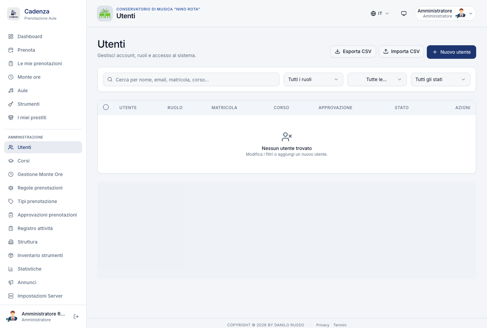

> Se lo screenshot non è ancora generato vedi il **Riferimento UI** sotto. Per generarlo: `node e2e/screenshots.mjs` (vedi `docs/screenshots/README.md`).

#### Riferimento UI

```
┌──────────────────────────────────────────────────────────────────────────┐
│ Utenti                                  [⤓ Esporta CSV] [⤒ Importa] [+]  │
│ Gestisci anagrafica, ruoli, OAuth e import Isidata                       │
├──────────────────────────────────────────────────────────────────────────┤
│ ┌── Filtri ────────────────────────────────────────────────────────────┐ │
│ │ 🔍 Cerca nome / email / matricola / corso                            │ │
│ │ Ruolo: [tutti ▾]   Approvazione: [tutti ▾]   Stato: [tutti ▾]        │ │
│ └──────────────────────────────────────────────────────────────────────┘ │
│ ┌── Bulk (visibile se selezionati > 0) ─────────────────────────────── │ │
│ │ 3 utenti selezionati (2 in pending)   [Pulisci] [Approva] [Rifiuta]  │ │
│ │                                                          [Elimina ✗] │ │
│ └──────────────────────────────────────────────────────────────────────┘ │
│ ┌── Tabella ──────────────────────────────────────────────────────────┐ │
│ │ □ │ Utente             │ Ruolo    │ Matr.  │ Corso         │ Appr.  │ │
│ │ □ │ A.M. Rossi · email │ Docente  │ 12345  │ DCPL34 — ...  │ ✓      │ │
│ │ □ │ G. Verdi  · email  │ Studente │ 67890  │ DCPL10 — ...  │ ⏱ pend │ │
│ │ ...                                                                 │ │
│ └──────────────────────────────────────────────────────────────────────┘ │
│ ┌── Provider OAuth ───────────┬── Isidata ─────────────────────────────┐ │
│ │ Google [toggle] ClientId... │ Importazione anagrafica                │ │
│ │ Microsoft [toggle] ...      │ [Apri importazione]                    │ │
│ └─────────────────────────────┴────────────────────────────────────────┘ │
└──────────────────────────────────────────────────────────────────────────┘
```

### 3.2 Toolbar e filtri

| Elemento                 | Tipo   | Note                                                             |
| ------------------------ | ------ | ---------------------------------------------------------------- |
| Ricerca testuale         | Input  | Match case-insensitive su nome, cognome, email, matricola, corso |
| Filtro **Ruolo**         | Select | Tutti · Admin · Docente · Studente                               |
| Filtro **Approvazione**  | Select | Tutti · Pending · Approved · Rejected                            |
| Filtro **Stato account** | Select | Tutti · Attivi · Inattivi                                        |

I filtri agiscono client-side dopo il fetch — sono immediatamente reattivi senza round-trip.

### 3.3 Tabella utenti

| Colonna       | Contenuto                                                                                                       |
| ------------- | --------------------------------------------------------------------------------------------------------------- |
| **Checkbox**  | Selezione per bulk action (header con `indeterminate`); **disabilitato** sulla riga del current user            |
| **Utente**    | Avatar (iniziali) + Nome Cognome + email; piccola etichetta `(Tu)` se è il current user                         |
| **Ruolo**     | Badge: `Admin` (con icona ShieldCheck), `Docente` (secondaria), `Studente` (muted)                              |
| **Matricola** | Testo grigio, `—` se assente                                                                                    |
| **Corso**     | `CODICE — Nome corso`, `—` se assente                                                                           |
| **Approval**  | `Admin` → sempre approvato; altrimenti `pending` (Clock) / `approved` (Check verde) / `rejected` (Shield rosso) |
| **Stato**     | Badge `Attivo` (success) / `Inattivo` (muted)                                                                   |
| **Azioni**    | ✓ Approva (solo se pending, non admin) · ✗ Rifiuta (idem) · ✎ Modifica · 🗑 Elimina (disabled se current user)  |

### 3.4 Bulk action bar

Compare animata in alto (giallo amber) appena `selected.size > 0`:

| Bottone | Effetto                                                                                                                    |
| ------- | -------------------------------------------------------------------------------------------------------------------------- |
| Pulisci | Svuota la selezione                                                                                                        |
| Approva | `usersApi.bulkApprove(ids, 'approve')` — toast `"N approvati, M saltati"`                                                  |
| Rifiuta | `usersApi.bulkApprove(ids, 'reject')` — toast `"N rigettati, M saltati"`                                                   |
| Elimina | Apre `ConfirmDeleteDialog` → `usersApi.bulkDelete(ids)` (rimuove anche le prenotazioni associate, ne riporta il conteggio) |

### 3.5 Form Utente (UserFormDialog)

Aperto da **+ Nuovo utente** (create) o icona pencil sulla riga (edit).

| Campo                                                                        | Tipo     | Validazioni                            | Note                                                   |
| ---------------------------------------------------------------------------- | -------- | -------------------------------------- | ------------------------------------------------------ |
| Nome / Cognome                                                               | Text     | required, min 1                        | Layout 2 colonne                                       |
| Email                                                                        | Email    | required, formato email                | Full-width                                             |
| Ruolo                                                                        | Select   | required, enum                         | Admin · Docente · Studente                             |
| Matricola                                                                    | Text     | optional, `inputMode=numeric`          | Pattern `[0-9]*`                                       |
| Corso di studio                                                              | Select   | optional                               | Disabled durante load del catalogo                     |
| Password (create)                                                            | Password | required, min 10, 1 maiuscola, 1 cifra | Policy AGID 2024 — vedi §3.8                           |
| Password (edit)                                                              | Password | optional (vuoto = nessun cambio)       | `autoComplete="new-password"`                          |
| Account attivo                                                               | Switch   | —                                      | Spegne il login senza cancellare                       |
| **Sezione Monte Ore — visibile solo per `role=docente`** (vedi §3.6 e §8.10) |
| Tipo contratto                                                               | Select   | optional                               | Da `contractTypesApi.list({ includeInactive: true })`  |
| Override Monte Ore individuale                                               | Switch   | —                                      | Abilita i sotto-campi                                  |
| Ore annue                                                                    | Number   | range 0–1500, step 0.5                 | Visibile se override on; placeholder es. `60`          |
| Esente vincolo 2-4 giorni/sett.                                              | Switch   | —                                      | Vedi §8.10                                             |
| Motivazione                                                                  | Textarea | required se override on, max 2000      | Tracciata nell'audit log come "documento contrattuale" |

#### Banner condizionali sul form

- **Email rimbalzata** (alert giallo): se `user.emailBouncedAt` è valorizzato compare un avviso "Email rimbalzata — notifiche disattivate" + reason + bottone **Riattiva** (`usersApi.resetBounce(id)`).
- **Server error** (alert rosso): in caso di errore di salvataggio mostra il messaggio mappato da `httpErrorMessage(err)`.
- **Help password (edit)**: "Aggiorna i dati o reimposta la password lasciando il campo vuoto per non cambiarla."

### 3.6 Provider OAuth (Google · Microsoft)

In coda alla pagina, due card affiancate (la terza è Isidata):

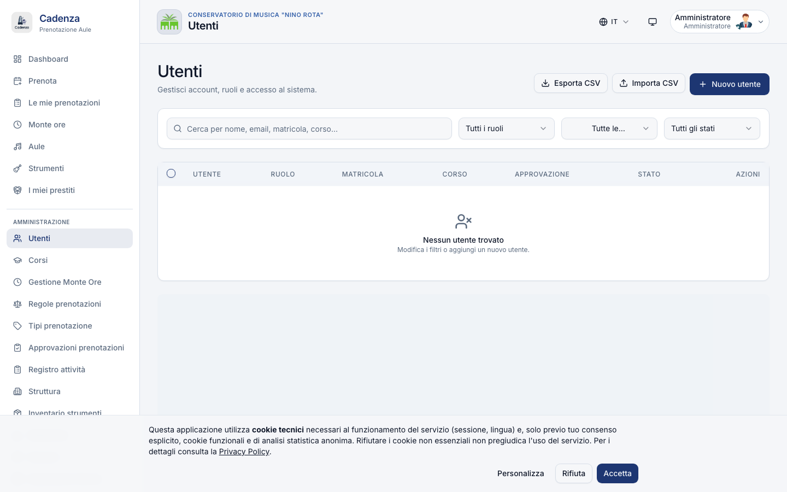

| Provider  | Campi                                                                                         |
| --------- | --------------------------------------------------------------------------------------------- |
| Google    | Toggle on/off · Client ID · Client Secret (eye icon mostra/nasconde) · Callback URL · `Salva` |
| Microsoft | Toggle on/off · Client ID · Client Secret · Tenant · Callback URL · `Salva`                   |

Le credenziali sono cifrate AES-256-GCM in DB. Una volta configurato, gli utenti vedono i bottoni "Accedi con Google" / "Microsoft" sul login. **Riavvia il backend** dopo il salvataggio per applicare il nuovo provider (alert info post-save).

### 3.7 Deroga Monte Ore per docenti a contratto orario

> Sezione approfondita in §8.10. Qui è descritto solo il **punto di accesso** dal form utente.

In coda al form _Modifica utente_ compare il blocco **Monte Ore — Tipo contratto** che permette di personalizzare la soglia annua del singolo docente, indispensabile per i contratti orari (precari, supplenti, part-time) che hanno un monte concordato individualmente diverso dalle 324h CCNL del titolare di ruolo.


Vedi §8.10 per il dettaglio dei valori tipici e del comportamento dello snapshot.

### 3.8 Anti mass-assignment + anti-lockout admin (v2.2)

> Hardening introdotto nel re-audit backend del 30 aprile 2026. Riguarda chiunque chiami `PUT /users/:id`, `DELETE /users/:id`, e bulk-delete.

**Mass-assignment**: prima di v2.2 alcuni endpoint amministrativi accettavano qualunque campo del modello User, incluso `passwordHash`, `tokenVersion`, `deletedAt`. Ora il backend usa `lib/sanitize.js` con **whitelist + coercizione tipi**.

| Endpoint             | Whitelist                                                                                                                                                                                                            | NON modificabile                                                                                          |
| -------------------- | -------------------------------------------------------------------------------------------------------------------------------------------------------------------------------------------------------------------- | --------------------------------------------------------------------------------------------------------- |
| `PUT /users/:id`     | email, firstName, lastName, role, matricola, courseId, status, isActive, contractType, monteOreAnnualHoursOverride, monteOreBypassDayConstraint, monteOreOverrideMotivation, emailNotifications + 4 toggle granulari | passwordHash, tokenVersion, deletedAt, googleId, microsoftId, icalToken/Hash, oauthTokens, sessionVersion |
| `PUT /structure/...` | campi anagrafici/configurativi specifici                                                                                                                                                                             | createdAt, updatedAt, soft-delete fields, ID interni                                                      |

**Anti-lockout**: il backend restituisce **400/409** se l'operazione lascerebbe il sistema senza admin attivi:

| Errore                | HTTP | Trigger                                  |
| --------------------- | ---- | ---------------------------------------- |
| `CANNOT_SELF_DEMOTE`  | 400  | Admin che si abbassa a docente/studente  |
| `CANNOT_SELF_DISABLE` | 400  | Admin che si imposta `isActive=false`    |
| `CANNOT_SELF_DELETE`  | 400  | Admin che cancella sé stesso             |
| `LAST_ADMIN_LOCKOUT`  | 409  | Operazione che lascerebbe 0 admin attivi |

**Workaround legittimo**: per dismettere un admin servono **almeno due** admin attivi. Per disattivare l'ultimo (chiusura del Conservatorio) occorre un DBA con accesso al DB.

### 3.9 Password policy AGID 2024 + rate limit

Da v2.2 i nuovi account creati via `POST /register` (e i cambi password via `PUT /users/:id/password`) devono soddisfare le linee guida AGID 2024:

- **min 10 caratteri** (era 8)
- **almeno 1 maiuscola**
- **almeno 1 cifra**

Errori: `PASSWORD_TOO_SHORT`, `PASSWORD_NEEDS_UPPERCASE`, `PASSWORD_NEEDS_DIGIT`. Le password storiche sotto soglia continuano a funzionare per il login (no rotazione forzata).

#### Rate limit dedicati

| Endpoint                                     | Limit | Finestra | Chiave                 | Motivo                            |
| -------------------------------------------- | ----- | -------- | ---------------------- | --------------------------------- |
| `POST /login`                                | 5     | 15 min   | IP                     | brute-force credenziali           |
| `POST /register`                             | 3     | 30 min   | IP                     | spam account                      |
| `POST /2fa/setup` · `/2fa/resend`            | 5     | 15 min   | userId del pre2faToken | spam codici via mail              |
| `POST /2fa/verify`                           | 10    | 15 min   | userId del pre2faToken | brute-force codice 6 cifre        |
| `POST /bookings/recurring`                   | 5     | 1 ora    | userId                 | DoS pool DB (52 booking/chiamata) |
| `POST /gdpr/export-data` · `/delete-request` | 3     | 24 ore   | userId                 | costo I/O elevato                 |
| `GET /ical/:token`                           | 30    | 1 ora    | IP                     | enumeration token                 |
| `/api/*` (default)                           | 300   | 1 min    | IP                     | barriera baseline                 |

I rate limit restituiscono **429** con header `Retry-After` + body `{ error, code: 'RATE_LIMITED', retryAfter: <s> }`.

### 3.10 API endpoint usati dalla pagina Utenti

```
GET    /api/users[?role=&active=&status=]
POST   /api/users
PUT    /api/users/:id
DELETE /api/users/:id
POST   /api/users/:id/approve
POST   /api/users/:id/reject
POST   /api/users/bulk-approve  body: { userIds, action }
POST   /api/users/bulk-delete   body: { userIds }
GET    /api/users/csv/export
POST   /api/users/csv/import
POST   /api/users/:id/reset-bounce
PUT    /api/users/:id/monte-ore-override
GET    /api/oauth-settings
PUT    /api/oauth-settings
GET    /api/courses
GET    /api/contract-types?includeInactive=true
```

---

## 4. Corsi e Livelli

URL: `/admin/courses` (con query `?tab=corsi|livelli`)

### 4.1 Layout

Pagina con **macro-tab selector** in alto (2 card grandi):

- **Corsi** (icon `BookOpen`, accent cielo) — catalogo SAD
- **Livelli** (icon `GraduationCap`, accent viola) — propedeutico, triennio, biennio, master…

Sotto il selector compare una card descrittiva della tab attiva. Il body cambia in base alla tab.

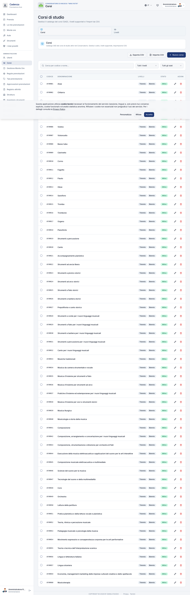

#### Riferimento UI — tab "Corsi"

```
┌──────────────────────────────────────────────────────────────────────────┐
│ Corsi di studio                                                          │
│ Gestisci il catalogo SAD, livelli supportati, import CSV.                │
├──────────────────────────────────────────────────────────────────────────┤
│ [📚 Corsi] [🎓 Livelli]                                                   │
├──────────────────────────────────────────────────────────────────────────┤
│ Toolbar:  [Esporta CSV] [Importa CSV]            [+ Nuovo corso]         │
│ Filtri:   [🔍 codice/nome] [Livelli ▾] [Stato ▾]                          │
├──────────────────────────────────────────────────────────────────────────┤
│ ┌── Tabella ──────────────────────────────────────────────────────────┐ │
│ │ □ │ Codice    │ Denominazione        │ Livelli       │ Stato │ Azioni│ │
│ │ □ │ DCPL34    │ Pianoforte           │ TRI · BIE     │ ✓     │ ✎ 🗑  │ │
│ │ □ │ DCPL10    │ Violino              │ PRO · TRI     │ ✓     │ ✎ 🗑  │ │
│ └──────────────────────────────────────────────────────────────────────┘ │
└──────────────────────────────────────────────────────────────────────────┘
```

### 4.2 Tab "Corsi"

#### Toolbar

- **Esporta CSV** (`coursesApi.downloadCsv()` → `corsi-YYYY-MM-DD.csv`)
- **Importa CSV** → apre `CoursesCsvImportDialog`
- **+ Nuovo corso** → apre `CourseFormDialog` (modalità create)

#### Filtri

| Elemento | Tipo   | Note                                       |
| -------- | ------ | ------------------------------------------ |
| Search   | Input  | Match su `code` e `name`, case-insensitive |
| Livelli  | Select | Tutti · oppure uno specifico livello SAD   |
| Stato    | Select | Tutti · Attivi · Disattivati               |

#### Bulk-select bar

Visibile se almeno una riga è selezionata:

- "X corso/corsi selezionato/i" + bottoni **Deseleziona** · **Elimina selezionati** (destructive).
- L'azione di delete passa per `ConfirmDeleteDialog` e chiama `coursesApi.bulkDelete(ids)`.

#### Colonne tabella

| Colonna       | Contenuto                                                     |
| ------------- | ------------------------------------------------------------- |
| Checkbox      | Multi-select con stato `indeterminate` sull'header            |
| Codice        | Mono uppercase xs                                             |
| Denominazione | Nome corso + sotto-riga `Dipartimento` (grigio, opz.)         |
| Livelli       | Lista badge secondaria (`PRO`, `TRI`, `BIE`, …); `—` se vuoto |
| Stato         | `Attivo` (success) · `Disattivato` (muted)                    |
| Azioni        | ✎ Modifica · 🗑 Elimina (destructive)                         |

#### Form Corso

| Campo              | Tipo           | Validazioni               | Placeholder            |
| ------------------ | -------------- | ------------------------- | ---------------------- |
| Codice             | Text           | required, min 1, max 20   | `DCPL34`               |
| Denominazione      | Text           | required, min 1, max 250  | `Pianoforte`           |
| Dipartimento       | Text           | optional, max 150         | `Strumenti a tastiera` |
| Livelli supportati | Checkbox group | optional, array di `code` | da `courseLevelsApi`   |
| Descrizione        | Textarea (3 r) | optional, max 2000        | —                      |
| Corso attivo       | Switch         | —                         | default `true`         |

Empty state: se non ci sono livelli configurati appare il messaggino "Nessun livello configurato. Aggiungili dalla scheda Livelli."

### 4.3 Tab "Livelli"

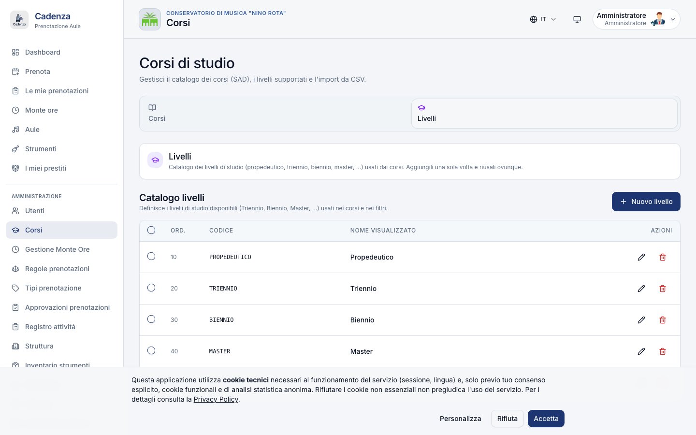

Catalogo dei livelli di studio (`propedeutico`, `triennio`, `biennio`, `master`, ecc.). Una volta creato un livello, lo riusi in tutti i corsi: il modulo `CourseLevelsSection` espone CRUD essenziale (codice, etichetta, ordine, attivo/disattivo).

### 4.4 API endpoint

```
GET    /api/courses
POST   /api/courses
PUT    /api/courses/:id
DELETE /api/courses/:id
POST   /api/courses/bulk-delete
GET    /api/courses/csv/export
POST   /api/courses/csv/import
GET    /api/course-levels
POST   /api/course-levels
PUT    /api/course-levels/:id
DELETE /api/course-levels/:id
```

---

## 5. Struttura: Istituti, Edifici, Aule, Dotazioni

URL: `/admin/structure` (con query `?tab=sedi|dotazioni`)

### 5.1 Layout

Macro-tab selector identico a Corsi, con due tab: **Sedi** (icon `Building2`, accent blu) e **Dotazioni** (icon `Cog`, accent viola).

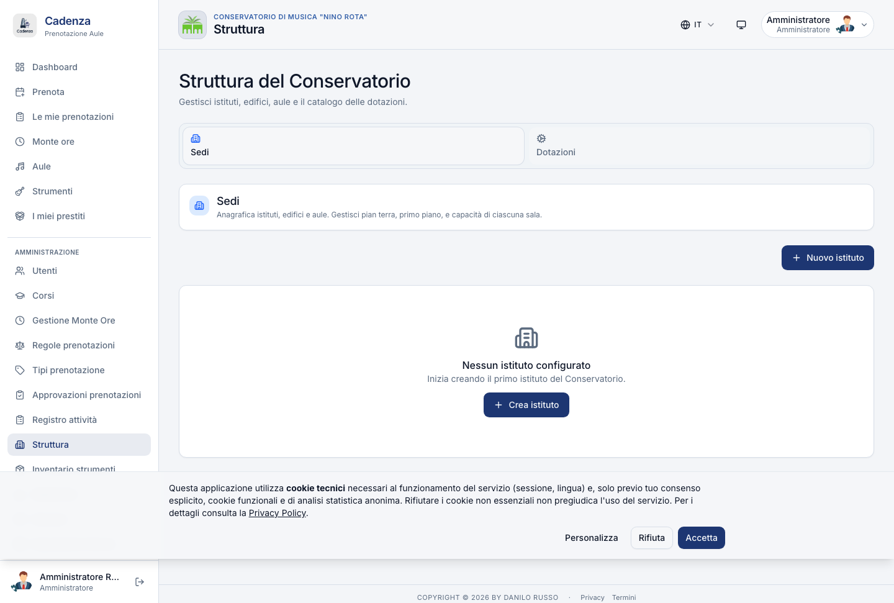

#### Riferimento UI — tab "Sedi"

```
┌──────────────────────────────────────────────────────────────────────────┐
│ Struttura                                          [+ Nuovo istituto]    │
├──────────────────────────────────────────────────────────────────────────┤
│ ┌── Conservatorio "X" — sede centrale ────────────────────────────────┐ │
│ │ Roma · INST01 · 3 edifici            [⤓ CSV] [⤒ CSV] [+ Edif.] [✎ 🗑]│ │
│ │ ──────────────────────────────────────────────────────────────────── │ │
│ │ □ ▶ Palazzo Storico · 12 aule · 3 piani         [+ Aula] [✎ 🗑]      │ │
│ │ □ ▼ Succursale Via Verdi · 8 aule · 2 piani     [+ Aula] [✎ 🗑]      │ │
│ │      ┌── Aule ─────────────────────────────────────────────────────┐ │ │
│ │      │ □ 🚪 Aula 101 (studio · prenotabile)  [Pianoforte ×1] [+]   │ │ │
│ │      │ □ 🚪 Aula 102 (concerto · approvazione) [—]            [+]   │ │ │
│ │      └────────────────────────────────────────────────────────────┘ │ │
│ └──────────────────────────────────────────────────────────────────────┘ │
│                                                                           │
│ [Floating bulk bar visibile se selezione > 0]                             │
│   2 edifici · 5 aule selezionati  [Deseleziona] [Elimina ✗]               │
└──────────────────────────────────────────────────────────────────────────┘
```

### 5.2 Gerarchia Istituto → Edificio → Aula → Equipment

Ogni livello è una "InstituteCard" con header proprio + lista figli espandibile/collassabile. Ogni nodo ha:

- Checkbox di selezione (per bulk action)
- Bottone toggle expand/collapse (chevron)
- Anagrafica (nome + sotto-info: indirizzo, conteggi, ecc.)
- Bottoni per-nodo: **+ Crea figlio** · **✎ Modifica** · **🗑 Elimina**

Le **dotazioni (equipment)** delle aule sono mostrate inline come chip (cliccabili per editare, x per cancellare) + bottone tratteggiato **+ Aggiungi**.

### 5.3 Form Istituto (InstituteFormDialog)

Form esteso che raccoglie sia anagrafica sia dati legali per Privacy Policy/Termini.

**Anagrafica**

| Campo       | Tipo        | Validazioni               |
| ----------- | ----------- | ------------------------- |
| Nome        | Text        | required, min 1           |
| Codice      | Text        | optional, max 50          |
| Città       | Text        | optional, max 100         |
| Indirizzo   | Text        | optional, max 300         |
| Descrizione | Textarea    | optional, max 2000        |
| Logo        | File upload | PNG/JPG/WEBP/SVG, max 2MB |

**Sezione Dati Legali**

| Campo                             | Tipo       | Note                                                                  |
| --------------------------------- | ---------- | --------------------------------------------------------------------- |
| Denominazione legale              | Text       | "Conservatorio di Musica Statale ..."                                 |
| P. IVA · Codice fiscale           | Text       | max 32 char ognuno                                                    |
| Email contatto · PEC              | Email      | max 255                                                               |
| Nome DPO · Email DPO              | Text/Email | Per la sezione "Titolare del trattamento" della privacy               |
| Foro competente                   | Text       | Default: città dell'istituto                                          |
| Sub-processor (textarea max 4 KB) | Textarea   | Format: `Nome \| Finalità \| Localizzazione \| URL DPA`, una per riga |

### 5.4 Form Edificio (BuildingFormDialog)

| Campo     | Tipo | Note                                       |
| --------- | ---- | ------------------------------------------ |
| Nome      | Text | required, min 1                            |
| Codice    | Text | optional, max 50                           |
| Indirizzo | Text | optional, max 300                          |
| Piani     | Text | comma-separated, es. `Piano Terra, 1º, 2º` |

### 5.5 Form Aula (RoomFormDialog)

| Campo                  | Tipo                        | Validazioni                                                      |
| ---------------------- | --------------------------- | ---------------------------------------------------------------- |
| Nome                   | Text                        | required                                                         |
| Codice                 | Text                        | optional, max 50 (es. `A.101`)                                   |
| Piano                  | Select                      | required, opzioni da `building.floors`                           |
| Capienza               | Number                      | required, int, min 1                                             |
| Tipologia              | Select                      | enum: `studio` · `aula` · `concerto` · `ufficio`                 |
| Ruoli ammessi          | Checkbox group              | array `[admin, docente, studente]`                               |
| Corsi autorizzati      | Checkbox group (scrollable) | empty = tutti                                                    |
| Note                   | Textarea                    | max 2000                                                         |
| Foto aula              | File upload                 | PNG/JPG/WEBP/HEIC/HEIF; aspect 16:9                              |
| Aula prenotabile       | Switch                      | default `true`                                                   |
| Richiedi check-in (QR) | Switch                      | default `false`                                                  |
| Richiede approvazione  | Switch                      | default `false` (sale concerti)                                  |
| QR check-in (PDF)      | Bottone                     | visibile solo se `requireCheckIn=true` ed è una `room` esistente |

### 5.6 Form Equipaggiamento (EquipmentFormDialog)

| Campo               | Tipo   | Validazioni                                                               |
| ------------------- | ------ | ------------------------------------------------------------------------- |
| Scegli dal catalogo | Select | optional; pre-compila nome + tipo dal template                            |
| Nome                | Text   | required, min 1                                                           |
| Tipologia           | Select | required (enum equipment types)                                           |
| Quantità            | Number | required, int, min 1                                                      |
| Marca / Modello     | Text   | optional, max 100                                                         |
| In funzione         | Switch | default `true` (gli equipment fuori uso si vedono opacizzati nella lista) |

### 5.7 Bulk action floating bar

Card fissa in basso (animata con framer-motion) visibile se `selectedRooms.size > 0` o `selectedBuildings.size > 0`. Sezioni:

- **Edifici selezionati** → `Deseleziona` · `Elimina` (cascata: rimuove anche aule, equipment e prenotazioni)
- **Aule selezionate** → `Deseleziona` · `Elimina` (cascata: rimuove equipment e prenotazioni)

I conteggi delle entità rimosse sono ritornati nel toast: `"5 aule eliminate, 12 prenotazioni rimosse"`.

### 5.8 Tab "Dotazioni"

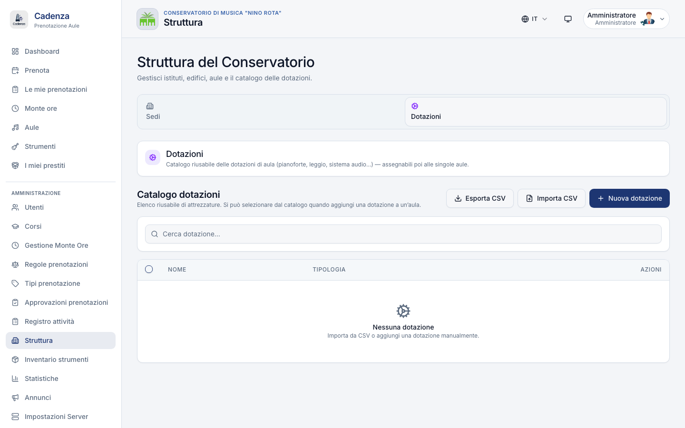

Catalogo riusabile delle dotazioni (template). Una volta creato il template "Pianoforte verticale", puoi assegnarlo a tutte le aule che lo possiedono in due click. Cambiare il template aggiorna tutte le aule che lo usano.

### 5.9 Vista pubblica `/rooms` raggruppata per edificio (v2.3)

La pagina `/rooms` (visibile a tutti gli utenti autenticati) ha lo **stesso schema visivo di `/admin/structure`**: sezioni espandibili per edificio con tile colorato (`buildingColor`), nome, conteggio aule e numero di piani.

Vantaggi rispetto alla lista flat precedente:

- meno scroll su istituti multi-edificio
- riconoscibilità immediata della sede (colore + nome edificio)
- stato `collapsedBuildings` ricordato durante la sessione

### 5.10 API endpoint usati

```
GET    /api/institutes/full
POST   /api/structure/institutes
PUT    /api/structure/institutes/:id
DELETE /api/structure/institutes/:id
POST   /api/structure/institutes/:id/logo
DELETE /api/structure/institutes/:id/logo
POST   /api/structure/buildings
PUT    /api/structure/buildings/:id
DELETE /api/structure/buildings/:id
POST   /api/structure/rooms
PUT    /api/structure/rooms/:id
DELETE /api/structure/rooms/:id
POST   /api/structure/rooms/:id/photo
DELETE /api/structure/rooms/:id/photo
GET    /api/structure/rooms/:id/qr
POST   /api/structure/equipment
PUT    /api/structure/equipment/:id
DELETE /api/structure/equipment/:id
POST   /api/structure/rooms/bulk-delete
POST   /api/structure/buildings/bulk-delete
GET    /api/structure/csv/:instituteId
GET    /api/structure/equipment-templates
```

---

## 6. ⭐ Regole prenotazione

URL: `/admin/rules`

Questa è la sezione che governa **chi può prenotare cosa, quando, per quanto tempo**. Le regole sono uno strato di policy applicato dal validator `bookingValidator.js`. Tutte le regole agiscono in modo **additivo restrittivo**: la prenotazione passa solo se **tutte** le regole applicabili la consentono.


La pagina ha **quattro macro-tab** in alto:

```
Regole prenotazioni
├─ Per ruolo            (limiti base per studenti/docenti/admin)
├─ Quote               (limiti per stanza/edificio/tipo aula)
├─ Quote prestiti       (analogo per inventario strumenti)
└─ Eccezioni            (override per aule/utenti specifici)
```

### 6.0 Come Cadenza valuta una prenotazione (flusso validator)

Quando un utente fa `POST /api/bookings`, il validator esegue queste verifiche **in ordine** e si ferma alla prima che fallisce:

```
┌─ 1. Auth & ruolo attivo ─────────────────────────────────────┐
│   user.isActive = true ?  status = 'approved' ?              │
└──────────────────────────────────────────────────────────────┘
              ↓ ok
┌─ 2. Aula prenotabile ────────────────────────────────────────┐
│   room.isBookable = true ?  room.deletedAt = null ?          │
└──────────────────────────────────────────────────────────────┘
              ↓ ok
┌─ 3. Anti-overlap (DB-level su Postgres) ─────────────────────┐
│   EXCLUDE constraint: nessun'altra Booking confermata        │
│   sovrappone (roomId, [start, end))                          │
└──────────────────────────────────────────────────────────────┘
              ↓ ok
┌─ 3bis. Conflitto logico utente (cap. 6.7) ────── (NUOVO v2.3)┐
│   Stesso userId con altra Booking confermata in ALTRA aula   │
│   nella stessa fascia oraria  →  USER_LOGICAL_CONFLICT       │
│   (un docente non può fisicamente essere in 2 posti)         │
│   Bypass: bypassQuotas=true (Monte Ore generator)            │
└──────────────────────────────────────────────────────────────┘
              ↓ ok
┌─ 4. BookingRule per ruolo (cap. 6.1) ────────────────────────┐
│   maxActive · maxHoursPerWeek · maxHoursPerDay               │
│   maxBookingDuration · minBookingDuration                    │
│   advanceMaxDays · advanceMinMinutes · cancellationCutoff    │
│   openingTime · closingTime · allowSameDay                   │
│   minIntervalBetweenBookingsMinutes  ← NUOVO v2.3 (cooldown) │
└──────────────────────────────────────────────────────────────┘
              ↓ ok
┌─ 5. BookingQuota — per ogni quota matching (cap. 6.2) ───────┐
│   roomType / equipmentType / room / building / global        │
│   maxHoursPerDay/Week/Month · maxBookings · daysOfWeek       │
│   timeFrom / timeTo                                          │
└──────────────────────────────────────────────────────────────┘
              ↓ ok
┌─ 6. BookingRuleException (cap. 6.3) ─────────────────────────┐
│   Eccezioni applicabili: SOSTITUISCONO i limiti precedenti   │
│   (es. "studente X: nessun limite settimanale dal 1/5 al 30/5")│
│   Tipo `block`: anteprima sovrapposizioni storiche (NUOVO v2.3)│
└──────────────────────────────────────────────────────────────┘
              ↓ ok
┌─ 7. requiresApproval ────────────────────────────────────────┐
│   Se room.requiresApproval=true OR rule.requireApproval=true:│
│   booking.status = 'pending_approval' (cap. 7)               │
│   altrimenti booking.status = 'confirmed'                    │
└──────────────────────────────────────────────────────────────┘
```

Tutti gli errori restituiscono **codici machine-readable** (`MAX_HOURS_EXCEEDED`, `QUOTA_EXCEEDED:roomType:concerto`, `OUTSIDE_OPENING_HOURS`, `MIN_INTERVAL_VIOLATED`, `USER_LOGICAL_CONFLICT`, ecc.) — utili per debug e per personalizzare i messaggi i18n nel frontend. Vedi §6.7 per la reference card completa.

### 6.1 Tab "Per ruolo" — `BookingRule`


Tre toggle in alto per scegliere il ruolo (Studenti · Docenti · Admin); il body è un form in 5 sezioni con i parametri sotto.

| Campo                                                                             | Default                     | Significato                                                                                                                                                                                                                                                                                                                                                                                                                                                                                                    |
| --------------------------------------------------------------------------------- | --------------------------- | -------------------------------------------------------------------------------------------------------------------------------------------------------------------------------------------------------------------------------------------------------------------------------------------------------------------------------------------------------------------------------------------------------------------------------------------------------------------------------------------------------------- |
| **Max prenotazioni attive contemporanee**                                         | 5                           | Numero massimo di prenotazioni future contemporanee. Studente=5, docente=10, admin=∞ tipico.                                                                                                                                                                                                                                                                                                                                                                                                                   |
| **Max ore / settimana**                                                           | 10 (studente), 20 (docente) | Tetto orario settimanale (lun–dom).                                                                                                                                                                                                                                                                                                                                                                                                                                                                            |
| **Max ore / giorno**                                                              | 4                           | Tetto giornaliero. Si conta dalle 00:00 alle 23:59.                                                                                                                                                                                                                                                                                                                                                                                                                                                            |
| **Durata massima prenotazione**                                                   | 120 minuti                  | Per slot singolo. Una prenotazione di 3h va spezzata in più slot.                                                                                                                                                                                                                                                                                                                                                                                                                                              |
| **Durata minima prenotazione**                                                    | 30 minuti                   | Slot minimo (allineato al granularità del calendario).                                                                                                                                                                                                                                                                                                                                                                                                                                                         |
| **Anticipo massimo (giorni)**                                                     | 14                          | Quanto in anticipo si può prenotare. Studente=14, docente=30 tipico.                                                                                                                                                                                                                                                                                                                                                                                                                                           |
| **Anticipo minimo (minuti)**                                                      | 0                           | Soglia per evitare prenotazioni "fra 5 minuti" su aule libere. Docente=0, studente=15 tipico.                                                                                                                                                                                                                                                                                                                                                                                                                  |
| **Cancellation cutoff (ore)**                                                     | 2                           | Quante ore prima della prenotazione l'utente può ancora cancellarla senza penalità. Sotto questa soglia conta come no-show.                                                                                                                                                                                                                                                                                                                                                                                    |
| **Richiede approvazione**                                                         | false                       | Se true, **tutte** le prenotazioni di quel ruolo passano per `pending_approval` indipendentemente dall'aula. Usabile per i nuovi studenti durante un periodo di prova.                                                                                                                                                                                                                                                                                                                                         |
| **Allow same-day**                                                                | true                        | Permettere prenotazioni in giornata.                                                                                                                                                                                                                                                                                                                                                                                                                                                                           |
| **Orario apertura / chiusura**                                                    | 08:00 / 22:00               | Fuori da questa finestra le prenotazioni sono rifiutate. Indipendente dall'orario di apertura del Conservatorio (usalo per limitare studio sera).                                                                                                                                                                                                                                                                                                                                                              |
| **Cooldown tra prenotazioni** (`minIntervalBetweenBookingsMinutes`) ⭐ NUOVO v2.3 | 0 (default backward-compat) | **Minuti minimi** che devono intercorrere fra la fine di una prenotazione e l'inizio della successiva dello stesso utente. Chiude il cap-bypass per concatenazione: senza cooldown, uno studente con `maxBookingDuration=120 min` e `maxHoursPerDay=4` può prenotare 14:00–16:00 + 16:00–18:00 e fare di fatto un blocco unico di 4h, vanificando il limite "2h per booking". Calcolo cross-day sui minuti astronomici, simmetrico (vale anche prenotando in ordine inverso). Errore: `MIN_INTERVAL_VIOLATED`. |

#### Strategia consigliata per la prima configurazione

```
ruolo studente:
  max attivi=5, max settimanali=10h, max giornaliere=4h
  durata max=120 min, durata min=30 min
  advance max=14 giorni, advance min=15 min, cancel cutoff=2h
  no approval, no same-day=false, 08:00–22:00

ruolo docente:
  max attivi=20, max settimanali=40h, max giornaliere=8h
  durata max=240 min, durata min=30 min
  advance max=60 giorni, advance min=0, cancel cutoff=2h
  no approval, allow same-day=true, 07:00–23:00

ruolo admin:
  illimitato per max attivi/settimanali/giornaliere (campo "0" o vuoto = nessun limite)
  altro come docente
```

> **Nota**: i campi a `0` significano "nessun limite". Non confonderli con `null` (campo non valorizzato).

### 6.2 Tab "Quote" — `BookingQuota`


Una **quota** è un sotto-limite più stringente per uno specifico target. Il validator applica **prima** la regola per ruolo e **poi** tutte le quote che matchano il target della prenotazione, prendendo il limite più basso.

#### Tipi di scope

| Scope           | Esempio                        | Uso tipico                                                     |
| --------------- | ------------------------------ | -------------------------------------------------------------- |
| `roomType`      | studio · aula · concerto       | "Studenti possono prenotare la sala concerti max 4h/settimana" |
| `equipmentType` | pianoforte_coda · contrabbasso | "Solo pianisti possono prenotare aule con pianoforte a coda"   |
| `room`          | aula 101                       | Limite specifico su una stanza (es. la più richiesta)          |
| `building`      | edificio_centrale              | Limite per edificio (utile se uno è in ristrutturazione)       |
| `global`        | \*                             | Limite globale (oltre quello di ruolo)                         |

#### Form Quota

Validazioni Zod (v2.3):

- `role` ∈ `[admin, docente, studente]`
- `scopeKind` ∈ `[roomType, equipmentType, room, building, global]`
- `scopeValue` obbligatorio se `scopeKind != global`
- Almeno uno tra `maxHoursPerWeek`, `maxHoursPerDay`, `maxHoursPerMonth`, `maxBookings` deve essere `> 0`
- Se sono compilati `timeFrom` o `timeTo`, devono esserlo entrambi e `timeFrom < timeTo`
- `daysOfWeek`: array di numeri 0–6 (Lun=1…Dom=0), vuoto = ogni giorno

Errori tipici di validazione: `cap_required`, `scope_required`, `time_pair`, `time_order`.

#### Esempio pratico

| #   | Ruolo    | Scope    | Scope value                 | Max h/sett | Days    | Orario | Note                                                |
| --- | -------- | -------- | --------------------------- | ---------- | ------- | ------ | --------------------------------------------------- |
| Q1  | studente | roomType | concerto                    | 0          | tutti   | —      | Studenti non possono prenotare sale concerti        |
| Q2  | docente  | roomType | concerto                    | 0          | tutti   | —      | Idem per docenti — solo Direzione                   |
| Q3  | studente | room     | "Aula 12 — Pianoforte coda" | 2          | tutti   | —      | Aula molto richiesta: max 2h/settimana per studente |
| Q4  | studente | global   | \*                          | 6          | sab-dom | —      | Limite weekend: 6h totali sab+dom                   |
| Q5  | studente | building | "Sede succursale"           | 0          | tutti   | —      | Edificio in ristrutturazione                        |

### 6.2bis Tab "Quote prestiti"

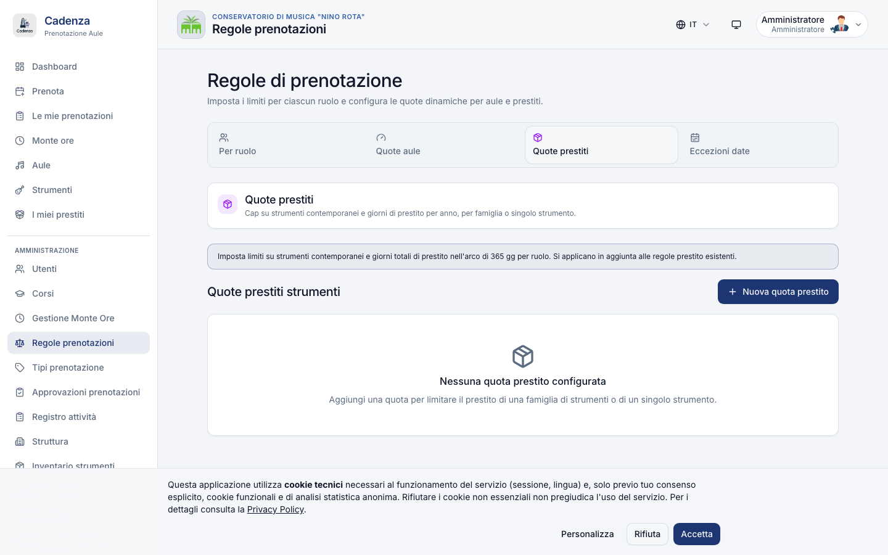

Schema analogo alle quote aule, ma applicato all'**inventario strumenti**:

| Campo            | Tipo   | Validazioni                               |
| ---------------- | ------ | ----------------------------------------- |
| `role`           | enum   | `admin · docente · studente`              |
| `scopeKind`      | enum   | `family · instrument · global`            |
| `scopeValue`     | string | required se `scopeKind != global`         |
| `maxConcurrent`  | number | 0–99 (max prestiti simultanei)            |
| `maxDaysPerYear` | number | 0–366 (giorni cumulati nell'anno)         |
| `isActive`       | switch | abilita/disabilita senza dover cancellare |

Almeno uno fra `maxConcurrent` e `maxDaysPerYear` deve essere `> 0`.

### 6.3 Tab "Eccezioni" — `BookingRuleException`


Le eccezioni **sospendono o sostituiscono** una regola/quota per:

- una **finestra temporale** specifica (es. "durante la sessione esami sospendi quota weekend")
- uno **specifico utente** (es. "Prof. Rossi: nessun limite settimanale per il mese di maggio per le prove dell'esame finale")
- una **specifica aula** (es. "Aula 5: prenotabile solo da chi ha permesso speciale, dal 1 al 30 giugno")

L'eccezione ha priorità sulla regola/quota originaria. Tracciato in **Audit Log** con motivo testuale obbligatorio.

#### Form Eccezione

| Campo                  | Tipo          | Validazioni                                                                    |
| ---------------------- | ------------- | ------------------------------------------------------------------------------ |
| Nome                   | Text          | required, non vuoto                                                            |
| Tipo                   | Select        | `block` (chiusura totale) · `time_window` (limite ore in finestra)             |
| Si applica a           | Select        | `all` · solo studenti · solo docenti · solo admin                              |
| Ore max nella finestra | Number        | required se `kind=time_window`; step 0.5, min 0.25                             |
| Giorni della settimana | Toggle multi  | 7 bottoni Lun–Dom; vuoto = ogni giorno                                         |
| Data singola / range   | Switch + Date | toggle "Data singola" mostra solo `dateFrom`; altrimenti `dateFrom` + `dateTo` |
| Fascia oraria          | Time + Time   | optional; entrambi presenti, `startTime < endTime`                             |
| Note                   | Textarea      | optional                                                                       |
| Attivo                 | Switch        | "Disattivala per disabilitarla senza eliminarla"                               |

> **Nudge UI**: se `dateTo < oggi` (eccezione retrodatata che copre solo il passato), un banner azzurro avvisa "Questa eccezione copre solo date passate — verrà ignorata da nuove prenotazioni".

#### Sovrapposizioni storiche al setup di chiusure (v2.3 — parity EasyRoom)

Quando crei un'eccezione di tipo **`block`** (chiusura aula/edificio per ristrutturazione, sciopero, festa patronale, ecc.) Cadenza ti chiede subito **"ci sono prenotazioni già confermate che cadono in questo blocco?"**. Workflow:

1. Salvi l'eccezione con `kind=block`.
2. Si apre un dialog di follow-up: Cadenza chiama `POST /api/rules/exceptions/preview-overlaps` (dry-run, nessun side-effect) e mostra l'elenco delle prenotazioni in conflitto, con badge **"Monte Ore"** se la prenotazione è collegata a uno slot del piano didattico (`bookingId` su `MonteOreSlot`).
3. Bottone **"Cancella tutte ($N)"** → `POST /api/rules/exceptions/:id/cancel-overlapping` esegue il batch in transazione:
   - prenotazioni passate o `checked_in` vengono **escluse** (non si ri-scrive il passato)
   - le prenotazioni cancellate ricevono `cancelReason` (testo obbligatorio dall'admin) → email automatica all'utente
   - se la prenotazione era da Monte Ore: lo slot collegato viene marcato `isActive=false, isLocked=true, lockReason=<nome eccezione>, bookingId=null`. **Importante**: senza questo lock, la rigenerazione del piano didattico (es. dopo amendment approvato) ricreerebbe la prenotazione cancellata.

Anche se chiudi senza cancellare nulla, l'eccezione `block` resta attiva: blocca le **prenotazioni future** dal momento della creazione in poi (l'anteprima è solo per smaltire lo storico).

### 6.4 Granularità slot

Il "minimo comune multiplo" temporale del sistema è **30 minuti** (configurabile a livello globale ma sconsigliato cambiarlo dopo il go-live). Tutte le quote/regole agiscono su questa griglia.

### 6.5 Anteprima regole (roadmap)

Il componente `RulesPreview` è già implementato ma non ancora esposto nella UI: simulerà una prenotazione (utente, aula, data/ora) e mostrerà quali regole/quote/eccezioni vengono valutate, con esito ✓ / ✗ riga per riga. Endpoint backend già disponibile: `POST /api/rules/preview`.

In attesa, per debug puoi usare direttamente l'API:

```bash
curl -X POST http://localhost:3000/api/rules/preview \
  -H "Authorization: Bearer <admin-token>" \
  -H "Content-Type: application/json" \
  -d '{"userId":42,"roomId":7,"startTime":"2026-05-20T14:00:00Z","endTime":"2026-05-20T16:00:00Z"}'
```

### 6.6 Errori comuni di configurazione

| Sintomo                                                                                                 | Causa probabile                                                                                                     | Fix                                                                                                      |
| ------------------------------------------------------------------------------------------------------- | ------------------------------------------------------------------------------------------------------------------- | -------------------------------------------------------------------------------------------------------- |
| Studenti non riescono a prenotare aule libere                                                           | Quota globale `0` (= bloccato) anziché vuota                                                                        | Lascia il campo VUOTO per "nessun limite" — `0` significa zero ore consentite                            |
| Errore `OUTSIDE_OPENING_HOURS` per docenti dopo le 22                                                   | `BookingRule.closingTime` troppo restrittivo per il ruolo                                                           | Aumenta closingTime nel tab "Per ruolo" per il ruolo docente                                             |
| Conflict overlap nonostante anti-overlap                                                                | Due booking con stesso roomId ma deletedAt valorizzato (soft-deleted) → la EXCLUDE constraint ignora i soft-deleted | Verifica con `SELECT * FROM bookings WHERE "roomId"=X AND "deletedAt" IS NOT NULL`                       |
| Quota mensile non scatta                                                                                | `maxHoursPerMonth=0` interpretato come "nessun limite"                                                              | Imposta un valore intero positivo                                                                        |
| Eccezione non applicata                                                                                 | `dateFrom > dateTo`, oppure `isActive=false`                                                                        | Controlla nella tab Eccezioni l'icona verde/grigia                                                       |
| `MIN_INTERVAL_VIOLATED` su prenotazioni back-to-back legittime (es. 2 lezioni di seguito di un docente) | Cooldown impostato troppo alto sul ruolo docente                                                                    | Rivedi `minIntervalBetweenBookingsMinutes` in §6.1, valuta se metterlo solo su studente                  |
| `USER_LOGICAL_CONFLICT` durante generazione Monte Ore                                                   | Pattern Monte Ore con slot concentrici legittimi (es. masterclass in 2 aule)                                        | Il generator usa `bypassQuotas=true`; se il blocco persiste, leggi i log per vedere quale slot lo emette |

### 6.7 Reference card — codici errore validator

Tutti gli errori di `POST /api/bookings` (e `/recurring`, `/swap`) restituiscono **400** con body `{ error, code, ... }`. Tabella unica per debug rapido:

| Codice                                                           | Causa                                                       | Cap.           |
| ---------------------------------------------------------------- | ----------------------------------------------------------- | -------------- |
| `BOOKING_CONFLICT`                                               | EXCLUDE constraint Postgres: aula occupata in quella fascia | §6.0 step 3    |
| `USER_LOGICAL_CONFLICT` ⭐ v2.3                                  | Stesso utente già confermato in un'altra aula               | §6.0 step 3bis |
| `MAX_ACTIVE_EXCEEDED`                                            | Troppe prenotazioni attive contemporanee                    | §6.1           |
| `MAX_HOURS_DAY_EXCEEDED` · `..._WEEK_..` · `..._MONTH_..`        | Cap orario di ruolo o quota                                 | §6.1 / §6.2    |
| `MAX_BOOKING_DURATION_EXCEEDED` · `MIN_BOOKING_DURATION_NOT_MET` | Slot fuori dai bound min/max                                | §6.1           |
| `ADVANCE_TOO_FAR` · `ADVANCE_TOO_SOON`                           | Prenotazione troppo in anticipo o troppo a ridosso          | §6.1           |
| `OUTSIDE_OPENING_HOURS`                                          | Fuori `openingTime`/`closingTime`                           | §6.1           |
| `SAME_DAY_NOT_ALLOWED`                                           | `allowSameDay=false` per quel ruolo                         | §6.1           |
| `MIN_INTERVAL_VIOLATED` ⭐ v2.3                                  | Cooldown tra prenotazioni non rispettato                    | §6.1           |
| `QUOTA_EXCEEDED:roomType:concerto` (formato dinamico)            | Quota specifica superata                                    | §6.2           |
| `EXCEPTION_BLOCK`                                                | Eccezione `kind=block` attiva sull'aula/edificio            | §6.3           |
| `ROOM_NOT_BOOKABLE`                                              | `room.isBookable=false` o soft-deleted                      | §6.0 step 2    |
| `USER_INACTIVE` · `USER_NOT_APPROVED`                            | Account utente inattivo/pending                             | §6.0 step 1    |
| `CANCEL_CUTOFF_PASSED`                                           | Tentata cancellazione oltre cutoff                          | §6.1           |

---

## 7. Approvazioni · Registro attività · Bookings

Tre pagine distinte ma correlate:

- **§7.1 Approvazioni** (`/admin/approvals`) — coda dei nuovi `pending_approval` da approvare/rifiutare.
- **§7.2 Registro attività** (`/admin/activity-log`) — operazioni sulle **prenotazioni confermate future** (filtri, bulk-cancel, swap).
- **§7.3 Bookings** (`/admin/bookings`) — alias di `/admin/activity-log` (deprecated, redirect interno).

### 7.1 Approvazioni — `/admin/approvals`

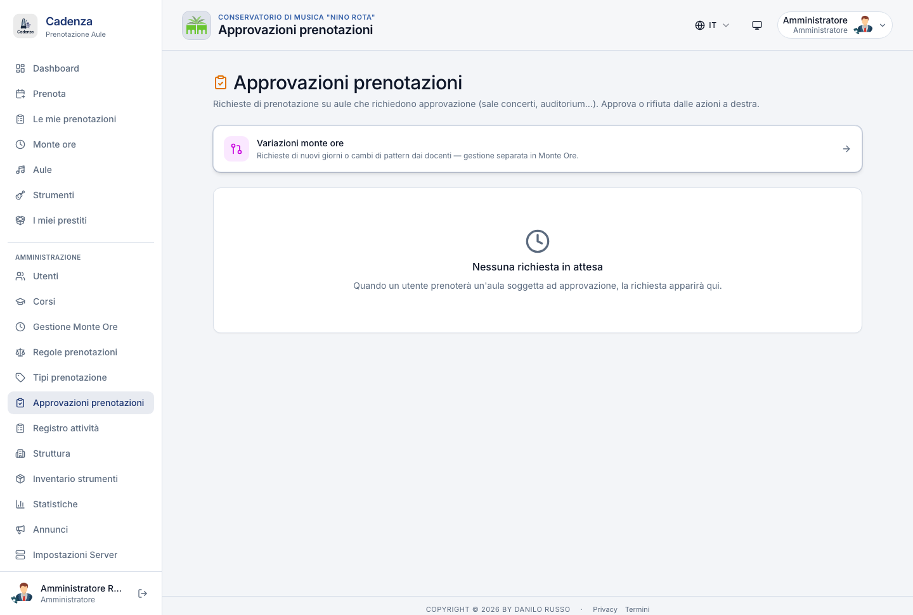

#### Riferimento UI

```
┌──────────────────────────────────────────────────────────────────────────┐
│ ✔ Approvazioni prenotazioni                                              │
│ Esamina e approva le prenotazioni in sospeso.                            │
├──────────────────────────────────────────────────────────────────────────┤
│ ┌── Variazioni Monte Ore ──────────────────────── [Badge 3 in sospeso]─┐ │
│ │ → Vai a /admin/monte-ore?tab=amendments                               │ │
│ └─────────────────────────────────────────────────────────────────────────┘
├──────────────────────────────────────────────────────────────────────────┤
│ ┌── Card prenotazione 1 ────────────────────────────────────────────────┐│
│ │ [Pending]  Mario Rossi (Docente)                                      ││
│ │ Aula 12 — Palazzo Storico                                             ││
│ │ Sabato 18 maggio 2026 · 18:00–20:00 · 120 min                          ││
│ │ Motivo: "Saggio di fine anno classe di pianoforte"                    ││
│ │                                          [✗ Rifiuta]   [✓ Approva]    ││
│ └────────────────────────────────────────────────────────────────────────┘│
└──────────────────────────────────────────────────────────────────────────┘
```

Vengono qui:

- prenotazioni su aule con `requiresApproval=true` (sale concerti, auditorium)
- prenotazioni di utenti con ruolo configurato `requireApproval=true`
- prenotazioni che violano una eccezione "approva-prima" (rara)

Per ogni richiesta vedi: utente, ruolo, aula, edificio, data/ora, durata, motivo.

#### Azioni

| Bottone   | Mutation                                                                              |
| --------- | ------------------------------------------------------------------------------------- |
| ✓ Approva | `POST /api/admin/bookings/:id/approve` → toast "Prenotazione approvata"               |
| ✗ Rifiuta | Apre dialog con textarea "Motivo del rifiuto" → `POST /api/admin/bookings/:id/reject` |

#### Card "Variazioni Monte Ore"

In testa alla pagina compare una card-link a `/admin/monte-ore?tab=amendments` con badge contatore: `"N in sospeso"`. Aggiornato ogni 60 secondi tramite `GET /api/admin/monte-ore/amendments/pending-count`.

#### API endpoint

```
GET    /api/admin/bookings/pending                      (staleTime 15s)
POST   /api/admin/bookings/:id/approve
POST   /api/admin/bookings/:id/reject     body: { reason }
GET    /api/admin/monte-ore/amendments/pending-count    (refetch 60s)
```

### 7.2 Registro attività — `/admin/activity-log` ⭐

> **Funzione che EasyAcademy/EasyRoom chiamano "scambio"**: Cadenza implementa lo swap atomico in **una** transazione (3 modalità del concorrente collassate in una). Era una sotto-tab nascosta dentro `/admin/audit-log`; ora è una pagina autonoma.

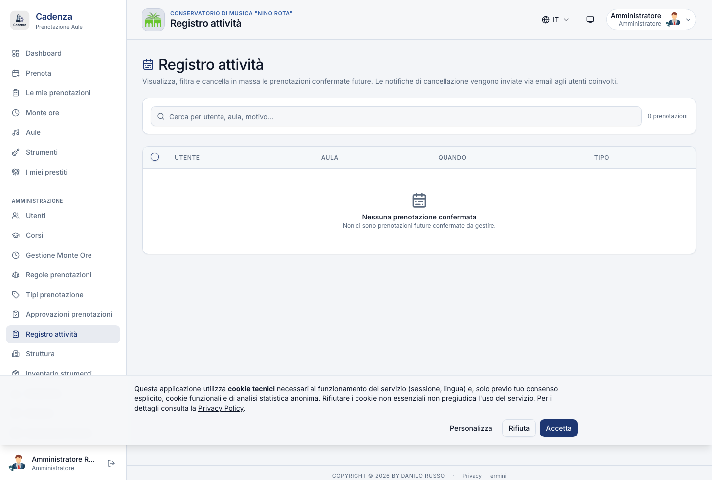

Mostra solo prenotazioni `confirmed` e **future** (filter: `from = now`).

#### Filtri

- **Ricerca libera**: input full-text su `room.name`, `building.name`, `user.firstName`, `user.lastName`, `user.email`, `purpose` (case-insensitive, trim).

#### Colonne tabella

| Colonna  | Contenuto                                                            |
| -------- | -------------------------------------------------------------------- |
| Checkbox | Multi-select; header con `indeterminate`                             |
| Utente   | Nome Cognome (font-medium) · email (muted xs)                        |
| Aula     | `Room.name` · `Building.name` (muted xs, condizionale)               |
| Quando   | `ddd D MMM YYYY` + `HH:mm–HH:mm`                                     |
| Tipo     | Badge secondaria con etichetta tipologia (i18n `BOOKING_TYPE_LABEL`) |

#### Selection summary bar

Visibile (animata con framer-motion) appena `selected.size > 0`:

```
┌──────────────────────────────────────────────────────────────────────────┐
│ 2 prenotazioni · 2 utenti distinti                       [Pulisci sel.]  │
│                                          [⇄ Scambia]   [✗ Cancella sel.] │
└──────────────────────────────────────────────────────────────────────────┘
```

- **Bottone "Scambia"** visibile **solo** se `selected.size === 2`
- **Bottone "Cancella selezionate"** sempre visibile se selezione > 0

#### Bulk-cancel con motivo broadcast

1. Seleziona più prenotazioni (checkbox)
2. Click **Cancella selezionate** → `ConfirmDeleteDialog` con campo textarea "Motivo della cancellazione" (≥ 10 caratteri)
3. Conferma → batch cancel in transazione + email broadcast a tutti gli utenti (motivo incluso, no PII di altri utenti)
4. Le prenotazioni Monte Ore: lo slot collegato torna `isActive=true` (a meno che non sia in un'eccezione `block` attiva — vedi §6.3)

Tipico: aula in ristrutturazione last-minute, sciopero, evento istituzionale.

#### Swap atomico — `POST /api/bookings/swap`

Quando in toolbar selezioni **esattamente 2** prenotazioni future, compare il bottone **"Scambia"**. Lo swap inverte aula+orario tra le due:

| Prima                           | Dopo                            |
| ------------------------------- | ------------------------------- |
| Booking A: Aula 5 · 10:00–12:00 | Booking A: Aula 8 · 14:00–15:00 |
| Booking B: Aula 8 · 14:00–15:00 | Booking B: Aula 5 · 10:00–12:00 |

##### Implementazione (perché è atomica)

L'EXCLUDE constraint Postgres `bookings_no_overlap WHERE status='confirmed'` impedirebbe lo swap "ingenuo" (entrambi i booking confermati, nessun gap intermedio). Cadenza esegue:

1. `SELECT … FOR UPDATE` su entrambi (lock)
2. **Flip A → cancelled** (esce dall'EXCLUDE, libera lo slot)
3. **Update B** con dati di A (ora libero)
4. **Update A** con dati originali di B + status `confirmed`

Tutto in 1 transazione. Se lo step 4 fallisce per overlap laterale (altra prenotazione che si è infilata) → **rollback completo**, nessuna delle due viene modificata.

##### Codici errore swap

| Codice             | HTTP | Causa                                                           |
| ------------------ | ---- | --------------------------------------------------------------- |
| `NOT_FOUND`        | 404  | Una delle due prenotazioni non esiste o è soft-deleted          |
| `INVALID_STATE`    | 400  | Una delle due non è `confirmed` (es. cancellata)                |
| `PAST_BOOKING`     | 400  | Una delle due è già passata (no swap retroattivo)               |
| `CHECKED_IN`       | 400  | Una delle due ha già check-in (utente è in aula)                |
| `BOOKING_CONFLICT` | 409  | Overlap laterale rilevato durante lo step 4 (rollback eseguito) |
| `SAME_BOOKING`     | 400  | `aId === bId`                                                   |

##### Audit log dello swap

Ogni swap genera due record in `audit_log`: uno per A (action `swap_in`), uno per B (action `swap_out`), entrambi con riferimento incrociato al booking gemello e all'admin che ha eseguito l'azione. Visibile in §12.8 con filtro `action LIKE 'swap_%'`.

#### API endpoint

```
GET    /api/admin/bookings/confirmed-future            (staleTime 30s)
POST   /api/admin/bookings/bulk-cancel  body: { ids, reason }
POST   /api/admin/bookings/swap         body: { aId, bId }
```

### 7.3 Bookings page — `/admin/bookings`


Alias deprecato di `/admin/activity-log`: stesso componente `AdminBookingsContent`, stesse funzioni. Mantenuto per backward-compat dei bookmark.

---

## 8. ⭐ Gestione Monte Ore

URL: `/admin/monte-ore`

> **Cos'è**: il "Monte Ore" è il **piano annuale di insegnamento** del docente del Conservatorio italiano. Contrattualmente il docente di ruolo deve garantire **almeno 324 ore annue** di didattica, distribuite in non meno di 2 e non più di 4 giorni a settimana, in una finestra di insegnamento definita (di solito ottobre→giugno). I docenti **a contratto orario** (precari, supplenti, part-time, collaboratori) hanno invece soglie individuali (tipicamente 30-200h) — vedi §8.10. Cadenza è **il primo software italiano** che digitalizza completamente questo workflow contrattuale.


### 8.1 Layout della pagina

Pagina con **3 macro-tab card** (icona+colore, identico pattern a Corsi/Struttura):

- **Proposte** (icon `FileSignature`, accent blu) — coda proposte da approvare/generare
- **Richieste variazioni** (icon `RefreshCw`, accent ambra) — amendments post-approvazione, badge contatore pending
- **Tipologie docenti** (icon `Users`, accent indaco) — `ContractTypesPanel`, gestione tipi contratto e impatto sull'override individuale

In header c'è il pulsante **"Calendario didattico"** che porta a `/admin/monte-ore/settings`.

### 8.2 Quattro modelli sottostanti

| Modello                                 | Funzione                                                                                                                                                     |
| --------------------------------------- | ------------------------------------------------------------------------------------------------------------------------------------------------------------ |
| `MonteOreSettings` (singleton istituto) | Definisce le regole annuali: anno accademico, finestra lezioni, finestra inserimento proposte, soglia ore, max giorni/settimana                              |
| `MonteOreProposal`                      | Una **proposta annuale** del docente: aule scelte, schedule (giorni × orari), totale ore stimate. Stato: `draft → submitted → approved/rejected → generated` |
| `MonteOreSchedule`                      | Riga di schedule dentro la proposta: aula + giorno settimana + ora inizio/fine (es. "Lun 14:00–17:00 in Aula 101")                                           |
| `MonteOreSlot`                          | Singola occorrenza concreta generata dallo schedule (es. lunedì 5/10/2026 14:00–17:00). Diventa una `Booking` quando la proposta è approvata e generata      |
| `MonteOreSuspension`                    | Sospensioni didattiche istituzionali (festività, ferie, esami) — escludono date dalla generazione slot                                                       |
| `MonteOreAmendment`                     | Variazione di una proposta già approvata: spostamento di una lezione, cancellazione, recupero. Stato: `pending → approved/rejected`                          |

### 8.3 Configurazione settings (admin · una volta all'anno)

URL diretto: `/admin/monte-ore/settings` (raggiungibile dal pulsante "Calendario didattico" della pagina principale).


| Campo                             | Esempio                 | Note                                                                                                                                                 |
| --------------------------------- | ----------------------- | ---------------------------------------------------------------------------------------------------------------------------------------------------- |
| **Anno accademico start / end**   | 2026-09-01 / 2027-08-31 | Periodo di riferimento contrattuale                                                                                                                  |
| **Finestra lezioni start / end**  | 2026-10-01 / 2027-06-30 | I docenti possono pianificare lezioni solo dentro questa finestra                                                                                    |
| **Finestra inserimento proposte** | 2026-09-15 / 2026-10-15 | Periodo in cui i docenti possono compilare/sottomettere proposte                                                                                     |
| **Soglia ore annue**              | 324                     | Default contratto AFAM. Personalizzabile (es. 270h per docenti part-time)                                                                            |
| **Max richieste variazione**      | 3                       | Tetto annuale di amendments per proposta                                                                                                             |
| **Max giorni / settimana**        | 4                       | Vincolo CCNL: i docenti non possono insegnare più di 4 giorni alla settimana                                                                         |
| **Min giorni / settimana**        | 2                       | Vincolo CCNL: minimo 2 giorni                                                                                                                        |
| **Bypass duration limit**         | true                    | Se true, i pattern Monte Ore possono superare la durata max prenotazione del ruolo (es. lezioni 3h consecutive anche se la regola docente è max 2h). |

> **⚠ Importante**: una volta che le proposte sono state approvate e generate, modificare i settings **non rigenera** automaticamente le prenotazioni. Per cambiare la finestra lezioni a metà anno servono amendments per ogni proposta interessata.

### 8.4 Sospensioni didattiche

In coda alla pagina Settings c'è una tabella con tutte le sospensioni dell'anno accademico selezionato:

| Colonna  | Contenuto                                                       |
| -------- | --------------------------------------------------------------- |
| Nome     | Es. "Vacanze di Natale"                                         |
| Dal · Al | Range date                                                      |
| Tipo     | Badge `Settimana intera` (destructive) · `Parziale` (secondary) |
| Azioni   | 🗑 Elimina (trash icon + confirm)                               |

Form sospensione (inline):

| Campo                     | Tipo   | Validazioni                                                           |
| ------------------------- | ------ | --------------------------------------------------------------------- |
| Nome                      | Text   | required                                                              |
| Dal · Al                  | Date   | required, `dal <= al`                                                 |
| Tipo                      | Select | `Parziale` (giorni rossi) · `Settimana intera` (riga sparisce)        |
| Applica alle prenotazioni | Switch | Solo se Parziale; crea automaticamente eccezione `block` nelle Regole |

Sospensioni tipiche:

- Festività nazionali (1 nov, 8 dic, 25 dic, 1 gen, 6 gen, Pasqua e lunedì dell'angelo, 25 apr, 1 mag, 2 giu, 15 ago)
- Ferie istituzionali (es. 24 dic – 6 gen, 1–7 settembre)
- Sessioni esami (es. 10–25 gen, 10–25 giu)
- Eventi straordinari (es. saggi pubblici dell'istituto)

Quando applichi alle prenotazioni esistenti, Cadenza:

1. Trova tutte le `MonteOreSlot` future che cadono nel range
2. Le marca come "sospese" (non vengono trasformate in Booking)
3. Crea un `MonteOreAmendment` automatico di tipo "sospensione" per ogni proposta toccata, in stato `auto-approved`
4. Notifica i docenti via email

### 8.5 Tab "Proposte" (vista admin)


Lista di tutte le proposte annuali. **Filtri per stato** in alto:

`Tutte` · `In attesa` · `Approvata` · `Generata` · `Rifiutata` · `Bozza`

Counter "{N} proposte" a destra. Ogni proposta è una **card cliccabile**:

```
┌──────────────────────────────────────────────────────────────────────────┐
│ Bianchi Maria  [Badge: Contratto orario]                  [Submitted]   │
│ AA 2026/2027 · 8 fasce · 78 / 60 h ✓                                     │
│ Inviata: 15/09/2026                                          [Apri →]   │
└──────────────────────────────────────────────────────────────────────────┘
```

Click su `Apri` → `DetailDialog` con tabella completa fasce orarie (giorno · orario · aula · tipo · etichetta).

Per ogni proposta vedi: docente, corso, **soglia ore applicata** (324h CCNL standard, oppure soglia personalizzata se il docente ha una deroga — cap. 8.10), totale ore proposte, schedule, aule scelte. Bottoni nel DetailDialog:

| Stato       | Bottoni nel DetailDialog                                                                  |
| ----------- | ----------------------------------------------------------------------------------------- |
| `submitted` | **Approva** (verde) · **Rifiuta** (apre textarea motivo)                                  |
| `approved`  | **Crea prenotazioni dal monte ore** (mutation generate, checkbox `includePast` opzionale) |
| `generated` | **Annulla generazione** (mutation unlock — re-apre la proposta)                           |
| any         | Tabella fasce con ✎ Edit / 🗑 Delete inline · `+ Aggiungi fascia` · `Chiudi`              |

#### Form Schedule edit dialog (fasce orarie)

| Campo          | Tipo   | Validazioni                                             |
| -------------- | ------ | ------------------------------------------------------- |
| Giorno         | Select | required, enum Lun-Dom                                  |
| Inizio · Fine  | Time   | required HH:MM                                          |
| Aula assegnata | Select | required per generare; warning icon se vuota            |
| Tipo           | Select | `Lezione` · `Studio individuale` · `Prova` · `Concerto` |
| Etichetta      | Text   | optional, max 255                                       |

#### Tasso di approvazione consigliato

In media, approva direttamente le proposte dei docenti senior; usa "approva con modifiche" per spostare i nuovi docenti su aule meno richieste. Il rifiuto puro va riservato alle proposte fuori vincolo (≥4 giorni/sett, <324h/anno, fuori finestra).

### 8.6 Tab "Richieste variazioni" (Amendments)


Una volta che la proposta è `approved`, il docente può chiedere di **modificare** singole occorrenze:

- "La lezione di lunedì 12 ottobre la sposto a martedì 13"
- "Rimuovo la lezione del 5 dicembre per malattia, recupero il 7"
- "Cambio l'aula da 101 a 102 per i prossimi 3 mesi"

Tabella amendments:

| Colonna | Contenuto                                                                                                                           |
| ------- | ----------------------------------------------------------------------------------------------------------------------------------- |
| Docente | Cognome Nome · AA {anno}                                                                                                            |
| Tipo    | `Disattivazione` · `Riattivazione` · `Cambio orario` · `Nuovo giorno`                                                               |
| Cella   | Summary testuale dello slot toccato                                                                                                 |
| Note    | Testo libero del docente                                                                                                            |
| Stato   | Badge `In attesa` · `Auto-approvata` · `Approvata` · `Rifiutata`                                                                    |
| Azioni  | Per `pending`: **Approva** (apre `ApproveNewDayDialog` se kind=`add_new_day` chiede aula) · **Rifiuta** (textarea motivo opzionale) |

#### Auto-approve per casi semplici

Per ridurre il carico amministrativo, attiva **auto-approve amendments** in _Settings → Monte Ore_ per:

- spostamenti di ±7 giorni che non cambiano aula
- cancellazioni con almeno 24h di anticipo

Tutti gli altri restano `pending` e richiedono approvazione manuale.

### 8.7 Generazione slot e materializzazione prenotazioni

Quando approvi una proposta, Cadenza esegue questa procedura atomica (transazione SERIALIZABLE):

1. Calcola tutte le **occorrenze** dello schedule per ogni `MonteOreSchedule` × tutti i giorni della settimana × tutti i giorni della finestra lezioni che non sono in `MonteOreSuspension`.
2. Per ognuna verifica anti-overlap: nessun'altra `Booking` o `MonteOreSlot` collide nell'aula.
3. Se anti-overlap fallisce: la proposta torna a `pending`, l'admin riceve un report per riassegnazione manuale.
4. Crea le `MonteOreSlot` (record interno) **e** le `Booking` corrispondenti (visibili nel calendario aule generale). Le due restano sincronizzate via foreign key e trigger.
5. Aggiorna lo status della proposta a `generated`.

> **Tempistica**: per un docente con 6h × 4 giorni × 36 settimane = ~864 occorrenze, la generazione richiede 1-3 secondi sul DB. La transazione è atomica: o tutto va a buon fine, o nulla viene scritto.

### 8.8 Calendario didattico (vista pubblica)

Nella pagina docente `/monte-ore` c'è un bottone **"Calendario didattico"** che esporta in PDF/iCal:

- per il docente: il proprio piano annuale
- per la Direzione (link admin): vista aggregata di tutto il monte ore del Conservatorio (incrocio aule × docenti)

Utile da inviare al sindacato o alla segreteria per i registri di insegnamento.

### 8.9 Casi limite

| Caso                                         | Comportamento                                                                                                               |
| -------------------------------------------- | --------------------------------------------------------------------------------------------------------------------------- |
| Docente a contratto orario (30-200h)         | Imposta deroga individuale dalla pagina Utenti → vedi §8.10                                                                 |
| Coordinatore di sezione                      | Nella tab Approvazioni può approvare proposte solo del proprio corso/sezione, non di altri                                  |
| Sostituto temporaneo                         | Crea proposta a nome del titolare originale + amendment di "subentro" per il periodo specifico                              |
| Sospensione tardiva (post-approvazione)      | Inserisci la `MonteOreSuspension` con flag "propaga"; Cadenza marca slot come sospesi e notifica docenti                    |
| Errore sistemico (es. festività dimenticata) | Inserisci sospensione retroattiva; le `Booking` già passate restano (storico immutabile), le future vengono marcate sospese |

### 8.10 ⭐ Deroga per docenti a contratto orario

> **Implementata da v1.1 (aprile 2026)**. Risponde alla casistica del 20-40% del corpo docente di un Conservatorio medio: contrattisti, supplenti, collaboratori, accompagnatori al pianoforte, docenti di laboratorio.

#### Perché serve

Il modello standard di Cadenza assume `MonteOreSettings.minRequiredHours = 324` per **tutti** i docenti dell'istituto. Per i docenti a contratto orario questa soglia è errata (hanno spesso 30-200h concordate individualmente) e **bloccherebbe il submit della proposta** rendendo il modulo Monte Ore inutilizzabile per quella categoria.

La deroga sposta la soglia da "globale per istituto" a "**per-utente**": ogni docente a contratto orario ha la sua soglia individuale + l'eventuale esenzione dal vincolo 2-4 giorni/settimana.

#### Come configurare la deroga

1. Vai su `/admin/users` e clicca su **Modifica** del docente target.
2. In coda al form compare la sezione **"Monte Ore — Tipo contratto"** (visibile solo per `role=docente`, vedi §3.5).
3. Compila:
   - **Tipo contratto**: seleziona la categoria (informativa)
   - **Soglia ore personalizzata**: attiva il toggle e inserisci le ore concordate (es. 60)
   - **Esente dal vincolo 2-4 gg/sett**: attiva se il docente concentra tutto in 1-2 giorni
   - **Motivazione**: obbligatoria (es. "Contratto orario 60h - prot. 2026/123 del 15/09/2026")
4. Salva. Da quel momento il submit Monte Ore di quel docente userà la soglia personalizzata.


#### Comportamento del docente

Il docente che ha una deroga vede sulla sua pagina `/monte-ore` un banner azzurro:

```
ⓘ  Soglia Monte Ore personalizzata: 60 ore/anno
   Tipo contratto: contratto orario · Vincolo 2-4 giorni/settimana: NON applicato
   Per modifiche contattare la Direzione.
```


#### Snapshot della soglia (immutabile per proposte già inviate)

Quando il docente fa submit della proposta, Cadenza memorizza in `MonteOreProposal.minRequiredHoursSnapshot` il valore **risolto** (override individuale → settings istituzionali → 324). Questo significa che:

- Se domani l'admin **rimuove** la deroga del docente, la proposta già `submitted/approved/generated` resta valida con la soglia originale.
- Se domani l'admin **abbassa la soglia** (es. da 60 a 30) la proposta esistente resta valida; il nuovo valore si applica solo ai prossimi submit.

Lo snapshot è la "fotografia contrattuale" del momento del submit — non si modifica mai retroattivamente.

#### Esempi di configurazione contrattuale tipica

| Categoria                     | Tipo contratto   | Soglia    | Bypass | Note                                            |
| ----------------------------- | ---------------- | --------- | ------ | ----------------------------------------------- |
| Titolare CCNL                 | titolare         | — (vuoto) | ❌     | Default 324h dal MonteOreSettings istituzionale |
| Titolare ridotto L.104/92     | titolare         | 270       | ❌     | Riduzione per assistenza familiare              |
| Supplente annuale 50%         | supplente        | 162       | ❌     | Mezzo monte ore titolare                        |
| Co.Co.Co. 60h annue           | contratto_orario | 60        | ✅     | Tipico per coadiutori al pianoforte             |
| Lab. di musica d'insieme 120h | altro            | 120       | ❌     | Da regolamento didattico                        |
| Accompagnatore concertistico  | contratto_orario | 30        | ✅     | Concerti pubblici, monoday possibile            |

#### Audit e conformità

Ogni modifica della deroga viene tracciata automaticamente nell'**Audit Log** (§12.8) con:

- chi ha autorizzato (admin loggato)
- quando (timestamp UTC)
- valore precedente vs nuovo
- motivazione testuale

La motivazione è considerata "documento contrattuale" ai sensi della L.241/1990 §3 sulla motivazione dell'atto amministrativo. Conserva l'audit log per **almeno 10 anni** dalla cessazione del rapporto di lavoro (art. 2220 c.c.).

#### Endpoint API (per integrazioni)

| Metodo | Endpoint                                     | Auth    | Descrizione                                                                                                                           |
| ------ | -------------------------------------------- | ------- | ------------------------------------------------------------------------------------------------------------------------------------- |
| `PUT`  | `/api/users/:id/monte-ore-override`          | admin   | Imposta/rimuove deroga (body: `contractType`, `monteOreAnnualHoursOverride`, `monteOreBypassDayConstraint`, `monteOreOverrideReason`) |
| `GET`  | `/api/monte-ore/me/threshold?year=YYYY/YYYY` | docente | Risolve la soglia applicabile al docente loggato (`{minHours, bypassDayConstraint, source, contractType, reason}`)                    |

Vedi `docs/MONTE_ORE_DEROGA_CONTRATTO_ORARIO.md` per il dettaglio progettuale completo.

### 8.11 API endpoint usati

```
GET    /api/admin/monte-ore/list?status={status|all}
GET    /api/admin/monte-ore/{id}
POST   /api/admin/monte-ore/{id}/approve
POST   /api/admin/monte-ore/{id}/reject
POST   /api/admin/monte-ore/{id}/generate
POST   /api/admin/monte-ore/{id}/unlock
POST   /api/admin/monte-ore/{id}/schedules
PUT    /api/admin/monte-ore/{id}/schedules/{scheduleId}
DELETE /api/admin/monte-ore/{id}/schedules/{scheduleId}
GET    /api/admin/monte-ore/amendments/pending-count
GET    /api/admin/monte-ore/amendments/list?status={pending|all}
GET    /api/admin/monte-ore/{id}/amendments
POST   /api/admin/monte-ore/{proposalId}/amendments/{amendmentId}/approve
POST   /api/admin/monte-ore/{proposalId}/amendments/{amendmentId}/reject
GET    /api/admin/monte-ore/settings/{academicYear}
PUT    /api/admin/monte-ore/settings
GET    /api/admin/monte-ore/suspensions/{academicYear}
POST   /api/admin/monte-ore/suspensions
DELETE /api/admin/monte-ore/suspensions/{suspensionId}
```

---

## 9. Inventario strumenti

URL: `/admin/instruments` (con query `?tab=inventory|all_loans|overdue|expiring|rules`)

Pagina con **5 tab**: Inventario · Tutti i prestiti · Scaduti · In scadenza (2 gg) · Regole prestito.

### 9.1 Tab "Inventario"


#### Toolbar

In header: **Esporta CSV** · **Importa CSV** · **+ Nuovo strumento**.

#### Filtri

| Elemento     | Tipo   | Opzioni                                                                                                  |
| ------------ | ------ | -------------------------------------------------------------------------------------------------------- |
| Search       | Input  | nome / codice / marca / modello                                                                          |
| Famiglia     | Select | Tutte · archi · fiati_legni · fiati_ottoni · tastiere · percussioni · corde · voce · elettronica · altro |
| Condizione   | Select | Tutte · ottimo · buono · discreto · da_riparare · fuori_uso                                              |
| Prestabilità | Select | Tutti · Sì · No                                                                                          |

#### Colonne tabella

| Colonna        | Contenuto                                                   |
| -------------- | ----------------------------------------------------------- |
| Checkbox       | Multi-select                                                |
| Strumento      | Foto (4:5 thumb) + Nome + Marca · Modello · SerialNumber    |
| Famiglia       | Badge secondaria                                            |
| Codice         | Mono uppercase                                              |
| Condizione     | Testo xs                                                    |
| Prestabile     | Badge `Sì` (verde) · `No` (muted)                           |
| Stato prestito | Badge condizionale (libero / in prestito / in approvazione) |
| Azioni         | ✎ Edit · 🗑 Delete                                          |

#### Bulk actions

Card ambra in basso quando `selected.size > 0`:

```
[N selezionati]    [Deseleziona] [Abilita prestito] [Disabilita prestito] [Elimina ✗]
```

#### Form Strumento (InstrumentFormDialog)

| Campo           | Tipo        | Validazioni                                      |
| --------------- | ----------- | ------------------------------------------------ |
| Nome            | Text        | required                                         |
| Codice          | Text        | optional, mono uppercase, placeholder `INV-0042` |
| Famiglia        | Select      | required, enum                                   |
| Condizione      | Select      | required, enum                                   |
| Marca / Modello | Text        | optional                                         |
| Numero seriale  | Text        | optional                                         |
| Note            | Textarea    | optional, max 2000                               |
| Foto            | File upload | aspect-video, fallback SVG default               |
| Prestabile      | Switch      | toggle on/off                                    |

### 9.2 Tab "Tutti i prestiti"

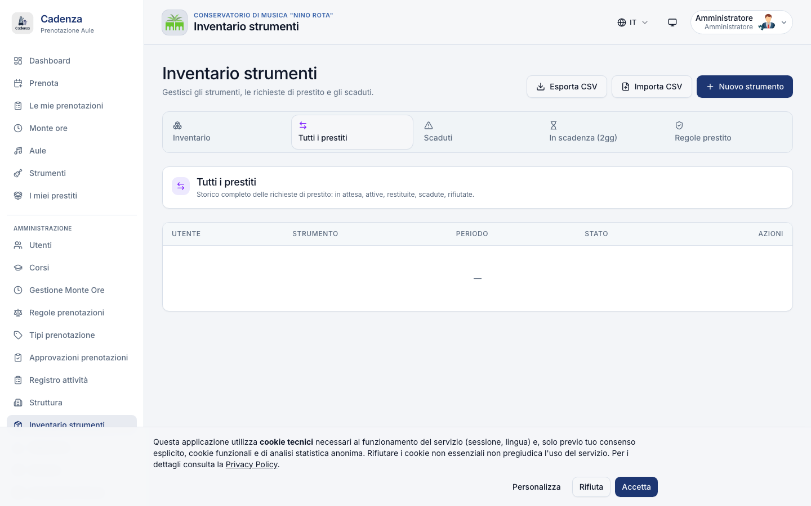

Tabella prestiti con tutti gli stati (`requested`, `active`, `overdue`, `returned`, `rejected`).

| Colonna   | Contenuto                       |
| --------- | ------------------------------- |
| Utente    | Nome + matricola · email        |
| Strumento | Foto + Nome + Codice · Famiglia |
| Periodo   | `dd/mm/aaaa → dd/mm/aaaa`       |
| Status    | Badge colore                    |
| Azioni    | Condizionali (vedi sotto)       |

#### Azioni per stato

| Stato                | Azioni disponibili                              |
| -------------------- | ----------------------------------------------- |
| `requested`          | ✓ Approva (verde) · ✗ Rifiuta (destructive)     |
| `active` / `overdue` | 📄 Stampa consegna (PDF) · ✓ Forza restituzione |
| `returned`           | 📄 Stampa restituzione (PDF)                    |

### 9.3 Tab "Scaduti" e "In scadenza"

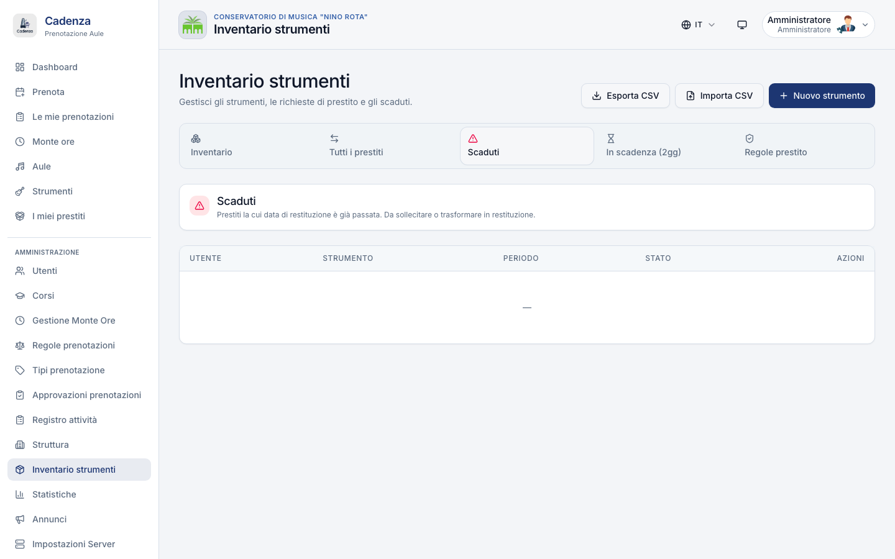

Liste filtrate dei prestiti a rischio. Bottone **"Solleva"** → invia mail di reminder all'utente. Tutti i prestiti scaduti generano automaticamente reminder ogni 7 giorni.

Workflow prestito:

```
richiesta → (admin approva) → attivo → (utente restituisce) → returned
                                  ↓
                                overdue (auto se > data restituzione)
```

Ogni cambio stato genera una mail automatica.

### 9.4 Tab "Regole prestito"

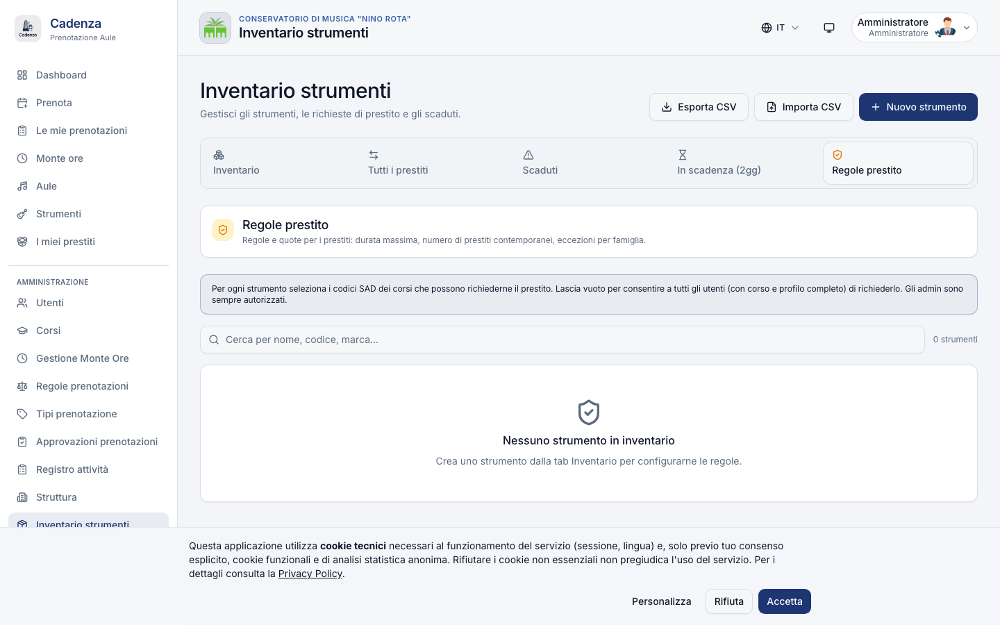

Tabella che mappa ogni strumento ai **corsi autorizzati** a richiederlo in prestito. Per ogni riga: foto + nome + codice + famiglia + chip corsi (oppure "Tutto permesso").

Click **Edit** → `CoursesEditDialog`:

- Search corsi
- Bottoni `Seleziona tutto` · `Deseleziona tutto`
- Grid checkbox 2 colonne dei corsi attivi
- Badge overflow `+N` se i selezionati sono > 8

> Le **quote prestito** numeriche (max prestiti simultanei, max giorni anno) sono separate e si configurano in §6.2bis (Tab "Quote prestiti" delle Regole).

### 9.5 API endpoint

```
GET    /api/admin/instruments?family=&loanable=
POST   /api/admin/instruments
PUT    /api/admin/instruments/{id}
DELETE /api/admin/instruments/{id}
POST   /api/admin/instruments/bulk-delete
POST   /api/admin/instruments/bulk-toggle-loanable
GET    /api/admin/instruments/csv/export
POST   /api/admin/instruments/csv/import
POST   /api/admin/instruments/{id}/photo
DELETE /api/admin/instruments/{id}/photo
GET    /api/admin/loans?kind={all|overdue|expiring}
POST   /api/admin/loans/{id}/approve
POST   /api/admin/loans/{id}/reject
POST   /api/admin/loans/{id}/return
GET    /api/admin/loans/{id}/pdf/{type:delivery|return}
PUT    /api/admin/instruments/{id}/allowed-courses
```

---

## 10. Statistiche / Analytics

URL: `/admin/analytics`

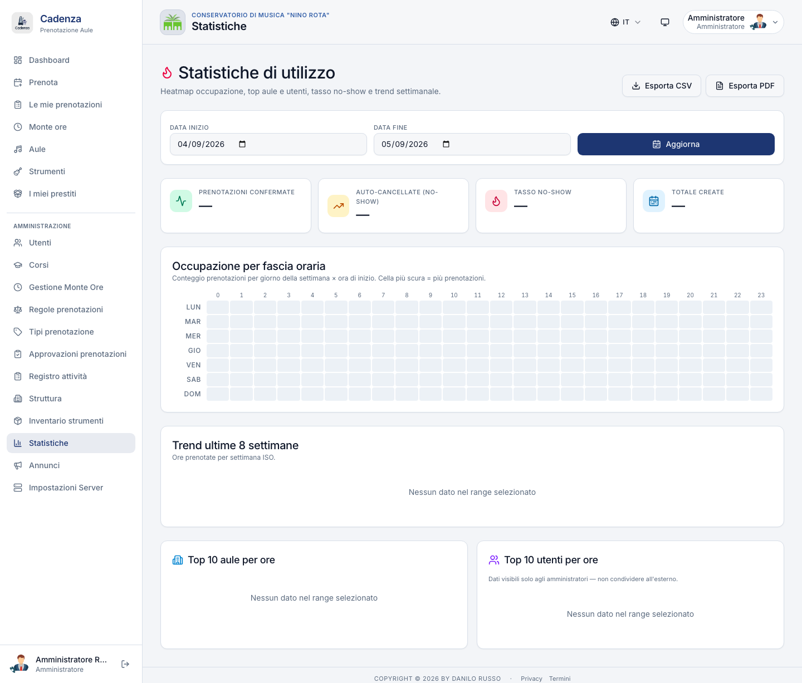

### 10.1 Layout

```
┌──────────────────────────────────────────────────────────────────────────┐
│ Analytics                            [⤓ Export CSV] [⤓ Export PDF]       │
├──────────────────────────────────────────────────────────────────────────┤
│ Filtri: dal [______] al [______]   [Applica]                              │
├──────────────────────────────────────────────────────────────────────────┤
│ ┌─ Confermate ─┬─ Auto-cancel ─┬─ No-show % ─┬─ Totale create ─┐         │
│ │      842     │      63       │   7.5 %     │       905       │         │
│ └──────────────┴───────────────┴─────────────┴─────────────────┘         │
│ ┌── Heatmap occupazione (7 × 24) ──────────────────────────────────────┐ │
│ │       00 01 02 ... 23                                                 │ │
│ │  Lun  ░░ ░░ ░░ ... ▓▓                                                 │ │
│ │  ...                                                                  │ │
│ └───────────────────────────────────────────────────────────────────────┘ │
│ ┌── Trend ultime 8 settimane ───────────────────────────────────────────┐ │
│ │ [grafico linea]                                                       │ │
│ └───────────────────────────────────────────────────────────────────────┘ │
│ ┌── Top 10 aule ──────────────┬── Top 10 utenti ────────────────────────┐ │
│ │ Aula 12 — Pal.Stor. ████ 87h│ M. Rossi (Doc) ███ 45h · 22 prenot.    │ │
│ │ ...                          │ ...                                     │ │
│ └──────────────────────────────┴─────────────────────────────────────────┘ │
└──────────────────────────────────────────────────────────────────────────┘
```

### 10.2 Filtri

| Elemento  | Tipo       | Default      |
| --------- | ---------- | ------------ |
| Date from | Date input | Oggi - 30 gg |
| Date to   | Date input | Oggi         |
| Apply     | Bottone    | Refresh dati |

### 10.3 KPI grid (4 card)

- **Confirmed bookings** — prenotazioni confermate nel periodo
- **Ghosted bookings** — auto-cancellate per no-show o cutoff
- **No-show rate %** — `ghosted / (confirmed + ghosted) × 100`
- **Total created** — totale create indipendentemente da stato finale

### 10.4 Visualizzazioni

- **Heatmap 7×24**: griglia giorno × ora, cella più scura = più prenotata
- **Trend ultime 8 settimane**: linea con ore prenotate per settimana ISO
- **Top 10 aule per ore**: bar chart orizzontale
- **Top 10 utenti per ore** (visibile solo agli admin, non condivisibile esternamente)

### 10.5 Export

- **Export CSV** → `GET /api/admin/analytics/export/csv?from=&to=` (Blob)
- **Export PDF** → `GET /api/admin/analytics/export/pdf?from=&to=` (formattato A4 landscape)

> Per la trasparenza GDPR: i dati utente nei top 10 sono anonimizzati nei report esportati, salvo se l'admin spunta "Includi nomi" (con audit log della scelta).

### 10.6 API endpoint

```
GET /api/admin/analytics?from=YYYY-MM-DD&to=YYYY-MM-DD
GET /api/admin/analytics/export/csv?from=&to=
GET /api/admin/analytics/export/pdf?from=&to=
```

---

## 11. Annunci

URL: `/admin/announcements`


### 11.1 Layout

Header con **+ Nuovo annuncio**. Body è una griglia card verticale (motion animate). Ogni card mostra:

- Badge contestuali in alto: `Pinnato` (blu) · `Audience: tutti/role/corso/edificio` (secondaria) · `Inattivo`/`Scaduto` (muted) · `Email inviata` (con icon mail)
- Titolo (h3) + body (max 2 righe troncate)
- Data pubblicazione + scadenza
- Azioni inline: 📤 Rinvia email · ✎ Modifica · 🗑 Elimina

### 11.2 Form Annuncio (AnnouncementFormDialog)

| Campo          | Tipo                 | Validazioni                                                 |
| -------------- | -------------------- | ----------------------------------------------------------- |
| Titolo         | Text                 | required, max 200                                           |
| Corpo          | Textarea (markdown)  | required, min 1                                             |
| Pubblicato il  | Datetime-local       | optional (default: now). Future-dated = "drafts" automatici |
| Scadenza       | Datetime-local       | optional. Dopo questa data sparisce dal feed                |
| Audience kind  | Select               | `all` · `role` · `course` · `building`                      |
| Audience value | Select dipendente    | required se kind ≠ all (dropdown ruoli/corsi/edifici)       |
| Pin            | Switch               | rimane sempre in cima                                       |
| Attivo         | Switch               | toggle visibilità senza cancellare                          |
| Invia email    | Switch (solo create) | invio broadcast all'audience al salvataggio                 |

> **Modifica annuncio**: la modifica **non rimanda** automaticamente l'email. Se vuoi notificare di nuovo, usa l'azione 📤 **Rinvia email** dalla card.

### 11.3 Audience targeting

| Kind       | Esempio               | Visibilità                                                |
| ---------- | --------------------- | --------------------------------------------------------- |
| `all`      | —                     | Tutti gli utenti + display kiosk                          |
| `role`     | `docente`             | Solo docenti                                              |
| `course`   | `DCPL34 (Pianoforte)` | Studenti del corso indicato                               |
| `building` | `Edificio centrale`   | Solo display kiosk dell'edificio (non nel feed personale) |

Gli avvisi `pinned` finiscono anche nella rotazione del display kiosk pubblico nelle aule (vedi §12.7 per la configurazione globale del display).

### 11.4 API endpoint

```
GET    /api/announcements/admin
POST   /api/announcements
PUT    /api/announcements/:id
DELETE /api/announcements/:id
POST   /api/announcements/:id/resend-email     → { sent: number }
GET    /api/courses?active=true
GET    /api/institutes/full
GET    /api/public/announcements                → endpoint pubblico per display kiosk
```

---

## 12. Impostazioni Server

URL: `/admin/server-settings`

### 12.0 Hub di navigazione macro/sub-tab

La pagina è un **hub** organizzato in macro-tab in alto + sub-tab quando la macro è "Servizi":

```
┌──────────────────────────────────────────────────────────────────────────┐
│ Impostazioni Server                                                      │
├──────────────────────────────────────────────────────────────────────────┤
│ [Servizi] [Aspetto] [QR Codes] [Display] [Audit Log] [Moduli]            │
├──────────────────────────────────────────────────────────────────────────┤
│  (se macro=Servizi) [Mail] [Mail Outbox] [Messaging] [Backups]            │
├──────────────────────────────────────────────────────────────────────────┤
│ Body della tab/sub-tab attiva                                            │
└──────────────────────────────────────────────────────────────────────────┘
```

URL pattern: `?tab=<macro>` oppure `?tab=<macro>&sub=<subTab>`. Le route legacy (`?tab=mail`, `?tab=messaging`, ecc.) sono ridirezionate automaticamente al nuovo schema.

#### Mappa completa macro → sub

| Macro     | Sub-tab                                  | Sezione manuale               |
| --------- | ---------------------------------------- | ----------------------------- |
| Servizi   | Mail · Mail Outbox · Messaging · Backups | §12.1 · §12.2 · §12.3 · §12.4 |
| Aspetto   | (nessuna sub)                            | §12.5                         |
| QR Codes  | (nessuna sub)                            | §12.6                         |
| Display   | (nessuna sub)                            | §12.7                         |
| Audit Log | (nessuna sub)                            | §12.8                         |
| Moduli    | (nessuna sub)                            | §12.9                         |

### 12.1 Servizi → Mail (SMTP)


#### Status badge

In alto compare il badge di stato della configurazione: `Configurato (DB)` · `Disabilitato` · `Non configurato`. Se le var d'ambiente SMTP sono attive, un alert blu informa che salvare la form prenderà il loro posto.

#### Card "Server SMTP"

| Campo                         | Tipo     | Validazioni                                                         |
| ----------------------------- | -------- | ------------------------------------------------------------------- |
| `isEnabled`                   | Switch   | —                                                                   |
| `host`                        | Text     | optional, placeholder `smtp.gmail.com`                              |
| `port`                        | Number   | 1–65535; auto-sync con `secure` (465 → secure, 587/25 → starttls)   |
| `secure`                      | Switch   | TLS implicito vs STARTTLS                                           |
| `username`                    | Text     | optional                                                            |
| `password`                    | Password | optional, mai pre-compilato (vuoto = no change). Bottone eye toggle |
| `fromAddress`                 | Email    | regex `/\S+@\S+\.\S+/`                                              |
| `fromName`                    | Text     | optional                                                            |
| `replyTo`                     | Email    | regex email                                                         |
| `throttlePerRecipientPerHour` | Number   | 0–1000 (0 = disabilitato)                                           |

#### Banner condizionali

- **Port mismatch** (alert ambra): porta 465 senza TLS, oppure 587/25 con TLS
- **Typo hint** (alert ambra): `smpt.` rilevato → suggerisce auto-correct in `smtp.`
- **Password saved**: badge verde "salvata" accanto al label password se già presente in DB

#### Card "Modelli email"

Dropdown per selezionare un template della libreria (badge `OFF` se disabilitato) → apre `MailTemplateEditor` (preview + save).

#### Card "Test invio"

| Campo          | Tipo    | Note                                                                              |
| -------------- | ------- | --------------------------------------------------------------------------------- |
| Destinatario   | Email   | required                                                                          |
| Tipo email     | Select  | "Generica" · ogni template della libreria                                         |
| **Invia test** | Bottone | POST `/api/admin/mail/test` o `/api/mail-templates/:kind/test` con sample context |

Il risultato viene mostrato sotto: `ok` (verde) o errore (rosso, con `<details>` per il raw error).

#### API endpoint

```
GET   /api/admin/settings/mail
PUT   /api/admin/settings/mail
POST  /api/admin/mail/test
GET   /api/admin/mail-templates
PUT   /api/admin/mail-templates/:kind
POST  /api/mail-templates/:kind/test
```

### 12.2 Servizi → Mail Outbox

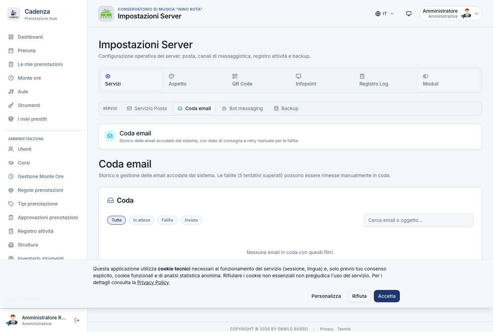

URL legacy: `/admin/mail-outbox` (ora sub-tab di Server Settings).

#### Health banner SMTP

In alto, banner con 4 varianti:

- 🟢 **Verde** — SMTP attivo, coda pulita
- 🟡 **Ambra** — SMTP non configurato
- 🔴 **Rossa** — SMTP non raggiungibile + dettaglio errore
- 🔴 **Rossa** — Email fallite oltre tentativi

Aggiornato ogni 30 secondi via `GET /api/admin/mail-outbox/health`.

#### Filtri

- **Status pills**: `Tutti` · `In attesa` · `Inviate` · `Fallite (dead)`
- **Search**: Input testo (cerca su email destinatario / oggetto)
- **Page**: paginazione con prev/next

#### Colonne tabella

| Colonna      | Contenuto                                    |
| ------------ | -------------------------------------------- |
| Stato        | Badge `pending`/`sent`/`dead` (icon + label) |
| Tipo         | Code tag con `kind` template                 |
| Destinatario | Email                                        |
| Oggetto      | Testo troncato + tooltip                     |
| Tentativi    | `N / maxN` (tabular-nums)                    |
| Quando       | Data inviata o prossimo tentativo            |
| Azioni       | 🔄 Retry (solo se `dead`) · 🗑 Delete        |

#### API endpoint

```
GET    /api/admin/mail-outbox/health
GET    /api/admin/mail-outbox/counts
GET    /api/admin/mail-outbox/list?status=&q=&page=
POST   /api/admin/mail-outbox/:id/retry
DELETE /api/admin/mail-outbox/:id
```

### 12.3 Servizi → Messaging


Una card per ogni canale (Telegram · WhatsApp · Signal · Email/IMAP). Ognuna mostra:

- Toggle enable/disable + badge `enabled`
- Settings non-secret (grid 2 col)
- Credentials secret (grid 2 col, `SECRET_PLACEHOLDER` per quelle già salvate)
- Setup guide (alert info con istruzioni)
- Test result (alert info/destructive)
- Bottoni **Test** + **Save**

#### Telegram

| Campo           | Tipo     | Validazione                      |
| --------------- | -------- | -------------------------------- |
| `botToken`      | Password | required se enabled              |
| `webhookSecret` | Password | required se enabled, hex 32 char |

#### WhatsApp Cloud API

| Campo           | Tipo     | Validazione |
| --------------- | -------- | ----------- |
| `accessToken`   | Password | required    |
| `phoneNumberId` | Text     | required    |
| `verifyToken`   | Password | required    |
| `appSecret`     | Password | required    |

#### Signal

| Campo           | Tipo     | Validazione                     |
| --------------- | -------- | ------------------------------- |
| `webhookSecret` | Password | required                        |
| `phoneNumber`   | Text     | required, formato `+39333…`     |
| `daemonUrl`     | Text     | required, URL signal-cli daemon |

#### Email / IMAP

| Campo      | Tipo     | Validazione                           |
| ---------- | -------- | ------------------------------------- |
| `password` | Password | required                              |
| `host`     | Text     | required, es. `imap.example.it`       |
| `port`     | Text     | required, default `993`               |
| `user`     | Text     | required, es. `book@conservatorio.it` |

Per ogni canale il bottone **Test** chiama `POST /api/admin/messaging/:channel/test` e mostra `ok / error / info` in alert.

### 12.4 Servizi → Backups

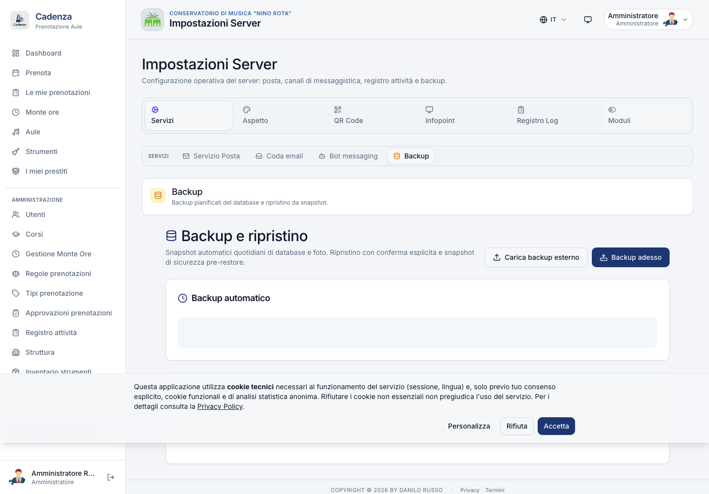

#### Card "Scheduler"

Griglia status: `Stato (Attivo/Disattivato)` · `Orario pianificato` · `Prossimo run`.

Sotto, alert sull'**ultimo run**: `ok` (verde) o `errore` (rosso, con dettaglio).

`SchedulerConfigSection` (toggle view/edit):

| Campo                | Tipo   | Validazione                     |
| -------------------- | ------ | ------------------------------- |
| `autoEnabled`        | Switch | —                               |
| `scheduledHour`      | Number | 0–23                            |
| `scheduledMinute`    | Number | 0–59                            |
| `keepDaily`          | Number | 1–365                           |
| `keepWeekly`         | Number | 1–104                           |
| `keepMonthly`        | Number | 1–60                            |
| `autoRestartEnabled` | Switch | Riavvia il backend dopo restore |

#### Card "Lista backup"

Tabella con file · data · size · azioni:

- 📥 **Download** (`GET /api/admin/backups/download/:file`, binary)
- 🔄 **Restore** (apre confirm dialog) → al successo mostra una "card success" con il pre-snapshot creato + bottone "Riavvia backend"
- 🗑 **Delete** (con confirm)

In header della card: bottoni **+ Backup adesso** (`POST /create-now`) e **⤒ Upload** (multipart, .tar.gz).

#### Dialog "Restart"

Alert destructive: "Il backend sarà riavviato; la sessione verrà persa". Dopo conferma: `POST /api/admin/backups/restart` → attesa 4s → reload pagina.

### 12.5 Aspetto


Due card:

- **AppIconSection** — upload icona brand (PNG/SVG, fallback `/cadenza.png`)
- **CopyrightSection** — testi copyright footer (mostrati su `/display` e in fondo a tutte le pagine pubbliche)

### 12.6 QR Codes

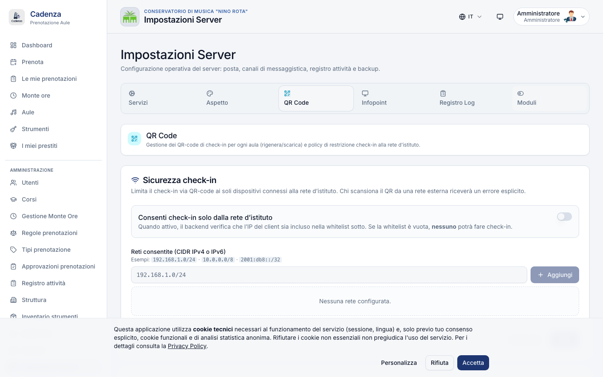

#### Card "Sicurezza check-in"

| Campo                                  | Tipo                    | Note                                             |
| -------------------------------------- | ----------------------- | ------------------------------------------------ |
| `checkInRequireInstituteNetwork`       | Switch                  | Toggle restriction by IP                         |
| `instituteNetworkCidrs`                | Array CIDR              | IPv4 (`192.168.1.0/24`) o IPv6 (`2001:db8::/32`) |
| **Bottone "Aggiungi mio IP corrente"** | (callerIp + /32 o /128) | Disabilitato se l'IP è loopback (::1, 127.x.x.x) |

Banner condizionali:

- **Loopback warning** (badge ambra): "loopback locale" se IP è ::1 o 127.x.x.x
- **Empty CIDR + toggle on** (alert destructive): "Nessuna rete configurata + toggle attivo = nessuno fa check-in"

#### Card "QR-code per aula"

Lista aule con anteprima del QR. Per ogni aula:

- Badge `Check-in non richiesto` (se `requireCheckIn=false`) · `Token mai generato` (se `hasQrToken=false`)
- 📥 **Scarica QR** (`GET /api/admin/qr-codes/:roomId/image?v=token` per cache-busting)
- 🔄 **Rigenera** (singolo) → confirm dialog warning "i fogli stampati saranno invalidi"

In header: **Rigenera tutti** (`POST /api/admin/qr-codes/bulk-regenerate`) — operazione di emergenza dopo data breach.

### 12.7 Display Kiosk (admin)

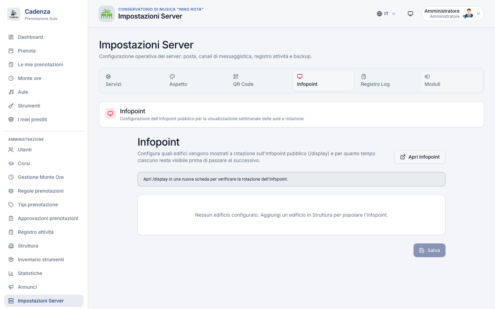

Pagina di configurazione globale dello schermo `/display` esposto al pubblico nelle aule.

#### Card "Rotazione prenotazioni"

Master toggle on/off + tabella edifici:

| Colonna          | Tipo             | Validazione                |
| ---------------- | ---------------- | -------------------------- |
| Edificio         | Dot color + nome | —                          |
| Stanze           | Number           | conteggio rooms            |
| Abilitato        | Switch           | disabilitato se master OFF |
| Intervallo (sec) | Number input     | 5–600 sec                  |

Disattivando il master, l'intera tabella diventa `opacity-50`.

#### Card "Concerti"

Master toggle + grid 3 col:

| Campo         | Validazione              |
| ------------- | ------------------------ |
| `days`        | 0–365 (giorni lookahead) |
| `count`       | 0–50 (0 = tutti)         |
| `intervalSec` | 5–600 sec                |

#### Card "Annunci"

Master toggle + grid 2 col:

| Campo         | Validazione                   |
| ------------- | ----------------------------- |
| `count`       | 0–30 (0 = tutti)              |
| `intervalSec` | 5–600 sec                     |
| `pinnedOnly`  | Switch — solo annunci pinnati |

In fondo: bottone **Salva** (disabled se non dirty). Le modifiche vengono propagate per ogni edificio modificato (`PATCH /api/structure/buildings/:id`).

> **Preview**: il pulsante in header apre `/display` in nuova scheda — utile per verificare la rotazione in tempo reale dopo aver salvato.

### 12.8 Audit Log

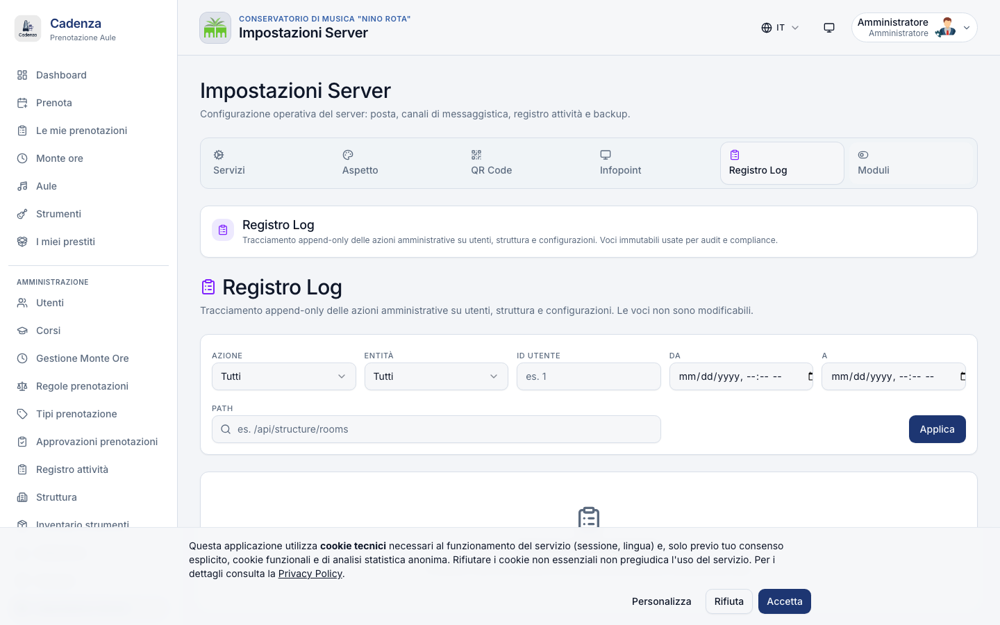

URL: `/admin/audit-log` (sub-tab di Server Settings; rinominato in "Registro Log" per distinguerlo dal "Registro attività" operativo di §7.2).

#### Filtri (5 campi draft + 2 bottoni)

| Campo                 | Tipo           | Note                                                               |
| --------------------- | -------------- | ------------------------------------------------------------------ |
| Action                | Dropdown       | `all` · POST · PUT · PATCH · DELETE                                |
| Target Type           | Dropdown       | da `GET /api/admin/audit-log/target-types` (cache 5min)            |
| Actor ID              | Number input   | userId admin                                                       |
| Date From / To        | Datetime-local | RFC 3339 UTC                                                       |
| Path Search           | Text input     | full-text nella path API                                           |
| **Apply** / **Reset** | Bottoni        | applica / pulisce filtri (reset visibile solo se hasActiveFilters) |

#### Colonne tabella (50 righe/pagina)

| Colonna | Contenuto                                                                          |
| ------- | ---------------------------------------------------------------------------------- |
| When    | DD/MM/YYYY HH:mm:ss tabular-nums                                                   |
| Actor   | Nome Cognome + email (truncate)                                                    |
| Action  | Badge mono colorato: `POST` (success), `PUT/PATCH` (secondary), `DELETE` (default) |
| Target  | `targetType` · `#targetId`                                                         |
| Path    | Mono xs (truncate)                                                                 |
| Status  | Status code colorato (≥400 destructive, else emerald)                              |

**Expandable row**: click sulla riga → mostra `payload` JSON, `response` JSON, IP, User-Agent (max-h-48 overflow-auto).

#### Forensic preservation — export firmato HMAC SHA-256 (v2.2)

Per default i record di audit log oltre i **730 giorni** vengono prunati dal `retentionScheduler` (compliance GDPR retention 24 mesi). Da v2.2 il prune è **preceduto** da un export forensic firmato:

1. `archiveAuditLog(cutoff)` esegue cursor-paged streaming del DB → file `.gz`
2. Sidecar `.hmac` contiene HMAC SHA-256 dell'archive (chiave da `AUDIT_ARCHIVE_HMAC_KEY` env, fallback derivato da `JWT_SECRET`)
3. Salvataggio in `backups/audit/audit-YYYYMMDD.gz` + `audit-YYYYMMDD.hmac`
4. **Solo se l'archive ha successo** il prune procede. Se fallisce → SKIP del prune (preserva i dati per ritentare al prossimo tick)

Verifica integrità di un archive (es. richiesta GDPR ex post o ispezione):

```bash
KEY="$AUDIT_ARCHIVE_HMAC_KEY"
expected=$(openssl dgst -sha256 -hmac "$KEY" backups/audit/audit-20260101.gz | awk '{print $2}')
actual=$(cat backups/audit/audit-20260101.hmac)
[ "$expected" = "$actual" ] && echo OK || echo TAMPERED
```

### 12.9 Moduli

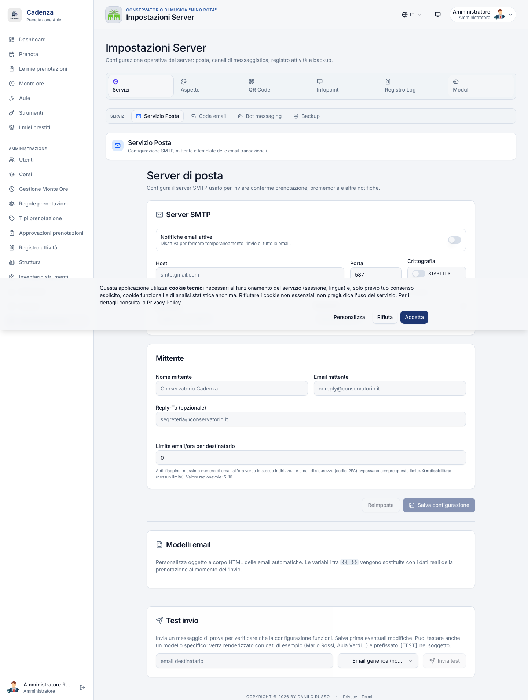

Card con due `ModuleRow`:

| Modulo                 | Switch                         | Effetto                                                       |
| ---------------------- | ------------------------------ | ------------------------------------------------------------- |
| **Monte Ore docenti**  | `moduleMonteOreEnabled`        | nasconde `/monte-ore` (utente) e `/admin/monte-ore` (sidebar) |
| **Prestito strumenti** | `moduleInstrumentLoansEnabled` | nasconde `/instruments`, `/my-loans`, `/admin/instruments`    |

> **Importante**: i toggle sono **puramente di presentazione**. Il backend resta sempre attivo:
>
> - I dati esistenti **non vengono cancellati**
> - Le rotte API continuano a funzionare (deep-link, integrazioni esterne, bookmark)
> - Riattivando il modulo i link tornano subito visibili

API:

```
GET /api/institutes/module-settings
PUT /api/institutes/module-settings
```

---

## 13. Integrazioni Isidata

URL: `/admin/integrations/isidata` (pagina standalone) — oppure dialog modale dalla pagina Utenti (§3.6).

### 13.1 Layout a 3 step

#### Step 1: Upload

```
┌──────────────────────────────────────────────────────────────────────────┐
│ Importazione anagrafica Isidata                                          │
│ ┌── Drop file ───────────────────────────────────────────────────────┐  │
│ │   ⤒ Trascina .xlsx / .xls / .csv qui, oppure clicca per scegliere  │  │
│ └────────────────────────────────────────────────────────────────────┘  │
│ ▶ Override colonne (opzionale, JSON)                                     │
│   [textarea collassabile con esempio mappingOverrides]                   │
│                                                          [Anteprima →]   │
└──────────────────────────────────────────────────────────────────────────┘
```

#### Step 2: Preview

KPI tile (4): `Da creare · Da aggiornare · Da disattivare · Letti totali`.

Sotto, 3 sezioni filtrabili (verde = create, blu = update, ambra = orphan), con tabelle dettagli + warnings.

#### Step 3: Done

Card success "Importazione completata" + numeri finali + bottone "Importa un altro".

### 13.2 Flusso a 2 step (preview → apply, anti-errore umano)

1. **Preview** (`POST /api/admin/integrations/isidata/preview`)
   - Carica il file. Cadenza ne fa parsing, applica il mapping (auto-rilevato dagli header — cfr. `INTEGRATIONS-ISIDATA.md`), confronta col DB e restituisce: lista utenti **da creare**, **da aggiornare** (con campi che cambierebbero), **da disattivare** (orphan = già linkati Isidata ma assenti nel nuovo export).
   - **Nessun side-effect sul DB**. Il file resta in `/tmp` per max 10 minuti, leggibile solo dall'admin che l'ha caricato (prefisso del filename = suo `userId`).
   - La risposta include `token` + `hash` SHA-256 del file.
2. **Apply** (`POST /api/admin/integrations/isidata/apply`)
   - Invia indietro `token` + `hash`. Cadenza riapre il file, ricalcola SHA-256, **rifiuta** con `HASH_MISMATCH` se il file è stato sostituito tra preview e apply (anti-TOCTOU).
   - Esegue create/update/orphan in transazione **SERIALIZABLE** su Postgres. I nuovi utenti nascono in stato `pending` (vanno approvati esplicitamente da `/admin/approvals`) e mai con permessi superiori a `studente`/`docente` derivati dal file.
   - **Mai un orfano viene cancellato fisicamente**: solo `isActive=false` + `externalStatusNote = "Non più presente nell'export Isidata del YYYY-MM-DD"`. Riapparire in un export futuro lo riattiva.

### 13.3 Mapping personalizzato per istituto

Se il vostro export Isidata ha header diversi da quelli auto-riconosciuti (matricola, cognome, nome, email, ruolo, ecc. con accenti/spazi/case variabile), invia un `mappingOverrides` JSON nel body con i target da mappare. Esempio:

```json
{
  "externalId": "Numero Matricola",
  "email": "Email Istituzionale",
  "courseCode": "Codice Indirizzo"
}
```

I target consentiti sono: `externalId`, `email`, `firstName`, `lastName`, `role`, `matricola`, `courseCode`, `courseName`, `status`, `birthDate`. Altri target vengono droppati silenziosamente. Valori non-stringa o oltre 100 char idem.

### 13.4 Limiti e protezioni (v2.3.1 hardening)

| Limite                  | Valore                | Motivo                                                                                                                                               |
| ----------------------- | --------------------- | ---------------------------------------------------------------------------------------------------------------------------------------------------- |
| File size massimo       | **10 MB**             | Cap multer + check buffer. File più grandi → `FILE_TOO_LARGE`                                                                                        |
| Record processati       | **5.000** dopo header | Le righe in eccesso vengono ignorate con warning. Se hai 8.000 utenti, splitta l'import in 2 file                                                    |
| Righe iterate (XLSX)    | **20.000** raw        | Difesa anti **XLSX-bomb**: il file ZIP da 10MB compressi può contenere milioni di righe vuote → cap hard sull'iterazione (era illimitato pre-v2.3.1) |
| Colonne max (XLSX)      | **1.024**             | Difesa contro `columnCount` patologico nel file                                                                                                      |
| Header riservati        | scartati con warning  | `__proto__`, `prototype`, `constructor` non finiscono nei record (defense-in-depth contro prototype pollution)                                       |
| `mappingOverrides` JSON | **4 KB** max          | Anti CPU-spike su parse di JSON patologici                                                                                                           |
| Token TTL               | **10 minuti**         | Dopo, il file viene cancellato e l'apply richiede di ricaricare → `TOKEN_EXPIRED` (410)                                                              |
| Compare hash            | **timing-safe**       | `crypto.timingSafeEqual` invece di `===` — defense-in-depth                                                                                          |

### 13.5 Codici errore (per debug)

| Codice              | Quando                                                         | Cosa fare                                |
| ------------------- | -------------------------------------------------------------- | ---------------------------------------- |
| `FILE_REQUIRED`     | `multipart/form-data` senza campo `file`                       | Verifica il form                         |
| `FILE_TOO_LARGE`    | File > 10 MB                                                   | Splitta o rimuovi colonne inutili        |
| `PARSE_FAILED`      | XLSX corrotto o CSV malformato                                 | Riapri in Excel, salva come .xlsx pulito |
| `VALIDATION_FAILED` | `mappingOverrides` non oggetto, troppo grande, o JSON invalido | Riguarda il body                         |
| `TOKEN_INVALID`     | Token non rispetta il formato `\d+-\d+-[a-f0-9]{16}.ext`       | Ricarica la preview                      |
| `TOKEN_FOREIGN`     | L'admin che fa apply ≠ quello che ha caricato                  | Solo l'uploader può applicare            |
| `TOKEN_EXPIRED`     | TTL 10min superato o file rimosso                              | Ricarica la preview                      |
| `HASH_MISMATCH`     | File modificato tra preview e apply                            | Ricarica la preview                      |

### 13.6 Audit trail per ogni run

Ogni preview+apply genera un record `IntegrationSyncRun` con: `actorId` (admin), `provider='isidata'`, `triggeredBy='manual'`, `status` (`success`/`partial`/`failed`), conteggi (`created`/`updated`/`orphaned`/`errors`), e `diffSnapshot` (lista dei target toccati per audit). Visibile in `GET /api/admin/integrations/runs?provider=isidata`.

> Per il setup avanzato del mapping per istituto e per il workflow legacy, vedi `INTEGRATIONS-ISIDATA.md`.

---

## 14. Operazioni periodiche e best practice

### 14.1 All'inizio dell'anno accademico (settembre)

1. Aggiorna `MonteOreSettings`: nuove date anno + finestre
2. Inserisci tutte le sospensioni del calendario didattico nazionale
3. Apri la finestra inserimento proposte (datas in settings)
4. Notifica i docenti via Annuncio o mail diretta
5. Importa anagrafica studenti aggiornata (Isidata o CSV manuale)
6. Verifica che le aule in ristrutturazione siano marcate `isBookable=false`
7. Aggiorna le quote stagionali (es. orario serale 18–22)

### 14.2 Settimanale

- **Lunedì mattina**: controlla `/admin/approvals` (badge sidebar) → approva/rifiuta in batch
- **Mercoledì mattina**: controlla amendments Monte Ore → approva/rifiuta
- **Venerdì pomeriggio**: controlla Statistiche → individua aule sotto-utilizzate o no-show seriali
- **Giornaliero**: occhio al banner SMTP in `/admin/server-settings?tab=servizi&sub=mail-outbox` — se diventa rosso, controlla mail rebote

### 14.3 Mensile

- Esporta backup off-site (oltre allo Storage Box automatico — copia su un disco fisico in cassaforte come ulteriore garanzia)
- Audit log review (filtra azioni "delete" e "role-change" del mese)
- Aggiornamento policy se cambia normativa (Garante / AgID)

### 14.4 Annuale

- Rivedi le quote (le abitudini di prenotazione cambiano)
- Esporta tutti i Monte Ore approvati come PDF per archivio amministrativo
- Verifica `tokenVersion` di tutti gli admin (forza re-login)
- Restore test da backup (esercizio di disaster recovery)

---

## 15. Troubleshooting

### "L'utente dice di non poter prenotare ma la regola sembra OK"

1. Vai su `/admin/rules` → bottone **Anteprima** (roadmap, vedi §6.5)
2. Inserisci utente + aula + giorno/ora che lui ha provato
3. La preview mostrerà esattamente quale regola/quota/eccezione blocca

### "Le prenotazioni Monte Ore non appaiono nel calendario"

1. Verifica che la proposta sia in stato `generated` (non solo `approved`)
2. Vai sulla proposta → tab "Slot generati" → controlla che siano materializzati
3. Se la proposta è ferma su `approved`, c'è stato un errore di overlap nella generazione: leggi il report nel campo "Note generation"

### "Il backup notturno non parte"

1. `/admin/server-settings?tab=servizi&sub=backups` → verifica ultimo run
2. Se errore: leggi log nel pannello (Storage Box raggiungibile? Spazio sufficiente?)
3. Esegui un backup manuale per validare il setup

### "Voglio annullare massivamente le prenotazioni di un'aula in ristrutturazione"

1. Vai su **`/admin/activity-log`** (Registro attività, vedi §7.2)
2. Filtra per aula + range date
3. Bulk-cancel con motivo broadcast → email automatica a tutti gli utenti coinvolti

> Per chiusure pianificate (ristrutturazione di settimane), valuta invece di creare un'eccezione `block` da §6.3 — Cadenza ti propone direttamente la lista delle prenotazioni da cancellare con badge "Monte Ore" per quelle collegate al piano didattico.

### "Voglio scambiare aula tra 2 prenotazioni"

1. `/admin/activity-log` (Registro attività)
2. Seleziona esattamente 2 prenotazioni future → bottone **"Scambia"**
3. Vedi §7.2 per dettagli sul flusso atomico e sui codici di errore (es. `BOOKING_CONFLICT` se appare un overlap laterale durante lo swap → ritenta)

### "Errore `MIN_INTERVAL_VIOLATED` su prenotazioni back-to-back"

Da v2.3 esiste il **cooldown** `minIntervalBetweenBookingsMinutes` per ruolo (§6.1). Verifica:

```bash
curl -H "Authorization: Bearer <admin-token>" \
     http://localhost:3000/api/rules
# → cerca minIntervalBetweenBookingsMinutes su ciascun ruolo
```

Se è troppo alto per il caso d'uso (es. masterclass docente con lezioni back-to-back), abbassalo o usa un'eccezione `BookingRuleException` mirata (§6.3).

### "Errore `USER_LOGICAL_CONFLICT` per uno studente che però era libero"

Lo studente ha un'altra prenotazione `confirmed` in **un'altra aula** in quella fascia oraria. Da v2.3 Cadenza blocca questo caso (un utente non può fisicamente essere in due posti). Verifica:

```sql
SELECT id, "roomId", "startTime", "endTime", status FROM bookings
WHERE "userId" = <id> AND status = 'confirmed' AND "deletedAt" IS NULL
  AND tstzrange("startTime","endTime","[)") && tstzrange('<start>','<end>','[)');
```

Cancellare la prenotazione "fantasma" sblocca quella nuova.

### "Mail Outbox banner rosso — SMTP non raggiungibile"

1. `/admin/server-settings?tab=servizi&sub=mail` → riapri test e leggi il dettaglio errore
2. Verifica typo nell'host (Cadenza segnala `smpt.` automaticamente come ambra)
3. Riprova con `Test invio` → se ancora fallisce, controlla firewall/credenziali
4. Le mail accumulate restano in `dead`: dopo aver fixato SMTP, vai in `Mail Outbox` e clicca **Retry** per ognuna (o crea uno script di bulk-retry)

### "Ho cancellato un corso AFAM per errore — al riavvio del backend non torna"

Comportamento corretto: il seeder rispetta le cancellazioni admin (regression test in `coursesSeederIdempotency.test.js`). Per ricreare il corso:

1. `/admin/courses` → bottone "+ Nuovo corso"
2. Inserisci codice, nome, livelli
3. Save

### "Un docente a contratto orario non può inviare la sua proposta Monte Ore"

Se vede l'errore `HOURS_BELOW_THRESHOLD` con "324 ore" (o `WORKING_DAYS_OUT_OF_RANGE`), molto probabilmente non hai ancora impostato la **deroga individuale**. Vai su **`/admin/users` → modifica del docente → sezione "Monte Ore — Tipo contratto"** e configura la soglia personalizzata. Vedi §3.7 e §8.10 per i dettagli.

Verifica diretta lato API (utile in debug):

```bash
# Risoluzione soglia per quel docente:
curl -H "Authorization: Bearer <docente-token>" \
     http://localhost:3000/api/monte-ore/me/threshold?year=2026/2027

# Atteso (deroga attiva):
# {"minHours":60,"bypassDayConstraint":true,"source":"user_override","contractType":"contratto_orario",...}

# Atteso (nessuna deroga, settings istituzionali standard):
# {"minHours":324,"bypassDayConstraint":false,"source":"institute_settings",...}
```

### "Un docente reclama che le sue ore Monte Ore sono sotto la soglia"

1. Apri la sua proposta in `/admin/monte-ore`
2. Verifica il totale ore generato (tab "Slot generati")
3. Se sotto soglia, sospensioni valide possono averlo decurtato: confronta con `MonteOreSuspension` attive
4. Eventualmente concedi una "deroga" inserendo un valore custom in `oreAnnueOverride` sul record proposta

---

## 16. Sicurezza e hardening

> Sezione di riferimento per Direttore IT / DSGA. Sintetizza in linguaggio admin tutte le difese aggiunte fra v2.2 (audit hardening backend, 30 apr 2026) e v2.3.1 (hardening import Isidata, 1 mag 2026 notte). Per i dettagli implementativi vedi `docs/SECURITY.md` e `docs/AUDIT_QUALITA_PRODUZIONE.md` §4.4-§4.7.

### 16.1 Difese a livello di endpoint admin (v2.2)

| Difesa                                             | Endpoint                                                                              | Cosa impedisce                                                                                                      |
| -------------------------------------------------- | ------------------------------------------------------------------------------------- | ------------------------------------------------------------------------------------------------------------------- |
| Anti mass-assignment whitelist (`lib/sanitize.js`) | `PUT /users/:id`, `PUT /structure/buildings/:id`, `/rooms/:id`, `/equipment/:id` (+2) | Modifica di campi privilegiati (`passwordHash`, `tokenVersion`, `deletedAt`, OAuth IDs) anche con admin compromesso |
| Anti-lockout admin (§3.8)                          | `PUT /users/:id`, `DELETE`, bulk-delete                                               | Auto-demote/disable, cancellazione ultimo admin attivo                                                              |
| Password policy AGID 2024 (§3.9)                   | `POST /register`, `PUT /users/:id/password`                                           | Password deboli (< 10 char, no maiuscola, no cifra) sui nuovi account                                               |
| Rate limit dedicati (§3.9)                         | `/login`, `/register`, `/2fa/*`, `/recurring`, `/gdpr/*`, `/ical`                     | Brute-force credenziali, spam codici 2FA, DoS pool DB su recurring                                                  |

### 16.2 Difese a livello di dati / lista

| Difesa                                    | Endpoint                                                         | Cosa impedisce                                                                                                                                                |
| ----------------------------------------- | ---------------------------------------------------------------- | ------------------------------------------------------------------------------------------------------------------------------------------------------------- |
| Pagination uniforme (`lib/pagination.js`) | `GET /users`, `/bookings`, `/admin/monte-ore`, list-routes admin | Caricamento di 10k+ record in memoria. Default 100/pagina, max 500. Header `X-Total-Count`, `X-Limit`, `X-Offset` esposti via `Access-Control-Expose-Headers` |
| Cache request-scoped validator            | `POST /bookings`, `/recurring`                                   | Full-table-scan su ogni POST. Riduce 10–15 query → 3–5 su batch. 10× speedup su recurring 52 settimane                                                        |
| Single-tx recurring                       | `POST /bookings/recurring`                                       | 52 transazioni SERIALIZABLE in serie su pool DB → starvation. Ora 1 transazione + parallel validate (concorrenza 5)                                           |
| afterCommit hooks waitlist                | `Booking.afterUpdate/afterDestroy`                               | Email "tu sei il prossimo" inviata anche se la transazione poi rollback                                                                                       |
| Atomic `amendmentCount`                   | `MonteOreProposal`                                               | Race condition su 2 amendment concorrenti dello stesso docente                                                                                                |

### 16.3 Difese a livello di file/IO

| Difesa                                | Cosa                                                                                       | Riferimento                                     |
| ------------------------------------- | ------------------------------------------------------------------------------------------ | ----------------------------------------------- |
| Path traversal hardening              | Cleanup tmp Isidata via `path.basename` + `path.relative` cross-platform                   | `routes/integrations.js`                        |
| XLSX-bomb cap (v2.3.1)                | `MAX_RAW_ROWS = 20.000` + `includeEmpty:false` + cap colonne 1024                          | `services/integrations/isidata/csvImporter.js`  |
| Prototype pollution defense (v2.3.1)  | Filtro header `__proto__/prototype/constructor` + `Object.create(null)`                    | `csvImporter.js`                                |
| Anti-TOCTOU import Isidata            | Hash SHA-256 del file emesso in preview, ricontrollato in apply (`crypto.timingSafeEqual`) | `routes/integrations.js`                        |
| Token Isidata IDOR-safe               | Prefisso adminId controllato, regex stretta `\d+-\d+-[a-f0-9]{16}\.<ext>`, TTL 10min       | `routes/integrations.js`                        |
| `mappingOverrides` whitelist (v2.3.1) | Solo target ∈ DEFAULT_ALIASES, valori string ≤100 char, JSON ≤4 KB                         | `services/integrations/isidata/fieldMapping.js` |
| Audit log forensic export             | HMAC SHA-256 + sidecar pre-prune (§12.8)                                                   | `services/retentionScheduler.js`                |
| DB anti-overlap                       | EXCLUDE constraint `bookings_no_overlap WHERE status='confirmed'` su Postgres              | `migrations/*`                                  |

### 16.4 Difese a livello di logica applicativa (v2.3)

| Difesa                            | Quando scatta                                                                                                       | Codice errore                 |
| --------------------------------- | ------------------------------------------------------------------------------------------------------------------- | ----------------------------- |
| Cooldown tra prenotazioni         | Stesso utente con prenotazione precedente che termina < cooldown minuti dall'inizio della nuova                     | `MIN_INTERVAL_VIOLATED`       |
| Conflitto logico cross-aula       | Stesso utente già in altra aula nella stessa fascia oraria                                                          | `USER_LOGICAL_CONFLICT`       |
| Sovrapposizioni storiche su block | Prima di salvare un'eccezione `kind=block`, anteprima delle prenotazioni in conflitto + sync MonteOreSlot al cancel | (no errore — UI workflow)     |
| Swap atomico EXCLUDE-aware        | Flip status temporaneo per aggirare EXCLUDE, rollback su overlap laterale                                           | `BOOKING_CONFLICT` (rollback) |

### 16.5 Comandi di verifica rapida (per Direttore IT)

```bash
# Backend test suite completa
cd backend && npm test
# Atteso: 550+ passed, pass rate 99%+

# Verifica npm audit
cd backend && npm audit --omit=dev
cd ../frontend && npm audit --omit=dev
# Atteso: 0 vulnerabilities

# Test specifici hardening import isidata
cd backend && npx vitest run tests/unit/csvImporter.test.js tests/integration/isidataImport.test.js
# Atteso: 20 passed (14 unit + 6 integration)

# DR drill non-distruttivo
bash backend/scripts/dr-drill.sh
# Atteso: RTO ~1s, 34 FK validati

# Verifica un archive audit-log firmato (v2.2 forensic)
KEY="$AUDIT_ARCHIVE_HMAC_KEY"
openssl dgst -sha256 -hmac "$KEY" backups/audit/audit-YYYYMMDD.gz
diff <(openssl dgst -sha256 -hmac "$KEY" backups/audit/audit-YYYYMMDD.gz | awk '{print $2}') \
     <(cat backups/audit/audit-YYYYMMDD.hmac) && echo OK
```

---

## Documenti correlati

- [`docs/ARCHITECTURE.md`](ARCHITECTURE.md) — architettura tecnica
- [`docs/SECURITY.md`](SECURITY.md) — sicurezza, GDPR, 2FA, audit log
- [`docs/DEPLOY.md`](DEPLOY.md) — deploy su VPS
- [`docs/BACKUP.md`](BACKUP.md) — strategia di backup e restore
- [`docs/SSO.md`](SSO.md) — configurazione SSO Google/Microsoft
- [`docs/BOT-MESSAGING.md`](BOT-MESSAGING.md) — integrazione Telegram/WhatsApp/Signal
- [`docs/INTEGRATIONS-ISIDATA.md`](INTEGRATIONS-ISIDATA.md) — sincronizzazione Isidata
- [`docs/AUDIT_QUALITA_PRODUZIONE.md`](AUDIT_QUALITA_PRODUZIONE.md) — punteggi qualità/sicurezza/stabilità (v2.3.1)
- [`docs/MIGRATIONS.md`](MIGRATIONS.md) — workflow sequelize-cli e migration storiche
- [`docs/DISASTER_RECOVERY.md`](DISASTER_RECOVERY.md) — runbook DR + script `dr-drill.sh`
- [`docs/SENTRY_SETUP.md`](SENTRY_SETUP.md) — runbook Sentry + scrubbing PII
- [`docs/MONTE_ORE_DEROGA_CONTRATTO_ORARIO.md`](MONTE_ORE_DEROGA_CONTRATTO_ORARIO.md) — dettaglio progettuale deroga monte ore
- [`docs/screenshots/README.md`](screenshots/README.md) — istruzioni per generare gli screenshot del manuale via `e2e/screenshots.mjs`

---

_Cadenza · Manuale Amministratore v1.3 · 5 maggio 2026 · Danilo Russo, docente del Conservatorio._
_v1.3: convenzioni di lettura (§0); §3 esteso con layout, OAuth providers, anti mass-assignment + AGID; §4 e §5 estesi con form completi (Istituto, Edificio, Aula, Equipment, Corso, Livelli); §7 separato in Approvazioni · Registro attività · Bookings con descrizioni visive; §9 esteso a 5 tab inventario; §10 con KPI/heatmap/trend; §11 con form audience completo + resend email; §12 ridisegnato come hub macro/sub con tutti i sotto-tab dettagliati (Mail, Mail Outbox, Messaging, Backups, Aspetto, QR, Display admin, Audit Log, Moduli); §13 dedicato a Isidata; §16 sicurezza riorganizzata. README screenshots aggiornato a 36 file mappati._
