# Cadenza · Manuale Docente

> **Versione**: 1.0 · **Data**: 13 maggio 2026 · **Lingua**: italiano · **Formato stampa**: A4
> **Destinatari**: docenti titolari, supplenti, contrattisti, collaboratori e accompagnatori del Conservatorio
> **Prerequisiti**: account su una installazione Cadenza già attiva (te lo crea la Segreteria o ti registri al primo accesso)

---

## Indice

- [§1. In due minuti](#1-in-due-minuti)
- [§2. Primo accesso](#2-primo-accesso)
- [§3. Dashboard e calendario](#3-dashboard-e-calendario)
- [§4. Prenotare un'aula](#4-prenotare-unaula)
- [§5. Le tue prenotazioni](#5-le-tue-prenotazioni)
- [§6. Check-in con QR code](#6-check-in-con-qr-code)
- [§7. Aule e dotazioni](#7-aule-e-dotazioni)
- [§8. Monte Ore — il piano annuale](#8-monte-ore--il-piano-annuale)
- [§9. Spostamenti e variazioni dopo l'approvazione](#9-spostamenti-e-variazioni-dopo-lapprovazione)
- [§10. Prestiti strumenti](#10-prestiti-strumenti)
- [§11. Avvisi e bacheca](#11-avvisi-e-bacheca)
- [§12. Profilo, notifiche e calendario personale](#12-profilo-notifiche-e-calendario-personale)
- [§13. App sul telefono (PWA)](#13-app-sul-telefono-pwa)
- [§14. Bot Telegram (opzionale)](#14-bot-telegram-opzionale)
- [§15. Lingue dell'interfaccia](#15-lingue-dellinterfaccia)
- [§16. Domande ricorrenti](#16-domande-ricorrenti)

---

## 1. In due minuti

Cadenza è la piattaforma del Conservatorio per **prenotare le aule** e gestire il **Monte Ore annuale**. Da un'unica interfaccia puoi:

- Prenotare studio, sala prove, sala concerti, aula didattica o ufficio.
- Compilare e inviare la tua **proposta Monte Ore** all'inizio dell'anno accademico.
- Chiedere **spostamenti** (cambio orario, cambio aula, sposta a un altro giorno) sulle lezioni già approvate.
- Richiedere **prestiti strumenti** dall'inventario dell'istituto.
- Leggere gli **avvisi** della Direzione filtrati per il tuo corso/ruolo.
- Ricevere **promemoria via email** prima di ogni lezione.
- Installare l'app **sul telefono** (Android e iPhone).

Cadenza è in italiano, inglese, spagnolo, tedesco e francese; cambia lingua dal tuo profilo.

---

## 2. Primo accesso

### 2.1 Login

URL: `https://cadenza.tuoconservatorio.it/login` (l'URL esatto dipende dall'istituto — chiedilo alla Segreteria).

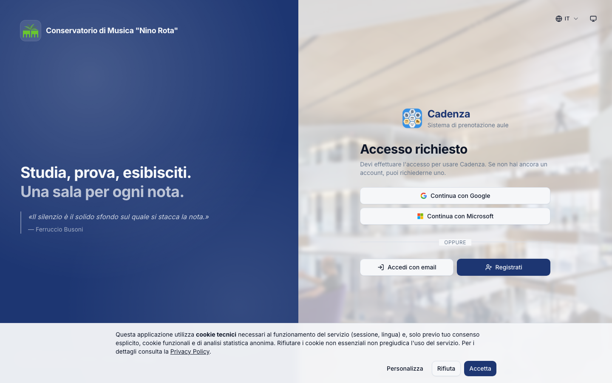

Hai tre modi per entrare:

| Metodo                       | Quando usarlo                                                                 |
| ---------------------------- | ----------------------------------------------------------------------------- |
| **Email + password**         | Account creato dalla Segreteria; password ricevuta via email al primo invito. |
| **Google**                   | Se il Conservatorio ha attivato il login Google Workspace.                    |
| **Microsoft 365 / Entra ID** | Se il Conservatorio ha attivato il login Microsoft (account istituzionale).   |

Click su "Email" apre il form classico:

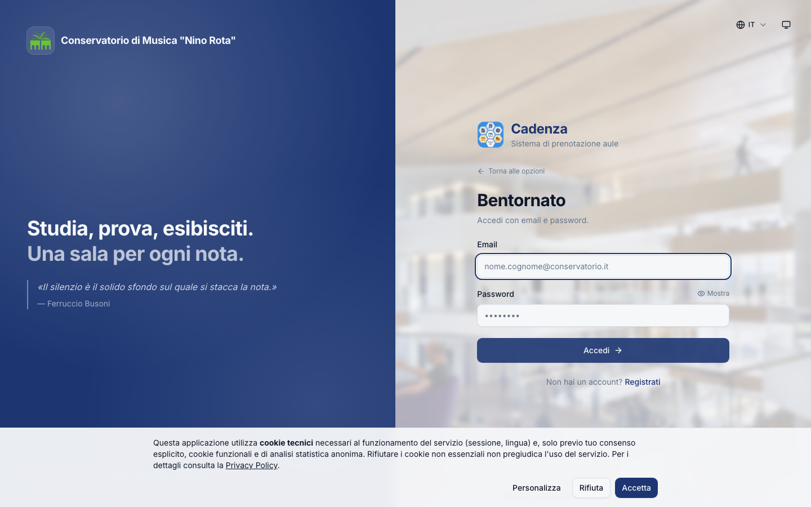

> **2FA via email** (opt-in): se la Direzione lo attiva, dopo username/password riceverai un codice a 6 cifre. Inseriscilo per completare l'accesso. La 2FA è facoltativa per i docenti, **obbligatoria** per gli admin.

### 2.2 Cosa fare se non hai una password

Se non hai mai ricevuto la password:

1. Chiedi alla Segreteria di invitarti (ti arriverà via email un link).
2. In alternativa, in fondo alla pagina di login c'è "Registrati": compila i tuoi dati e attendi che la Segreteria approvi il tuo account.

### 2.3 Completamento del profilo (solo al primo accesso)

Al primo login Cadenza ti chiede di completare l'anagrafica: nome, cognome, eventuale matricola, corso (se applicabile). Per i docenti il campo "corso" è facoltativo.

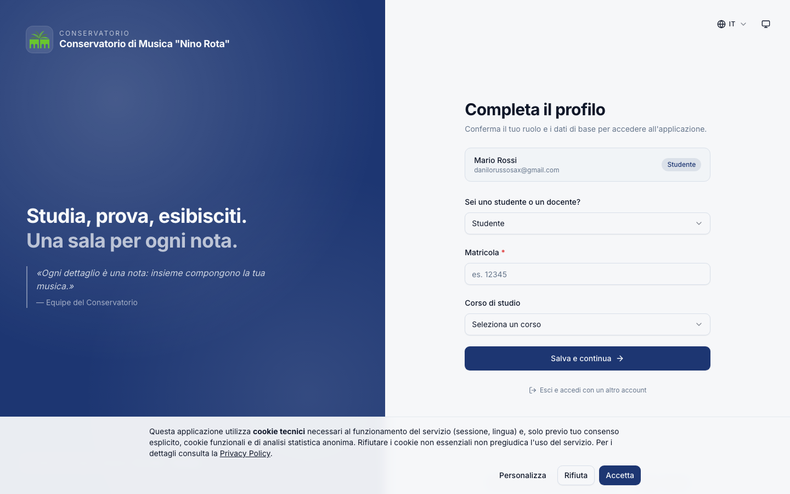

Dopo il completamento sei dentro e arrivi alla **Dashboard**.

---

## 3. Dashboard e calendario

La Dashboard è la tua "home" dentro Cadenza. Mostra:

- Il calendario delle aule del **giorno selezionato** (oppure di 3 giorni affiancati, vedi sotto).
- I tuoi **prossimi impegni** (Monte Ore + prenotazioni manuali) come elenco compatto.
- I **template di prenotazione rapida** ("Quick book") se ne hai salvato qualcuno.
- Gli avvisi importanti pubblicati dalla Direzione.

### 3.1 Vista 1 giorno (default)

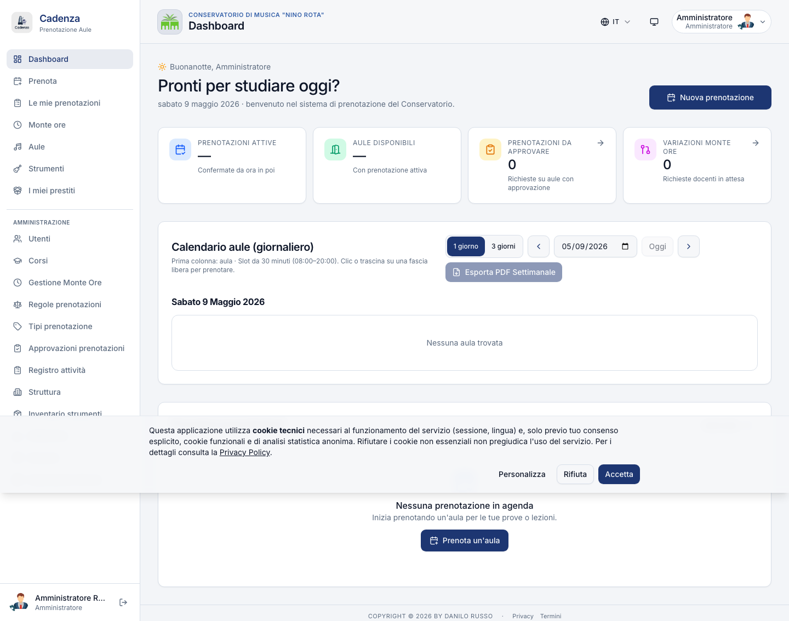

Le aule sono in colonna, le ore in riga (slot da 30 min). Colori:

- 🟦 **Blu**: prenotazione tua;
- 🟪 **Viola**: prenotazione di un altro utente (non disponibile);
- 🟩 **Verde tenue**: slot libero.

Click su uno slot libero ti porta direttamente al form di prenotazione, con orario e aula pre-compilati.

### 3.2 Vista 3 giorni

In alto a destra c'è un toggle "1 giorno · 3 giorni". Cambiandolo vedi tre colonne giorno affiancate, utile per pianificare la settimana o cercare aule libere.

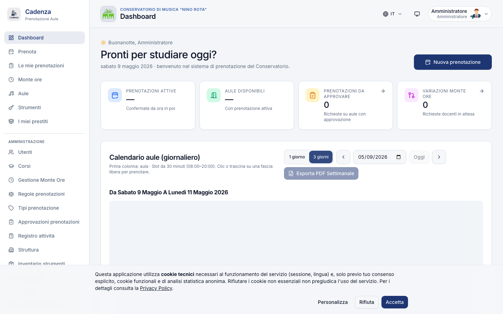

> La preferenza tra "1 giorno" e "3 giorni" viene **ricordata sul tuo browser**: la prossima volta che apri Cadenza ritrovi la stessa vista.

### 3.3 Frecce di navigazione

Le frecce `‹` `›` accanto al titolo del giorno si comportano coerentemente con la vista attiva: in modalità "1 giorno" spostano di un giorno, in modalità "3 giorni" spostano di tre. Il bottone "Oggi" riporta al giorno corrente.

### 3.4 Sidebar

A sinistra trovi la sidebar con le aree principali:

- 🏠 **Dashboard** (la home)
- 📅 **Prenota** — apre il form di prenotazione completo
- 📋 **Le mie prenotazioni** — il riepilogo storico
- 🎵 **Aule** — la directory degli spazi
- 🎻 **Strumenti** — l'inventario per i prestiti (se attivo)
- ⏱ **Monte Ore** — la tua proposta annuale
- 📢 **Avvisi** — bacheca della Direzione
- 👤 **Profilo** — anagrafica, password, notifiche, iCal

---

## 4. Prenotare un'aula

URL: `/booking` (o click sulla cella libera nel calendario, oppure "Prenota" nella sidebar).

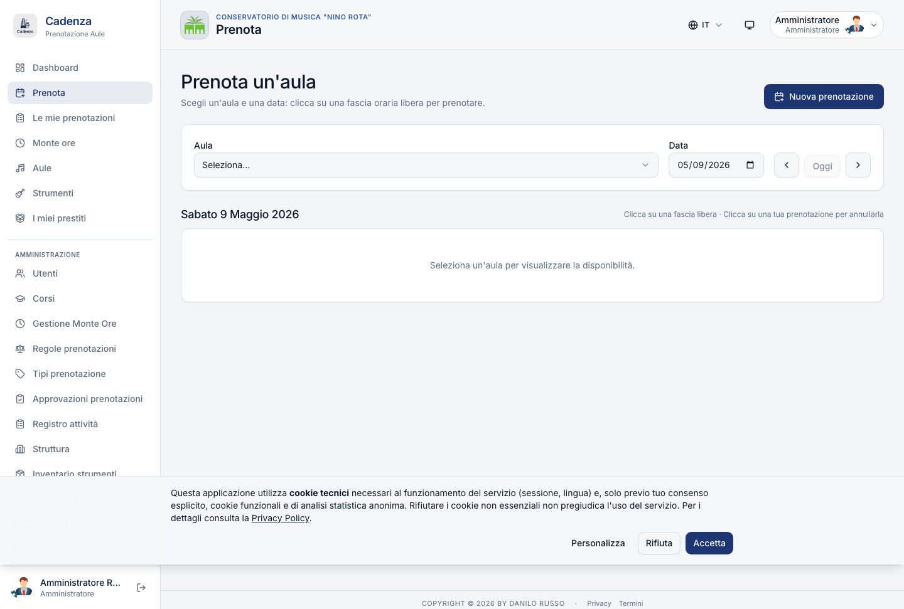

### 4.1 Il form

| Campo             | Cosa fa                                                                                                      |
| ----------------- | ------------------------------------------------------------------------------------------------------------ |
| **Aula**          | Scegli dal menu raggruppato per edificio. Le aule "non prenotabili" o "non per il tuo ruolo" sono nascoste.  |
| **Data**          | Date picker. Massimo l'anticipo concesso dalla regola del tuo ruolo (default 60 giorni per i docenti).       |
| **Dalle / Alle**  | Slot a 30 minuti. Durata fra il minimo e il massimo previsti per il tuo ruolo (default 30–240 min).          |
| **Tipo attività** | Lezione · Studio individuale · Prova · Concerto. Influenza alcune quote (es. concerti sono limitati di più). |
| **Etichetta**     | Testo libero (max 255 caratteri). Es. "Lezione pianoforte 3°".                                               |
| **Note**          | Eventuali note per la Direzione (facoltativo).                                                               |

### 4.2 Quando una prenotazione viene rifiutata

Cadenza controlla, in ordine:

1. **Tu sei attivo e approvato** (lo sei se sei loggato).
2. L'**aula è prenotabile** (non disattivata).
3. **Non c'è già un'altra prenotazione** sull'aula in quella fascia oraria.
4. **Tu non hai già un'altra prenotazione** in un'altra aula nella stessa fascia (un docente non può essere in due posti).
5. **Le regole** per il ruolo "docente" (max ore/settimana, durata massima, finestra oraria, cooldown) sono rispettate.
6. **Le quote** specifiche (per tipo aula, stanza, edificio) sono rispettate.
7. Nessuna **eccezione attiva** copre quella fascia (es. aula in ristrutturazione, festa patronale, sessione esami).

Se uno dei controlli fallisce, vedi un messaggio leggibile in cima al form, tipo:

> _Hai superato le ore settimanali consentite (30/30). Riprova la prossima settimana._

### 4.3 Aule che richiedono approvazione

Alcune aule (sala concerti, auditorium, sale di rappresentanza) hanno il flag "richiede approvazione" attivo. Quando le prenoti:

1. La tua richiesta entra in stato **"In attesa di approvazione"** (non occupa l'aula).
2. La Direzione riceve una notifica e decide entro pochi giorni.
3. Tu ricevi un'email **approvata** o **rifiutata con motivo**.
4. Solo dopo l'approvazione la prenotazione è definitiva e compare nel calendario aule.

> Le aule che richiedono approvazione mostrano un'icona "✓" accanto al nome nel menu di scelta.

### 4.4 Quick book (template)

Se prenoti regolarmente la stessa aula nello stesso orario (es. lezione lunedì 14-16 in Aula 12), puoi salvare un **template** dalla Dashboard. Click su "Salva come template" dopo aver creato una prenotazione, dagli un nome (es. "Lezione lunedì"), e per i prossimi giorni della stessa fascia trovi un bottone "Quick book" che precompila tutto in un click.

> **Differenza con il Monte Ore**: il Quick book è per prenotazioni occasionali ricorrenti. Per le **lezioni annuali** che ripeti ogni settimana per tutto l'anno accademico, usa direttamente il **Monte Ore** (§8): è pensato apposta.

---

## 5. Le tue prenotazioni

URL: `/my-bookings`

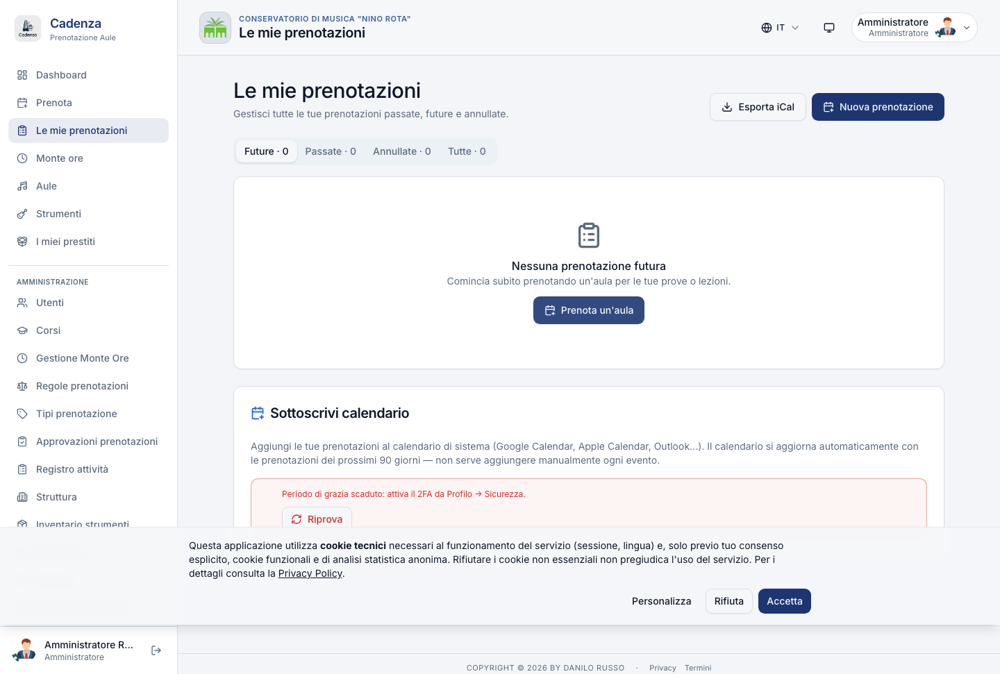

Tre tab:

| Tab           | Cosa contiene                                                                     |
| ------------- | --------------------------------------------------------------------------------- |
| **Future**    | Prenotazioni confermate (o in attesa di approvazione) dal momento attuale in poi. |
| **Passate**   | Storico delle prenotazioni concluse. Utile per verificare le ore svolte.          |
| **Annullate** | Prenotazioni che hai cancellato tu o che la Direzione ha cancellato.              |

### 5.1 Azioni per ogni prenotazione

| Azione                        | Quando disponibile                                                                                                                 |
| ----------------------------- | ---------------------------------------------------------------------------------------------------------------------------------- |
| **🗑 Cancella**               | Sempre, ma se sei sotto il "cancel cutoff" (default 2 ore prima) la cancellazione conta come no-show e impatta le tue statistiche. |
| **✎ Modifica**                | Solo per le prenotazioni future che NON sono già state "checked-in".                                                               |
| **📅 Aggiungi al calendario** | Scarica un file `.ics` da importare in Google Calendar, Outlook, Apple Calendar.                                                   |
| **🔗 Copia link**             | URL diretto alla prenotazione (utile per condividerla con un collega).                                                             |

### 5.2 Cosa significa "no-show"

Se hai prenotato un'aula e non hai fatto **check-in** entro 15 minuti dall'inizio (vedi §6), la prenotazione viene **automaticamente cancellata** dal sistema, l'aula liberata, e tu accumuli un "no-show" nelle tue statistiche. Tre no-show in un mese tipicamente fanno scattare un avviso dal coordinatore.

---

## 6. Check-in con QR code

> **Cos'è**: una "presentazione all'aula" che conferma che ci sei davvero. Il sistema lo richiede per evitare il fenomeno del "ghost booking" (aule prenotate ma vuote, mentre altri non trovano posto).

### 6.1 Come funziona

In ogni aula prenotabile c'è un **foglio A4** appeso vicino alla porta, con il QR code dell'aula:

```
        ╔══════════════════════╗
        ║  Aula 12 · Storico   ║
        ║                      ║
        ║  ┌──────────────┐    ║
        ║  │              │    ║
        ║  │   QR CODE    │    ║
        ║  │              │    ║
        ║  └──────────────┘    ║
        ║                      ║
        ║  Inquadra con la     ║
        ║  fotocamera del tel  ║
        ╚══════════════════════╝
```

1. Arrivi in aula 5 minuti prima dell'orario di prenotazione.
2. Apri la fotocamera del telefono e inquadri il QR.
3. Si apre Cadenza con il messaggio "Check-in confermato per Aula 12 alle 14:00".

> Devi essere **già loggato** in Cadenza sul telefono perché il check-in funzioni. Se non lo sei, Cadenza ti chiede di farlo (1 click).

### 6.2 Grace period e auto-cancel

- Puoi fare check-in **fino a 5 minuti prima** dell'orario (`CHECKIN_EARLY_MINUTES`, configurabile).
- Hai **15 minuti di tolleranza** dopo l'inizio (`GHOST_GRACE_MINUTES`, configurabile).
- Oltre, la prenotazione viene **auto-cancellata** + ti arriva un'email di notifica.

### 6.3 Aule senza check-in obbligatorio

Alcune aule (uffici, sale di rappresentanza, sale prove "fidate") possono avere il check-in **disattivato** dalla Direzione. In quel caso non c'è nessun foglio QR e nessun auto-cancel: il fatto stesso di aver prenotato basta. Lo riconosci perché in `/my-bookings` la card della prenotazione mostra un'etichetta "Check-in non richiesto".

---

## 7. Aule e dotazioni

URL: `/rooms`

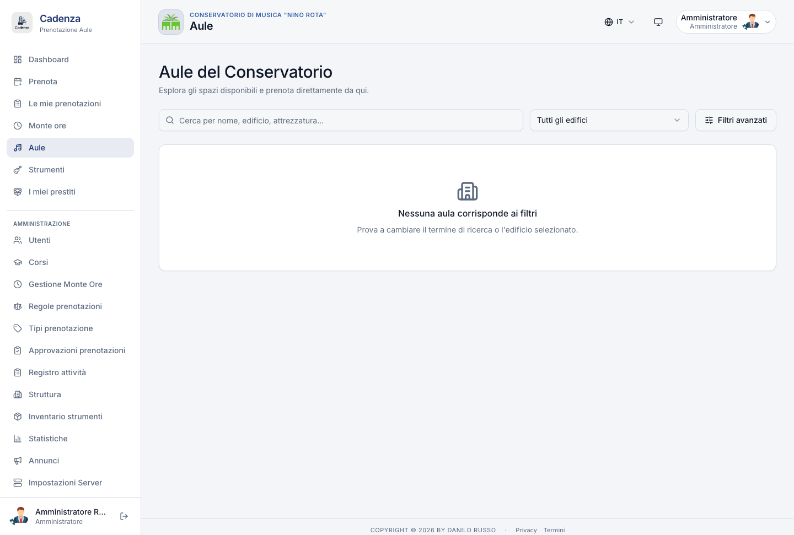

Directory degli spazi del Conservatorio, **raggruppata per edificio**:

- Ogni edificio è una **sezione espandibile** con il proprio colore distintivo.
- Per ogni aula vedi: nome + codice, capienza, tipologia, dotazioni principali (pianoforte, leggii, mixer, …), foto e bottone "Prenota".
- Lo stato espanso/collassato di ogni gruppo viene ricordato per la sessione.

Usa questa pagina quando:

- Vuoi vedere **quali aule hanno il pianoforte a coda** (filtra per dotazione).
- Stai cercando un'aula con una **capienza specifica** (es. masterclass per 30 persone).
- Vuoi controllare la **foto** di un'aula che non hai mai usato.

> **Differenza con la Dashboard**: la Dashboard mostra **chi sta usando** le aule **adesso**. La pagina Aule mostra **com'è fatta** ogni aula a prescindere dall'occupazione.

---

## 8. Monte Ore — il piano annuale

URL: `/monte-ore`

> **Cos'è il Monte Ore**: è il **piano annuale di insegnamento**. Contrattualmente devi garantire almeno **324 ore di didattica** all'anno (se sei titolare), distribuite in **2-4 giorni a settimana**, nella finestra di lezioni stabilita dalla Direzione (di solito ott → giu). Per chi ha contratto orario, la soglia è personalizzata (tipicamente 30-200 h).

### 8.1 Quando compilare la proposta

La Direzione apre una **finestra di inserimento** ogni anno (es. 15 set – 15 ott). Vedrai un avviso nella Dashboard. Dentro la finestra puoi:

- Creare il tuo pattern settimanale
- Modificarlo quante volte vuoi
- Inviare la proposta al coordinatore quando sei pronto

Fuori dalla finestra l'invio è bloccato (a meno che la Direzione ti abbia concesso una **deroga individuale** — vedi §8.10).

### 8.2 Le due sezioni della pagina

La pagina `/monte-ore` ha due sezioni in cascata:

1. **Sezione A — Pattern settimanale**: definisci le tue "fasce ricorrenti" (es. "Lun 14-17 in Aula 12, Mer 14-17 in Aula 12, Ven 9-12 in Aula 5"). Sono i mattoni della tua settimana tipo.
2. **Sezione B — Griglia annuale**: il pattern viene espanso su tutte le settimane dell'anno accademico (al netto delle vacanze). Sulla griglia puoi accendere o spegnere singole celle per personalizzare.

### 8.3 Compilare il pattern settimanale (Sezione A)

Click su **+ Aggiungi fascia**. Si apre un dialog con:

| Campo                      | Cosa metti                                                                      |
| -------------------------- | ------------------------------------------------------------------------------- |
| **Giorno della settimana** | Lun · Mar · Mer · Gio · Ven · Sab                                               |
| **Inizio / Fine**          | Orari a granulazione 30 min                                                     |
| **Aula preferita**         | Scegli un'aula dal menu (oppure lascia "qualunque" — il coordinatore assegnerà) |
| **Tipo attività**          | Lezione · Studio individuale · Prova · Concerto                                 |
| **Etichetta**              | Testo libero (es. "Pianoforte 3°", "Solfeggio biennio")                         |

Aggiungi tutte le fasce della tua settimana. Le vedi in tabella sotto:

```
  Giorno    Orario      Aula                 Tipo       Etichetta
  ─────     ───────     ─────────────────    ────────   ─────────────
  Lun       14:00–17:00 Aula 12 · Storico    Lezione    Pianoforte 3°
  Mer       14:00–17:00 Aula 12 · Storico    Lezione    Pianoforte 3°
  Ven       09:00–12:00 Aula 5 · Storico     Lezione    Pianoforte 1°
```

**Regole CCNL**:

- Minimo **2 giorni diversi** della settimana, massimo **4**. Se metti 5 giorni il sistema te lo segnala come errore.
- La somma delle ore della settimana × numero di settimane dell'anno deve essere **≥ alla tua soglia annua** (324 h se sei titolare, altrimenti la tua soglia personalizzata).

Cadenza ti aiuta mostrando in alto **Totale ore proposte / Soglia annua** in tempo reale:

- 🟢 Verde se sei ≥ soglia → puoi inviare
- 🟡 Ambra se sei sotto soglia → completa prima di inviare

### 8.4 La griglia annuale (Sezione B)

Una volta che il pattern è compilato, click su **"Rigenera dalla Sezione A"**. Il sistema espande il pattern su tutte le settimane lavorative dell'anno, escludendo automaticamente le vacanze e le festività infrasettimanali configurate dalla Direzione.

La griglia mostra **settimana × giorno**, con le celle colorate:

- 🟦 **Blu**: cella attiva (la userai per fare lezione)
- ⬜ **Vuota**: cella inattiva (puoi cliccarla per attivarla)
- 🟥 **Rossa**: cella bloccata (festività, vacanze — non cliccabile)

Click su una cella attiva → la disattivi (libera quelle ore).  
Click su una cella vuota → la attivi (la includi nella proposta).

> Tutte le celle nascono **inattive** dopo la rigenerazione: tu le accendi cliccando, e il totale ore si aggiorna in tempo reale. Questo ti permette di "saltare" specifiche settimane (es. trasferte, conferenze, scambi Erasmus).

### 8.5 Soglia ore personalizzata

Se hai un contratto diverso dal titolare CCNL (contratto orario, supplente part-time, accompagnatore concertistico, ecc.), la Direzione può averti impostato una **soglia individuale**. In quel caso vedi un banner azzurro in cima:

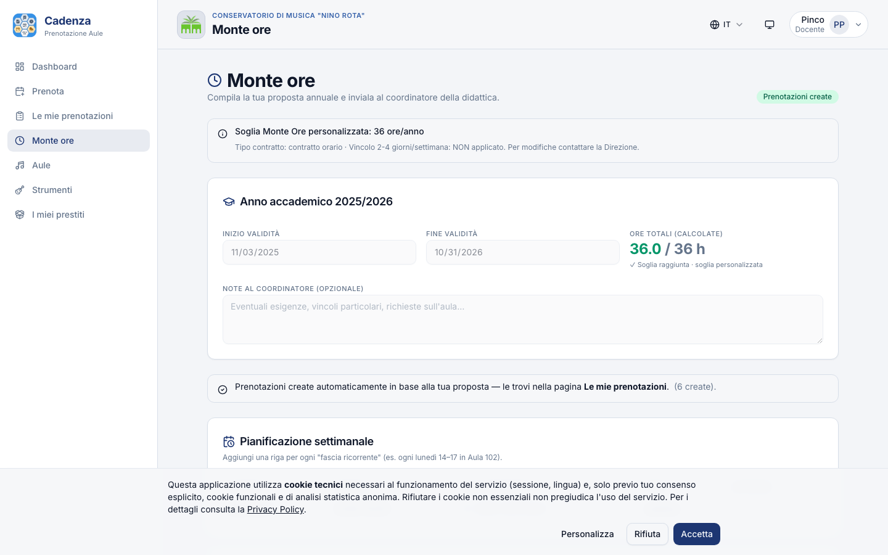

| Esempio di deroga                | Soglia | Bypass vincolo 2-4 gg                   |
| -------------------------------- | ------ | --------------------------------------- |
| Titolare ridotto L.104/92 al 50% | 162 h  | No                                      |
| Contratto orario 60 h            | 60 h   | Sì (puoi concentrare tutto in 1 giorno) |
| Laboratorio musica d'insieme     | 120 h  | No                                      |
| Accompagnatore concertistico     | 30 h   | Sì                                      |

> Per modificare la deroga, contatta la Direzione: tu **non puoi** cambiarla autonomamente. Le modifiche vengono tracciate in audit log.

### 8.6 Inviare la proposta

Quando hai compilato pattern + griglia e il totale ore raggiunge la soglia, click **"Invia al coordinatore"** in alto a destra.

Il sistema controlla un'ultima volta:

- Almeno 2 fasce orarie nel pattern;
- Giorni distinti fra 2 e 4 (a meno della tua eventuale deroga);
- Totale ore ≥ soglia.

Se manca qualcosa, vedi un **Alert** che ti elenca cosa correggere prima di inviare. Il bottone "Invia" è disabilitato finché tutto è verde.

Dopo l'invio la proposta passa in stato **"In attesa di approvazione"** e arriva al coordinatore.

### 8.7 Stati della proposta

| Stato         | Cosa significa per te                                                                                       |
| ------------- | ----------------------------------------------------------------------------------------------------------- |
| **Bozza**     | Stai compilando. Puoi modificare e salvare quante volte vuoi. Nessuno la vede.                              |
| **In attesa** | L'hai inviata. Aspetti la decisione del coordinatore. NON puoi più modificare.                              |
| **Rifiutata** | Il coordinatore ha rifiutato con un motivo. Torna in bozza, modifica, reinvia.                              |
| **Approvata** | Tutto OK. Il coordinatore può ancora assegnare le aule. Le prenotazioni reali non sono ancora state create. |
| **Generata**  | Il coordinatore ha cliccato "Crea prenotazioni". Adesso le trovi tutte in `/my-bookings`.                   |

> **Differenza tra "approvata" e "generata"**: la prima è la firma contrattuale ("ok, il piano è valido"); la seconda è la materializzazione operativa ("ho creato 600 prenotazioni nel calendario"). Possono passare alcuni giorni tra le due.

### 8.8 "Richiesta di modifica" dal coordinatore

Può capitare che il coordinatore non rifiuti la tua proposta in blocco, ma ti chieda una **correzione mirata** (es. "manca un'ora rispetto al CCNL", "l'aula 12 il martedì è già occupata, scegline un'altra"). In quel caso la proposta **torna in bozza** e vedi un banner rosso con il motivo:

```
[!] Proposta da rivalidare
    Manca 1 ora alla soglia: aggiungi una fascia di 30 min × 2 settimane.
```

Fai le modifiche richieste e clicca di nuovo "Invia al coordinatore".

### 8.9 Cosa NON puoi fare dopo l'invio

Una volta inviata la proposta NON puoi più modificare il pattern settimanale o cliccare le celle della griglia, finché il coordinatore non decide. Se ti accorgi di un errore importante:

1. Scrivigli/parlagli direttamente.
2. Lui può rifiutare (torni in bozza, riparti da zero) oppure "richiedere modifica" (torni in bozza ma il tuo lavoro è preservato).

### 8.10 Deroga finestra di inserimento (subentro tardivo)

Se entri in servizio **dopo che la finestra di inserimento è chiusa** (es. nomina MIUR di novembre, sostituzione a stagione iniziata), chiedi alla Direzione di concederti una **deroga individuale**. Loro impostano una **data limite** entro cui tu puoi inviare. Il sistema te lo permette anche se la finestra generale è ormai chiusa.

> La deroga è personale e nominale: vale solo per te, non riapre la finestra per gli altri docenti.

---

## 9. Spostamenti e variazioni dopo l'approvazione

Una volta che la tua proposta è **"approvata"** o **"generata"**, le lezioni sono fisse nel calendario. In corso d'anno è normale aver bisogno di:

- Cancellare una lezione (visita medica, congresso, malattia)
- Spostare una lezione di orario
- Cambiare aula per una sola settimana
- Recuperare una lezione in un altro giorno
- Aggiungere una lezione fuori pattern (recupero compenso)

Cadenza ti dà 5 strumenti diversi. Ogni richiesta è una **variazione** (in inglese: _amendment_).

### 9.1 Limite annuale di variazioni

Per evitare che la proposta venga riscritta di settimana in settimana, la Direzione imposta un **massimo di variazioni all'anno** (default: **3** per proposta). Quando raggiungi il limite, le richieste successive sono bloccate fino al prossimo anno accademico (a meno di intervento manuale dell'admin).

| Tipo di variazione          | Consuma una variazione?            |
| --------------------------- | ---------------------------------- |
| Disattivazione di una cella | **No** (libera ore, sempre lecita) |
| Riattivazione               | Sì                                 |
| Cambio orario               | Sì                                 |
| Cambio aula puntuale        | Sì                                 |
| Spostamento (off+on)        | Sì (**1 sola** variazione, non 2)  |
| Nuovo giorno fuori pattern  | Sì                                 |

### 9.2 Le 5 azioni di variazione

#### 9.2.1 Disattivare una lezione (toggle off)

> _"Cancella la lezione del 12 ottobre, sono in trasferta."_

Dalla griglia annuale, click sulla cella attiva del 12/10. Diventa vuota. La prenotazione corrispondente nel calendario aule si cancella automaticamente. **Auto-approvata sempre**.

#### 9.2.2 Riattivare una lezione

> _"La lezione del 12 ottobre che avevo cancellato la voglio rimettere."_

Click sulla cella vuota del 12/10 (sotto un giorno del pattern). Cadenza ricrea la prenotazione, **auto-approvata** se l'aula è ancora libera.

#### 9.2.3 Cambiare orario di una sola occorrenza

> _"Lunedì 6 novembre ho una visita medica alle 14: inizio alle 16 invece che alle 14."_

Sulla cella attiva del 6/11, click sulla piccola icona "**⋮**" in alto a destra → si apre il dialog "Spostamento lezione" → tab **"Cambia orario"** → inserisci i nuovi orari (es. 16:00–19:00) → "Salva".

- **Auto-approvata** se la cella era nel piano originale.
- Tutte le altre lezioni del pattern restano invariate.
- La prenotazione nel calendario aule si aggiorna ai nuovi orari.

#### 9.2.4 Cambiare aula puntualmente

> _"Mercoledì 8 novembre l'Aula 12 è occupata per un concerto: sposto solo quel mercoledì in Aula 5."_

Cella attiva del 8/11 → icona "**⋮**" → tab **"Cambia aula"** → seleziona "Aula 5" → "Richiedi cambio aula".

- **Sempre pending**: l'aula è risorsa condivisa, il coordinatore deve confermare che Aula 5 è davvero libera.
- Quando il coordinatore approva, lo slot del 8/11 prende Aula 5 come aula. Il pattern e tutte le altre settimane restano in Aula 12.

#### 9.2.5 Spostare una lezione su un altro giorno

> _"La lezione di lunedì 13 novembre la sposto a giovedì 16 novembre."_

Cella attiva del 13/11 → icona "**⋮**" → tab **"Sposta a…"** → scegli "16/11 14:00–17:00" dall'elenco delle celle libere → "Sposta".

- **Auto-approvata** se sia la cella sorgente sia quella destinazione sono già nel tuo pattern settimanale.
- **Pending** se la destinazione è fuori pattern.
- Conta come **1 sola** variazione (non 2): la disattivazione del 13/11 e l'attivazione del 16/11 sono fatte in un'unica operazione atomica.

#### 9.2.6 Aggiungere un giorno fuori pattern

> _"Voglio aggiungere una lezione il sabato 18 novembre per recuperare il programma."_

Pulsante **"Richiedi nuovo giorno"** in cima alla griglia. Si apre un dialog con:

| Campo          | Cosa metti                                |
| -------------- | ----------------------------------------- |
| Data           | 2026-11-18                                |
| Inizio – Fine  | 09:00 – 12:00                             |
| Aula preferita | (facoltativa: il coordinatore la assegna) |
| Tipo           | Lezione · Studio · Prova                  |
| Etichetta      | "Recupero programma 3°"                   |
| Note           | "Mi mancano 3 ore prima dell'esame"       |

- **Sempre pending**: il coordinatore deve verificare aula + opportunità.
- Quando approvato, viene creato uno slot "fuori pattern" + la prenotazione corrispondente.

### 9.3 Dove vedere lo storico delle tue variazioni

Sotto la griglia annuale c'è una card collassabile **"Storico variazioni"** con il conteggio:

- **In attesa**: le pending in attesa di decisione del coordinatore
- **Auto-approvate**: quelle che il sistema ha applicato automaticamente
- **Approvate**: le pending che il coordinatore ha approvato
- **Rifiutate**: quelle che il coordinatore ha rifiutato (con motivo visibile)

### 9.4 Banner "proposta da rivalidare" in corso d'anno

Se la Direzione **modifica il tuo contratto** (es. passi da titolare a titolare ridotto, o ti aggiunge ore per supplenza) **mentre la tua proposta è già attiva**, Cadenza ti mostra in cima alla pagina Monte Ore un banner rosso:

```
[!] Proposta da rivalidare
    Variazione contratto (admin) in corso d'anno: rivedi e re-invia la proposta.
```

Cosa fare:

1. Apri la pagina Monte Ore e leggi il motivo del banner.
2. Verifica il pattern: con la nuova soglia ore, devi aggiungerne / toglierne?
3. Se serve, aggiungi o rimuovi fasce dal pattern e ri-clicca "Invia al coordinatore".
4. Il banner sparisce alla prossima submit.

> Il banner è informativo, **non blocca** la didattica corrente. Le lezioni continuano regolarmente fino a quando non re-invii.

---

## 10. Prestiti strumenti

URL: `/instruments` (se il modulo è abilitato dalla Direzione)

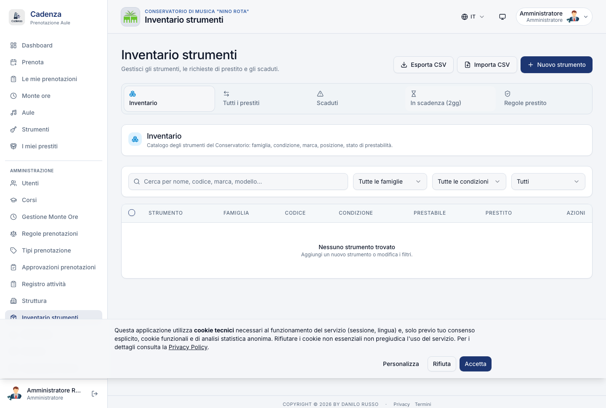

Cadenza ti permette di richiedere in prestito strumenti dell'inventario del Conservatorio (violini, fiati, percussioni, attrezzature elettroniche, ecc.).

### 10.1 Richiedere un prestito

1. Apri `/instruments`, filtra per **famiglia** (archi · fiati · tastiere · …) e per **condizione** (ottimo · buono · …).
2. Clicca sullo strumento che ti serve.
3. Compila il form prestito: periodo (dal / al), motivo (lezione, prova, evento esterno), note.
4. Conferma. La richiesta entra in stato **"richiesto"**.
5. La Direzione approva (o rifiuta con motivo).
6. Vai in `/my-loans` per vedere lo stato.

### 10.2 Quote di prestito

A seconda del tuo ruolo e della famiglia dello strumento, ci sono **quote**: numero massimo di prestiti contemporanei e/o giorni cumulati all'anno. Le quote sono visibili nella card di ogni strumento ("max 1 prestito di archi per docente"). Se chiedi un prestito oltre quota, vedi un messaggio chiaro.

### 10.3 PDF di consegna e restituzione

Quando la Direzione approva, ti arriva via email un **PDF di consegna** da stampare e firmare. Lo porti al magazziniere il giorno del ritiro; lui ti consegna lo strumento.

Al rientro, idem: il magazziniere genera un **PDF di restituzione** (firmato anche da te) e chiude il prestito su Cadenza.

### 10.4 Promemoria e ritardi

- **2 giorni prima** della data di restituzione, ricevi un'email di promemoria.
- Se non restituisci entro la data prevista, il prestito passa in stato **"scaduto"** e ricevi un'email ogni 7 giorni finché non chiudi.
- Tre prestiti scaduti accumulati possono comportare la sospensione della quota fino a fine anno (politica della Direzione).

---

## 11. Avvisi e bacheca

URL: `/announcements`

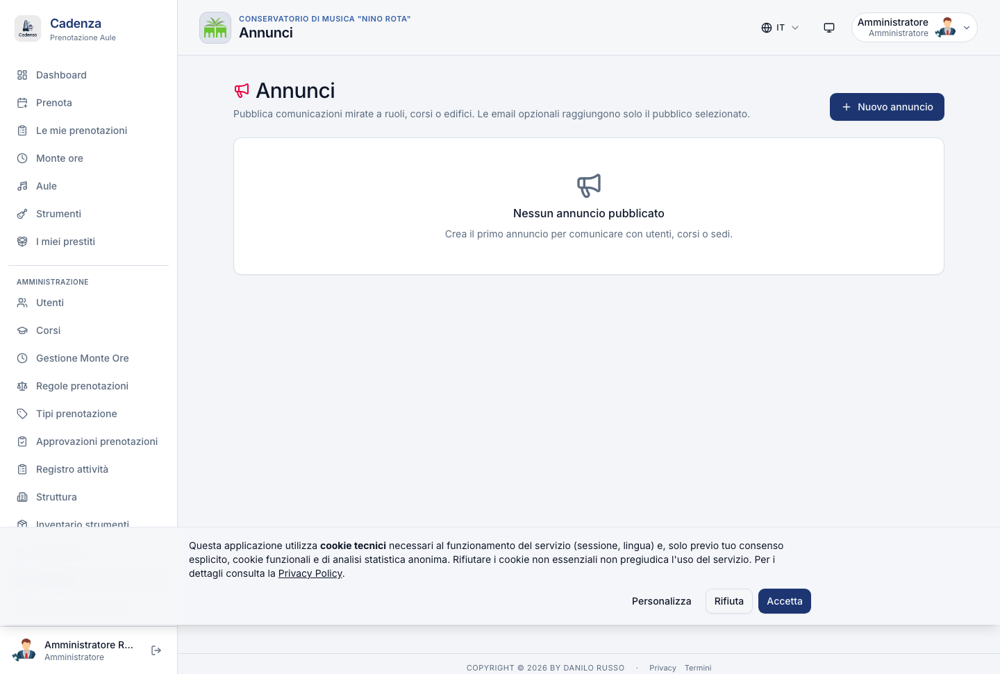

Gli avvisi sono pubblicati dalla Direzione, filtrati per **audience**:

- A tutti
- Per ruolo (solo docenti)
- Per corso (es. solo Pianoforte)
- Per edificio (es. solo Sede succursale)

Vedi solo gli avvisi che riguardano te. Ogni card mostra titolo, corpo (markdown semplice), data di pubblicazione, scadenza, badge "Pinnato" se importante.

> Gli avvisi importanti compaiono anche **in cima alla Dashboard** la prima volta che entri. Se li chiudi con la X, restano comunque sulla pagina `/announcements` finché non scadono.

---

## 12. Profilo, notifiche e calendario personale

URL: `/profile`

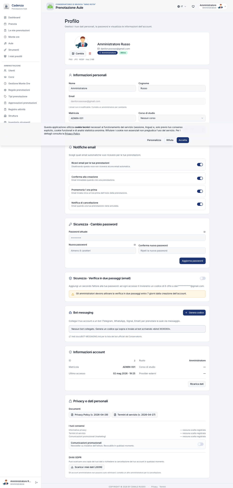

### 12.1 Anagrafica

Aggiorna nome, cognome, matricola, corso (se applicabile). L'email non si cambia direttamente: contatta la Segreteria.

### 12.2 Password

Cambia la password. La nuova deve avere **almeno 10 caratteri**, una **maiuscola** e una **cifra** (linee guida AGID 2024).

### 12.3 Preferenze notifiche email

Tre interruttori indipendenti:

| Notifica                  | Quando ti arriva                                                                 |
| ------------------------- | -------------------------------------------------------------------------------- |
| **Conferma prenotazione** | Subito dopo aver salvato una nuova prenotazione.                                 |
| **Promemoria**            | 24 h prima dell'orario di una prenotazione.                                      |
| **Cancellazione**         | Quando una prenotazione viene cancellata (da te, da admin, o auto-cancel ghost). |

Default: tutti e tre attivi. Disattivali se preferisci notifiche minimali.

### 12.4 Token iCal (calendario personale)

Cadenza pubblica un **calendario iCal personale** con tutte le tue prenotazioni. Per usarlo:

1. Click su **"Mostra link iCal"** nella card "Sincronizza calendario".
2. Copia l'URL (formato `https://cadenza.example.it/api/users/me/ical/<token>`).
3. Importalo nel tuo client preferito (Apple Calendar, Google Calendar, Outlook).
4. Da quel momento, ogni nuova prenotazione/cancellazione si sincronizza automaticamente.

> Il token è **segreto**: non condividerlo. Se lo rigeneri (bottone "Rigenera token") il vecchio smette di funzionare e dovrai aggiornare il client.

### 12.5 Cancella account (art. 17 GDPR)

In coda alla pagina c'è un bottone rosso **"Richiedi cancellazione account"**. Compila la motivazione (es. "Pensionamento") → la Direzione riceve la richiesta e procede. I dati vengono cancellati nei tempi previsti dal GDPR (di norma 30 giorni).

### 12.6 Esporta dati (art. 20 GDPR)

Bottone **"Esporta i miei dati"** → scarichi un file ZIP con tutto quello che Cadenza ha su di te: prenotazioni, monte ore, prestiti, audit log, consensi cookie. Utile per portabilità verso un altro sistema, o per archivio personale.

---

## 13. App sul telefono (PWA)

Cadenza è una **PWA** (Progressive Web App): puoi installarla sul telefono come fosse un'app nativa, **senza passare da Google Play o App Store**.

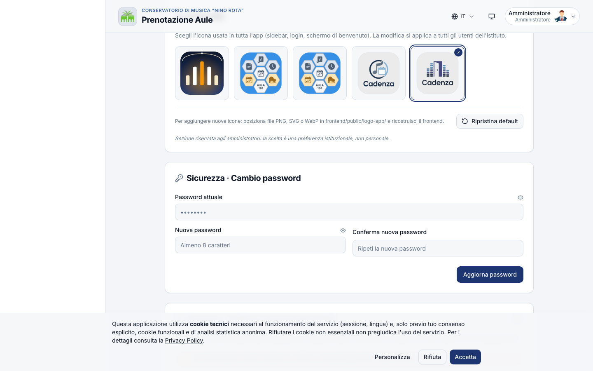

### 13.1 Installazione su Android

1. Apri Cadenza in Chrome.
2. In alto a destra (tre puntini) → "Aggiungi a schermata Home" oppure usa il banner che compare automaticamente.
3. L'icona Cadenza appare sulla home come un'app vera. Aprila: parte a tutto schermo, senza la barra del browser.

### 13.2 Installazione su iPhone (Safari)

1. Apri Cadenza in Safari.
2. Tocca il pulsante "Condividi" (rettangolo con freccia in su).
3. Scorri e tocca "Aggiungi a Home".
4. Conferma. L'icona appare in home.

### 13.3 Offline-soft

Quando il telefono perde rete, Cadenza non ti lascia "appeso":

- Vedi un **banner giallo** in alto: "Connessione persa — modalità offline".
- Le **pagine già visitate** restano leggibili (dashboard, le tue prenotazioni, profilo).
- Le **azioni che richiedono rete** (nuove prenotazioni, check-in, ecc.) sono temporaneamente disabilitate.
- Appena torna la rete il banner sparisce e tutto torna normale.

> La modalità offline è soft: i dati sono cached, non scritti. Tutte le modifiche vere passano per il server.

---

## 14. Bot Telegram (opzionale)

> **Cos'è**: un bot di Telegram con cui puoi prenotare, vedere le tue prenotazioni e ricevere promemoria **direttamente dalla chat**. Utile se hai sempre Telegram aperto e vuoi evitare il browser.

Disponibile solo se la Direzione ha attivato l'integrazione.

### 14.1 Setup (una volta sola)

1. In `/profile`, scorri fino alla card **"Bot Telegram"**.
2. Cerca il bot del tuo Conservatorio su Telegram (la Direzione ti dice il nome, es. `@CadenzaConservatorioBot`).
3. Avvia la chat e scrivi `/start`.
4. Il bot ti chiede un **codice di binding** (OTP a 6 caratteri).
5. Torna su `/profile` → "Genera codice" → copia il codice → incollalo nel bot.
6. Bot e profilo Cadenza ora sono "legati".

### 14.2 Comandi disponibili

| Comando              | Cosa fa                                                              |
| -------------------- | -------------------------------------------------------------------- |
| `/aule`              | Elenco aule prenotabili dal tuo ruolo                                |
| `/agenda`            | Le tue prenotazioni dei prossimi 7 giorni                            |
| `/agenda 2026-11-12` | Snapshot di un giorno specifico (formato YYYY-MM-DD)                 |
| `/book`              | Wizard a 5 step: sede → aula → quando → tipo → conferma              |
| `/list`              | Le tue prenotazioni future                                           |
| `/cancel <id>`       | Cancella la prenotazione con quell'ID                                |
| `/check <id>`        | Effettua il check-in da remoto (solo se "vicino" all'aula in orario) |
| `/help`              | Riepilogo comandi                                                    |

### 14.3 Rate-limit

Il bot ha un limite di **30 messaggi/minuto** e **200 messaggi/giorno** per utente. Sufficiente per uso normale, ti protegge da incidenti.

---

## 15. Lingue dell'interfaccia

Cadenza è disponibile in **5 lingue**:

- 🇮🇹 Italiano (default)
- 🇬🇧 English
- 🇪🇸 Español
- 🇩🇪 Deutsch
- 🇫🇷 Français

Cambia lingua dal menu in alto a destra (vicino al tuo nome). La preferenza viene memorizzata sul browser: la prossima volta ritrovi la lingua scelta.

---

## 16. Domande ricorrenti

**Posso prenotare per un altro docente / per uno studente?**
No, ogni prenotazione è legata al tuo account. Se devi farlo per ragioni operative (sostituzione, masterclass), parlane con il coordinatore: ha un comando admin apposito.

**Quante prenotazioni attive posso avere insieme?**
Per i docenti il default è **20** prenotazioni future contemporanee. La Direzione può cambiare il limite. Lo vedi in `/my-bookings` con "5 / 20 attive".

**Ho dimenticato di fare check-in e l'aula è stata cancellata. Posso recuperare?**
Sì: vai in `/booking`, ricrea la prenotazione per lo stesso slot. Se l'aula nel frattempo è stata presa da qualcun altro, scegli un'altra.

**Cosa succede se modifico una lezione dopo che è già stata "fatta"?**
Non puoi: la modifica è bloccata per le prenotazioni passate o "checked-in". Lo storico è immutabile a fini di rendicontazione contabile.

**Il coordinatore mi ha "rifiutato" la proposta Monte Ore. Devo rifare tutto?**
No, la proposta torna in **bozza** preservando tutte le tue fasce e celle. Apporti le modifiche richieste e re-invii. Vedi il motivo del rifiuto nel banner rosso.

**Ho 12 variazioni da fare in un anno ma il limite è 3. Cosa faccio?**
Le **disattivazioni** (toggle off) NON consumano variazioni, sono sempre gratis. Solo le aggiunte/cambi orario/cambi aula/nuovi giorni consumano. Se ti servono davvero 12 modifiche strutturali, parlane con la Direzione: può sbloccare manualmente il contatore o intervenire in altro modo.

**Posso vedere le prenotazioni dei miei colleghi?**
Sì, sulla Dashboard e sul calendario aule vedi tutti gli slot occupati (senza il nome del docente, per privacy — solo "Occupato"). Il nome compare invece nella tua tab `/my-bookings` per le tue.

**Cadenza funziona se la rete del Conservatorio è giù?**
Cadenza vive su un server cloud (Hetzner o equivalente), non sulla rete interna. Quindi sì, anche se la rete del Conservatorio è giù, da casa o dal cellulare 4G Cadenza funziona. L'unica eccezione è il **check-in QR**, che la Direzione può aver ristretto agli IP della rete interna.

**Chi vede i miei dati personali?**
Solo tu, gli admin e — limitatamente — il coordinatore della didattica. Nessun dato è venduto/condiviso con terzi. Cadenza è ospitata in un datacenter europeo GDPR-compliant. Per il dettaglio leggi la pagina **Privacy** in fondo al sito.

---

<div align="center">

**Cadenza · La musica merita il software migliore**

_© 2026 Danilo Russo · Manuale Docente v1.0 · 13 maggio 2026_

</div>
